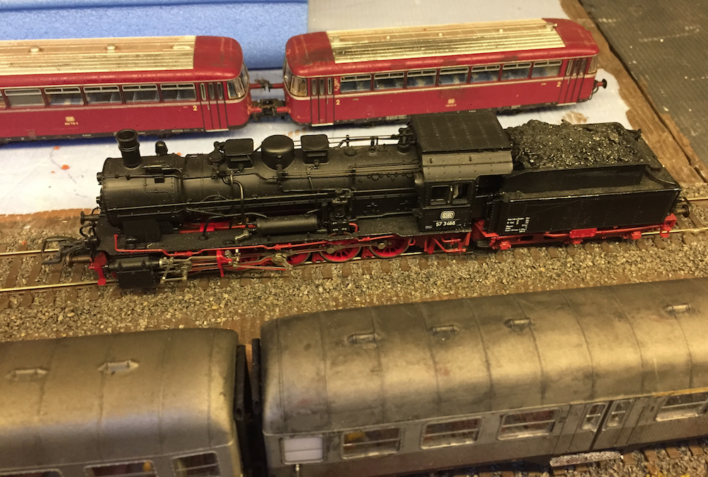

2D-flow
============

3Di is wonderful. You can calculate all sorts of stuff.

Example:

- Bla.

- Bla.

- Bla.

Example cross-reference to a formula: :eq:`example_formula`.

Woohoo, images. Or rather, we probably want figures:

   Well, at least there's some blue in the image! That makes it water-related,
   right?
