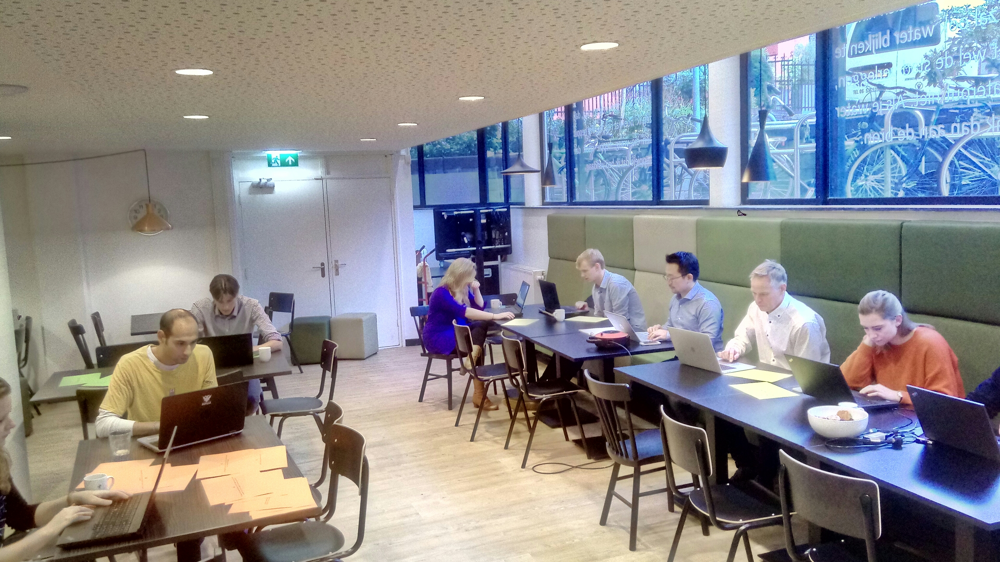

****************************
Contact and Contributors
****************************

This manual has been created with the help of staff members of Deltares, RHDHV, het Hoogheemraadschap van Delftland, MicroX and Nelen & Schuurmans.

For general questions about Nelen & Schuurmans and our IT services, go to https://nelen-schuurmans.nl/en/home/ or contact us at info@nelen-schuurmans.nl.

For a free license for scientific researchers contact us at info@3diwatermanagement.com.

For a general overview of all 3Di instruments, go to https://3diwatermanagement.com/3di-start/.

For specific questions about 3Di contact our service desk at servicedesk@nelen-schuurmans.nl.

     
   Docuthon organized by Nelen & Schuurmans in the winter of 2017.
   
This documentation is never finished, this is an alive document and is regularly updated. This yields for the text as the downloadble splt, database overview etc. 

We do our best to make this documentation as comprehensible  and complete as possible. We welcome all suggestions for improvements. Unfortunately, errors can occur in the description, please let us know if you encounter them, we will correct them as soon as possible. Moreover, the source documentation is open to everyone, so feel free to correct or add things or tutorials your self.
