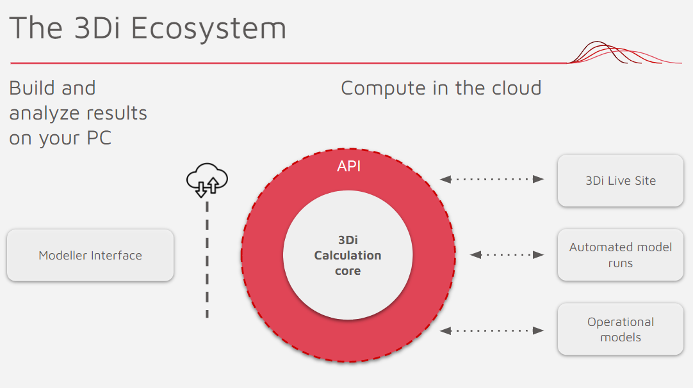
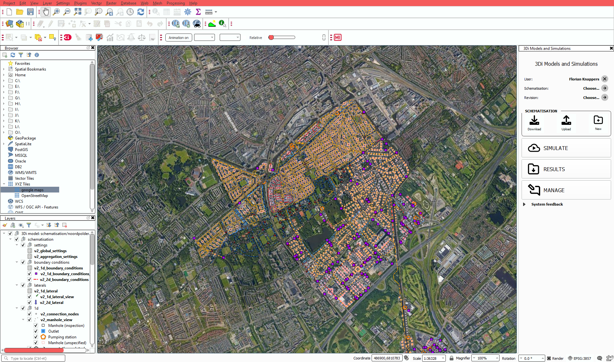
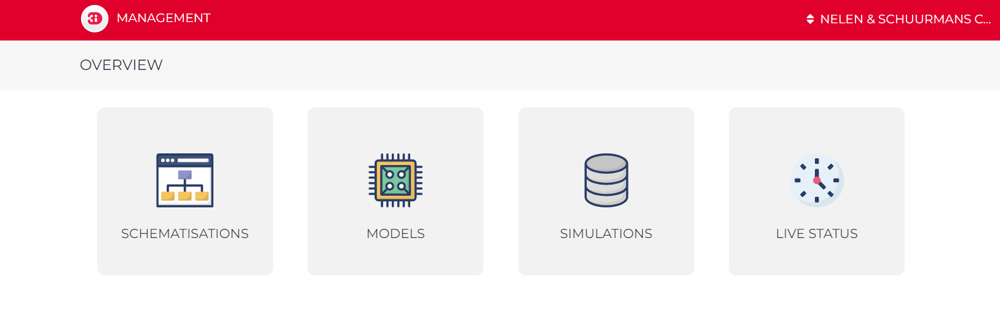

.. _a_ecosystem:

3Di Ecosystem
^^^^^^^^^^^^^

The 3Di Ecosystem consists of the following five components:

* :ref:`a_modeller_interface`: a QGIS based environment where schematisations can be build and edited.

* :ref:`a_livesite`: a web application to start, pause and adjust simulations.

* :ref:`a_management_screens`: an online overview of your schematisations, models and simulations.

* :ref:`a_computational_core`: a Fortran software package which handles the hydrodynamic calculations.

* :ref:`a_api`: an *application programming interface*, which enables other applications and user interfaces to interact with the computational core.

All components are secured by an **Authentication** and **Authorisation** system. This will be discussed in the :ref:`a_authentication_user_management` section.

   
   The 3Di Ecosystem.

.. _a_modeller_interface:

3Di Modeller Interface
======================

The Modeller Interface is the QGIS based interface, where hydrology experts can build and edit models, start simulations and analyse their results. 
It is a customised QGIS installation, which automatically installs the required plugins for working with 3Di.
This setup empowers the user to benefit of all processing power of QGIS, combined with the **3Di Models and Simulations** and the **3Di Toolbox**, two powerfull custom made 3Di plugins.
The 3Di Models and Simulations plugin enables the user to perform a complete modeling workflow (i.e. upload your model, start a simulation and download & analyze your results) within the Modeller Interface. 
The 3Di Toolbox is used for importing schematisations, checking your data and analysing the results.

.. note::
   For more information on installing the Modeller Interface, please refer to our :ref:`3di_instruments_and_downloads`. The basics of the Modeller Interface are explained in the :ref:`Workflow <tutorial1_workflow>` Tutorial. 
   For the experienced modellers, the :ref:`How to work with 3Di section<qgisplugin>` covers the more in depth applications of the Modeller Interface.

   An example of a schematisation in the Modeller Interface.

We have chosen QGIS as our supporting platform because of the following reasons:

- QGIS comes with hundreds of powerfull GIS processing tools;
- It enables the combination of web maps (aerial, topo, osm and may others) and model schematisations;
- It offers an exstensive amount of styling options;
- It has a highly customisable interface
- The option of building your own plugins to interact with the model;
- The fact that it is an open source platform.

.. _a_livesite:

3Di Livesite
============
On the `Livesite <https://www.3di.live/>`_ you can start, pause and adjust your simulations. This is the key to interactive and visual modelling, which is essential for a shared understanding of watersystems.
A scientific paper on the importance of a shared understanding can be found `here <https://www.researchgate.net/publication/285586163_Interactive_use_of_simulation_models_for_collaborative_knowledge_construction_-_The_case_of_flood_policy_decision-making>`_.

The video below gives a brief demo of the Livesite. For more detailed information, visit the :ref:`Livesite <guide_to_portal>` page.

.. raw:: html

	<iframe width="560" height="315" src="https://www.youtube.com/embed/k9heL89ZF1E" title="YouTube video player" frameborder="0" allow="accelerometer; autoplay; clipboard-write; encrypted-media; gyroscope; picture-in-picture" allowfullscreen></iframe>

*A demo of the 3Di Livesite*

.. _a_management_screens:

3Di Management Screens
======================
When using the Modeller Interface, schematisations are stored locally. However, if a user uploads the schematisation via the Model and Simulations plugin, the schematisation is uploaded to our private cloud.
These uploaded schematisation can be found in the Management screens. Furtheremore, all relevant information on the revisions, 3Di Models and simulations related to the schematisations can be found in the Management Screens.
Therefore colleagues can synchronise their models on their own laptop and continue working with the improved version. This enables the use of version control on your schematisations.

The Management Portal can also be used to manage 3Di Models, start simulations from simulation templates, monitor running simulations, and download results.
With our portal we aim to provide our users with the necessary information to run day-to-day tasks within a web browser.

A more enhanced use of the Management screens is described in the :ref:`Management Screens <b_management_screens>` manual. 

   The homepage of the Management Screens.
   

.. _a_computational_core:

3Di Computational Core
======================
The computational core handles the hydrodynamic calculations after a simulation is started. 
These calculations run on specialized servers to ensure computational power. 
Please visit the :ref:`Physics <e_physics>` and the :ref:`Modelling Concepts <e_modelling_concepts>` pages to read more about the science that underlies the Computational Core.

.. _a_api:

3Di API
=======
Our `REST API <https://api.3di.live/v3/>`_ is the center of the 3Di Ecosystem, which serves as communication between all interactions of users and forcings and the functionality of 3Di.
If you are only interested in using the above mentioned tools, no extra attention to the API is required.
However, the API can be used if you want to connect your favourite tools (Jupyter Notebook, Matlab, Power BI etc.) or programming language to 3Di.
This gives you a lot of flexibility to your modelling applications and can save you lots of manual work and time. Some examples of applications of the API are:

- Batch simulations: run hundred different rain events.
- Automated testruns, results checks and adjustments to a model before running another simulation.
- Run 3Di in an operational system, such as a Flood Early Warning System.
- Use Jupyter Notebooks to run, download and analyse your 3Di simulations. Examples can be found on the `3Di github repository <https://github.com/threedi/scripts-nens/tree/master/Notebooks%203Di%20-%20API%20v3%20-%20VD>`_.
- Design your own control for weirs or other structures.

The API Root can be found on `https://api.3di.live/v3/ <https://api.3di.live/v3/>`_. More enhanced information on the API is written in the `Swagger version <https://api.3di.live/v3/swagger/>`_, where each endpoint contains a block of documentation.

.. _a_authentication_user_management:

Authentication and User Management
=================================

.. _a_singing_up:

Signing up
--------------

New users require an invitation to create a 3Di account. Users with a 'manager' role within an organisation are able to :ref:`send invitations <a_user_management>`.
If you do not know whom to contact, please contact our :ref:`servicedesk` at servicedesk@nelen-schuurmans.nl.

If you have received an email from either a manager within the organisation or the servicedesk:

#) Open the invitation link in the email. 

#) Click on 'Sign up' and fill in the required fields. **Please use the same email as the invitation was sent to.** Using another email will not work.

#) Check your email for the required verification code.

#) You should now be redirected to the API root. This means you have created a 3Di account and have access to the organisation.

.. note::
   If you see a **403 error** after openining the invitation email, please try to open the url in an **incognito** window before reaching out to the Servicedesk.

.. _a_singing_in:

Signing in
----------
Users can login in either the Modeller Interface, the Livesite, the Management Screens and the API.
Except for the Modeller Interface, all 3Di components will redirect you to the following login screen:

.. figure:: /image/a_login.png
   :alt: The login screen

   The login screen.

If you do not have an account yet, please read  ':ref:`a_singing_up`' first. 
If you do have an account, you can either log in by using your company account or by using your credentials, in case your company is listed on the left part of the login screen. Loging in via your company account is the preferred option.
Existing users should use the same method as they used when signing in for the first time.

.. warning::
   Due to our authentication update in May 2022 it might occur that you cannot log in anymore. Please use the ':ref:`a_singing_up`' guide to create a new account.

.. tip::
    Do you want to add your company to the list to centralise the user accounts
    of your organisation? Please contact our support office
    (servicedesk@nelen-schuurmans.nl) for the options.

.. _a_user_management:

User management
---------------

.. figure:: /image/a_usermanagement1.png
   :alt: The User Management interface.

   The User Management interface.

Users can be managed in the User Management interface. This interface can be reached via https://api.3di.live/management/users/.
The example above shows the list of users in the example organisation '3Di Test', with for each user options for 4 roles. These role are desribed as: 

* A **Viewer**, who can only *read* data and *follow* simulations
* A **Simulation runner**, who can *read* data and *run* simulations
* An **Creator**, who can *read* data and can *add*, *change* or *delete* schematisations and 3Di models
* A **Manager**, who can *manage* other roles in the organisation. A manager can not read or write data by default. This role should be appointed separately. 

The User Management interface gives you an overview of all users in your organisation. As manager you can distribute the roles to all users within the organisation.
This is done by clicking the '+' next to the user and choose the roles you want to assign tot the user. Click “Save” to save the changes.
If you are Manager of multiple organisations you can switch between organisations by using the selection menu next to your username.  

   
.. note::
    A manager role is required to access the User Management interface.
    If you wish to obtain one for your organisation, please contact the application manager within your organisation or our :ref:`servicedesk` at servicedesk@nelen-schuurmans.nl.
	

**Adding a new user**

You can add a new user by clicking the “NEW USER” icon in the upper right corner. This will lead you to the screen to add a new user.

.. figure:: /image/a_usermanagement2.png
   :alt: The interface for adding a user.

   The interface for adding a user.
   

By default the new user is granted a 'Viewer' role. At least one role is required when inviting a new user.  
Press the 'Save' button to finish the invitation process, which results in an invitation email sent to the (new) user. An existing user can use the invitation link to accept the invitation. 
A new user can create an account by using the :ref:`a_singing_up` guide. When accepted, the user will appear in the User Management overview.

.. note::
   * The invitation email might end up in your spam folder. 
   * Deselecting all roles will remove the user from the organisation, but will not delete the account of the user.
   * You cannot remove your own manager role.	

	

Authorisation
-------------

Within 3Di the data governance structure is set up per organisation. Users within the same organisation can see all models that are build under their organisation. 
Sharing models with external users is also possible. The two options are:

- External users get access to the 3Di subscription of the organisation. By handing out Viewer and Simulation runner roles, the user can access and run the models.
- Allow External users Viewer priveleges. This enables them to download the 3Di Models, so they can use their own subscription of their organisation to run simulations.

.. _personal_api_key:

Personal API Key
----------------

When you login via your browser, your browser receives a session cookie.
All subsequent requests to the API are authenticated with that session cookie.

Authenticating to the REST API outside of a browser is done by attaching a
Personal API Key to *every* request. You can attach a Personal API Key to 
a request by using HTTP Basic Authentication with password = {your api key}.
The username needs to be fixed to ``__key__`` (with double underscores on both
sides of the word "key").

Almost all applications or script languages support HTTP Basic Authentication.

Generate a Personal API key at https://management.3di.live/personal_api_keys.
It is considered best practise to generate one Personal API Key per application
or script, so that you can selectively revoke keys in case they are compromised.