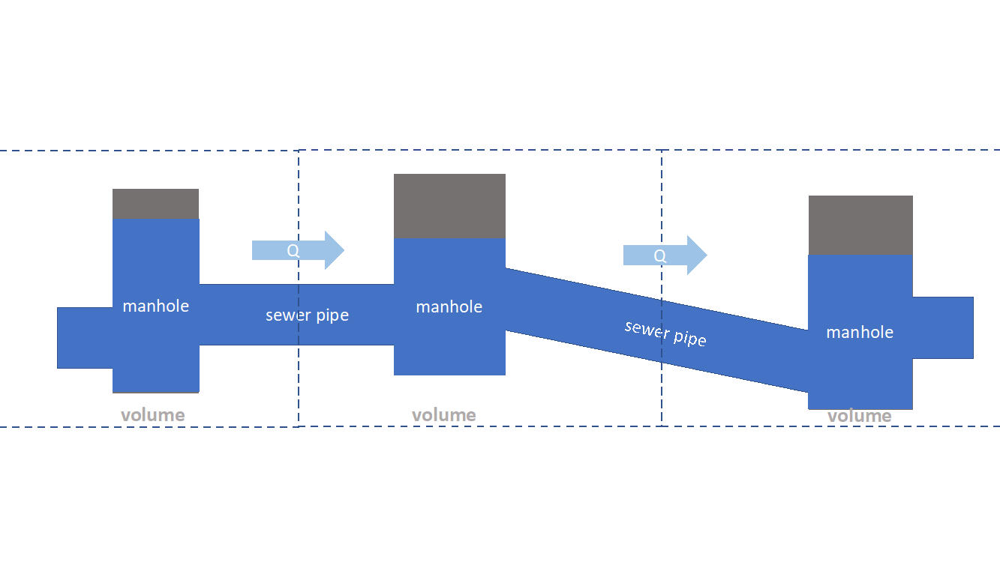

.. This document is not included anywhere in the documentation. But I don't know where to put it. Pipe flow could be put under 1d flow?

.. _sewerage:

Pipe flow
=========

The dynamic flow through complex sewer networks can be computed fast, stable and accurately by 3Di. 3Di can be used to model any sanitary, storm and combined sewerage system, offering complete hydrology and hydraulic simulation and real-time control (RTC) modeling capabilities. 3Di uses the complete “de Saint Venant Equations”, including backwater and transient flow phenomena. The computational core has an automatic drying and pressurized procedure and handles both subcritical and supercritical flow. The computation is 100% mass conservative, machine precision.

.. figure:: image/b_sewerage_overview.png
   :alt: b_sewerage_overview

   Sewerage system overview

The sewer network has to be defined in the 3Di model schematization. A sewer network is based on manholes connected by pipes. In the model a wide variety of cross sections and manhole shapes are available, including user-defined ones. In the sewer network one can specify any type of hydraulic structure, such as single or multiple stage pumps, weirs of any shape, rectangular and circular gates, culverts and storage and overflow basins. All structures handle free, submerged and transient flow conditions. Real-time control, including PID control, are available for all structures to simulate real time controlled networks.

Combination of sewer network with other 0D, 1D and 2D networks
-----------------------------------------------------------------

A sewer network is a special type of 1D network. Another type of the 1D network is an open water network. Both type of 1D networks can be combined in one model. There is no limitation to number of sewer pipes, the number of networks or the complexity of the networks.

The 1D sewer network can be linked to a 2D terrain model above that network. The spatial boundaries of the 1D and 2D model can be different. This implies that if desired, only a specific part of the 1D network can be covered by the 2D network, or the other way around.

The 1D sewer network can also be linked to a 0D network of nodes. The 0D nodes can be used for rainfall runoff inflow and dry weather flow. In the rainfall runoff process various types of paved and unpaved areas, such as streets, roofs and parking lots can be simulated (see :ref:`0d_rain`). Detailed infiltration as a time-dependent process following the HORTON equation is also available.

Schematisation
--------------

Basically, a sewer network is built of manholes and sewer pipes. Each manhole is represented as a node, and each node has x,y,z coordinates. The sewer pipes are defined by a begin and an end node. Any number of sewer pipes can be connected to a manhole node. Lateral inflow and outflows are located on the manhole nodes. In the computational core, a volume and water level is computed at each manhole node. Thereby the volume of each manhole and the connected sewer pipes is taken into account. In between two nodes a discharge is computed, based on the water levels and pipe characteristics.

.. figure:: image/b_sewerage_schematization.png
   :alt: b_sewerage_schematization

   Sewerage system schematization

   Distribution of volume and flow in 3Di sewerage system

If the water level rises above the street level, as defined on each manhole, the water can be stored on the street, by defining storage above street level. Typically, a manhole has a storage area of 1 m2, and the street has a storage area of 100 m2. By defining street storage above the manholes, the water level rise is slowed down, by the increased storage volume. After the storm event, the water stored above the manhole is discharges by the sewer network.

.. figure:: image/b_sewerage_surface_storage.png
   :alt: b_sewerage_surface_storage

   Storage above manhole

A more refined approach is to link the manholes with a 2d terrain model. In that case, water is not only stored above the manholes, but it can also flow away to lower areas. This approach is preferred for cases with heavy rainfall where a considerable amount of water is discharges by overland flow.

Another possibility is to model the streets only by defining an open sewer pipe which represents the street profile. In that case a 1d model is used to represent street flow between manholes. Although this possibility exists, a 2d model terrain model is preferred for its accuracy.

