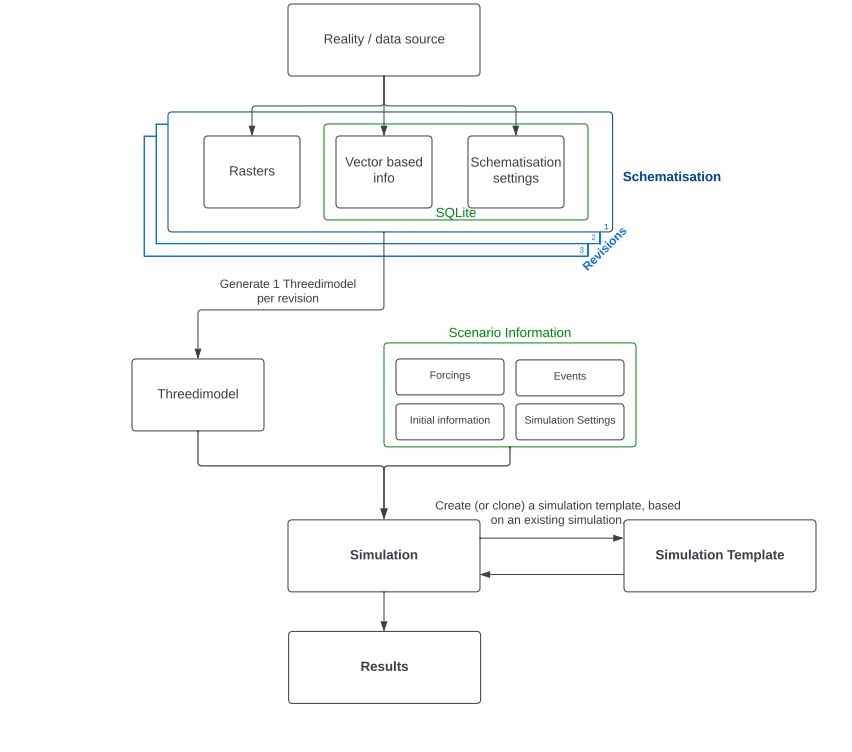

.. _basic_modelling_concepts:

Schematisation, Models & Simulations 
=====================================

   A schematic overview of the 3Di Workflow modelling concepts.

During the workflow from real-world data to simulation results, one encounters various modelling concepts.
The first important concept is the **Schematisation**. A schematisation consists of all the required information to create a calculation grid and subgrid tables: one or more rasters and a single SQLite.
The latter contains vector based information and the schematisation settings, such as grid and table settings. 

When a new version of a schematisation is re-uploaded, a new **Revision** is created.
A schematisation can thus consist of multiple revisions. Out of each revision a so called **3Di Model** can be generated. 
A 3Di Model is the required format (i.e. a calculation grid and subgrid tables) of the data for the calculation core to run a calculation. 
For each schematisation, the maximum amount of generated 3Di Models to exists is 3. 
This means that if a fourth revision is uploaded, while the first three revisions contain a generated 3Di Model, one 3Di Model needs to be deleted before being able to generate one for the newest revision.

.. note::
   Please note that when deleting a 3Di Model, the revision of the schematisation will **not** be removed. This means that a deleted 3Di Model can be re-generated at any time, as long as the schematisation has no more than 3 existing 3Di Models.

In order to run a **Simulation**, additional **Scenario Information** is required. 
The Scenario Information is a bundle of information of one or more of the following factors: 1) Forcings (i.e. wind, rain etc.), 2) Events (i.e. breaches, laterals etc.), 3) Initial Information (i.e. initial water levels), and 4) the Simulation Settings (i.e. numerical and timestep settings).

After a simulation has run, a **Simulation Template** can be created. 
A simulation template is basically a copy of the simulation, which refers to the model and scenario settings that were used for the simulation.
The power of a simulation template is that it can be used to start another simulation with the option to change various settings, including the scenario information. 
This enables the option to clone and change past simulations, instead of having to start from scratch all over again.
Therefore, simulation templates comes in very handy in, for example, batch calculations.

.. figure:: image/a_modelling_concepts_visual.png
   :alt: A visual overview of the 3Di Workflow modelling concepts
   
   A visual overview of the 3Di Workflow modelling concepts.
