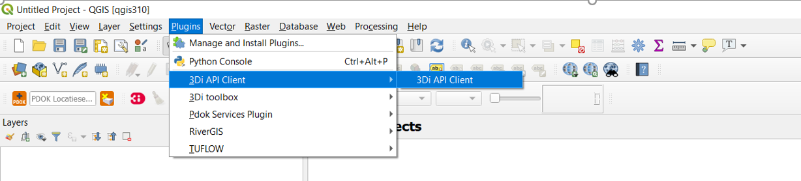
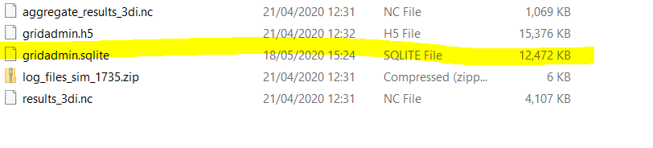
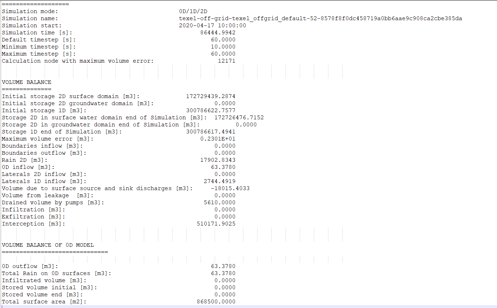
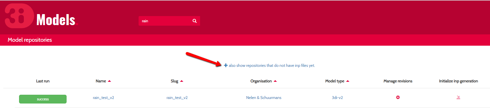
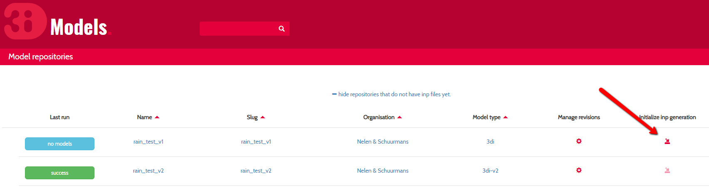
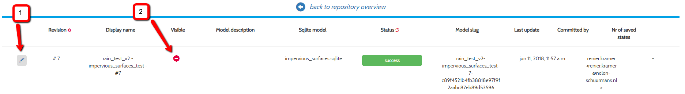

*************
Release notes
*************

Release 3Di Modeller Interface - Hotfix
########################################

Monday July 6th we have released version 1.14.1 of the 3Di Toolbox containing two bugfixes. The following issues have been fixed:

- In case of a schematization without a pump the graph tool was empty
- In the sufhyd importer pipe material is now correctly imported from the sufhyd file

To obtain the fixes:

- Download the latest version of the `modeller interface <https://docs.3di.live/modeller-interface-downloads/3DiModellerInterface-OSGeo4W-3.10.6-1-Setup-x86_64.exe>`_
- Or update the 3Di Toolbox in the plugin manager. In QGIS: Settings --> plugin manager --> Select the 3Di Toolbox --> Click upgrade plugin

Updating the Modeller Interface without complete reinstallation is also possible. In that case follow these instructions:

Open the Modeller Interface and via the menu bar go to ‘Plugins > Manage And Install Plugins’.

- Go to ‘Settings’.
- Add a plugin repository
- Fill in a name and copy the URL: https://plugins.lizard.net/plugins.xml into the URL box.
- Go to ‘All’ and choose ‘3Di toolbox’ from the list
- Upgrade the 3Di Toolbox plugin to version 1.14.1

Release 3Di - 2020-05 Zambezi Release
#####################################

The Zambezi release is a major release, including the introduction of a new API and a new live site and some big improvements of the modeller interface. The new set up is based on the idea that simulation includes model information and scenario information. Putting these two aspects together makes a simulation. This release and the following releases will bring this reality to you.
Model information includes all information you need to set up a model and make you computational grid. Scenario information covers initial conditions, forcings, like rain, wind, timeseries and controls. Thanks to this distinction, you can now construct a simulation for a given model and by storing all scenario information in events, make all simulation information retraceable and comparable. Furthermore, it makes it easier to create a uniform method to interact with simulations. In the sections below, we will introduce some more details.

API 3Di
=======

First, some definitions and names of versions to avoid confusion.  

========= =================================================================
Name      Description 
========= =================================================================
V1 models act with computational core v1 and the current live site
V2 models act with API v1 and v3 with current and new live site
API v1:   Api to run v2 models without use of the live site
API v3:   API to run v2 models, supports all action of new live site 
========= =================================================================

The first 3Di API implementation is called v1, but this API works with the so-called v2 models. We have decided to move forward to API v3 to avoid confusion with models that are sometimes also called v2. In these release notes we refer to v1 for current production and v3 for the newly released software. For the number of available simulation sessions, it does not matter whether you are using the v1 or the v3 API. The new live site is completely based on the v3 API. However, since this is for the live site still beta-release, we are going to not force this yet and give everyone a chance to try out the new beta live site! 

We keep API v1 for users to give some time to get used to our new API. In the table below you find an overview of the status of the 3Di API and the live sites:

============================= ================= ==================
Component                      After May 25     After August 25	
============================= ================= ==================
API v1                          Production      Deprecated
API v3                          Production      Production
3di.lizard.net                  Production      Deprecated
beta.3di.live                   Beta            Production
v1 models                       Nothing changes Deprecated
============================= ================= ==================

With the release of API v3 and the new live site, it is important to note that the current API v1 and live site on 3di.lizard.net will still be available. As this release includes some very significant developments, we introduced 3 months overlap to get used to the new interfaces, before we will make a full switch. In the meantime, we will host webinars and provide documentation to make the switch as smooth as possible.
The new API can be found here: https://api.3di.live/v3.0/ 
If you use python, please use our open API implementation: https://pypi.org/project/threedi-api-client/
More information on how to use the API checkout here: :ref:`api_v3` 

Model information and Scenario Events
=====================================

The model information consists of all information that determine your modelling domain, computational grid and physical processes. Scenario events will define what is simulated. An event will for example determine your initial conditions and it defines certain forcings. The model information is defined in your spatialite and the scenario information will be defined in your API call. The separation of scenario information from model information nearly done. There are two specific scenario events that are not yet fully included and are still defined in your spatialite. 
These are the initial waterlevels and boundary conditions. For example, to use the initial water level that is defined in your spatialite a different call is required than when using initial waterlevels directly through the API. The boundary conditions can only be defined in the spatialite. 
In the upcoming months, these exceptions are fully resolved.  We will also inform and help you, how to deal with the information that is currently stored and saved in your models. 
In the table below, the current status of implementation of these scenario events. Note that this concerns only the v2 models:

============================= ================= ================= ===============
Forcings                        Spatialite          API             Live site
============================= ================= ================= ===============
Boundary conditions             v1, v3              -               v1, v3
Initial water level             v1, v3              v1, v3          -
Laterals  1D and 2D             v1                  v3              -
============================= ================= ================= ===============
A user can trace back the events of a simulation via this page: https://api.staging.3di.live/v3.0/simulations. 

Model meta info
^^^^^^^^^^^^^^^

With API v3, some extra model meta information is stored and made available. The user can also access this information. The meta information that is available for a model is:

- Request a model-list by organisation from the server
- Request an organisation-list from the server (which a user has access to)
- Potential breaches
- Model extents
- Model geojson including calculation grid
- Direct grid administration download
- Availability initial waterlevels

Interacting with a simulation
^^^^^^^^^^^^^^^^^^^^^^^^^^^^^^

With the development of the new API v3, the ability to interact with 3Di has become much more efficient. The API v3 offers various possibilities to uses for non-3Di developers. Users are now able to script against the API v3 (or even create their own client) and thereby having full control over a simulation. Some examples of this are:

- Follow simulation (see progress of a simulation)
- Get results while still simulating (using websockets)
- Interact with simulations (start, stop, pause)
- Adjust attributes of your schematisation while running (pause first)

The following attributes can be changed:

- Change you DEM
- Control the discharge coefficients of structures
- Control the pump capacity
- Control the weir crest level
- Control for orifice crest level

Combining some of the features in 3Di, allows a whole new range of applications. For example, one can build his/her own control: follow water levels up and downstream of weir and adjust the crest level based on these values. 

Enhanced input possibilities
^^^^^^^^^^^^^^^^^^^^^^^^^^^^

Additional input options and simulation options were implemented:

- Upload own rainfall data, this can be a timeseries or a NetCDF  
- Re-run the same schematisations immediately while changing initial waterlevel or laterals

Here you can find some usage examples: https://nens.github.io/threedi-openapi-client/

beta.3di.live
=============

We are proud to release the beta version of our completely new live site. We completely redisigned our live site after several rounds of input from different kind of users. We invite you to test out our new beta site on beta.3di.live and give us your feedback. This beta live site is released next to the current live site which for the moment stays the production site. 

**Please note** that initial water level and laterals that are defined in the spatialite are not yet taken into account when simulating purely via beta.3di.live. 

Modeller Interface
==================

We have added a toolbox to our repo’s that enables user to start simulations via the API v3 directly. There are two ways to install this wizard: 

- By installing the `modeller interface <https://docs.3di.live/modeller-interface-downloads/3DiModellerInterface-OSGeo4W-3.10.6-1-Setup-x86_64.exe>`_

- As a plugin:  :ref:`plugin_installation` (After installation open the panel as follows: In QGIS menu choose plugins --> 3Di API Client --> 3Di API Client

	

The interface is in beta, it includes:

- login
- choose model
- choose billing organisation
- choose duration of calculation
- choose rainfall type event (rain, custom, constant)
- see progress of simulations from other users within the same organisation 
- download files directly from the server using the download menu

Bugfixing Threeditoolbox
-------------------------

We have fixed the following issues:

- graph tool: pump_discharge is now only shown on pumps, discharge only shown on flowlines
- schematisation checker: check for line connections shorter than 0.05 m
- schematisation checker: check whether use_1d_flow is turned on when having 1D elements
- schematisation checker: schematisation checker crashes when a datetime column doesn't contain a date

**Important note:**
If you’re using the plugin on a model that you have already looked at before, go to the folder with the results and remove the gridadmin.sqlite. You might have to close QGIS to be able to do that. Then load in the results again. 

	
Computational core
==================

Features:

- Refactor Core program interface.
- Added method for setting wind drag coefficient during initialization.
- Compression of netCDF results.
- Write results in Float32 to result files (NetCDF).
- Improved logging and log levels. 

Fixed the following issues in computational core v3:

- Small memory allocation problem in lists.
- More efficient memory allocation for advection administration. Issue for large models and high indices
- Fixed memory leaks.
- Fixed computation of aggregation method “average”.
- Fix for length of channel, when multiple channels connect to 1 connection node.
- Correction for friction computation in rectangle cross-section
- Fix for flow summary concerning boundary inflow and outflow in case boundary starts dry.

Fixed the following issues in computational core v1 (May 27 2020):

- More efficient memory allocation for advection administration. Issue for large models and high indices

Release 3Di - 2019-11 Meuse Release
###################################

In the Meuse release we updated, improved and created a lot of features. These features, with more detailed description below, include:

- New Modeller interface (incl. Windows installer)
- New calculation API (beta)
- Operational flood forecasting with 3Di
- Script sharing - Invitation to participate
- Damage calculations
- Documentation
- Bugfixes

Modeller Interface (incl. installer)
====================================

We are happy to announce our brand new user-friendly Modeller Interface. We offer a brand new installer in which we have configured QGIS specifically for model building and analyzing. We do this to assist users in getting a more user friendly experience when building a model. It also helps in positioning our plugin within organisations, now it is clear that our version is meant for 3Di model building while still having the benefit of being powered by QGIS.
In this installation we include QGIS, our plugin, additional useful third party plugins and a custom (simplified) layout. So no need to have QGIS installed any more. As a user you have two choices:

- use our Modeller Interface installer (for standard use of 3Di)
- use QGIS and install our plugin (for advanced users)

Download the `installer <https://docs.3di.lizard.net/modeller-interface-downloads/3DiModellerInterface-OSGeo4W-3.4.13-1-Setup-x86_64.exe>`_

If you experience difficulty within your organization installing QGIS 3.x or the Modeller interface and are still using QGIS 2.18 please contact our `local partner <https://landgoed.it/producten/>`_ (dutch only) that advises organizations on the implementation of QGIS.

Based on user feedback during our user meetings in the Netherlands and Denmark and suggestions we received in our servicedesk we have implemented a lot of features like default values, selectable options, assistance with obligated fields and lots more. This makes model building for 3Di more intuitive.
Additionally, when loading a model using the 3Di toolbox, automatically a spatialite connection is stored. This makes it easier to use the raster and schematisation checker.
For a full list of adjustments, have a look at the `qgis documentation page <https://docs.3di.lizard.net/d_qgis_plugin.html#view-and-edit-3di-model-a-schematisation>`_.

New calculation API (beta)
==========================

We have released the first version of the brand new API. We are very proud to share this with you. Because the new API is a beta release in this Meuse release, it does not yet support all features of our current API. The implemented features, however, do support a wide range of possible calculations. More on that below.

A big improvement with the new API is the separation of model schematization and scenario information. As a user you -of course- still need to create your model schematization and upload this to the 3Di cloud. This uploaded schematization does not have the scenario information included. This information needs to be provided through the new API at the start of a calculation. This unlocks the potential of more efficient scenario based simulations. Multiple simulations can now be run without additional preprocessing of the schematization, when only scenario information changes. Another big improvement in the new API is the improved ability to monitor the status of simulations while they are running, and subsequently the possibitity to stop simulations. It is therefore not required anymore to wait for the full calculation to finish and to then discover something was wrong with a setting or a mistake in the model schematization was made. For more reliability the new calculation API enables us to develop faster and deploy easier, by automating a lot of the testing. This results in smoother and more reliable releases in the future.

This new approach is a big change in how the calculation core works. The engine remains the same, but the shell has completely changed. So what do we support right away?

Scenario’s:

- rain (radar, timeseries, including more extensive custom rain option)
- sources & sinks
- laterals (**new!**)
- upload own events (using netCDF) (**new!**)
- initial water level (1D/2D) (**new!**)

Interactiveness:

- start
- stop (**new!**)
- pause (**new!**)
- progress (**new!**)

States:

- saves state
- use saved state

Results:

- result download via API (**new!**)
- metadata on modelrun & model schematization (**new!**)

Here you can find a more `detailed technical overview <https://nens.github.io/threedi-openapi-client/usage/>`_.  of our API.

*How to continue*

This release is our first production release. To get a feel for the new API and help us improving it, users can request acces to the beta release. Interested to be a beta user? Let us know here.

Of course we are still developing. The new API will become the main route for future calculations. On top of the programming interface, regular users will be facilitated through the Modeller interface for use of the new API in the future. We will start rolling out an interface in the Modeller interface that will automatically use the new API route. So what features will be released in the near future?

Scenarios:

- breaches
- wind
- raster edits
- boundary conditions

Interactiveness:

- make changes (after pausing the model)
- request results (during calculation)

Results:

- postprocessing via Lizard

Operational flood forecasting with 3Di
======================================

We are proud to announce that we have made it easier to deploy your 3Di model operationally. You can now start, stop, pause and analyze your 3Di model using the aforementioned new API. Interested to know more about operational possibilities of 3Di? Read this `blogpost on operational flood forecasting <https://3diwatermanagement.com/blog/operational-flood-forecasting-with-3di/>`_ or contact us directly via jonas@nelen-schuurmans.nl

Script sharing - Invitation to participate
==========================================

One of the special things about 3Di is that we have made our software available via an API, so users can integrate it into their work process using their own tools. Thanks to this possibility a lot of our users have already built custom scripts on our API. This can be to start a calculation, built a model or to analyse results in a specific way. To give everyone a chance to share their work and help each other forward, we have opened a repository on github to share the code:

`github.com/threedi <https://github.com/threedi>`_

Not only is this an opportunity to show to other users what you’ve built and keep track of different versions of these scripts. Would you like to share your work but you don't know how github works? Contact us via servicedesk@nelen-schuurmans.nl and we'll help you with this.

Damage calculations
===================

For our Dutch users only: The base maps for damage calculations are updated with the AHN3 data for the following areas:

- Waterschap Vallei en Veluwe
- Waterschap Rijn en IJssel
- Waterschap Limburg

Documentation
=============

As part of a continuous improvement of the documentation, the updates have been made to:

- `New database sheet  <https://docs.3di.lizard.net/d_before_you_begin.html#database-overview>`_.
- `Manual <https://docs.3di.lizard.net/d_qgis_plugin.html#view-and-edit-3di-model-a-schematisation>`_ of our QGIS plugin

Bugfixing
=========

Modeller Interface:

- Improved raster_checker's 'extreme raster values' check: not rely on meta data, but check actual data. Also include number of warnings in pop-up when finished.
- Added missing columns to the manhole_view layer.
- Added 'v2_cross_section_location_view' and 'v2_simple_infiltration' layers to the schematisation group.
- Fixed schematisation checker, now levees are also checked for empty geometries.

Release 3Di - 2019-07 Rhine Release
###################################

The newest version of 3Di is released on July the 8th 2019. This 2019-07 Rhine release is a big step towards a fully new way of interacting with 3Di. The following features are released:

- Schematization checker
- API v3 dev version

We have changed the way we name our releases, from now on releasenames will have the following structure: year-month and the name of a water body.

Schematization checker
======================

We proudly announce our newest addition to the 3Di Modeller Interface! Our QGIS toolbox has been expanded with a new tool, called the schematization checker.
This tool will help you  building your 3Di models. Simply select your 3Di schematisation and run the schematisation checker. It will verify a range of input data and settings. It reports any missing or incorrect data in your 3Di model. This first version of the schematisation checker will find already the most common mistakes made when building a 3Di schematisation. This first version of the schematisation checker does not catch all possible errors in your 3Di schematisation. However, we will add more checks in the future.

`Documentation <https://docs.3di.lizard.net/en/stable/d_qgis_plugin.html>`_. of the tool.

Just like the ThreeDiToolbox, the schematisation checker is an open source tool. You can find the `source code <https://github.com/nens/threedi-modelchecker>`_. online Any contributions are greatly appreciated.

API v3 dev version
==================

We have made a dev release of our new API. It is meant for developers to hook up their applications in an early stage of development. A full working version will be made available for all users in the next release. A sneak preview is given in this `blogpost <https://3diwatermanagement.com/blog/release-3di-2019-07-rhine/>`_.

Bugfixes
========

We have also fixed some bugs this release. In case of the computational core it is required to re-run inpy to use the bug-fixed version.

Computational Core
==================

- Leaking levees: Users reported that in some very specific cases levee elements did not block the flow. We have been able to find the exceptions in which did occur. It was due to a combination of the location of the vertices and the edges of subgrid cells. Therefore, the chance it would occur increases in case of larger subgrid cells.
- Long crested weir: In case of forking 1D elements just before or after a long crested weir, the model would crash. This is now fixed.
- Sommerfeld edges: We have fixed a bug for the Sommerfeld boundary conditions, which might occur in pure 1D calculations.
- 1D Laterals: In case of 1D laterals, the results were not correctly written in the netcdf and in the flow summary.

QGIS/Modeller Interface
=======================

- Animation toolbar:  The animation toolbar previously allowed users to select variables from the aggregation netcdf. However, these variables were not supported in the animation tool causing it to crash when a user selects them. We've removed these aggregation variables from the animation tool. Furthermore, the timeslider now displays the selected timestamp index as "Days Hours:Minutes" after the start of the simulation, similar as in the 3Di live-site. Previously it displayed an timestamp index.
- Load all tables from spatialite in qgis on startup: Not all 3Di tables were loaded when selecting a 3Di model. We have added the missing table. Still missing a table? Let us know
- Show connection nodes and manhole: Since the previous release, connection nodes and manholes were not visible on the map. This is now fixed.
- Improved logging: We improved the logging and the accessibility of the 3Di Plugin. Therefore we introduce  a new icon in the toolbar. This will allow you easy access to the log file. Found a bug? Report it via `topdesk <https://nelen-schuurmans.topdesk.net/>`_. and send us a copy of the log file. This will greatly help us in reproducing and fixing the bug!
- Dependencies management: We have made improvements in the dependency management of the 3Di Plugin. Python dependencies of the plugin are now installed under the python folder of the active user profile instead of in the plugin itself.

Once you have installed the newest version of the plugin, you should be able to install/uninstall and activate/deactivate the plugin via the Qgis plugin manager again. Updating the ThreediToolbox to the newest version should be a breeze in the future!
- No longer experimental 3Di Plugin: The 3Di Plugin is no longer marked as an experimental plugin. You no longer need to configure the Qgis plugin-manager to also show experimental plugins. The experimental version of the 3Di Plugin will not disappear. In the future, we will be using the experimental marked plugin to distribute beta releases of our 3Di plugin.

Release 3Di - Hotfix
####################

On Monday April 30th, we have released a minor hotfix on our 3Di servers.

The following issue has been fixed:

- In case of a table control structure with discharge_coefficients, settings
  are applied in the right order.

The next full release of 3Di is scheduled for the 8th of July. Then, the Web
Interface will be unavailable between 8.00 AM and 12.00 AM (CEST).

Release 3Di - Carnival Release 2019
###################################

The newest version of 3Di is released on March the 4th. This Carnival release contains various new features. Moreover, we are preparing for a huge product upgrade of the back-end of 3Di. We will explain this in more detail in the next releases. Furthermore, a brand new 3Di start page has been made available to all users: 3Di `startpage <https://3diwatermanagement.com/3di-start>`_.

Usage
=====

We are happy to introduce a brand new usage `page <https://usage.3di.lizard.net>`_. Users will have an overview of their use of 3Di. This contains the time spend and the time still available for simulations, how many sessions are currently available and who is simulating at that moment. Moreover an overview is given of all simulations that have been performed.

Surface source and sink terms
=============================

After the Carnival release, it is possible to add a surface source and sink term to your 3Di model. The surface source and sink term will allow users to add or substract water from your 2D surface domain. This can be used for many purposes. An example, could be a simplified method to capture evapotranspiration effects during your simulation. This feature will only be available via the API. In a follow-up release of 3Di, we will support not only time-series, but also time-varying rasters. In the example mentioned above, it would allow for a time-varying evapotranspiration based on satellite imagery. A more detailed description of the :ref:`sssdischarges` is given wit the surface sources and sinks.

Download option for migrated SpatiaLite files
=============================================

The models in the 3Di repository are migrated after every 3Di release. This to ensure they are still available and working. After this release, the migrated spatialite can be downloaded. New features can than be directly added to existing models. Users will find, after the release, their migrated Spatialite in their model repository at https://3di.lizard.net/models. Users have to download and manually check in the updated Spatialite file in their own repository if they wish to work the latest Spatialite file. This is optional, and only required if you wish to use the newest 3Di features.

QGIS 3.4.5 support
==================

We are happy to announce the support on QGIS 3.4.5 for all 3Di related QGIS tools and plugins! We follow the lead of the QGIS in releases and in support of our plugins. This means that we will also stop active development on QGIS 2.18. New features will only be available for QGIS 3.4.5 as this is the new Long Term Release from QGIS. A `technical overview <changelog.qgis.org/en/qgis/version/3.4-LTR/>`_. can be found online.
Some nice `animations <https://north-road.com/2017/12/24/24-days-of-qgis-3-0-features/>`_. of several of the new features are published online.
Specifically for 3Di, one of the most exciting new features is the new *Mesh support*. This will allow to visualise easily your water levels and velocities in the 2D  domain. This will show the raw data as available in the NetCDF. When using the Crayfish plugin, users can create movies. Note, that results of surface source and sink terms will only be visualised in the plugin supported by QGIS 3.4.5.

The 3Di plugin is tested against windows7, windows10, Linux16.04, Linux18.04. The easiest way to install QGIS with the correct dependencies is using the stand-alone installation package (https://www.qgis.org/nl/site/forusers/download.html). Under Windows, it is recommended to use a 64-bits version of QGIS (a compiled 64-bit version of the netCDF library is included. For the 32-bit version of QGIS you have to install/compile a version of the python netCDF library under QGIS yourself).

Raster Checker
==============

Rasters contain important input data for 3Di. It can be a challenge to have perfectly fitting rasters with all the proper settings. Therefore, we introduce the Raster Checker. It is a tool in the 3Di toolbox of the QGIS plugin that assist the user in checking the consistency of the provided rasters. For example, it checks the alignment of the rasters and the correct settings for nodata values and the pixel dimensions. The DEM raster is taken as leading for all checks. The following checks are performed on all referenced raster in the Spatialite file for all global settings entries:

1. Are all filenames of rasters within one setting_id unique? (3Di can handle this, but the RasterChecker not).
2. Do the referenced rasters (in all v2_tables) exist on your machine?
3. Is the raster file extension .tif / .tiff?
4. Is the raster filename valid? (no special characters, no space, max one '.' and '/')
5. Is the raster single- (not multi-) band?
6. Is the raster nodata value -9999?
7. Does the raster have a projected coordinate system (unit: meters)?
8. Is the raster data type float 32?
9. Is the raster compressed? (compression=deflate)
10. Does the pixel-size have max three decimal places?
11. Are the pixels square?
12. Are there no extreme pixel values? (dem: -10kmMSL<x<10kmMSL, other rasters: 0<x<10k)

After running the tool a pop up window will appear which shows the name and location of the log file with detailed error logging and a shapefile with point information to show you were errors have been found.

Bug fixes
=========

The following bugs have been fixed in this 3Di release:

- Water balance tool now correctly checks whether rain has been applied to simulation
- Fixed bug in netcdf_groundwater not reading in correctly the aggregate variable
- Apply conversion from hours to seconds of inundation_period in damage_estimation settings when headless calculation is started from queue (after "currently no sessions available"). When storing results, the applied unit is now consistently in hours in the whole 3Di stack.
- Error related to case sensitivity in email addresses resolved in user management screen.
- Show polygon of raster edit for v2 models in live site.
- Handling DEM edits through levees correctly. Users don’t have to edit the full width of the cell edge anymore to lower the levee.
- Use of correct primary key in relation between manholes and connection nodes when visualizing water depth, water level and groundwater level on the live site.
- Fixed deletion of generated inp-files of deprecated model revisions. Users have access to max three revisions of their models. Before, models were incorrectly being stored on the server.
- [3Di QGIS plugin] Select correct scenario results after filtering in list.
- [3Di QGIS plugin] Fixed visualization of interception time-series.
- [3Di QGIS plugin] Water balance now correctly checks availability of rain in scenario results.
- API Calls are being checked for invalid options. It is no longer possible to pass an invalid option into the API.
- Time out on the live site has been adjusted to 15 minutes in case of inactivity.

Release 3Di - Hotfix
####################

On Monday January 14th, we will release a hotfix on our 3Di servers. We expect a very limited downtime around 8.00 AM (CEST).

After the hotfix, the following issues will be fixed:

- Bug concerning the chosen boundary condition type for some cases that include 1D and 2D boundaries
- For a specific combination of SpatiaLite-settings, e.g. multiple entries in v2_global_settings table, egg-shaped profiles were not processed correctly
- DEM edits are now possible outside the -10 m and +10 m range

Furthermore, in the LiveSite a wider range of design rainfall events is available. This concerns some specific Dutch rainfall events (DPRA buien).

The next full release of 3Di is scheduled for the 4th of March. Therefore, the Web Interface will be unavailable between 8.00 AM and 12.00 AM (CEST).

Release 3Di – Hotfix
####################

On the 5th of December 2018 3Di, will be updated with some minor fixes. These include:

-  The cross-sections in case of a breach in combination with interflow
-  The 1D discharge written in the results NetCDF and the aggregation NetCDF in some special cases
-  Included a correct initialisation for aggregation setting 'current'

Release 3Di – Fall Release 2018
###############################

The newest version of 3Di is released on 26th of November 2018. With this update, the following features are available for all users of 3Di:

- Interception
- Culvert discharge coefficients
- Water balance tool
- Option for custom rain event
- Software updates and bug fixes

Interception
============

With this release, we introduce a new process in 3Di to extend the processes of the hydrological cycle. It is now possible to take interception into account during your simulation. Interception refers to precipitation that does not reach the bottom, but is instead intercepted by buildings or vegetation.

The interception layer can be used in the following situations:

- The obvious application is to take the effect of interception into account due to vegetation, green roofs and other buildings.
- However, it can also be used in the so-called hybride models, where urban areas are modelled and the inflow to the sewer from buildings is directly coupled to the sewer system.

It is possible to edit the interception layer in the 3Di live site.

Culvert discharge coefficients
==============================

From this release, the culvert discharge coefficient will be enabled. The coefficient allows to take inlet losses for culverts into account and can be defined for positive and negative flow directions.  The coefficient is defined via an attribute per culvert in the table 'v2_culvert'. Prior to the release, the coefficients were already available in the spatialite. However, these coefficients were not yet taken into account. After the release, these will become active, this might, of course, affect the results. In case, these coefficients were unintended, set these coefficients to 1, and you will return to your previous results.

Water balance Tool
==================

A new version of the 3Di QGIS plugin is released as well. Hereby, we also release the 3Di water balance tool. Users can select an area on the map and see the exact water balance, including an overview of the flows between the 2D surface water, 2D groundwater and the 1D flow domains for a certain area and period. To be able to use this water balance an aggregation NetCDF is required. This exciting new tool helps users to get an improved insight in their water system. With this water balance tool, we help experts in their analysis and understanding of the modeling results.

For more information have a look at our documentation on the :ref:`waterbalance`. Here, one finds an overview of the aggregation settings required for the use of the water balance tool as well.

The water balance tool is an initiative of Deltares and a co-creation of experts of Deltares and Nelen & Schuurmans. It is co-funded by the Ministry of Economic Affairs (Top Sector Water).

Option for custom rain event
============================

In the 3Di live site, the options for rain events are extended. It is now possible to define a time-varying rain event.

Software updates and bug fixes
==============================

Behind the scenes there have been some major changes to the 3Di software. We have fundamentally improved the server-interaction. Note, this changed some minor things. When you want to load a new model, quit your previous session first. Your session on the live site will close after 1 hour of inactivity. Use the API, for longer simulations with no interaction.

Threedigrid has been extended with some more information of your model to allow for a more accessible analysis.

Moreover, several bug fixes have been performed.  These include;

- The message *No more sessions available* was sometimes visible, when it was not true. We have added a new session count system, which eliminates this bug
- No more potentially leaking levees in case of interflow
- Removed check for type 2 pumps on lower stop level.
- Added check for overlapping vertices in channels and culverts
- Fix in visualizing the groundwater results in the live site
- Fix for dealing with obstacles after a DEM-edit

Release 3Di – Autumn Release 2018
#################################

The newest version of 3Di is now available. With this update, it is possible to edit the bathymetry layer in the 3Di live site.
The following has been adjusted in 3Di:

- Bathymetry edits in live site
- Groundwater levels visible in live site
- Friction based on the Chezy formulation in 2D domain
- Adjusted logging
- Documentation update

Moreover, we took measures for the maintenance of the 3Di software. Soon you will receive an update with several developments around our QGIS plugin.

Please note! Due to technical problems, not all input files are updated to the newest 3Di version. We expect all models to be available October 8th. You can update the input files of your own model to the newest version manually, by following the tutorial at the end of these release notes. You are also welcome to contact our service desk to update the model for you.

Bathymetry edits in Live Site
=============================

A DEM (Digital Elevation Model) edit is the newest tool in our live site, it allows to adjust the height of the bathymetry. This can be done at any time during the simulation by drawing a polygon. The DEM edit is immediately committed when finishing the polygon. The result can be checked using the 'Cross profile' tool. A DEM edit is also possible via our `API <:https://3di.lizard.net/api/v1/docs/>`_ , thereby allowing external applications to perform a DEM edit as well. However, the steps performed by ‘process results’ do not take the DEM edit into account.  Take this into consideration when interpreting the results.

Groundwater
===========

In our previous release ground water has been added to 3Di. From now on groundwater levels are visible in the live site in the cross-profiles and in a pop-up panel for waterlevels.

Chezy resistance (2D)
=====================

From the start of 3Di, the Manning formulation is implemented to compute friction. In some cases users prefer to use a different friction formulation, for this the Chezy formulation is now available in the 2D domain.

Spatialite database in documentation
====================================

The overview of the spatialite database is updated in our documentation, because we found an error in a cross-section definition. It concerns type 1 rectangle. We advise everyone to download the newest database overview: :download:`here <pdf/database-overview.pdf>`

Error and warning messages
==========================

The next cases will be marked  as “Error” instead of “Warning”.
- Non-Existing foreign key relations, for example non-existing connections to impervious surfaces
- Friction type has to be specified for 2D (required as we now support both Manning and Chezy)
- Levee at inactive location in raster. Levee entree is skipped and lies between pixel coordinates ([i0,j0] and [i1,j1])
- Friction raster and DEM are not aligned, please check coordinates:
- Maximum infiltration raster and DEM are not aligned, erroneous coordinates are:
- Maximum infiltration raster and DEM are not aligned, number of erroneous coordinates exceed 10. File is not further evaluated and values are set to default value

We hope by doing this, to improve the feedback for users about errors in the model, before the model starts with the computation. When you receive one or more errors, you cannot proceed with your simulation until your errors are resolved. We ask users to check the warning and error messages after the model generation and try to solve them before contacting the service desk.

Tutorial: Update input for 3Di model
====================================

To run some simulations in first week of October, you may need to update the input files of your model manually. This tutorial explains the manual steps:

- Browse to https://3di.lizard.net/models
- Search your model. If not listed, click on ‘also show repositories that do not have inp files yet’. Only the version of your latest commit of your model will be listed, during this week. When you need an older and/or pinned version, please contact the service desk. We will make this version for you available.

- After you have found your model, click the icon in the column ‘initialize inp generation’

- Depending on the size of your model, the input generation can take a few minutes up to 15 minutes before it appears.
- As soon as the model appears, the column ‘last run’ will show a green button with the word ‘success’ or a red button with ‘failed’. In case, the generation failed, take a look at the log files.
- Click on the button ‘success’

- Click on the pencil icon on the left [1] and then on the button ‘visible’. [2]

- Store your result (save icon appears on the location of the pencil icon) [1].
- Your model is now ready for use in the live site and for use with the API.

Release 3Di - Hotfix
####################

On Thursday the 5th of July, we released a new version of 3Di to solve some minor bugs. The following has been added or changed:

LiveSite and API
================

- The wind forcing was not working properly after the previous release.

- Some computations, run with the rain radar input from The Netherlands, endured from a specific technical problem with map projections between the live site and rain radar. This is fixed.

Input
=====

The log-messages concerning errors in input data is improved. Users can find the error messages in the logging files on the model page. However, 3Di became also more strict to errors. If errors occur in the grid generation, a simulation cannot be initiated. An example of an error, that is often ignored: is when the lower stop level of a pump is defined below the bottom level of the connection node. Naturally, this is an impossible configuration. Therefor, this needs to be fixed by the modeller.

Furthermore, if a certain error occurs more than 10 times it will stop printing the error. This is to ensure that the log files remain compact and readable. This does not mean that the error is less important. An example of an error message that is encountered many times is when users supply rasters that are not aligned.

Inflow model
============

In 1D modelling, a mapping table is build to map connection nodes with the (impervious) surfaces related to the inflow model. Previously, we needed the ids of the mapping table to be incremental with no missing numbers. This is not required anymore. An example: after building a mapping table, the user deletes one of these mappings. In the past this meant that the ids of the table needed to be rebuild. In the current situation, no further action from the user is required.

Computational core
==================

The formulation to compute the flow through a breach is improved, in response to lack of the flow through a breach in case of a very small breach and high infiltration.

Release 3Di – Spring Release 2018
#################################

On Monday the 28th of May 2018 the latest version of 3Di will be released. This is a so-called major release. The past months, the team included groundwater in 3Di. In close collaboration with Prof. Stelling and in association with Deltares, we extended 3Di to a two-layer system to be able to compute the interaction between surface water and groundwater. A more elaborate explanation about the new features can be found in the 3Di documentation (https://docs.3di.lizard.net).

Some other changes:

LiveSite
========

Some of the visualizations in the LiveSite are improved. For example, the levees and breach locations are much better visible. Also, more information about the computational grid becomes available, such as the deepest point in the cell, the IDs and the levee heights.

Application Programming Interface
=================================

The progress of simulations that are computing via the API is shown on a progress bar. The progress bar can be found from the start screen (https://3di.lizard.net) under follow running simulations.

Input
=====

There are several adaptations in the input. There are three new input tables; v2_groundwater, v2_interflow and v2_simple_infiltration, to which you can refer to in the v2_global_settings table. The content of the final two table is not new, but are removed, for clarity, from the v2_global_settings table. In addition to this, there are some small changes concerning the aggregation input. For more detailed information, we refer to the 3Di documentation.

QGIS Plugin and Output
======================

There will also be a new version of the 3Di Plugin required (Version 1.0). With this release, we meet different conventions for NetCDF (CF conventions). With the new 3Di Plugin, results from the old type and the new type of the NetCDF can be evaluated. Behind the scenes, there has been a lot of work to reorganize the Plugin, as a preparation to future developments.

Release 3Di – April 2018
########################
########################

On Monday the 23th of April 2018 the latest version of 3Di will be released. The 3Di team worked mainly on improving the performance of computational times when using the API, and on implementing groundwater flow. Groundwater flow will be available to everyone from next month. In this release we have worked on:

Application Programming Interface
=================================

When you want to run batches of scenario’s or set up operational scenario’s the best route is using the API. An explaination for using the API can be found in the manual
:https://docs.3di.lizard.net/en/stable/d_api.html

- The computational times are greatly improved with this Release. Times can be up to ten times as fast.

Note:
The reduction in computational time does not occur for simulations, making use of wind and/or breaches. It is no longer possible to follow these API simulations via the Livesite. At the next release, user feedback for API simulations in the livesite will be improved.

Bug fixes
=========

There are improvements concerning:

-	Computations using embedded channels

-	The stability of connection to the livesite to make it more robust.

On Monday the 23th of April 2018  the 3Di web interface will be unavailable between 8.00 AM and 10.00 AM (CEST). The next full release is planned on Tuesday May the 22nd  2018.
