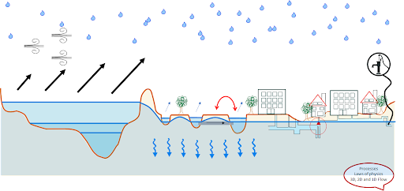

.. _overview_documentation:

.. *hier een globaler verhaal typen met uitleg hoe de documentatie is opgebouwd met referenties naar de kopjes*

Overview documentation
^^^^^^^^^^^^^^^^^^^^^^^

This document presents functional documentation, tutorials and a description of the methods used in 3Di. This document will help both the novice as well as the experienced 3Di-user. For the novice it contains background information and key points for creating a first model, while for the experienced user it will serve as a reference work. The manual contains the following sections:

* The sections under *Tutorials* is the place to start if you want to get going with existing models and changing them. In these section we also describe how to get insight in the results and some best practices. 

* The section *Problem Solving* consists of a list that contains the most common Error messages including how to fix them. We also update here some known issues. 

* In the sections under *Physics*, the concepts behind the 3Di engine are explained in detail. Read these sections to get to know the processes and the computations of 3Di.

* In the final part, *Model Concepts* clusters a series of numerical methods used by 3Di.

Information about courses, examples, demonstrations and how to contact us can be found on: https://3diwatermanagement.com/training/3di-course/ 

.. _welcome:

Introduction to 3Di
^^^^^^^^^^^^^^^^^^^^^^^^

3Di is a process-based, hydrodynamic model for flooding, drainage and other water management studies. It can be used for the computation of water flow in 1D and 2D. The software is developed by a consortium of Stelling Hydraulics, Deltares, TU Delft and Nelen & Schuurmans. With 3Di it is possible to make fast simulations while using a high level of detail. 3Di allows the user to interact with the model during a simulation. One can interactively influence the simulation by changing the rainfall, wind force and model components like cross-sections, breaches and pump capacities.

.. raw:: html

	<iframe width="560" height="315" src="https://www.youtube.com/embed/BvS8ijgUvuc" title="YouTube video player" frameborder="0" allow="accelerometer; autoplay; clipboard-write; encrypted-media; gyroscope; picture-in-picture" allowfullscreen></iframe>
	
*A short introduction to 3Di is given in this video*

The 3Di Ecosystem
""""""""""""""""""

3Di is not only hydrodynamic modelling for desk studies, but thanks to its unique setup it is also out of the box suitable for operational systems. The ecosystem of 3Di is as follows:

.. figure:: image/d_api_3di_ecosystem.png
   :alt: 3Di Ecosystem

The 3Di Ecosystem is composed of the following components; a computational core, an *application programming interface* (API), a model databank, the Modeller Interface and the` 3Di Live site. A typical workflow is that a user builts a 3Di schematisation on his laptop using the Modeller Interface, then uploads this to the Model Databank. The Model Databank stores revisions of schematisations and converts schematisations to 3Di models. These models are run in the cloud. 
There are several options to start a simulation: using the Modeller Interface, using the Live Site, using an operatonial model setup or directly via programming language. All these methodes use the 3Di API, which is a standardized way of interacting with the computational core and the model databank. 

.. Jonas: dit lijkt nu dubbel met stuk johanna

The Modeller Interface is the place where a Modeller builts or edits a schematisation, upload or download the schematisation to the model databank, starts a simulation, downloads results and analyses these results. The MI is part of QGIS with various pre-installed plugins: the 3Di Toolbox to analyse results, the 3Di API Client to start calculations, download results and some third party plugins. The interface has been cleaned compared to a standard QGIS installation, it shows only relevant buttons for model building and analysing.

Model Databank 

The Model Databank stores the uploaded schematizations, a user can keep track of the work in progress, download a previous version, or make a copy of a base model to test out scenario's without making changes to the base model. 
https://3diwatermanagement.com/blog/local-or-cloud-modelling-why-not-combine-the-best-of-both-worlds/

Live site

The Live Site enables user to start simulations, and interact with them. Simulations that have been started using the Modeller Interface or via the API can also be followed, however in that case it is not possible to pause the simulation and make changes to the 3Di model. 
[links naar rest docu toevoegen]

.. raw:: html

	<iframe width="560" height="315" src="https://www.youtube.com/embed/k9heL89ZF1E" title="YouTube video player" frameborder="0" allow="accelerometer; autoplay; clipboard-write; encrypted-media; gyroscope; picture-in-picture" allowfullscreen></iframe>
	
*A walkthrough of the live site is given in this video*

API

The API enables other applications and user interfaces to interact with the computational core. The computational core and the API run on specialized servers to ensure computational power. We develop and maintain two user interfaces the Modeller Interface and the 3Di livesite. Operational models can also interact directly via the API with the computational core. Naturally,  users who are familiar with programming languages can make their own interface or script to automatically calibrate or add their own controls to their simulation. Because all interaction with the model databank and the calculation core is API based it means that the whole workflow from 

.. Jonas: vanaf hier wel weer uniek

Computational core

The 3Di computational core is developed by Prof. dr. ir. G. S. Stelling, who worked on the subgrid technique in close collaboration with Prof. dr. ir. V. Casulli. Most of the techniques used within the 3Di engine are published in scientific papers.  https://3diwatermanagement.com/training/scientific-articles/ 

The computational core is completely built from scratch by Stelling Hydraulics, TuDelft, Deltares and Nelen & Schuurmans. Prof Dr Guus Stelling has over 25 years of experience in building hydrodynamic modeling software like Sobek Urban/Rural, Wanda and Waqua. The 3Di engine is based on state-of-the-art numerical schemes. The engine makes use of a so-called subgrid method. This technique includes high resolution information in coarse resolution computations. This guarantees both accuracy and efficiency. The 3Di engine includes a whole range of processes, including surface run-off, 1D and 2D surface water and groundwater flow. Moreover, it can deal with 1D sewer flow and structures like pumps, weirs and culverts. 3Di deals with numerous external forcings, like precipitation from radar images and wind. These unique characteristics makes 3Di suitable for climate impact studies, flood studies and hydraulic design of open channel and sewer networks. These are completely integrated flow calculations, meaning that the water euqations for these domains are solved in the same matrix. Contrast to a traditional solution where modelling domains are coupled (e.g. overland flow and sewerage). The benefit of the 3Di approach is that there is a stable interaction between 1D and 2D flow, a small mass balance error and less time iterations than would be required in case of couples domain models. 

Post processing of results

In an additional module 3Di offers users the possibility to automatically postprocess results generating interpolated water depth and water level maps, time of arrival, flood hazard rating and damage estimates. Results are stored in the 3Di scenario archive. Results can be downloaded, or used via OGC webservices (WMS, WMS-T) in your favorite GIS package e.g. ArcGIS Pro, QGIS, etc. 

Distributed Rainfall

With 3Di it is possible to calculate rainfall on 0D, 1D & 2D surfaces. These rainfall events can be timeseries with uniform rainfall on he whole area, or use data from rain radar. Within 3Di it is possible to upload these rainfall from radar as a NetCDF file, but it is also possible to connect to Lizard in case there is rainfall available for that area in the world. 

Processes in 3Di

With 3Di it is possible to calculate with the following hydrological processes:

- surface flow 2D
- groundwater flow 2D
- sewerage flow 1D
- channel flow 1D
- inflow 0D
- structures (e.g. weirs, orifices, pumps)
- controls (e.g. memory control, table control, timed control)
- distributed rainfall
- distributed sources and sinks (e.g. evapotranspiration)
   

Interactive calculations

With 3Di it is possible to calculate interactively. This means:

- See results of the simulation while it is still running
- Examine flow links, look at water depth maps
- Adjust the model during the simulation, e.g. edit the elevation in the model to create a dike, or a retention basin, edit the pump capacity, adjust a weir height, etc. The effect is immediately shown. 

GIS based model building and analysing

A 3Di schematization is built in a GIS package. 3Di provides tools for users to aid in de model building process and the analyzing of the modelling results. For this the processing power of QGIS is used, so a over hundreds of GIS processing tools are available for the user. 

Visualisations

Thanks to the setup of 3Di it is possible to create animations using the results of 3Di. 

.. insert example tracerts

.. insert example animation toolbar

.. insert example water balance tool

.. example barbapappa tool

.. example 3D visualisation

.. _basic_concepts_3di:

Basic concepts in 3Di
^^^^^^^^^^^^^^^^^^^^^^

.. Jonas: het is meer een soort definitie pagina? 

In 3Di there are a few basic concepts that are applied throughout the whole ecosystem.

Schematisation: A Schematisation is a work in progress model which has not been processed to be used in a simulation. Once a Schematisation is processed by the model checker and the grid-builder it's ready for simulation. The model that is being used in a simulation is called a 3Di-model. 

3Di Model: A converted schematisation that is ready to simulate on the 3Di servers 

Simulation template: A simulation template consists of initial conditions, events & forcings that are applied to a 3Di Model

.. nieuwste versie plaatje toevoegen 

Event: DEM edit, breach, control structure

Forcing: Sources & sinks, Rainfall, Boundary conditions, laterals 

Simulation: A 3Di model together with a simulation template forms a simulation .. Jonas: klopt dit wel helemaal?

Introductie van schematisatie en scenario is samen een simulatie.

.. _background:

Background of 3Di
^^^^^^^^^^^^^^^^^

The 3Di engine is based on state-of-the-art numerical schemes. The engine makes use of a so-called subgrid method. This technique includes high resolution information in coarse resolution computations. This guarantees both accuracy and efficiency. The 3Di engine includes a whole range of processes, including surface run-off, 1D and 2D surface water and groundwater flow. Moreover, it can deal with 1D sewer flow and structures like pumps, weirs and culverts. 3Di deals with numerous external forcings, like precipitation from radar images and wind. These unique characteristics makes 3Di suitable for climate impact studies, flood studies and hydraulic design of open channel and sewer networks.

