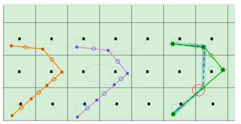
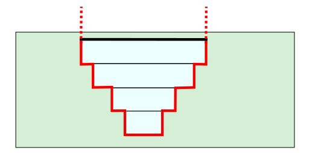

.. _1Dtypes:

1D Flow
+++++++

3Di offers the possibility to model areas as 1D networks. Generally, these simulations are very fast, but the schetisation is a strong simplification of the real world. The 1D elements should be used for application in which only one horizontal dimension (flow direction) is dominant over the other directions. In other cases one can make connection and combinations of 1D and 2D domains. 3Di has various options to integrate 1D elements in the 2D domain. This offers the possibility to preserve the complexity of the modelling domain, but to make use of the extra resolution option and speed of 1D computations. In such case, the 1D elements are narrow compared to the dimensions of the 2D resolution. 

The flow in 1D networks is computed, using the equations of conservation of mass and momentum, more specifically the 1D depth-averaged shallow water equations. The momentum equation for 1D flow is:

.. math::
   :label: 1D momentum equation

   \frac{\partial u}{\partial t}+u \frac{\partial u}{\partial s}=-g\frac{\partial \zeta}{\partial x}-\frac{\tau_f}{\rho}-\frac{\tau_w}{\rho}

| In which: 
| :math:`u` is the cross-sectionally averaged velocity
| :math:`s` is the 1D coordinate in along the network
| :math:`g` is the gravitational acceleration
| :math:`\rho` is the density of the water
| :math:`\tau_f` is the shear stress due to bottom friction
| :math:`\tau_w` is the shear stress due to wind

In words; in 1D, 3Di takes inertia, advection, pressure gradients, bottom friction and wind shear stresses into account. This yields for all types of 1D network applications. However, in the computation of advection and the effect of wind stress on specific 1D network configurations, some differences are applied. This will be explained more elaborated below.  

1D Network
------------

In the most abstract form, a 1D network can be viewed as a combination of nodes and lines. Such a network is translated to a grid, as described in :ref:`1dgrid`. The nodes and the connections have their own characteristics. Based on those, cross-sectional areas, storage and flow is computed. 

.. figure:: image/1dnetworkabstract.png
   :figwidth: 400 px
   :alt: abstract_1D_networks
   :align: left
   
   Example of a 1D network

Cross-sections of 1D elements
^^^^^^^^^^^^^^^^^^^^^^^^^^^^^

There are various options to define cross-sectional areas in 3Di. There are ready made shapes; circulair, egg-shape and squares. The other two options allow the user to custimize the cross-sectional area. One can define a table with any height width combination. Moreover, the values can be interpretated linearized or as discrete values. Some examples are shown in the figure. These tabelised options are very suited to deal with measured profiles in open water channels.

The top of cross-sections can be defined open and closed. When the  cross-section is defined open, the water level can rise above the defined height of the cross-section, the width of the cross-section remains the same. As is indicated in the figure with the dashed lines. In case the cross-section is closed at the top level, the water level cannot rise higher. The flow becomes pressurized.

.. figure:: image/b_1dcrosssections.png
   :alt: crosssec_1D_networks
   
   Examples of cross-sections in 1D networks; circular, egg-shaped, rectangular, open and closed tablelized cross-sections.

Types of 1D elements
--------------------

A water system consists often of small channels, ditches and pipes. These are difficult to model in 2D, and therefore they are schematised using the 1D network options in 3Di. These elements can interact with the 2D computational domain. There are three different options that determine the interaction with the 2D domain. The elements can be defined as:

- Isolated; no connection to the 2D domain

- Connected; one connection to the 2D domain

- Double Connected; two connections to the 2D domain

- Embedded; fully integrated with the 2D domain

   
   A connected, a double connected and an embedded channel in a 2D domain.

In the sections below, these options are further discussed. In this figure, three channels are drawn within a 2D domain. It shows a connected channel (orange), a double connected channel (purple) and an embedded channel (green). The squares indicate the computational points of the water level and the circles the locations of the velocity points. Their connections with the 2D domain are indicated with curved, dashed lines.

In a one network all these types of 1D elements can be used together. The sections :ref:`sewerage`, :ref:`structures` and :ref:`channels` describe how these elements can be defined in a model schematisation.

Isolated 1D network elements
^^^^^^^^^^^^^^^^^^^^^^^^^^^^

**When do you use this?**

In case the 1D network is defined as Isolated. The element does not interact with the 2D surface domain. In case a network is fully isolated, it is a pure 1D simulation.

   
   Example of an isolated element, the thin red line in indicates the top of the cross-section information.
   
**How it works?**

This is the simplest option. There is no interaction with the 2D domain, so only the 1D shallow water equations are solved. 

Connected 1D network elements
^^^^^^^^^^^^^^^^^^^^^^^^^^^^^

**When do you use this?**

In case the 1D network is defined as Connected. The element can interact with the 2D surface domain. For applications where one has an extended 2D domain including, various essential small scale features, 1D connected elements could improve the model. Ditches, sewer pipes and mannholes can be schematised using the 1D connected elements. Hereby locally increasing the resolution.  

.. figure:: image/b_connectedelement.png
   :figwidth: 450 px
   :alt: connected_1D_networks
   :align: right
   
   Four examples of connected elements. 1) The bank/drainage level is defined above the highest bed levels in the 2D domain. 2) The bank/drainage level is defined below the local bed level 3) The bank/drainage level is not defined, the exchange level is based on the local value of the bed level. 4) This is an example of a double connected channel, where exchange levels have different values.

**How it works?**

The computational/water level points of 1D elements, that are defined as connected make a connection to the nearest 2D computational/water level point. The figure shows different variations of exchange levels. Water will start to flow when the water level rises higher than the exchange level in either the 1D or the 2D computational point.

The exchange levels can be set by the user or are based on the local bed level. Once the water level reaches the exchange level, the computed flow is based on a reduced momentum balance;

.. math::
   :label: reduced 1D momentum equation

   0 = -g\frac{\partial \zeta}{\partial s} \big\rvert_{1D2D}-\frac{\tau_f}{\rho}

This momentum equation in combination with a cross-section defines the flux between the computational domains. 

.. math::
   :label: Q 1D2D

   Q_{1D2D} = u_{1D2D} A_{1D2D}

The cross-sectional area of the 1D2D connection is the exchange depth times an exchange length. The exchange length varies for sewerages and for open channels. For sewerages the exchange length is based on the storage areas of the mannholes:

.. math::
   :label: storagearea

   A_{1D2D} = H_{1D2D} L_{1D2D} = H_{1D2D} \sqrt{S_{man}} 

where, :math:`S` is the storage area of the mannhole. In case of open water elements, the exchange length is scaled with the lenght of banks:

.. math::
   :label: storagearea

   A_{1D2D} = H_{1D2D} L_{1D2D} = H_{1D2D} 2 L_{bank}

The connections between the 1D and 2D elements are set automatically. The connection is made, based on the location of the 1D element and the nearest 2D computational node. Users can rearrange the connections between the 1D elements and the 2D elements using the tooling in the Modeller Interface.

Embedded 1D network elements
^^^^^^^^^^^^^^^^^^^^^^^^^^^^

**When do you use this?**

The option to add 1D elements to the 2D domain will effectively increase your resolution and offers the possibility to take small elements into account. However, adding computational points will affect the computational effort. A middle ground could be the use of embedded 1D elements. In such case the information of the 1D elements is integrated with the information of the 2D domain. The number of computational points is not increased, but the number of velocity points is. 

.. figure:: image/b_embeddedelement.png
   :figwidth: 400 px
   :alt: embedded_1D_networks
   :align: right
   
   Examples for the storage in the combined 1D2D embedded domain.

**How it works?**

3Di analysis the location of the 1D element and its routing in the 2D domain. It fixes the locations where the 1D element crosses the 2D cells. In between those points, the 1D embedded point is defined. This embedded waterlevel point, will always have the same value as the 2D water level point. But the velocities and discharges are computed based on the 1D flow equation. In case it a structure connects the elements, the flow will be based on the appropriate formulations. The flow cross-sections and the storage within a cell, depend on the bed level information of the 2D domain and the cross-section information of the 1D element. It is analysed based on the largest surface area per height. In the figure at the right, there are the three possible configurations drawn for the storage in the combined 1D2D embedded domain. 1) The embedded channel is fully below the 2D bed levels. 2) the embedded takes over the 2D domain. This is allowed within 3Di, but it is from an application perspective a unnatural configuration. 3) The embedded information overlapse with the information of the 2D bed levels and some of the 1D information is ignored. 

In the figure below the section *Types of 1D elements* the third channel that is shown is an embedded case. It is shown that the geometry is simplified based upon the 2D geometry. It also shows, indicated with the coloured, transparent hollows, which domain contribute to the volumes. As they can be shifted with respect to the 2D domain, recalculation by hand can be difficult. There is option to define the length of interest of an embedded channel. If the channel within a computational is shorter than that length, that part of the channel is skipped. This is indicated by the red circle in the same figure.

Some considerations for 1D elements
-----------------------------------

Every method has advantages and disadvantages. This is also true for choices considering the 1D types. It depends on the application, where the balance lies:
- considering *connected* types, the seperate dealing of the 1D and 2D domain in the same geographic area result in an overlapping volume domain. This means that the volume above a 1D channel, is counted twice.
- In embedded, the tools for dealing with this are still very limited. Moreover, the specific handling of the 1D information is strongly related to the 2D resolution. However, there is no double counting of volume and no increase in computational cost. 

In general,  use 1D models for application that are truely 1D with respect the rest of the domain. Use it for elements that are narrow with respect to the 2D resolution and it will be fine. In those cases the disadvantges will remain small. 