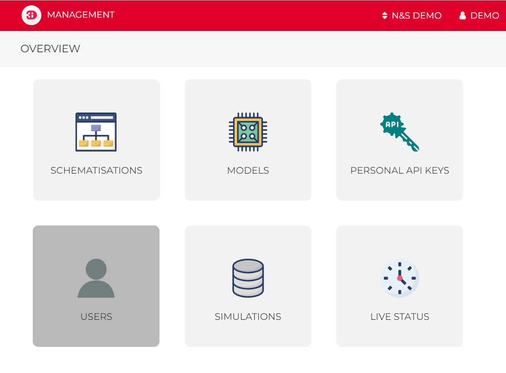

Modeller Interface
^^^^^^^^^^^^^^^^^^

The Modeller Interface is the interface for the hydrology experts. This interface is used to build models, edit models, start simulations and analyse results. The Modeller Interface is a customised QGIS installation with dedicated plugins for the use of 3Di.
This setup allows users to benefit of all processing power of QGIS combined with custom made tools supporting 3Di. Since a 3Di schematisation consists of a compact database (currently spatialite format) and rasters users have a great deal of freedom in building their model.
And when finished there is no import/export necessary, the spatial dataset is the schematisation.

.. figure:: image/a_intro_modeller_interface.png
   :alt: 3Di Modeller Interface

   An example of a schematisation in de Modeller Interface.

We have chosen QGIS as our supporting platform to build, edit and analyse the 3Di models and the results for the following reasons:

- QGIS Technology allows you to use the power of hundreds of GIS processing tools
- Combine web maps (aerial, topo, osm and may others) and model schematisations
- It offers almost unlimited styling options styling options
- It is a highly customisable interface
- Option for building own plugins to interact with model (results)
- It is an open source platform.

You can install the Modeller Interface `here <https://docs.3di.live/modeller-interface-downloads/3DiModellerInterface-OSGeo4W-3.16.7-1-Setup-x86_64.exe>`_.

For advanced installs, please consult :ref:`plugin_installation`.

3Di Live
^^^^^^^^

https://www.3di.live/

The 3Di Live Site is the interface where users have live insight in the results of their simulation. Not only that, they can also interact with it. This interface is perfect to create a shared understanding of the watersystem.
Scientific papers on this can be found `here <https://www.researchgate.net/publication/285586163_Interactive_use_of_simulation_models_for_collaborative_knowledge_construction_-_The_case_of_flood_policy_decision-making>`_

.. raw:: html

	<iframe width="560" height="315" src="https://www.youtube.com/embed/k9heL89ZF1E" title="YouTube video player" frameborder="0" allow="accelerometer; autoplay; clipboard-write; encrypted-media; gyroscope; picture-in-picture" allowfullscreen></iframe>

*A short introduction of 3Di.live*

3Di API
^^^^^^^^

https://api.3di.live/v3/
https://api.3di.live/v3/swagger/

.. figure:: image/e_api.png
   :alt: 3Di API

The 3Di API is the center of the 3Di Ecosystem as it allows all interactions of users and forcings. The 3Di API is accessible for users. It is a more advanced way of modelling, but it gives you lots of flexibility and can speed up projects.
We give here some examples of applications, where it can be usefull to interact directly using the API.

- Batch simulations: run hundred different rain events
- Automated testruns & results checking & adjusting a model and run it again
- Run 3Di in an operational setting
- Use Jupyter Notebooks to run, download and analyse 3Di simulations. Examples can be found on the : `threedi github repository <https://github.com/threedi/scripts-nens/tree/master/Notebooks%203Di%20-%20API%20v3%20-%20VD>`_
- Design your own control for weirs or other structures

The current production API of 3Di is v3.

Management Portal
^^^^^^^^^^^^^^^^^^^

https://management.3di.live/

.. figure:: image/b_managementportal_models.png
   :alt: Management portal - Model management

The Modeller Interface is used to build and edit you model schematisation on your own computer. However, the 3Di models are stored in the cloud, to enable version control. When uploading a model it is stored in the so-called *3Di Model Database*. Users upload their model with a description of the adjustment being made.
Colleagues can synchronise their models on their own laptop and continue working with the improved version.

The Management Portal can be used to monitor running simulations, download results, manage 3Di models, schematisations and simulation templates. With our portal we aim to provide our users with the necessary information to run day-to-day tasks within a web browser.

.. _authorisation_authentication:

Authorisation and authentication
^^^^^^^^^^^^^^^^^^^^^^^^^^^^^^^^^^

Within 3Di the data governance structure is set-up per organisation. People from within the same organisation can see all models that belong to their entity. Sharing the model with people outside your organisation is also possible. There are two ways to organise this:

- external people get access to the 3Di subscription, have read and write access to the models and can run them
- external people download the 3Di models and use their own subscription for running simulation

Signing in
===========

Users that already have a 3Di account can click the "Log in"
button on the top right of the screen.

First-time users require an invitation to create a 3Di account. Users with
a "manager" role are able to send invitations to new users.
If you do not know whom to contact, please contact our support office
(servicedesk@nelen-schuurmans.nl).

After clicking "Log in" or after following the invitation link, you will arrive
at the login screen.

.. image:: /image/login.png

On the login page you have three different options to sign in:

1. through a company account,
2. with username and password,
3. by creating a new account (Sign up).

First-time users may choose any of these options. If your company is listed as
one of the possible companies to sign in with, that is the preferred choice.

Existing users should use the same method as they used when signing in for 
the first time. If your 3Di username/password existed before May 2022,
use method 3.

.. tip::
    Do you want to add your company to the list to centralise the user accounts
    of your organisation? Please contact our support office
    (servicedesk@nelen-schuurmans.nl) for the options.

Roles
=====

We have 4 roles and 3 different types of privileges. 

* A **Viewer**, who can only *read* data and *follow* simulations
* A **Simulation runner**, who can *read* data and *run* simulations
* An **Creator**, who can *read* data and can *add*, *change* or *delete* schematisations and 3Di models
* A **Manager**, who can *manage* other roles in the organisation. A manager can not read or write data by default. This role should be appointed separately. 

User management
===============

Users can be managed in the User Management interface.
This interface can be reached via https://api.3di.live/management/users/ 

.. note::
    You require a “manager” role to access the User Management interface.
    Haven’t got a “manager” role but you would like to add the User Management interface?
    Please contact the application manager within your organisation or our support office (servicedesk@nelen-schuurmans.nl)
	
.. image:: /image/b_usermanagement1.png

In the example above, you see the current rights for 6 users under the organisation '3Di test'. 
	
Manage existing users
----------------------

The User Management interface gives you an overview of all users that have roles for your organisation.
If you are Manager for multiple organisations you can switch organisation using the button in the dark green bar. You can change the role of a user by clicking the “+" next to the user and choose the roles you want to assign. Then click “Save” to make the changes. 

Adding a new user
-------------------

You can add a new user by clicking the “NEW USER” icon in the upper right corner.

This will lead you to the screen to add a new user.

.. image:: /image/b_usermanagement2.png

By default the new user is granted a “Viewer” role. At least one role is required when invite a new user.  
Do not forget to click ‘Save’! When saved, an invitation email will be sent to the new user.
This user can follow the invitation link to (if necessary) create an account and receive the new roles.
The user will appear in the user management overview once they accepted the invite and created the account.

.. note::
    Sometimes this invitation mail will end up in the spam folder. 

.. note::
    The invitated user is required to sign in with the email address that is supplied by the manager. This email address can't be changed later on. 

.. note::
	Deselect all roles will remove the user from the organisation but will not delete the user's account. You cannot remove your own manager role.	
	
.. tip::
	Click on 'Pending Users', to see who have not completed the acitvation process yet. 

