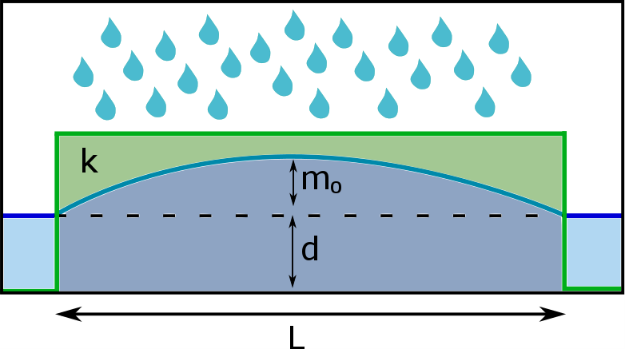

.. _groundwater:

Groundwater
===========

Introduction
---------------------

Surface water is not only affected by rain and in and outflow of water originating from other regions. In reality, surface water is fully coupled to and interacts with groundwater. This implies that the behaviour and the quantity of water at the surface is affected by groundwater too. The flow in the subsurface is influenced strongly by processes on both very large and small scales in time and space. In order to take all processes into account, models with significant computational times are required, even when surface flow, sewer systems and other processes are neglected. 

3Di aims at a modelling method that can handle short term effects of heavy precipitation and inundation, including the interaction with groundwater. For the computation of surface flow detailed information about the topography and the land use is often available. However, the information about the soil is often much less accurate and detailed. This lack of data and the complexity of the processes involved, favor a scenario-approach when dealing with groundwater flow. Especially, when investigating the sensitivity of areas to flooding and hindrance originating from groundwater. This approach requires a fast numerical model that can integrate the effects of the sewer system, surface water and overland flow. Therefore, processes need to be simplified. First, a short summary of the concepts implemented in 3Di is presented. In the sections that follow, some more detail and context is given about large scale groundwater flow, the implementation and the choices made in the model.

Summary of concepts in 3Di
------------------------------

.. figure:: image/b_grw_overview_ass.png
   :alt: master_figure2

   Overview of groundwater concepts in 3Di (1)
   
The Figure above shows a cross-section of a region with surface and sub-surface water. The Letters in the Figure refer to the following description of the main assumptions made for the computation of groundwater flow:

A. The phreatic surface is assumed equal to the water table. The soil below is assumed fully saturated and the soil above assumed completely dry.

B. In the saturated zone, the flow is assumed hydrostatic and horizontal (Dupuit-assumption).

C. An example where assumption B is locally not strictly valid, is at a stream edge where the gradient in the groundwater level is high.

D. The porosity (phreatic storage capacity) is a single, spatially variable value. It represents the potential storage in the saturated zone. Wetting or drying effects and isolation of moisture is not considered. 

E. The infiltration is based on the Horton equation.

F. At the bottom boundary, effects of deeper groundwater layers or extraction of water can be defined. This bottom boundary condition is called *leakage* and is assumed constant in time and spatially variable. 

G. For modelling a soil water zone, groundwater can be combined with :ref:`interflow`.

In the section below, while using the Letters and Numbers in *Figure 1*  and *3* the key concepts and the assumptions made for the groundwater computations are explained in more detail.

Groundwater concepts
-----------------------

The subsurface is a general term for the whole domain below the surface, where many processes of the hydrological cycle take place. 3Di aims at a fast, but accurate computation of the flow, especially concerning the interaction between groundwater and surface water. Therefore, the domain of computation focuses on the top aquifer. However, before zooming in at this layer, a schematic overview of some of the large scale processes is given in *Figure 1*. The various processes that are discussed here are indicated by Romain numbers. *Number I* indicates surface flow and overland flow. From the surface (*Number II* ) water can infiltrate or exfiltrate to and from the subsurface, where it can flow further in the horizontal or the vertical direction (*Number III* ). From thereon, several aquifers can overlap and interact. As they are separated by (semi-)impervious layers, they can exist under different pressure regimes. The exchange can, therefore, occur in both up- and downward direction (*Numbers IV and V* ).  One aquifer can consist of a zone of saturation and the zone of acration (unsaturated zone). In addition, within one aquifer, the soil characteristics vary over time and space (*Number VI* ). To limit the modelling domain and the number of processes to be taken into account, the current method for modelling groundwater flow in 3Di, is focused on the processes in the top aquifer of the sub-surface layer (the red box of *Number VII* ).

   
.. figure:: image/b_grw_largescaleoverview.png
   :alt: largescale_figure

   Overview of large scale groundwater concepts (2) 

Most of the groundwater concepts on which the groundwater method in 3Di is based, are thoroughly described in the book of *Jacob Bear and Arnold Verruijt, Modeling Groundwater Flow and Pollution*. However, here a short overview is given of the key concepts and assumptions made for the groundwater method used in 3Di. These concepts are illustrated in the Figures 1 and 3 and indicated with Letters and Numbers. The general aim is to simplify the processes involved in the top aquifer, but to preserve enough accuracy for reliable simulations of the surface-subsurface interaction. The numbers below refer to those in Figure 3 and the letters refer to those in Figure 1. 

1. When only looking at the top aquifer in a system, only one phreatic surface can be defined. This is the level at which the pressure is atmospheric (assumed zero). Below the phreatic surface is the soil fully saturated. 

|
2. Above the phreatic surface is the vadose water zone. There, some of the pore space is actually occupied by water, although the soil is not fully saturated. In the right graph, near *Number 2*, is the saturation of the soil is plotted as fuction of the depth. As can be seen, the change in gradient can be quite steep and is often approximated by a step function. The step-size depends on various issues including the characteristics of the soil. In the vadose water zone, pressures are negative, which allows the water to go upwards (capillary fringe). This can be seen in the left graph of depth versus pressure.

|
3. At the top of the capillary water, the water table is defined. In many applications it is valid to approximate the groundwater table at the top of the capillary fringe by assuming the soil to be saturated below this level and completely dry above it. This assumption is called the capillary fringe approximation and gives in combination with surface water flow,  a two-layer system.  When the :math:`h_c` \ is much smaller than the thickness of the aquifer, the capillary fringe can be neglected. Then, the water table and the phreatic surface are at the same level. This is indeed assumed in 3Di. This is indicated by the *Letter A*. 
 
| 
4. The main flow in an aquifer follows the phreatic surface, therefore the phreatic surface is considered to be a stream-line. Within an aquifer the slope of the phreatic surface (:math:`i`) is generally small. It is often much smaller than 1 ( :math:`i<<1` ) *[Dupuit (1863)]*. In such case, one can assume the stream-lines to be horizontal, and use only the horizontal Darcy equations to compute the flow. The groundwater level gradients are than defined by the height of the phreatic surface. This is consistent with assuming a hydrostatic pressure within the aquifer. This assumption is called the Dupuit approximation (*Letter B* ).
 
.. figure:: image/b_grw_overview.png
   :alt: master_figure
   
   Overview of general groundwater concepts (3) 
 
|
5. The Dupuit approximation can be locally valid, while in other regions it can be invalid. *Number 5*  indicates an example where the gradient of the stream-lines is high. The dashed red line indicates where the Dupuit assumption is invalid. In stationary cases, one can apply the so-called Dupuit-Forchheimer discharge formula to compute the outflow from groundwater to surface water. The computation of the discharge is still quite accurate, even though the groundwater levels deviate.  In regions further than ones or twice the :math:`\Delta h`, the solution approximates again the actual solution. In 3Di (*Letter C* ), the Dupuit-Forchheimer discharge formula is at these interfaces not applied, as they are often not a priori known. However, for practical purpose this is often only a local deviation.
 
|  
6. The storage capacity in the soil is naturally very important, as it determines the volume that can be added and extracted from the soil. However, the storage capacity and the saturation of the soil is related to very complex processes. This deals with the pores, the distribution of pores and the molecular behaviour of water interacting with the soil.  These processes are responsible for the amount of water that can be added or be extracted to/ from the soil. Therefore, for each soil type there is difference between porosity, the specific yield and the specific retention. Where the porosity is measure for the pore space, the specific yield, also known as the effective porosity, is a measure for the space where water can be added or extracted. Whereas, the specific retention is representative for the space within the pores where water cannot be added nor extracted, for example in isolated pores. These values are actually also dependent on the local pressure distribution and partly also whether the pores where previously filled or dry. For simplicity, all these processes are simplified by defining a phreatic storage capacity that is a measure for the effective storage in this layer (*Letter D* ). Although, this is a simplification of reality, the structures in the soil at this level of detail are generally unknown and can, therefore not be added to a model.
 
| 
7. In case of a porous surface layer, surface water will be flowing downward due to gravity, depending on the pressure gradient, the saturation and the hydraulic connectivity. As seen in the graph, there will be a saturated front flowing downward. There is a difference between the infiltration rate and the effective infiltration velocity. The infiltration rate is the rate in which the surface water level decreases. The effective infiltration velocity is the velocity of the front of the saturated zone. Due to differences in porosity the effective velocity can vary with depth. The vertical flow can be described by a Darcy-like formulation in the vertical:

.. math::
   :label: inf_press

	q(x,y,z,t) = -\kappa(x,y,z) \frac{\partial \phi}{\partial z}
|	
    
	
	where :math:`\phi` is the hydraulic head. This equation is seemingly simple, but the hydraulic head and the hydraulic connectivity are both dependent on the saturation of the soil. Due to the complexity of the infiltration processes, there are various formulations for infiltration, such as Green and Ampt, Horton and Philip infiltration. There are several differences between those formulations. However, they share that the infiltration rate is initially higher and decreases more or less exponentially to an equilibrium rate. For now, only the Horton-based infiltration, see :ref:`grwhortoninfiltration`, is implemented, which is a formulation, originally, for ponded infiltration only. The formulation described by Horton (1875-1945) takes into account that when the soil contains more water, the infiltration rate will decrease. This can be seen in the graph in the  at *Label E* .

|
8. Within the soil, multiple aquifers can exist within one domain. Such aquifers are separated by (semi) impervious layers, but these can leak. To simulate the potential interaction between these layers, it is possible to add a bottom boundary condition for flow. This can represent the possible effect of deeper groundwater layers or other sources of extraction or recharge (See *Label F* ).
 
|  
9. The soil water zone is the layer just below the surface. Often this is a fully saturated area, but the processes in this layer are heavily affected by the vegetation, precipitation and evaporation. Therefor, often the simulation of this layer is difficult. In case of heavy precipitation, this layer becomes saturated in a sort time. In such case, a user can simulate this layer with use of the interflow layer (*Label G* ).

.. _grwhortoninfiltration:

Horton based infiltration
-----------------------------------

Mentioned above, the infiltration process is rather complex, therefore many models use a parametrization for this process. In 3Di, two types of infiltration formulations are implemented; Horton based infiltration and a constant infiltration. Only the Horton based infiltration is coupled to groundwater. More information about the constant infiltration can be found at :ref:`simpleinfiltration`. Here, only the Horton infiltration is discussed.

Horton based infiltration formulation describes infiltration rate that is decaying in time. Three variables determine the infiltration rate. It is based on the notion that the infiltration rate decays to an equilibrium value, due to changes in the soil characteristics. Mathematically, it is defined by:

.. math::
   :label: inf_horton

	f(x,y,t) = f_{equ}(x,y)+(  f_{ini}(x,y)-f_{equ}(x,y))e^{-t/T(x,y)}

in which :math:`f` is the infiltration rate varying in time and space, :math:`f_{equ}` and :math:`f_{ini}` are the equilibrium and the initial infiltration rates, respectively. The decay period :math:`T` determines the time that the infiltration rate reaches its equilibrium. An example of the decay function is shown in *Figure 4*. 

.. figure:: image/b_grw_inf_rate.png
   :figwidth: 422 px
   :alt: Horton infiltration
   :align: right   

   Infiltration rate according to Horton; with :math:`f_{ini}=300.0` mm/day and :math:`f_{equ}=100.0` mm/day and :math:`T=3.0` hours.    (4)

The infiltration rate will start its decay as soon as the cell becomes wet. Currently, there is no process to restore the infiltration rate to its initial value. This would happen in real life when an area becomes dry again due to run-off or evaporation.   
   
   
Input
~~~~~~~~~~~~

For the use of Horton infiltration, one chooses indirectly to take a groundwater level into account. This to ensure a limit to the infiltration; when the groundwater level reaches the surface. To take the storage capacity of the soil into account, one needs to define the impervious surface layer and the phreatic storage capacity, as well. The three Horton parameters (in *[mm/day]*), the impervious surface layer ([m] relative to a reference level)  and the phreatic storage capacity (*[-]* between 0-1) can be defined globally and spatially varying. In case one uses the spatially varying option, a user needs to define a method for analyzing the rasters (taking the minimum, maximum or the average in a computational domain). 

The initial conditions for the groundwater level can be added to the *v2_global_settings*  table using a global value or a raster for spatially varying values.

You can download the complete overview of tables that 3Di uses in the spatialite database :download:`here <pdf/database-overview.pdf>`.

Output
~~~~~~~~~~~ 

Similar to the other variables, the results are saved in the result files, snap-shots and aggregated results. In contrast to infiltration computed according to :ref:`simpleinfiltration`, the Horton-based infiltration is computed on a flow line. Both a discharge (:math:`[m^3/s]`) and a velocity (*[m/s]*) are available as output. Note, that the velocity is the infiltration rate and not the effective velocity. The effective velocity is the velocity that the water front would subside through the soil. 

.. _grwflow:

Groundwater flow 
--------------------

The flow in the subsurface is computed under the assumption of hydrostatic pressure. This is also known as the Dupuit assumption. This implies that the flow in the saturated zone is fully horizontal and described by the Darcy equations:

.. math::
   :label: eq_darcy
   
   Q_x=-K_x A_x \frac{\partial \phi}{\partial x}
 
   Q_y=-K_y A_y \frac{\partial \phi}{\partial y}
   
with :math:`Q_x, Q_y` the x- and y- component of the discharges, :math:`A_x, A_y` the corresponding cross-sectional areas and the gradients of the preatic surface (:math:`\phi`). Even though, the Dupuit assumption can be invalid locally, it is very applicable on the larger scale. A famous analytical case, based on these assumptions is the Hooghoudt equation. It describes the groundwater level in between two open water channels, see *Figure (5)*. 

   Hooghoudt: Typical example of groundwater flow according to the Dupuit assumption. (5)

Input
~~~~~~~~~~~~

The input for using groundwater flow is very similar to the input for :ref:`grwhortoninfiltration`. In addition to these parameters, one can define the Darcy or hydraulic connectivity values globally or using a raster for spatially varying values. The dimension of the hydraulic connectivity is in *[m/day]*. You can download the complete overview of settings that 3Di uses in the spatialite database :download:`here <pdf/database-overview.pdf>`.

Output
~~~~~~~~~~~ 

The discharges ([m\ :sup:`3`\ /s]), the velocities *[m/s]* and the groundwater levels *[m]* are all included in the NetCDF and in the aggregated results NetCDF. Also for the groundwater related variables yields that discharges and velocities are defined at flow lines and the water levels at the nodes. Note, that the velocity is the effective velocity, not the velocity of a single water particle. 

.. _grwleakage:

Sources and Sinks, Leakage
-----------------------------

We offer the possibility to define a bottom boundary condition for the subsurface domain. At this boundary condition sources and sinks can be defined. The range of applications is rather wide, as it can be used as the interaction with deeper groundwater layers, local pumping and/or evaporation. The formulation for leakage is therefore made as general as possible to offer the user as much freedom as possible. Naturally, there cannot be water extracted, which isn't there but otherwise it is up to the user.

Input
~~~~~~~~~~~~

The input for leakage is simple, it can be defined globally and with a raster to define a spatially varying values. The values can be positive or negative. Positive values are representing water going into the domain. The dimension of leakage is in *mm/day*. You can download the complete overview of tables that 3Di uses in the spatialite database :download:`here <pdf/database-overview.pdf>`.

Output
~~~~~~~~~~~ 

Sources and sinks are defined in the cell centers. This yields also for leakage values. The fluxes per cell [m\ :sup:`3`\ /s] can be found in the result files. Note that when the flow limits the extraction, the limited values are recorded in the result files. 

.. _grwnummericalimplementation:

Numerical implementation [#f1]_
-----------------------------------

The numerical implementation of the horizontal and vertical flow is based on the concept of staggered grids as explained in :ref:`grid`. This implies that pressure points are defined in the cell centers and flow is defined at the cell edges. The spatial resolution of the 2D surface flow equals that of the groundwater flow. Therefore, the connections between the surface and the subsurface are completely vertical and orthogonal to the surface and subsurface layers. 

The timescales of groundwater flow compared to those of surface water flow, are generally considerably longer. This would favor an explicit formulation. However, the moment that the groundwater level reaches the surface, the timescales are the same. Therefore, only the horizontal flow is computed explicitly, but the vertical interaction is computed implicitly. 

For the sources and sinks, we choose an implementation where the sources are computed explicitly, but the sinks are implicitly taken into account. This is to guarantee mass conservation.

We are working on a full description of the numerical implementation to be published in *International Journal For Numerical Methods in Fluids*.

.. rubric:: Footnotes

.. [#f1] The numerical implementation is developed by and under the supervision of G.S. Stelling, Stelling hydraulics, 2018