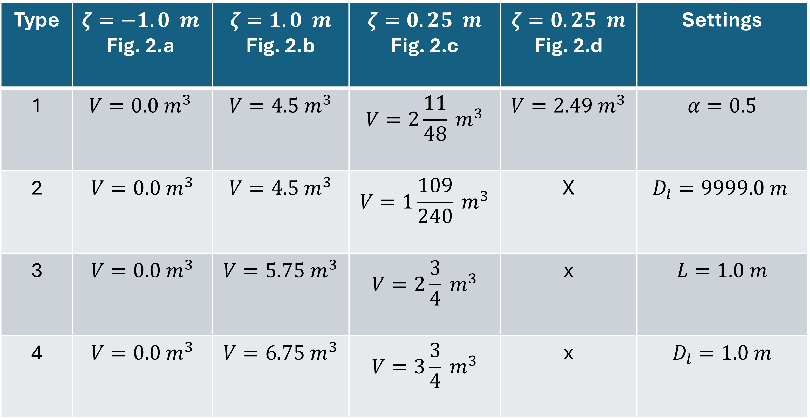

Interflow
=========

In a 2D model, the water flows over the surface and can infiltrate into the soil. Surface water flow is described by the shallow water equations. The infiltration is based on the available water above the surface, the maximum infiltration rate and the storage capacity of the soil. All these parameters are defined on a geographical raster, and translated to a set of values for each computational cell.

The interflow layer is an extra layer that can be defined below the surface. Surface water can be stored and can flow within the interflow layer. The flow through the interflow layer is described by the Darcy equation. The Darcy type of flow is believed to be more realistic for surface/subsurface flow in rainfall runoff conditions. This is because, in these cases, one deals with very thin water layers for which small (unknown) structures in the soil and on the ground level affect the flow. In such case the flow resembles more a Darcy type of flow than surface water flows. 

Basic Principles
------------------

.. figure:: image/b_interflow_applications.png
   :alt: Applications of the interflow layer
   
   Applications of the interflow layer

The interflow layer is defined by setting the thickness of the interflow layer, the porosity and the hydraulic conductivity. Together, these variables determine the storage capacity and the flow of the interflow layer. When the ground level is uniform, the thickness of the interflow layer has a unique interpretation, but when the ground level varies within a computational cell, there are multiple interpretation possible. This interpretation can be chosen by the user by setting the interflow type. Before explaning the differences due to the subgrid approach, first, the interflow concept will be explained for a uniform ground level. 

Computation of Volume
-----------------------

When introducing an interflow layer, one introduces only new flow links and extra storage capacity, but no new pressure/water level points. This implies that the volume of water in a computational cell consists of the volume in the porous layer and that of the open water layer. The thickness of the interflow layer, the porosity and the water level determine the water volume of a computational cell: 

.. math::
   :label: interflow_volume
   
     V = \alpha H_I A + H A,

| In which, 
- | :math:`\alpha` is the local porosity, 
- | :math:`H_I` is the thickness of the interflow layer, 
- | :math:`A` is the pixel surface and 
- | :math:`H` is the water depth.

.. figure:: image/b_interflow_simple.png
   :alt: Sketch of interflow layer

The water level rises from the deepest level in a cell. Therefore water is first stored in the interflow layer and only when the water level rises above the ground level is water stored on the surface. This implies, that :math: `H_I` can be maximally the thickness of the interflow layer and H>0 when the water level is above the ground level. The porosity depends on the soil characteristics, below one finds some examples.

.. figure:: image/b_interflow_examples_porosity.png
   :alt: Applications of the interflow layer
   
   Applications of the interflow layer

Computation of Flow
---------------------

The flow through the interflow layer is calculated by the 2D implementation of Darcy’s law for groundwater flow:

.. math::
   :label: interflow_flow
   
   Q_I^x = \kappa A_I^x \frac{\delta \zeta}{\delta x}\\
   Q_I^y = \kappa A_I^y \frac{\delta \zeta}{\delta y}

| In which: 
| :math:`Q_I^x` and :math:`Q_I^y` = the horizontal discharges in the interflow layer. 
| :math:`\kappa` = the hydraulic condutivity
| :math:`A_I^x` and :math:`A_I^y` = the cross-sectional area.

Note: The Darcy’s velocity does not take into account that medium is a grain-aggregate. In reality water flows through pore-paths (inter-connected pores) only. The interflow velocity computed in 3Di is related to the discharge through the concept of effective porosity.

Interflow in combination with the subgrid approach
----------------------------------------------------

The basic principles of interflow are simple, but applied with subgrids things become more complicated. To fully understand interflow with subgrids, it is important to realize that each cell (one cell has multiple subgrids) has one volume value and hence one water level. The flow from one cell to another has two components, namely interflow and surface flow. (Only when using the groundwater flow option in 3Di, two volumes are computed for each cell, a groundwater volume and a surface water volume).

However, when within a computational cell the ground level varies, the moment that the water level rises above the ground level is different per subgrid cell as the water level is uniform within a computational cell. 3Di allows four different methods to deal with the subgrid information. The user defines this by setting the interflow type. 

Without the interflow layer, the volume of water in a cell is computed from the surface of the lowest subgrid cell. If interflow is used, the volume is computed from another reference level, namely the impermeable layer. In the example of the figure above, the lowest elevation is 0.0 m and the interflow depth is defined by 1.0 m. This means that the reference (or impermeable) level is at -1.0 m for this cell. 

The interflow layer is completely dry (V=0 m\ :sup:`3`\) if the water level in a cell is at the level of the impermeable layer (-1.0 m). The interflow flow layer is completely filled (saturated), if the water level is at the same level of the highest subgrid in this cell (+1.0 m). The relation between the water level and the volume, as shown in the graph below, can be split into three parts. In part I, is there only water in the interflow layer. The curve is fully determined by the porosity distribution. In part II, water is partly in the interflow layer and partly above the ground level. In part III, the volume rises linearly with the water level as the interflow layer is fully saturated.

.. figure:: image/b_interflow_build_volume.png
   :alt: Sketch of interflow layer for, form left to right, Part I, II and III
   
   Sketch of interflow layer for, form left to right, Part I, II and III
   
.. figure:: image/b_interflow_volumewaterlevel.png
   :alt: Relation between water level and volume
   
   Relation between water level and volume

The user defines the thickness of the interflow layer. As the groundlevel varies, the level of the impermeable layer would vary too. Nummerically, it has advantages to choose within a computational cell a uniform reference level. So the defined thickness of the interflow layer is always relative to the lowest pixel. The lowest pixel either defined in the computational cell or in the modelling domain. This is up to the user. To be able to control the storage capacity, the porosity within a subgrid cell can be rescaled, to guarentee for an unchanged storage capacity. Whether, this rescaling is performed depends also on the user settings.

It is advised to use the option for automatic rescaling of the defined porosity. By using automatic rescaling the storage volume in the interflow layer is according to the expected volume based on the defined porosity and defined depth of the interflow layer. If rescaling is used, then the user also has to define a reference level of the permeable layer. This extra reference level has no physical meaning and has been added for advanced numerical purposes, such as stability. The porosity is rescaled to this extra permeable reference level.  
This results in four different types for interflow. A more detailed description is given below including some volume computations. 

echnical explanation of the four interflow types
---------------------------------------------------

.. figure:: image/b_interflow_states.png
   :alt: Overview of different states using interflow

   Overview of different states using interflow

Types
--------

There are 4 types or settings of interflow that determine the way the volume it determined.  For types 1 and 2 the user explicitly defines the thickness of the porosity layer and the depth of the impervious layer. In theory both should have the same value. But early practice showed that using a very deep depth in the interflow layers results in a more stable simulation. By choosing the thickness of the porosity layer the volume in the interflow layer can still be controlled. The water levels do become artificial low, which can be confusing. In the figure above the water level may sink to 10000 meter.

**Type 1** Fixed thickness of the porosity layer in the model domain and uniform impervious layer elevation per calculation cell

Provide a porosity, porosity layer thickness and the depth of the interflow layer. Porosity can be given global or per pixel. The porosity and the thickness of the porosity layer determine the volume stored in the calculation cell. De depth of the interflow layer determines the water level. The volume in the interflow layer is scaled to the interflow layer depth to determine the water level. 

.. math::
   :label: porosity_scaled
   
   \hat{\alpha} = \frac{\alpha * L}{max(H_I, L)}

| In which: 
| a = input porosity, 
| L = interflow layer depth and 
| H\ :sub:`I`\ = D\ :sub:`sur`\ – D\ :sub:`inp`\, in which: 
| D\ :sub:`sur`\  = surface level elevation and 
| D\ :sub:`inp`\  = elevation of the impervious layer.

 
For type 1 Interflow, the depth of the interflow layer is measured from the deepest DEM pixel in the calculation cell. The scaled porosity is then used to determine the volume in the interflow layer according to equation (1).

**Type 2** Fixed thickness of the porosity layer in the model domain and uniform impervious layer elevation over the model domain

The porosity is determined in the same as as under type 1, but the elevation of the impervious layer is determines relative to the lowest DEM pixel in the entire model.

**Type 3** Relative thickness of the porosity layer and uniform interflow depth per calculation cell

The volume in the interflow layer depends on the porosity per pixel and the depth to the impervious layer. The porosity can be given globally or as a raster with different values per pixel. In type 3 the porosity is scaled based on the distance between the lowest DEM pixel in the calculation cell and the elevation of the impervious layer while the volume is determined per pixel. This means that although you are able to spatially vary porosity in more detail, the volume in pixels that lie above the lowest pixel of the calculation cell is overestimated. 

**Type 4** Relative thickness of the porosity layer and uniform interflow depth over the model domain

Type 4 works in the same way as type 3 but determines the depth of the interflow layer as the difference between the lowest DEM pixel in the whole model and the impervious surface elevation.

*The table below shows an example of de volumes in a calculation cell with interflow relative to the water level. In the last column the interflow settings are given. The rows in the table correspond to the situations displayed in figure 2. The calculation cell's area is one square meter and for simplicity the cells contains only 4 pixels*

Settings for interflow
--------------------------

Below two tables are included with a summary of the possible settings for interflow. 

.. list-table:: Settings for interflow layer
   :widths: 45 45 45
   :header-rows: 1

   * - Parameter
     - Uniform in Model Domain
     - Spatially Varying in Model Domain
   * - Porosity
     - .. math:: 
         \checkmark
     - .. math:: 
         \checkmark
   * - Porosity Layer
     - .. math:: 
         \checkmark
     - 			x
   * - Hydraulic Connectivity
     - .. math:: 
         \checkmark
     - .. math:: 
         \checkmark
   * - Impervious Layer Elevation
     - .. math:: 
         \checkmark
     - x

.. list-table:: Interflow Types
   :widths: 30 30 30 30
   :header-rows: 1
   
   * - Porosity
     - Per Cell
     - Model Wide
     - Result
   * - Rescale
     - Type 1 
     - Type 2
     - Storage is known apriori
   * - Constant
     - Type 3
     - Type 4
     - Extra storage in interflow layer
     

Good to know
------------

**Infiltration** In principle, nothing about infiltration has changed with or without interflow. Infiltration is not to interflow layer itself, but from the interflow to the subsoil. The infiltration volume is removed from the interflow layer. Infiltration stops when the water level is below the lowest pixel.

**Laterals** Nothing actually changes for the laterals. The extraction of water continues until the total volume is zero. This means that the water level can be lower than the DEM.

**Obstacles and levees** Flow in the interflow layer is affected (stopped) by obstacles and levees. Flow in the interflow layer does not flow under levees.

**Connection with 1D** There is no separate link between interflow and 1D-elements. So no seepage from deep channels, all flow between 1D and 2D happens via the 2D surface.

**Embedded channels or pipes** Both embedded elements and interflow affect the volume in 2D calculation cells and it is therefore not advised to use them together.

