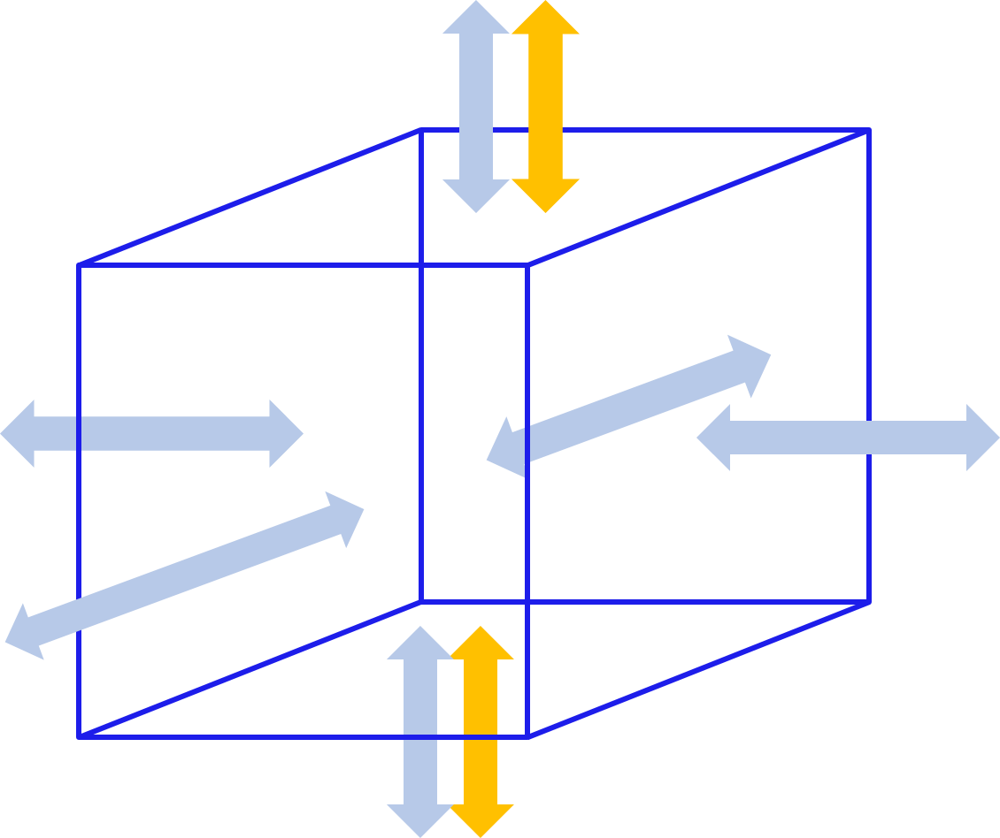

.. _cons_volume:

Conservation of mass
========================

To capture or predict flow under varying conditions, one is often forced to use the computational power of computers. Since the introduction of computers various methods have been introduced and improved. Some aspects are true for all types of methods. Here, we will limit ourselves to the methods used in the computational core of 3Di.

3Di is a two-layer, subgrid based hydrodynamical model, where a surface and a subsurface layer can be defined in combination with a 1D network. The computations of flow in each domain are based on two fundamental laws of physics; i) Conservation of mass and ii) Conservation of momentum. In this section we will describe how we deal with conservation of mass.

Conservation of mass states that mass cannot disappear or appear in a certain domain without clear source. For a defined domain, when all fluxes in and out of that domain are known, the change in mass can be computed. This can be described mathematically as:

.. math::
   :label: mass_conservation    

   \frac{\Delta \rho V}{\Delta t}=\sum_i^{in} \rho Q_i -\sum_k^{out} \rho Q_k + \sum_j \rho S_j 

| In which: 
| :math:`\rho` is the density, 
| :math:`V_\Omega` is the volume, 
| :math:`Q` discharge,
| :math:`S` source or sink term. 
|

   
   A virtual box for conservation of mass.

The counters i, j, k count over all existing discharges, sink and source terms. In 3Di we do not account for density variations, so the density :math:`\rho` is assumed uniform and constant. This simplifies the equation for conservation of mass to the following equation for conservation of volume:

.. math::
   :label: volume_conservation    
   
   \frac{\Delta V}{\Delta t}=\sum_i^{in} Q_i -\sum_k^{out} Q_k + \sum_i S_j 

It is important to define the domain for which this is true. In the finite volume approach, used in 3Di, a volume domain equals a computational cell, i.e. the water level domain. For such a domain, as shown in the Figure, all discharges (in blue) sources and sink terms (in yellow) entering and leaving the domain are to be defined or computed. The discharges are computed based on the momentum equations. The Section :ref:`flow` elaborates on the computation of flow in the various domains, such as 2D surface water, ground water, 1D surface and sewerage flow. Sources and sink terms are generally terms for water that is added or extracted in a domain. The various source and sink options are described in :ref:`sources_sinks`. Examples of source and sink terms are :ref:`simpleinfiltration` and :ref:`rain`. In 3Di, the conservation of volume combines all flow phenomena. This is independent whether flow originates from the 1D, 2D surface or subsurface domain. This allows a fully integrated approach of a water system.

