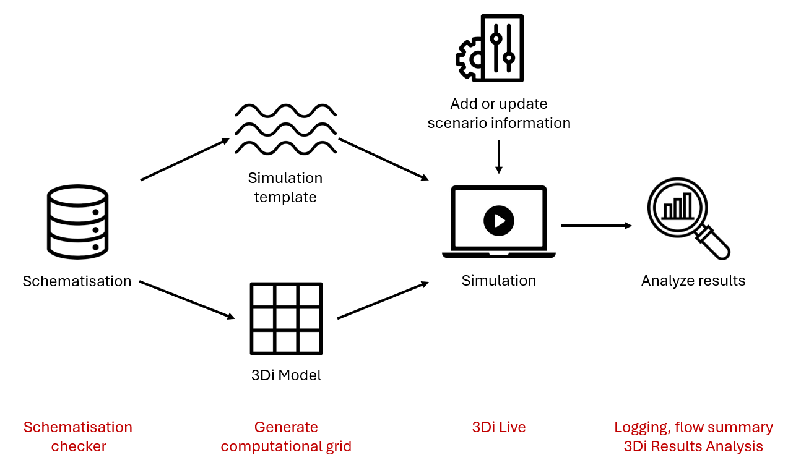

.. _workflow:

Modelling workflow
==================

The 3Di workflow consists of four steps, as depicted in the image below:

- Making a schematisation. See :ref:`mi_modelling` for an explanations of all the possibilities that you have here.
- Converting the schematisation to a 3Di model and simulation template. This will be done for you automatically as soon as you :ref:`upload a schematisation revision<uploading_schematisation>`
- Running a simulation. This can be done in :ref:`threedi_live_toc` or from within the 3Di Modeller Interface. See :ref:`simulate_api_qgis` for instructions.
- Analysing the results. 3Di Live allows quick analysis during the simulation. For more in-depth analysis, use the 3Di Modeller Interace. Follow the tutorial :ref:`tutorial_analysing_simulation_results` to learn how to do this. :ref:`mi_analysing_results` provides further documentation on all the analytical tools available in the 3Di Modeller Interface.

   
   3Di modelling workflow, including quality control options at every step

Best practices
--------------

Your modelling flow will improve if you do these three things: define modelling objectives before you start, use an iterative approach, and save and check your work often.

Define modelling objectives
"""""""""""""""""""""""""""

Throughout the modelling process, many choices will need to be made. In most cases, the modelling objective determines what is the right choice. Formulate the modelling objective(s) before you begin, so it can guide your choices throughout the process. Think of:

- *Overall objective of the model*. Why are you making a model and for whom? Which specific insights or numbers are needed from the modelling study? Which decisions will be based on those insights or numbers? For example, if the overall objective is to get a general assessment of which areas risk flooding, a simple model combined with some sensitivity analysis may be more appropriate than a single simulation with a very complex model.
- *Types of events*. Many modelling choices depend on the type of event you want to model: For example, short, high-intensity rain events; long, sustained rain periods; river discharge peaks; or storm surge events may require a different focus on which details are important.
- *Relevant hydrological processes*. For example, if the objective is to use forecast rain to predict water levels in a river in a sloping, mostly rural watershed, the rainfall-runoff process upstream of the river will be highly relevant, while the sewer system can mostly be ignored.
- *Required model extent*. The model extent should fit the scale at which the hydrological processes take place. In the previous example, including the whole watershed upstream from the locations where you want to predict the water level will be crucial for obtaining accurate results. (Note that this does not mean that it is required to model the entire river basin in 2D; you may also combine 2D with surface inflow or boundary conditions in some way, as long as the whole basin is accounted for).
- *Relevant locations*. Make sure you know well which parts of the study area you are most interested in. For example, gauging stations, known flood-prone areas, etc, built-up or otherwise high-value areas, etc.
- *Performance requirements*. For operational flood forecasting models, simulation speed is highly relevant and a maximum total simulation duration of e.g. 10 minutes may be the required. For other purposes, it may be good enough if the simulation takes a few hours or even an entire night. Do note however that a faster model allows for more iterations, which will generally improve the modelling process substantially.
- *Accuracy requirements*. Try to define the bounds within which specific model outputs should match measured values. E.g., the water level peak should be within 10 cm of the measured peak, or the timing of the peak should be within half an hour of the measured peak time.
- *Data availability and quality*. Once you have a clear idea on the topics mentioned so far, you can start to define what kind of data you need to build the model. However, if the data is not available or not of the required quality, you may need to revise your modelling plan. 

.. note::
    A common pitfall in modelling is to start from the available data, and making "How am I going to get all this data into my schematisation" the central concern. This will usually lead to needlessly complex models and a lot of time spent on data wrangling. It is recommended to start with the other questions, and from there ask yourself: "What data do I need to build the model that fits my purpose?"

Use an iterative approach
"""""""""""""""""""""""""

The modelling process becomes smoother and more efficient when using many small iterations. Start out with a very simple version of the model you envision, go through the whole workflow outlined above, and add complexity step-by-step. As an example, this could be an iterative modelling process for building a integral model with overland flow, groundwater, an open water system and a sewer system:

#. *Simple model with overland flow only*. The only schematisation object included is the DEM. Objectives: get a feeling for the basic hydrological functioning of the area, the simulation speed, the preferable model extent and cell size, locations where ponding or flooding occurs due to the presence of raised (rail)roads and other linear landscape elements, locations where boundary conditions are needed, etc.
#. *Add 2D boundary conditions*. Objective: find out what the right boundary conditions are for your model, and how they affect the simulation.
#. *Grid convergence*. A finer grid (smaller computational cells) will give more accurate results. However, at some point, further diminishing the cell size will no longer significantly improve the accuracy. The objective of this step is find the optimal computational cell size for your model, taking into account the desired accuracy relating to the modelling objectives, and the desired simulation speed. Results from several simulations with different uniform cell sizes (same cell size in the entire model domain) can subsequently be used to decide on the use of local grid refinements.
#. *Add groundwater flow*. Objective: get a feeling for the correct parameterization of the groundwater layer, and its effects on simulation speed.
#. *Add obstacles*. Objective: make sure that any relevant, narrow linear obstacles in the landscape are properly taken into account by 3Di.
#. *Add open water hydraulic structures*. Structures like culverts and weirs may need to be schematised in 1D. Objective: making sure that water can pass underneath (rail)roads, and that relevant water management works are taken into account correctly. 
#. *Add 1D open water channels*. In many cases, open water can be modelled in 2D, but in some cases it may be desirable to model them in 1D. Objective: modelling flow at a higher level of detail than the subgrid resolution allows, modelling channel flow very precisely in locations where the precise channel flow dynamics are important for the modelling objective.
#. *Add groundwater exchange to open water channels*. Objective: get a feeling for the correct parameterization of the groundwater exchange, and its effects on the simulation results.
#. *Add the sewer system*. If there is a large sewer system in your model area, you could consider adding it in parts, in multiple iterations.
#. *Add groundwater exchange to the sewer system*. Objective: get a feeling for the correct parameterization of the groundwater exchange, and its effects on the simulation results.
 
Save and check often
""""""""""""""""""""

Throughout the process, 3Di facilitates saving and checking your work at every step. 
- Each time you add things to your schematisation, save it as a new revision. This allows you to go back to that revision at any time in the future if you make mistakes later. 
- Check and fix errors and warnings in your schematisation often. It becomes harder to solve issues in your schematisation if they stack up. Some tools may also give unexpected results if there are mistakes in the schematisation.
- Generate and check the computational grid often to make sure your schematisation is converted to a 3Di model in the way you intended.
- Simulate often, also with preliminary versions of the model. Use 3Di Live to check if the model generally behaves the way you expect. Have a quick look at the flow summary, to get a feeling for the water balance of your area. If the simulation time, the volume error, or the water balance changes significantly due to changes you made to the model, try to understand why. 

Creating a new schematisation
--------------------------------------
3Di schematisations are created in the Modeller Interface and then uploaded to the server, where a 3Di model is generated from the schematisation.
For an in-depth explanation on how to create a schematisation, refer to this :ref:`section <create_a_new_schematisation>`.

.. kopje voor loading existing schematisations toevoegen?

Editing a schematisation
--------------------------
A schematisation can be edited in the Modeller Interface. This is explained in this :ref:`section <edit_schematisation>`.

You cannot edit your schematisation with 3Di Live, but it is possible to temporarily adjust values of your model components. This is explained in this :ref:`section <3di_live_interactive_tools>`.

Checking the schematisation
-----------------------------
Checking the quality of a schematisation can be done in the Modeller Interface. For information how to do this, see :ref:`checking_model`.

Uploading and downloading schematisations
------------------------------------------
Schematisations can be uploaded and downloaded in the Modeller Interface.

Running a simulation
----------------------
Before you can simulate your model you need to add *scenario information*. A scenario holds information like the weather condition during a simulation, the total runtime of a simulation and information about laterals, breaches and initial conditions.

Adding scenario information and running a simulation can be done in  :ref:`the Modeller Interface <simulate_api_qgis>` with the 3Di Models and Simulations plugin or on :ref:`3Di Live <3di_live_sessions>`. 

You can run an interactive simulation on 3Di Live. 3Di Live provides the opportunity to see the results of your simulation as it is running. When your simulation is finished you can store and subsequently download the results. When you use the Modeller Interface your results will only be provided after the simulation has finished. The Modeller Interface does provide a more detailed overview where you can enter your scenario information.

Downloading results
-------------------
Simulation results can be downloaded with the Modeller Interface (see :ref:`mi_download_res`)

.. TODO: uitbreiden met resultaten downloaden uit Lizard.

Viewing, analyzing and storing results
----------------------------------------
Results can be viewed and analyzed with :ref:`3di_results_manager`, :ref:`3Di Live  <3di_live_analysis_tools>` or :ref:`the Scenario Archive <scenario_archive>` in Lizard.

When using 3Di Live you can :ref:`store <store_results>` the results.

Manage your schematisations and models
----------------------------------------
Managing your schematisations and models can be done with :ref:`3Di Management <management_screens_manual>`.