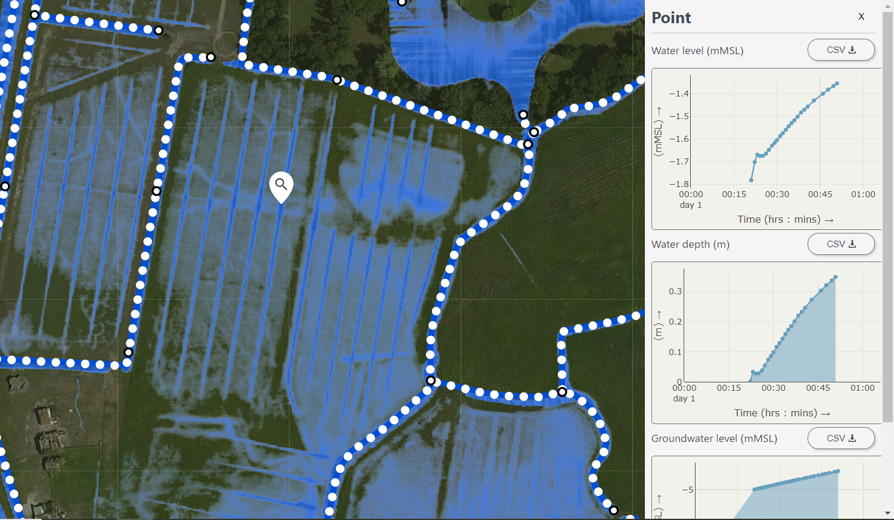
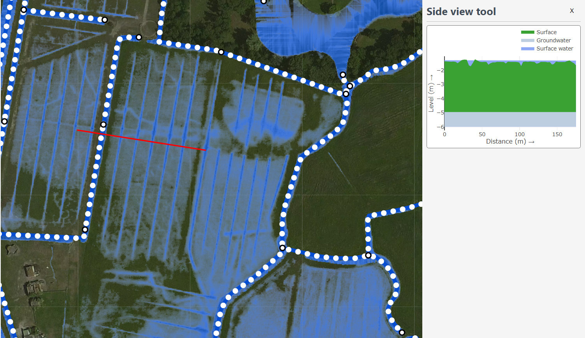
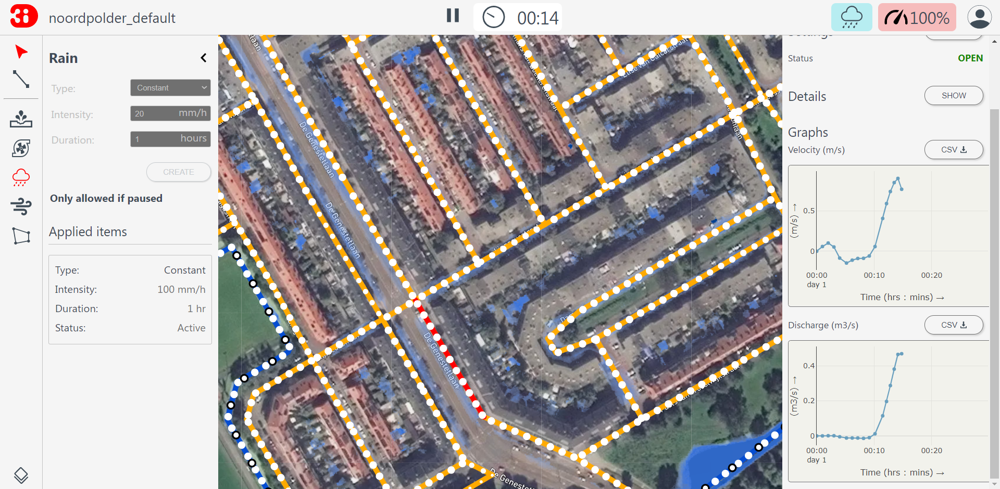
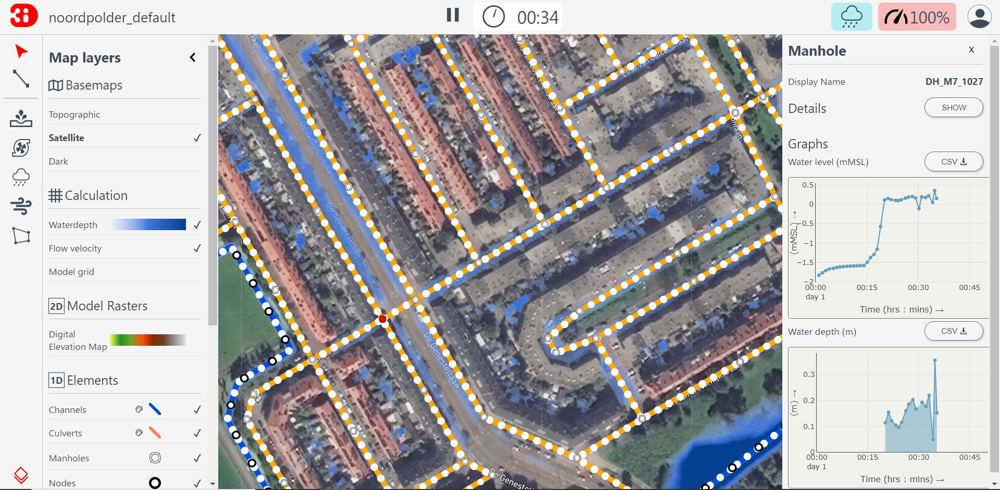

.. _3di_live_analysis_tools:

Analysis tools
==============

.. _search_bar_ls:

Search bar
----------
The *Search Bar* enables you to locate assets of your schematisation. You can search for asset type (e.g. pipe), name, code or id.

.. _point_selection_tool:

Point selection tool
--------------------

Using the *Point selection tool*, you can click anywhere on the map to visualize the time series at that location: water depth, (ground)water level, and rain intensity. 

The time series can all be downloaded in CSV format. The points in the graphs in :numref:`fig_point_select_tool` are the points calculated by the 3Di calculation core and are independent from the output time step that the modeller has set while following a location. If a location is clicked later during the simulation, the historic values on the graph are the values shown according to the output time step. 

.. note::
	Water depth is not shown for channel nodes

.. _fig_point_select_tool:

	Point selection tool.

.. _line_selection_tool:

Line selection tool
-------------------

The *Line-selection tool* allows you to draw a transect on the map, to show the elevation profile (side view), together with the water level in that transect. Click the start and end point in any place on the map (within the 2D model domain) to view the elevation profile.

	Line selection tool.
	
The side view shows the elevation in green and the water in blue. By hovering over the graph with the mouse, exact values can be seen. Keeping this graph open while the simulation progresses will show you how the water level rises or falls. Note that the model used for the example also contains a groundwater component, indicated by an extra blue line; this will only be shown if your model contains a groundwater component. 

1D network
----------

Channels and structures can be included as 1D elements in the model. The channels show the direction of flow with the help of moving dots. The direction and speed are based on the flow velocity in the channel. The different sizes of the dots are based on the discharge. The results (discharge, water level, waterdepth and flow velocity) are available at the structures by clicking on them with the *Point selection tool*.

Discharge and velocity are in the lines:

Water level and water depth are in the nodes:

