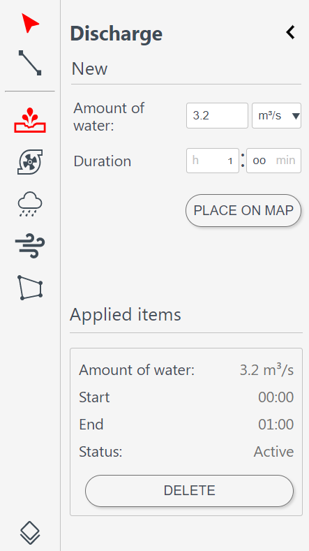
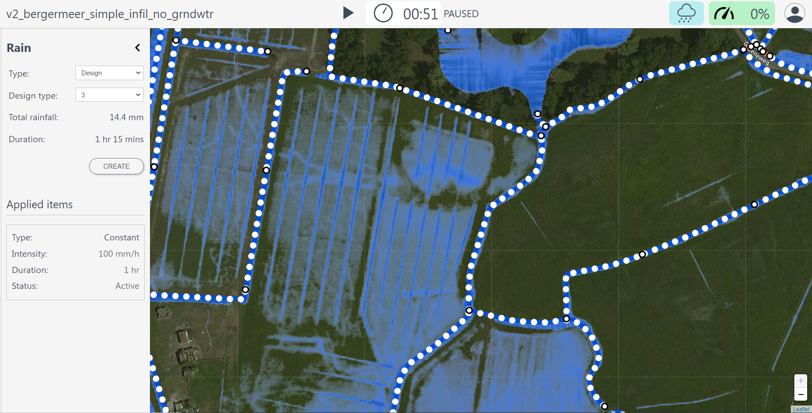
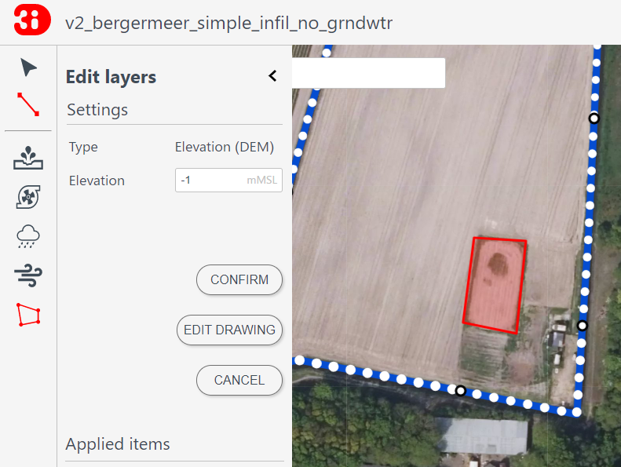
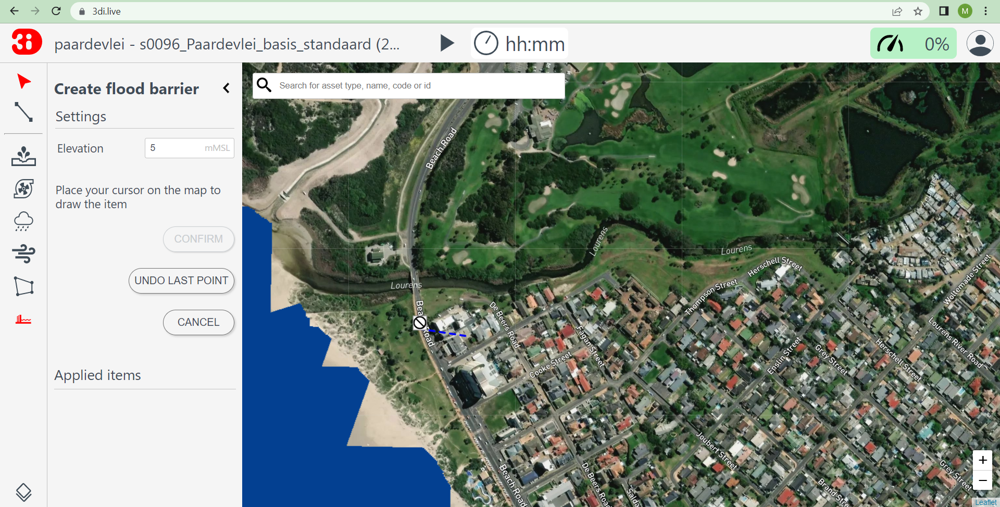
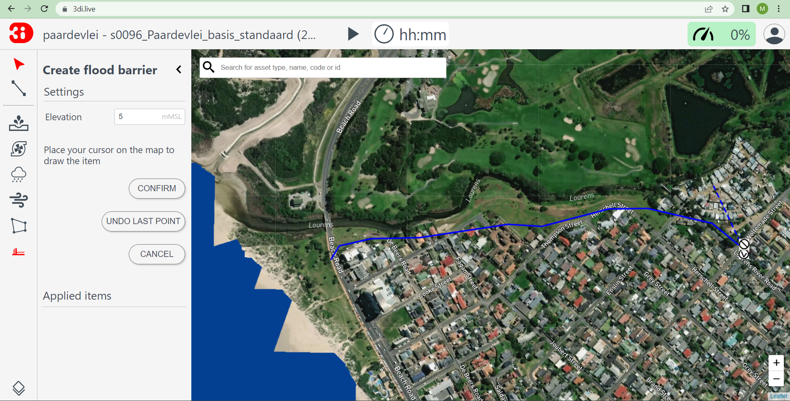
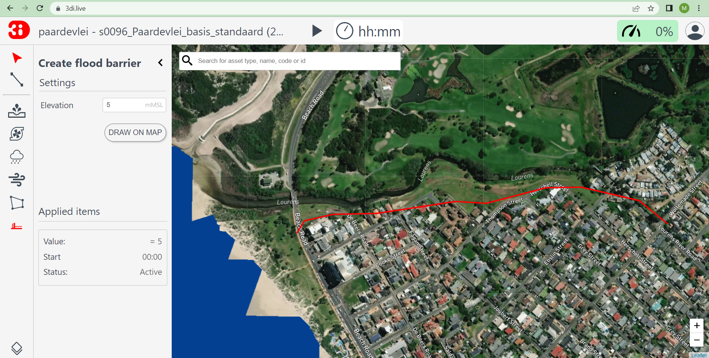

.. _3di_live_interactive_tools:

Interactive tools
=================

3Di Live offers a range of options to interact with the simulation. You can set the weather conditions to assess the effect of historical or forecast rain events, or statistically calculated fictitious rain events, add wind, or a point discharge to simulate a dam breach or breaking pipe. You can make quick assessments of the effect of measures such the creation of a retention basin in a watershed, an open storage facility as part of sustainable urban drainage solutions (SUDS). You can also assess the effect of interventions during a flood calamity, such as the deployment of an emergency mobile flood barrier or the closing off of specific flow routes. 

The following options are available:

- :ref:`discharge_tool_3di_live`: add a point discharge anywhere
- :ref:`pump_tool_3di_live`: add an (emergency) pump anywhere
- :ref:`rain_tool_3di_live`: add a rain event
- :ref:`wind_tool_3di_live`: add wind
- :ref:`dem_edits_3di_live`: edit the digital elevation model
- :ref:`flood_barrier_tool_3di_live`: block the flow (2D domain)
- :ref:`closing_structures_3di_live`: block the flow (1D domain)
- :ref:`changing_crest_levels_3di_live`: raise or lower a weir or other hydraulic structure (1D domain)
- :ref:`changing_pump_capacities_3di_live`: switch existing pumps on or off, or let them pump faster or slower
- :ref:`breaches_3di_live`: open a levee breach that will grow as flood water starts flowing through it

.. note::
    
    To use these interactive tools, you need to *Pause* the simulation, make your edits, and then clicking *Play* to continue the simulation.

.. _discharge_tool_3di_live:

Discharge tool
--------------

With the **Discharge tool** a constant source of water can be added to the model. Select the icon and change the amount of water you want to apply. In the dropdown menu you can change the unit. You can also change the duration of the discharge. Click **PLACE ON MAP** and click a location on the map that should be the source. The water will start flowing from this location over the 2D domain.
When you click *Play*, the point discharge will become active.

    Discharge tool.

If you made a mistake when creating discharge, you can **delete** before you activate it. After you have started your simulation, you can **stop** the discharge while its status is 'active', when your simulation is paused. The discharge will then only have had an effect during it's runtime and not for the previously set duration time.

.. note::
    In technical terms, what this tool does is adding a 2D lateral with a constant lateral discharge. 

.. _pump_tool_3di_live:

Pump tool
---------

With the **Pump tool**, a constant sink of water can be added to the model. Click the icon and change the amount of water you want to pump out of the model. In the dropdown menu you can change the unit. You can also change the duration of the pumping. Click **PLACE ON MAP** and click a location on the map that should be the pump. The water will be pumped out from the 2D domain from this location (1D pumps should be added in the schematisation).
The water that is taken out of the model will not flow back into the model and is considered a loss. 

The pump will become active when you click *Play*. If you made a mistake when creating a pump you can *Delete* before you activate it. After you have started your simulation, you can *Stop* the pump while its status is 'active', when your simulation is paused. The pump will then only have had an effect during its runtime and not for the previously set duration time. 

.. note::
    In technical terms, what this tool does is adding a 2D lateral with a constant *negative* lateral discharge. 

.. _rain_tool_3di_live:

Rain
----

Through the **Rain tool** icon, rainfall can be added to the model. The following rain event types are available:

* **Constant**: a homogeneous event in both space and time across the entire model range.
* **Radar**: use historical rainfall data (only available in the Netherlands).
* **Design**: use a design event. This event is homogeneous over the entire model area and heterogeneous in time.
* **Forecast**: use forecast rain.

These options for adding rainfall all cover the entire model area.

When choosing a **Constant** type of precipitation, the rain intensity (in mm/h) and duration of the rain must be defined. The rain intensity is uniform and constant in the given time frame.

The option **Radar** is currently only available in the Netherlands and uses historical rainfall data that is based on radar rain images. Providing temporally and spatially varying rain information. The Dutch Nationale Regenradar is available for all Dutch applications for organisations that have this module in their contract. On request, the information from other radars (worldwide) can be made available to 3Di as well. In order to apply this type of rain a historical time frame needs to be set. 

When choosing the option **Design**, a number between 3 and 16 must be selected. These numbers correlate to predetermined rain events, with differing return periods, that fall homogeneous over the entire model. Numbers 3 to 10 originate from `RIONED <https://www.riool.net/bui01-bui10>`_ and are heterogeneous in time. Numbers 11 to 16 have a constant rain intensity. When selecting a design rain the total rainfall and duration information will change in the tab.

The **Forecast** option gives you the option to add forecast data from several sources to the model. Currently, we support forecast data from ICON Global, ICON EU, ICON-D2 and QPE Forecast. If there is another rain forecasting service you would like to use in 3Di Live, please contact the :ref:`servicedesk`.

For a more detailed description on rainfall, see: :ref:`rain`.

When the rainfall is active a cloud icon appears on the top right of the screen. Information about the rainfall event can be accessed by keeping the rainfall tab open. Active and past (inactive) events are shown in this tab 

    Rainfall tool.

.. _wind_tool_3di_live:

Wind
----

A compass card appears after clicking on the **Wind tool** icon. By clicking in the compass card a homogeneous wind field with a specific direction and speed can be set up for the whole model in the 2D domain. This direction can also be filled in numerically. The strength and duration of the wind can be changed. Because the wind is constant for the whole model you only need to press **CREATE**. When the wind is active a wind icon appears on the top right of the screen.

.. figure:: image/d3.6_wind.png
    :alt: Wind speed, direction and duration

    Wind tool.

Once you have created a wind event, you can press **EDIT**. This lets you either **STOP WIND** or after altering the fields **UPDATE EXISTING WIND**.

.. _dem_edits_3di_live:

DEM edit
--------

The Digital Elevation Model (DEM) can be edited during the simulation. You can raise or lower the elevation within a specified area. This raising or lowering can be either absolute (the elevation is set to a specified elevation in m MSL) or relative (the elevation is raised or lowered by a specified amount, relative to the current elevation). 

.. figure:: image/d_dem_edits.png
   :alt: Dem edits

Some other tools are useful when making DEM edits. Make the Digital Elevation Model visible, see :ref:`visualisation_model_rasters_3di_live`. If you are not sure about the elevation to use, use the :ref:`line_selection_tool`. Changes in elevation will only affect the flow if they intersect with the boundary between two cells. Therefore, it may be helpful to make the model grid layer visible when making DEM edits (see :ref:`visualisation_calculation_layers_3di_live`).

Click *Draw on map* and draw a polygon by clicking on the map. Set an elevation level (in m MSL) for that polygon. After you have drawn your polygon, check if it is they way you want it. If not, click *Edit drawing* to change the shape of the polygon. When you are happy with the shape of the polygon, click *Confirm*. Your edit will be active for the rest of the simulation. 

    Raster edit tool.

.. figure:: image/d_draw_dem_polygon.png
   :alt: Performing a dem edit
   
.. figure:: image/d_confirm_dem_polygon.png
   :alt: Confirming a dem edit

.. note::

    If there is water on the 2D while editing, and the edit lowers the surface the computational core needs a few time steps to get to a new water level in the DEM edit location. 

.. _flood_barrier_tool_3di_live:

Flood barrier
-------------

A flood barrier can prevent a certain area from flooding. To see the flood barriers tool in action, you can watch the `Floodbarriers preview <https://www.youtube.com/watch?v=by4MS5DdEgY>`_ on Youtube.

Click on the **Flood barrier tool** icon |flood_barrier_icon| at the left of the screen. The flood barrier tool appears.

.. |flood_barrier_icon| image:: image/d3.6_flood_barrier_icon.png

    Flood barrier tool.

You can set the height in the elevation box. 

- The height is in meters Mean Sea Level (m MSL). If the waterlevel in the flow link crossing the flood barrier exceeds this height the water will flow over the flood barrier. 

Press the DRAW ON MAP button to draw the shape of the flood barrier on the map.

.. figure:: image/d3.6_flood_barrier_draw_on_map.png
    :alt: Flood barrier tool - start creating flood barrier.

    Flood barrier tool - start creating flood barrier.

Click on the map to set the first point. The flood barrier is created by selecting points on the map. Every new point selected on the map creates a line connecting with the previous point. All points together form the flood barrier. 

    Flood barrier - first point selected.

During the creation, you can go back to the previous point or cancel the entire flood barrier.
Cancel the last point by clicking on the |flood_barrier_cancel_point| on the map or clicking UNDO LAST POINT in the flood barrier tool (on the left).
Cancel the entire flood barrier by pressing CANCEL in the flood barrier tool.

.. |flood_barrier_cancel_point| image:: image/d3.6_flood_barrier_cancel_point.png

    Flood barrier - multiple points selected.

Confirm the flood barrier by pressing the |flood_barrier_confirm_flood_barrier| on the map or CONFIM in the flood barrier tool.

    Flood barrier created.

.. _closing_structures_3di_live:

Blocking specific flow routes (1D)
----------------------------------

Weirs, orifices, culverts, pipes and channels can be closed during the simulation. Take the following steps:

#) Pause the simulation. 

#) Activate the :ref:`point_selection_tool`. Click on the object you want to close. 

#) In the panel at the right side, click *Edit*. Set the status to *Closed*. Click *Confirm*. 

#) Click the *Play* button to resume the simulation.

.. _changing_crest_levels_3di_live:

Changing structure crest levels
-------------------------------

The crest level of weirs and orifices can be changed during the simulation. Take the following steps:

#) Pause the simulation. 

#) Activate the :ref:`point_selection_tool`. Click on the weir or orifice of which you want to change the crest level. 

#) In the panel at the right side, click *Edit*. Fill in the desired crest level. Click *Confirm*. 

#) Click the *Play* button to resume the simulation.

.. _changing_pump_capacities_3di_live:

Changing pump capacities
------------------------

The pump capacity of pumps can be changed during the simulation. You can switch pumps of by setting the capacity to 0. Take the following steps:

#) Pause the simulation. 

#) Activate the :ref:`point_selection_tool`. Click on the pump of which you want to change the capacity. 

#) In the panel at the right side, click *Edit*. Fill in the desired pump capacity. Click *Confirm*. 

#) Click the *Play* button to resume the simulation.

.. _breaches_3di_live:

Breaches
--------

If breach locations are predefined in the model, these can be activated as follows:

#. Check whether breaches are turned on in the map layer menu. 
#. Zoom in to a breach location
#. By clicking a breach location a pop-up screen with settings for this breach appears.

.. figure:: image/d3.8_breach_location.png
    :alt: Breach location

To show the flow rate over time, select a breach location using the point information tool.