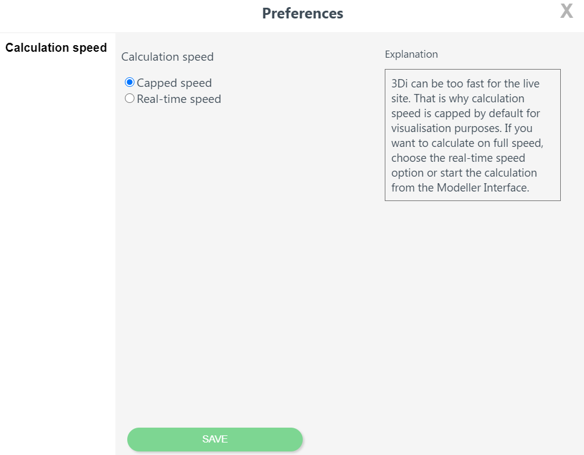

.. _3di_live_sessions:

Sessions
========

To start or follow a 3Di Live session, open your browser and go to https://3di.live and log in with your username and password. If you do not have a 3Di account yet, or do not know your username and password, please contact the :ref:`servicedesk`.

After logging in to 3Di Live , the *Welcome screen* will be shown. In this screen, there are two possibilities:

* Start a new session using the :ref:`start_a_new_session` tab.
* Follow an ongoing session via the :ref:`follow_a_session` tab.

.. _start_a_new_session:

Starting a new session
----------------------

* Click *New session*. 
* If you have simulation rights for multiple organisations, use the *Billing goes to* dropdown menu to select the 
* Select the model you want to use to start a simulation with. You may type the model name in the search bar to find it.

A new session will be started. During the start up of the model tips for use of the site will be shown. It may take some time to load the model. Actual loading time dependens on the model size; for large models, this may take several minutes.

.. note::

	The number of sessions that can run simultaneously by your organisation depends on your organisation's 3Di subscription. If this limit is reached, the message "Your organisation is already running X sessions" will be shown.
	
	If you organisation has a limited number of simulation hours in its subscription, the time that the session is active is subtracted from the available number of hours for the current year.
	
	When paused and inactive for too long, the session will close and say: 'This simulations is no longer active. You may start a new simulation.'

.. _follow_a_session:

Following a session
-------------------

Active sessions of your organisation can be followed. This may be a session that you started earlier (e.g. from the :ref:`3Di Modeller Interface <simulate_api_qgis>`), or a session that someone else in your organisation has started.

In the *Follow session* tab, Select an active session and click *Follow*. The number of followers of a session is unlimited. To leave the session, either close your browser tab, or click the *User* icon (top right) > *Leave session*. 

.. _user_menu:

User menu
^^^^^^^^^^

You can access the *User menu* by click the user icon at the top right of the screen. The user menu has the following options:

Preferences
"""""""""""

**Calculation speed** 
The Calculation speed is the rate at which the calculations are shown on screen. The Calculation speed is slowed down (**capped speed**) by default. This is done because 3Di Live is meant to give a live insights in what is happening. If the model is too fast, it can be hard to understand the flows. 

If you want to calculate on full speed, choose the **Real-time speed** option. The model most likely will speed up in case the % on the top right of the screen was not indicating 100% already. In case the server load is at 100%, no gain will be seen in calculation speed on 3Di Live.

.. _restart_session:

Restarting sessions
-------------------
Restarting the simulation resets all the calculations that have been made and reloads the simulation. If you want to save your results you will get sent back to the start screen afterwards.

.. _quit_session:

Quitting the session
--------------------

In the **User menu** you can select **quitting the simulation**, this ends the use of calculation time. If this option is not used the session remains active. One of the following scenario's might apply:

- time out after being inactive is set to 30 minute for a running simulation
- time out after being inactive is set to 5 minute for a paused simulation
- leaving the session via a tab will close the simulation after 30 minutes

You can:

- **Quit, don't store results**
- **Quit, store results**

.. _store_results:

Storing results
---------------

.. note::
    
	:ref:`Raw results<outputs>` will always be stored for 7 days, even if you choose the option *Quit, don't store results*. 

Direct download
^^^^^^^^^^^^^^^

When you quit the session (*User menu* > *Quit Simulation*), you can download these files directly to your computer by choosing > *Quit, Store Results* > *Direct download*. You may also :ref:`download them from the 3Di Modeller Interface<mi_download_res>`.

Store in scenario archive
^^^^^^^^^^^^^^^^^^^^^^^^^

.. note::
    This option is only available if your subscription includes the Scenario Archive.

Another option you have when you quit the session, is to store the results in the :ref:`scenario_archive`. When you choose this option, you also have several options for **automated post-processing**. For an explanation of the available options, see :ref:`scenario_archive`.

.. _live_simulation_template:

Storing and using simulation templates
--------------------------------------
A :ref:`simulation template<simulation_and_simulation_templates>` can be stored by clicking **User menu**, then clicking **Quit Simulation** and then **Create simulation template from simulation**. Set a template name and check the options you want to save:

   - **Include events**: All :ref:`forcings<toctree_forcings>` and :ref:`events<toctree_events>` you have used in the simulation, such as rain events, breaches, or raster edits.
   
   - **Include initials**: All :ref:`initial conditions<toctree_initials>` that were used in the simulation in the simulation template, including initial water levels in 1D and/or 2D domains, or :ref:`saved_states`.
   
   - **Include settings**: All :ref:`simulation_settings`: physical, numerical, time step, and aggregation settings.

Finally click **Store results**.

Now when starting the same model again, you will be directed to choose a simulation template. The template you previously created will be accessible with the name you assigned to it. If you want to run a new simulation select the simulation template at the bottom of the list.
