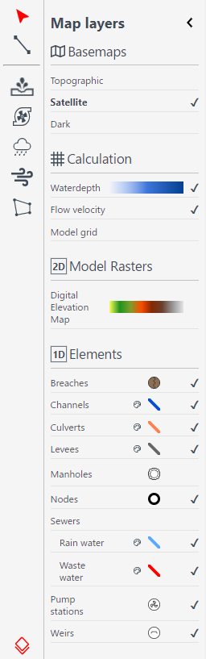

.. _3di_live_visualisation_tools:

Visualisation tools
===================

.. _layers_menu_guide:

Opening the *Map layers* panel
------------------------------

Click on the *Layer tool* at the bottom left of the screen. The *Map layers* panel appears: 

	Map layers panel.

Base maps
---------

In the *Map layers* menu the background map can be chosen under *Base maps*

- Topographic
- Satellite (Default)
- Dark

.. _visualisation_calculation_layers_3di_live:

Calculation layers
------------------

In the *Calculation* section, you can toggle the visibility of layers that give insight in the simulation result and the computational grid:

- *Waterdepth* shows you the proportional depth of the water on the 2D domain. The color scheme of the water depth can not be changed in 3Di Live.
- *Flow velocity* shows the flow in the 1D elements, visualized by moving white dots. The size of the dots indicates the discharge, and the speed with which they move indicates the flow velocity.
- *Model grid* shows the 2D cells on the map. Note that you need to zoom in sufficiently for the cells to be shown.
- *Model grid flow* shows the 2D flowlines and 1D2D exchange flowlines of your model. Note that you need to zoom in sufficiently for the cells to be shown.

.. _visualisation_model_rasters_3di_live:

Model rasters
-------------

In the *Model rasters* section, you can toggle the visibility of the *Digital Elevation Model*.

1D Elements
-----------
If the model contains 1D elements, they are set to visible by default. Depending on which 1D elements are present in the model (and turned on in the *Map layers* menu), you will see:

- Breaches (shown after zooming in)
- Channels
- Culverts
- Levees
- Manholes (shown after zooming in)
- Nodes
- Sewers
- Pump stations
- Weirs

Colors for all these layers can be changed according to your preferences by clicking on the small paint pallet next to the element.

.. note::
	Manholes are turned off by default. Turning them on and zooming out may degrade the performance of 3Di Live.

