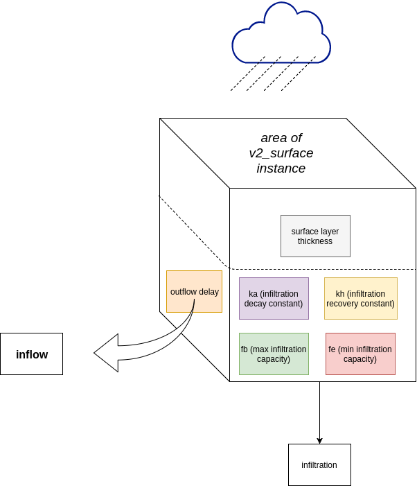

.. _inflow:
Inflow
============

In 3Di water that flows into the water body via a surface is calculated by the inflow module. Each model with an active inflow setting will calculate the inflow into the water body of the model area when being run as a headless calculation or in the GUI. All occurring rain events will also be applied to the defined surfaces. Local rain events can overlay each other. Global rain events can occur in succession.

A model must have have an use_0d_inflow parameter specified in its global_settings column. This setting allows for three different choices. When set to 0, inflow is turned off. When set to 1 it will use the data from the v2_impervious_surface instances. When set to 2, it will use the entries for the v2_surface instances. 

Impervious surface
------------------

A surface often is an urban construction like the roof of a building with its typical characteristics. For this use case 3Di has a set of pre-defined impervious surfaces (from the dutch NWRW-inloop model). The surface itself is modelled by a v2_impervious_surface instance that can be linked to connection nodes by v2_impervious_surface_map instances where the percentage attribute controls the inflow distribution. 

The figure below shows an overview of the parameters available.

   Overview of surface run-off parameters

The parametrisation for the impervious surface types is fixed. It uses the following parameters:
    
.. list-table:: Parameters Impervious Surface
   :widths: 50 30 30 30 30 30 30 30
   :header-rows: 1

   * - Surface description
     - outflow_delay (/min)
     - surface_storage (mm)
     - infiltration boolean
     - Max infiltration capacity (mm/h)
     - Min infiltration capacity (mm/h)
     - Time factor reduction of infiltration capacity (/h)
     - Time factor recovery of infiltration capacity (/h)
   * - gesloten verharding, hellend
     - 0.5
     - 0.0
     - False
     - 0.0
     - 0.0
     - 0.0
     - 0.0
   * - gesloten verharding, vlak
     - 0.2
     - 0.5
     - False
     - 0.0
     - 0.0
     - 0.0
     - 0.0
   * - gesloten verharding, vlak uitgestrekt
     - 0.1
     - 1.0
     - False
     - 0.0
     - 0.0
     - 0.0
     - 0.0
   * - open verharding, hellend
     - 0.5
     - 0.0
     - True
     - 2.0
     - 0.5
     - 3.0
     - 0.1
   * - open verharding, vlak
     - 0.2
     - 0.5
     - True
     - 2.0
     - 0.5
     - 3.0
     - 0.1
   * - open verharding, vlak uitgestrekt
     - 0.1
     - 1.0
     - True
     - 2.0
     - 0.5
     - 3.0
     - 0.1
   * - dak, hellend
     - 0.5
     - 0.0
     - False
     - 0.0
     - 0.0
     - 0.0
     - 0.0
   * - dak, vlak
     - 0.2
     - 2.0
     - False
     - 0.0
     - 0.0
     - 0.0
     - 0.0
   * - dak, vlak uitgestrekt
     - 0.1
     - 4.0
     - False
     - 0.0
     - 0.0
     - 0.0
     - 0.0
   * - onverhard, hellend
     - 0.5
     - 2.0
     - True
     - 5.0
     - 1.0
     - 3.0
     - 0.1
   * - onverhard, vlak
     - 0.2
     - 4.0
     - True
     - 5.0
     - 1.0
     - 3.0
     - 0.1
   * - onverhard, vlak uitgestrekt
     - 0.1
     - 6.0
     - True
     - 5.0
     - 1.0
     - 3.0
     - 0.1

Surface
--------

To offer more flexibility it is also possible to define your own set of parameters that characterize the inflow of a surface. This can be achieved by using surface parameters. In this case the surface can be modelled by a v2_surface instance that then is linked to connection nodes just the same way as described above but with its own mapping table called v2_surface_map. 

The parametrisation of your specific surface-type can be set in the v2_surface_parameters table. For an overview of the available parameters check out the :ref:`database-overview`.