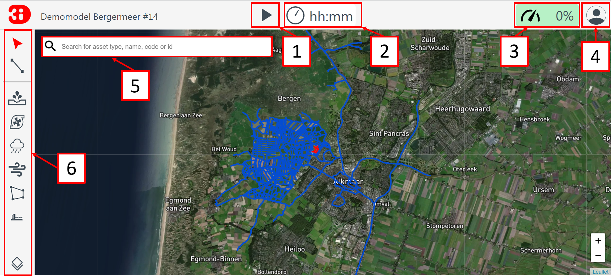

Overview of the Live Site
==============================

.. _overview_screen_ls:

Overview session screen and tooling
-------------------------------------

When starting or following a session, the screen in :numref:`fig_main_ses` will be loaded. The loaded model will be shown in the complete extent. At the top left you can see the name of the loaded model.

.. _fig_main_ses:

	Interface main session.

1. With the **Start simulation** button, the simulation can be started and paused once started. 
2. The simulation run time will be indicated in [hours:minutes].
3. Indicates the load of the model on the server in %.
4. The :ref:`user_menu`.
5. The :ref:`search_bar_ls`.
6. This bar contains the following tools from top to bottom: 

- :ref:`selection_tool_guide`
- :ref:`line_selection_tool`
- :ref:`discharge_tool_guide` (2D)
- :ref:`pump_tool_guide` (2D)
- :ref:`rain_tool_guide`
- :ref:`wind_tool_guide`
- :ref:`raster_edit_tool`
- :ref:`flood_barrier_tool`
- :ref:`Layer tool <layers_menu_guide>`

.. _user_menu:

User menu
^^^^^^^^^^

Click the user icon at the top right of the screen to show the **User menu**. The user menu has the following options:

Preferences
"""""""""""

.. figure:: image/d2.8_user_menu.png 
	:alt: User menu

**Calculation speed** 
The Calculation speed is the rate at which the calculations are shown on screen. The Calculation speed is slowed down (**capped speed**) by default. This is done because the Live Site is meant to give a live insights in what is happening. If the model is too fast, it can be hard to understand the flows. 

If you want to calculate on full speed, choose the **Real-time speed** option. The model most likely will speed up in case the % on the top right of the screen was not indicating 100% already. In case the server load is at 100%, no gain will be seen in calculation speed on the Live Site.

Help
""""
Currently sends you to https://3diwatermanagement.com/3di-start/.
For support from the help desk, visit https://nelen-schuurmans.topdesk.net/.

Quit simulations
""""""""""""""""
:ref:`timeoutlivesite` ends the use of calculation time. And let's you save your results.

You can:

- **Quit, don't store results**
- **Quit, store results**, for more information, see: :ref:`store_results_live_site`.

Restart simulations
"""""""""""""""""""
Restarting the simulation resets all the calculations that have been made and reloads the simulation. If you want to save your results you will get sent back to the start screen afterwards.

.. _search_bar_ls:

Search Bar
^^^^^^^^^^^^
The Search Bar enables you to locate assets of your schematisation. You can search for asset type (e.g. pipe), name, code or id.

.. _selection_tool_guide:

Selection tool
^^^^^^^^^^^^^^^^
By default, the **selection tool** is switched on. With it you can click anywhere on the map to visualise the time series at that location. By default water depth and water level will be shown. If the model contains ground water, that graph is also shown. 

The time series can be downloaded in CSV format. The points in the graphs in :numref:`fig_point_select_tool` are the points calculated by the 3Di calculation core and are independent from the output time step that the modeller has set while following a location. If a location is clicked later during the simulation, the historic values on the graph are the values shown according to the output time step. 

.. _fig_point_select_tool:

.. figure:: image/d3.1_point_location.png
	:alt: Point selection

	Point selection tool.

.. _line_selection_tool:

Line-selection tool
^^^^^^^^^^^^^^^^^^^^

The **Line-selection tool** shows the height of a cross section, together with the water level in that transect. Click the start and end point in any place on the map for the cross section (within the 2D model domain).

.. figure:: image/d3.1_side_view.png
	:alt: Cross section selection

	Line-selection tool.
	
The side view shows the elevation in green and the water in blue. By hovering over the graph with the mouse, exact values can be seen. Keeping this graph open during a flood event will show you how the water level is slowly rising. Note that in the example also groundwater is available in the model indicating an extra blue line (only in those cases where ground water is set up in the schematisation). 

.. _discharge_tool_guide:

Discharge tool
^^^^^^^^^^^^^^^

With the **Discharge tool** a constant source of water can be added to the model. Select the icon and change the amount of water you want to apply. In the dropdown menu you can change the unit. You can also change the duration of the discharge. Click **PLACE ON MAP** and click a location on the map that should be the source. The water will start flowing from this location over the 2D domain. It is the modelling equivalent of a 2D lateral. 
When you press the **Play** button, the intervention will become active.

.. figure:: image/d3.6_discharge.png
	:alt: Discharge tool

	Discharge tool.

If you made a mistake when creating discharge, you can **delete** before you activate it. After you have started your simulation, you can **stop** the discharge while its status is 'active', when your simulation is paused. The discharge will then only have had an effect during it's runtime and not for the previously set duration time.

.. _pump_tool_guide:

Pumping tool
^^^^^^^^^^^^^

With the **Pump tool**, a constant sink of water can be added to the model. Select the icon and change the amount of water you want to pump out of the model. In the dropdown menu you can change the unit. You can also change the duration of the pumping. Click **PLACE ON MAP** and click a location on the map that should be the pump. The water will be pumped out from the 2D domain from this location (1D pumps should be added in the model schematisation).
The water that is taken out of the model will not flow back into the model and is considered a loss. It is the modelling equivalent of a negative 2D lateral. 
When you press the **Play** button the intervention will become active.

If you made a mistake when creating a pump you can **delete** before you activate it. After you have started your simulation, you can **stop** the pump while its status is 'active', when your simulation is paused. The pump will then only have had an effect during its runtime and not for the previously set duration time. 

.. _rain_tool_guide:

Rain tool
^^^^^^^^^^

Through the **Rain tool** icon, rainfall can be added to the model. The following rain event types are available:

* **Constant**: a homogeneous event in both space and time across the entire model range.
* **Radar**: use historical rainfall data (only available in the Netherlands).
* **Design**: use a design event. This event is homogeneous over the entire model area and heterogeneous in time.

These three options for adding rainfall all cover the entire model area.

When choosing a **Constant** type of precipitation, the rain intensity (in mm/h) and duration of the rain must be defined. The rain intensity is uniform and constant in the given time frame.

The option **Radar** is currently only available in the Netherlands and uses historical rainfall data that is based on radar rain images. Providing temporally and spatially varying rain information. The Dutch Nationale Regenradar is available for all Dutch applications for organisations that have this module in their contract. On request, the information from other radars (worldwide) can be made available to 3Di as well. In order to apply this type of rain a historical time frame needs to be set. 

When choosing the option **Design**, a number between 3 and 16 must be selected. These numbers correlate to predetermined rain events, with differing return periods, that fall homogeneous over the entire model. Numbers 3 to 10 originate from `RIONED <https://www.riool.net/bui01-bui10>`_ and are heterogeneous in time. Numbers 11 to 16 have a constant rain intensity. When selecting a design rain the total rainfall and duration information will change in the tab.

For a more detailed description on rainfall, see: :ref:`rain`.

When the rainfall is active a cloud icon appears on the top right of the screen. Information about the rainfall event can be accessed by keeping the rainfall tab open. Active and past (inactive) events are shown in this tab 

.. figure:: image/d3.2_rainfall.png
	:alt: Rainfall event

	Rainfall tool.

.. _wind_tool_guide:

Wind tool
^^^^^^^^^^^

A compass card appears after clicking on the **Wind tool** icon. By clicking in the compass card a homogeneous wind field with a specific direction and speed can be set up for the whole model in the 2D domain. This direction can also be filled in numerically. The strength and duration of the wind can be changed. Because the wind is constant for the whole model you only need to press **CREATE**. When the wind is active a wind icon appears on the top right of the screen.

.. figure:: image/d3.6_wind.png
	:alt: Wind speed, direction and duration

	Wind tool.

Once you have created a wind event, you can press **EDIT**. This lets you either **STOP WIND** or after altering the fields **UPDATE EXISTING WIND**.

.. _raster_edit_tool:

Raster-edit tool
^^^^^^^^^^^^^^^^^^

The **Raster-edit tool** lets you edit the elevation raster (DEM) by pressing **DRAW ON MAP** and drawing a polygon and setting a constant elevation level (in mMSL) for that polygon. After you have drawn your polygon, you can **CONFIRM** the polygon and your raster edit will be active for the rest of the simulation. You can also **EDIT DRAWING** and change the shape of your polygon.  

.. figure:: image/d3.6_raster_edits.png
	:alt: Raster edits

	Raster edit tool.

.. _flood_barrier_tool:

Flood barrier tool
^^^^^^^^^^^^^^^^^^^^

A flood barrier can prevent a certain area from flooding. To see the flood barriers tool in action, you can watch the `Floodbarriers preview <https://www.youtube.com/watch?v=by4MS5DdEgY>`_ on Youtube.

Click on the **Flood barrier tool** icon |flood_barrier_icon| at the left of the screen. The flood barrier tool appears.

.. figure:: image/d3.6_flood_barrier.png
	:alt: Flood barrier tool.

	Flood barrier tool.

You can set the height in the elevation box. 

- The height is in meters Mean Sea Level (m MSL). If the waterlevel in the flow link crossing the flood barrier exceeds this height the water will flow over the flood barrier. 

Press the DRAW ON MAP button to draw the shape of the flood barrier on the map.

.. figure:: image/d3.6_flood_barrier_draw_on_map.png
	:alt: Flood barrier tool - start creating flood barrier.

	Flood barrier tool - start creating flood barrier.

Click on the map to set the first point. The flood barrier is created by selecting points on the map. Every new point selected on the map creates a line connecting with the previous point. All points together form the flood barrier. 

.. figure:: image/d3.6_flood_barrier_first_point_selected.png
	:alt: Flood barrier - first point selected.

	Flood barrier - first point selected.

During the creation, you can go back to the previous point or cancel the entire flood barrier.
Cancel the last point by clicking on the |flood_barrier_cancel_point| on the map or clicking UNDO LAST POINT in the flood barrier tool (on the left).
Cancel the entire flood barrier by pressing CANCEL in the flood barrier tool.

.. |flood_barrier_cancel_point| image:: image/d3.6_flood_barrier_cancel_point.png

.. figure:: image/d3.6_flood_barrier_multiple_points_selected.png
	:alt: Flood barrier - multiple points selected.

	Flood barrier - multiple points selected.

Confirm the flood barrier by pressing the |flood_barrier_confirm_flood_barrier| on the map or CONFIM in the flood barrier tool.

.. |flood_barrier_confirm_flood_barrier| image:: image/d3.6_flood_barrier_confirm_flood_barrier.png

.. figure:: image/d3.6_flood_barrier_created.png
	:alt: Flood barrier created.

	Flood barrier created.

.. _layers_menu_guide:

Layers tool
^^^^^^^^^^^^

Click on the **Layer tool** at the bottom left of the screen. The **Map layers** appear: 

.. figure:: image/d3.6_layer_tool.png
	:alt: Layer tool.

	Layer tool.

In the **Map layers** menu the background map can be chosen under **Basemaps**:

- **Topographic**
- **Satellite** (Default)
- **Dark**

In the **Calculation** section all layers are shown that indicate (a visualisation of) results of the simulation on the map:

- **Waterdepth** shows you the proportional depth of the water on the 2D domain.
- **Flow velocity** shows the velocity of the flow in the 1D elements, with the movement of white dots.
- **Model grid** depicts the (sub)grids of your model.

In the **2D Model Rasters** you can activate a slightly transparent **Digital Elevation Map**.

If the model contains 1D-elements, they are set to visible by default. Depending on which 1D elements are present in the model (and turned on in the **Map layers** menu), you will see:

- **Breaches** (shown after zooming in)
- **Channels**
- **Culverts**
- **Levees**
- **Manholes** (shown after zooming in)
- **Nodes**
- **Sewers**
- **Pump stations** 
- **Weirs**

Colors for all these layers can be changed to reflect user preferences by clicking on the small paint pallet next to the element.

.. _notables:

Notables
---------

- When paused and inactive for too long, the session will close and say: 'This simulations is no longer active. You may start a new simulation.'
- Editing of structures or DEM can only be done after *pausing* a simulation.
- In the current setup special attention to models with initial water levels in 2D and laterals. 
- Initial water level in 2D is taken into account, but only with the 'max' parameter.
- Laterals in a model are at the moment not used in the Live Site.
- Structure controls are at the moment not used in the Live Site.
- The color scheme of the water depth can not be changed in the Live Site.
- The language of the site will change depending on the language settings of your browser. Currently mandarin, english and dutch are supported. Please keep in mind that model elements are never translated. 
- Manholes are turned off by default. Turning them on and zooming out might cause the Live Site  to slow down.
- Water depth is not shown in the channel nodes.