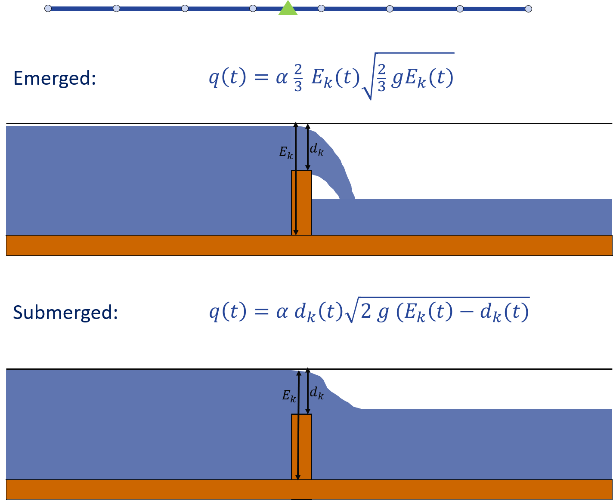
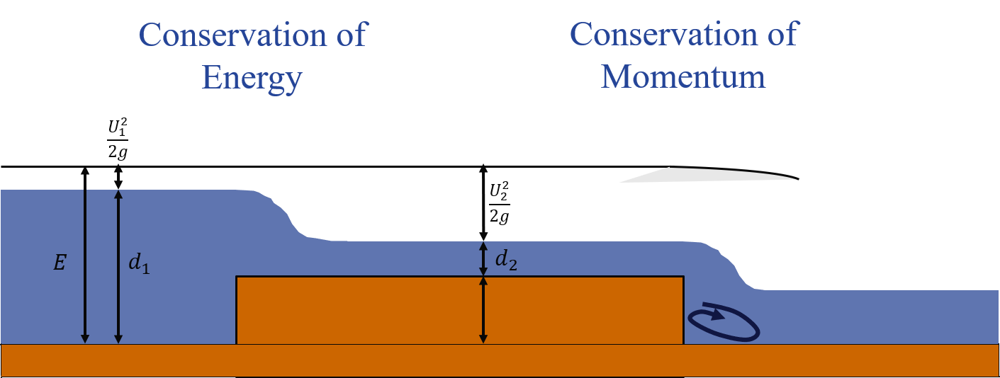

.. _structures:

Structures
============

Structures can be an integral part of water systems. In 3Di they are placed between or on connection nodes as links between channels and pipes. They have different properties depending on there type and can have different functions depending on the settings the user defines. The sections below give an overview of the structures available in 3Di.

.. _pump:

Pump station
------------

In 3Di, the modeler can add pumps to a 1D channel and/or 1D sewer networks. There is no distinction made for pumps in sewer systems and channel networks, since their function is the same. Characteristics for the pump, as needed for a specific water system, can be set by configuring attributes of the pumps. The attributes specify at which water levels the pump starts moving water from one node to the other and what the discharge is. 

.. figure:: image/b_structures_pump.png
   :alt: structures_pump
     
   Schematic display of a pump function

Pumps are in place to move water from one location to another, usually to conquer elevation differences. Some examples of this displacement function of pumps are:

* Polder pump: Water needs to be transported out of the polder to drain the area of excess water and keep the polder dry. A pump transports the water from low lying canals in a polder system to the higher lying drainage canal through which it can be transported further.

* Sewer pump: In a sewer system  sewer water needs to be transported to a treatment plant. A pump in a sewer system moves the sewer water from the sewer system to the treatment plant.

The main pump characteristics that can be specified in a 3Di are:

* Capacity: Maximum discharge for which the pump is able to displace water from the suction node to the delivery node.

* Start level: Water level for which the pump will be turned on.

* Lower stop level: Water level beneath start level for which the pump will be turned off.

* Upper stop level: Water level above start level for which the pump will be turned off.

* Type: Parameter to set whether start and stop levels are measured at suction side or delivery side of the pump.

Furthermore, there are two methods to add a pump in a 3Di:

1. Pump between two nodes: A pump between two nodes moves water from the  node at suction side to the node at delivery side with the specified pump capacity. Depending on the type of pump the suction side or delivery side water levels determine the activity of the pump.

2. End pump:  For an end pump only the suction side node needs to be specified. With no delivery side all water being moved by this pumped is taken out of the model. All water pumped from the model is specified in the flow_summary.log as contribution to the global water balance. The pump characteristics to be specified are the same as for a pump type with start/stop levels at suction side. Since no delivery side node is present, it is not possible to specify a pump type with start stop level at delivery side.

Finally, pumps can either be set to work implicitly, explicitly or as a combination of both. When set implicit, pumps will only pump a fraction of their capacity depending on the downstream supply. This prevents pumps from switching on and off in a short period of time and makes the calculation more stable. The implicit ratio for pumps can be set in the numerical settings. 

.. _weir:

Weir
------------

Weirs are used to maintain the water level in drainage level areas of act as threshold for sewerage water overflowing into storage basins or surface water. Again, there is no distinction between these types of usages in 3Di. The location of the weir determines the its function. The main weir characteristics that can be specified in 3Di are:

* Crest level: The threshold level or height of the weir.

* Crest type: Selects a short or long crested weir formulation.

* Discharge coefficient: The coefficient used in the weir discharge formulation.

* Cross_section_definition: For the shape and size of the weir you must define a cross section definition.

The short crested weir can be submerged or emerged. If the weir is emerged water flows over the crest freely, the downstream flow conditions have no influence on the amount of water that flows over the crest. If the weir is submerged the downstream water level approaches the crest level and affects the flow over the crest. The transition between these states in smoothed for a stable computation. The figures below illustrate these two states.

     
   Illustration of short crested weir in two states. Emerged and Submerged. The formulas shown are used in 3Di to compute the discharge over the weir, in which a stands for the discharge coefficient.

The long crested weir uses the conservation of mass and energy equations to compute discharge. It uses the weir friction given by the user and the actual length between the connection nodes. The figure below illustrates the long crested weir.

     
   Illustration of long crested weir.

.. _culvert:

Orifice and Culvert
--------------------

Orifices are used in sewerage to limit flow or can be used to model a bridge or culvert. The separate culvert table differs from orifices in the way the flow is calculated. Culverts are closely related to pipes in this sense. The Culvert table can be used for longer sections of pipe-like structures and may be curved. Shorter, straight culverts are best modeled as an orrifice. An orrifice is treated as a weir to allow for larger time steps. 

For culverts and orifices, the energy loss caused by the change in flow velocity at the in- and outlet are accounted for by 3Di. The discharge coefficients for orifices can be used to account for any additional energy loss. 

The input parameters for orifices are similar to those for weirs, specified in the section above. Culverts use invert levels at the start and end instead of the crest level in weirs and orifices. The input parameters are all described in the spatialite database :download:`here <pdf/database-overview.pdf>`.

Control on structures is described in a separate section: :ref:`control_structures`.
