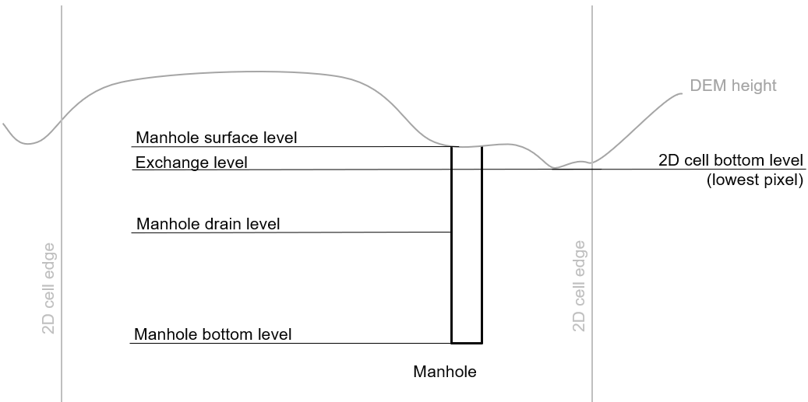
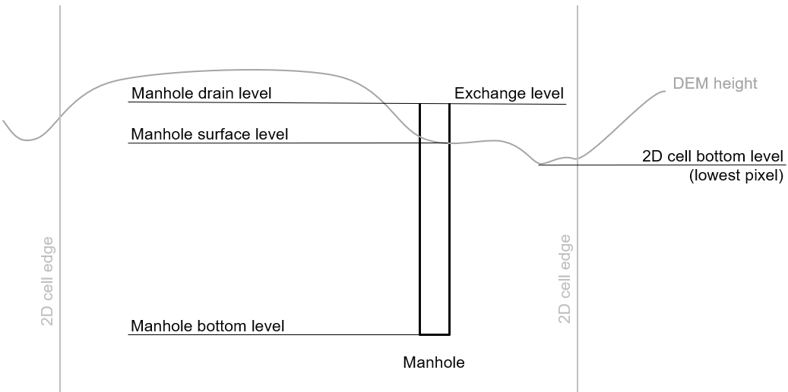

.. _1d_objects:

1D Objects
==========

1D objects are used to schematise 1D networks. The way flow is calculated in these 1D networks is described in the section :ref:`onedee_flow`.

* :ref:`1d_boundary_condition`
* :ref:`channel`
* :ref:`connection_node`
* :ref:`cross_section_location`
* :ref:`culvert`
* :ref:`material`
* :ref:`orifice`
* :ref:`pipe`
* :ref:`pump_schematisation_object`
* :ref:`pump_map`
* :ref:`weir`
* :ref:`windshielding`

.. _1d_boundary_condition:

1D Boundary Condition
---------------------

Boundary condition for 1D connection nodes.

Layer name
^^^^^^^^^^

boundary_condition_1d

Geometry
^^^^^^^^

Point

Attributes
^^^^^^^^^^

.. list-table:: 1D Boundary condition attributes
   :widths: 6 4 4 2 4 30
   :header-rows: 1

   * - Attribute alias
     - Field name
     - Type
     - Mandatory
     - Units
     - Description
   * - ID
     - id
     - integer
     - Yes
     - \-
     - Unique identifier
   * - Code
     - code
     - text
     - No
     - \-
     - Name field, no constraints
   * - Display name
     - display_name
     - text
     - No
     - \-
     - Name field, no constraints
   * - Boundary type
     - type
     - integer
     - Yes
     - \-
     - Sets the type to 1: Water level, 2: Velocity, 3: Discharge, 5: Sommerfeld, 6: Groundwater level or 7: Groundwater discharge
   * - Time units
     - time_units
     - text
     - Yes
     - \-
     - Units of the time step. Possible values: 'seconds', 'minutes', 'hours'
   * - Interpolate
     - interpolate
     - boolean
     - Yes
     - \-
     - True: values will be interpolated between time steps. False: values will remain contant until the next time step
   * - Time series
     - timeseries
     - text
     - Yes
     - [s, min, or h] and [m MSL, m/s, m/m, m³/s]
     - CSV-style table of 'time_step,value' pairs, separated by newline character.
   * - Connection node ID
     - connection_node_id
     - integer
     - Yes
     - \-
     - Foreign key reference to an ID in :ref:`connection_node`
   * - Tags
     - tags
     - text
     - No
     - \-
     - Comma-separated list of foreign key references to ID's in :ref:`tag`

.. _1d_boundary_condition_notes_for_modellers:

Notes for modellers
^^^^^^^^^^^^^^^^^^^

General notes
"""""""""""""

- 1D boundary conditions can only be applied to connection nodes that have a single connection to the rest of the network.
- The pipe, channel, or structure directly connected to the boundary condition must have exchange type *isolated*.
- 1D boundary conditions cannot be placed on the same connection node as a pump.
- 1D laterals placed on a connection node with a 1D boundary condition will be ignored.
- Surfaces and Dry weather flow mapped to a connection node with a 1D boundary condition will be ignored.

Time series
"""""""""""

- Format the time series as Comma Separated Values (CSV), with the time (in minutes since the start of the simulation) in the first column and the value (units dependent on the boundary type) in the second column. For example::

    0,145.20
    15,145.23
    30,145.35
    45,145.38
    60,145.15

- Units used are:
    - Water level: m MSL
	- Velocity: m/s
	- Discharge: m³/s
	- Sommerfeld: m/m
	- Groundwater level: m MSL
    - Groundwater discharge: m³/s

- The time series string cannot contain any spaces or empty rows

- The boundary condition time series is stored in the simulation template and is not part of the 3Di model itself. It can be overridden when starting a new simulation, without the need to create a new revision of the schematisation.

- When posted to the 3Di server, the time steps will be converted to seconds

- For boundary types Velocity, Discharge and Sommerfeld, the drawing direction of the channel, pipe, or structure determines sign of the input value. For velocity and discharge, this means that if the 1D boundary condition is placed on the end connection node, positive values result in boundary *outflow*. For the Sommerfeld boundary, a positive gradient for a 1D boundary condition that is placed at the end connection node means that the waterlevel downstream is higher than upstream, i.e. this will result in boundary *inflow*.

- The time series must cover the entire simulation period.

- The time series values are interpolated between the defined times

- In case of multiple boundaries in one model: make sure they all have the same number of time series rows with the same temporal interval. This also applies if you have e.g. one 1D boundary and one 2D boundary.

- When editing the time series field in using SQL (sqlite dialect), use ``char(10)`` as line separator. The example time series shown above would look like this::

    '0,145.20'||char(10)||'15,145.23'||char(10)||'30,145.35'||char(10)||'45,145.38'||char(10)||'60,145.15'

.. _channel:

Channel
-------

A natural or artificial open channel. Channels can have a variable bed level, bed friction and cross section along their length. This information is stored in another object, the :ref:`cross_section_location`. A channel can have one or more cross-section locations, depending on the variability of the channel.

See :ref:`channelflow` for more details.

Layer name
^^^^^^^^^^

channel

Geometry
^^^^^^^^

Linestring (two or more vertices)

Attributes
^^^^^^^^^^

.. list-table:: Channel attributes
   :widths: 6 4 4 2 4 30
   :header-rows: 1

   * - Attribute alias
     - Field name
     - Type
     - Mandatory
     - Units
     - Description
   * - ID
     - id
     - integer
     - Yes
     - \-
     - Unique identifier
   * - Code
     - code
     - text
     - No
     - \-
     - Name field, no constraints
   * - Display name
     - display_name
     - text
     - No
     - \-
     - Name field, no constraints
   * - Display name
     - display_name
     - text
     - No
     - \-
     - Name field, no constraints
   * - Calculation point distance
     - calculation_point_distance
     - decimal number
     - No
     - m
     - Maximum distance between calculation points, see :ref:`techref_calculation_point_distance`
   * - Exchange type
     - exchange type
     - integer
     - Yes
     - \-
     - Sets the 1D2D exchange type: embedded (100), isolated (101), connected (102), or double connected (105). See :ref:`calculation_types`.
   * - Exchange thickness
     - exchange_thickness
     - decimal number
     - No
     - m
     - The thickness of the porous layer that the water needs to flow through to reach the groundwater, see :ref:`1d2d_groundwater_exchange`
   * - Hydraulic conductivity in
     - hydraulic_conductivity_in
     - decimal number
     - No
     - \-
     - Hydraulic conductivity for water flowing from the groundwater to the channel, see :ref:`1d2d_groundwater_exchange`
   * - Hydraulic conductivity out
     - hydraulic_conductivity_out
     - decimal number
     - No
     - \-
     - Hydraulic conductivity for water flowing from the channel to the groundwater, see :ref:`1d2d_groundwater_exchange`
   * - Start connection node ID
     - connection_node_id_start
     - integer
     - Yes
     - \-
     - ID of start connection node
   * - Connection node ID end
     - connection_node_id_end
     - integer
     - Yes
     - \-
     - ID of end connection node
   * - Tags
     - tags
     - text
     - No
     - \-
     - Comma-separated list of foreign key references to ID's in :ref:`tag`

Notes for modellers
^^^^^^^^^^^^^^^^^^^

.. todo::
   Refer to "how to schematise open water systems" when that section is finished

- Use 1D channels wisely. In many applications, schematising waterways in 2D is preferable. See :ref:`channelflow` and :ref:`calculation_types`.

- All channels must have at least one :ref:`cross_section_location`.

Exchange type 'embedded'
""""""""""""""""""""""""

- Embedded channels add extra connections between 2D grid cells, but ignore obstacles and levees
- Make sure the embedded channel profile always lays partially below the DEM; embedded channels cannot 'float' above the DEM.
- Embedded channels only function when they connect several 2D grid cells, so make sure no embedded channel falls completely inside one 2D grid cell
- Do not place boundary conditions directly on embedded channels.

Exchange types 'connected' and 'double connected'
"""""""""""""""""""""""""""""""""""""""""""""""""

For channels with exchange type 'connected' and 'double connected', 1D2D connections connect each 1D calculation point to the 2D cell it is in. Therefore, channels with these exchange types need to be in a 2D cell. Alternatively, you may use an :ref:`exchange_line` to customise the 1D2D connections. When using an exchange line, the channel does not need to be in 2D cells, but the exchange line needs to be in 2D cells.

.. _connection_node:

Connection node
---------------

Location and ID of nodes to connect :ref:`channel`, :ref:`culvert`, :ref:`orifice`, :ref:`weir`, :ref:`pipe`, :ref:`pump_schematisation_object`, or :ref:`pump` features. :ref:`1d_lateral`, and :ref:`1d_boundary_condition` features are also defined at connection nodes. See :ref:`inflow_objects` for more information on how surfaces and dry weather flow can be mapped to a connection node. 

Layer name
^^^^^^^^^^

connection_node

Geometry
^^^^^^^^
Point

Attributes
^^^^^^^^^^

.. list-table:: Connection node attributes
   :widths: 6 4 4 2 4 30
   :header-rows: 1

   * - Attribute alias
     - Field name
     - Type
     - Mandatory
     - Units
     - Description
   * - ID
     - id
     - integer
     - Yes
     - \-
     - Unique identifier
   * - Code
     - code
     - text
     - No
     - \-
     - Name field, no constraints
   * - Display name
     - display_name
     - text
     - No
     - \-
     - Name field, no constraints
   * - Bottom level
     - bottom_level
     - decimal number
     - See :ref:`notes<notes_for_modellers_connection_nodes>`
     - m MSL
     - Bottom level nodes with storage
   * - Storage area
     - storage_area
     - decimal number
     - See :ref:`notes<notes_for_modellers_connection_nodes>`
     - m MSL
     - Surface area at the bottom of the object. Adds additional storage capacity to a 1D network.
   * - Initial water level
     - initial_waterlevel
     - decimal number
     - No
     - m above datum
     - Initial water level for the 1D domain
   * - Exchange type
     - exchange_type
     - integer
     - No
     - See :ref:`notes<notes_for_modellers_connection_nodes>`
     - Sets the type of 1D2D exchange: Embedded (0), Isolated (1), or Connected (2).
   * - Exchange level
     - exchange_level
     - decimal number
     - No
     - m MSL
     - Exchange level for the 1D2D connection. See :ref:`notes_for_modellers_connection_nodes`.
   * - Exchange thickness
     - exchange_thickness
     - decimal number
     - No
     - m
     - For groundwater exchange: the thickness of the (porous) manhole wall that the water needs to flow through to reach the groundwater (or v.v.), see :ref:`1d2d_groundwater_exchange`
   * - Hydraulic conductivity in
     - hydraulic_conductivity_in
     - decimal number
     - No
     - \-
     - Hydraulic conductivity for water flowing from the groundwater into the manhole, see :ref:`1d2d_groundwater_exchange`
   * - Hydraulic conductivity out
     - hydraulic_conductivity_out
     - decimal number
     - No
     - \-
     - Hydraulic conductivity for water flowing from the manhole into the groundwater, see :ref:`1d2d_groundwater_exchange`
   * - Visualisation
     - visualisation
     - integer
     - No
     - m MSL
     - Defines how the connnection node is visualised: Connection node (NULL), Manhole (0), Outlet (1), Pump chamber (2), Infiltration manhole (3), Gully (4), or Other (99)
   * - Manhole surface level
     - manhole_surface_level
     - decimal number
     - No
     - m MSL
     - Top of the manhole, e.g. street level (not used in the calculation).	 
   * - Tags
     - tags
     - text
     - No
     - \-
     - Comma-separated list of foreign key references to ID's in :ref:`tag`

.. _notes_for_modellers_connection_nodes:

Notes for modellers
^^^^^^^^^^^^^^^^^^^

Connection nodes and calculation nodes
""""""""""""""""""""""""""""""""""""""

Connection nodes are not the same as calculation nodes. When 3Di generates the computational grid from the schematisation, a calculation node is created for each connection nodes, but additional 1D calculation nodes may also be created in between. See the :ref:`grid` section for further details.

Bottom level
""""""""""""

If the node has a storage area, 3Di needs a bottom level to calculate storage volumes. In many cases, this bottom level can be borrowed from adjacent objects. For example, if the node connects to a channel, that channel's reference level can be used as bottom level for the storage node. However, if there is no adjacent object with a bottom level, the bottom level needs to be filled in. For example, a storage node between two weirs or orifices, or an embedded node without any connections to 1D objects.

Storage area
""""""""""""

- Storage area on connection nodes is additional to the storage that is defined by the dimensions of channels, culverts and pipes. See :ref:`techref_storage_in_1d_domain` for more details.

- To calculate storage volume from the storage area, the height of the water column (water level minus bottom level) needs to be known.

- For connection nodes that are not connected to channels, a storage area larger than zero is recommended.

- Connection nodes with large storage (i.e. the square root of the storage area is much larger than the width of the incoming channel) reduce the flow velocity and advective force.

Initial water level
"""""""""""""""""""

- For calculation nodes that are added along the length of a channel, pipe, or culvert, initial water levels are linearly interpolated between connection nodes. See the :ref:`grid` section for further details.

- The intial water level is stored in the simulation template and is not part of the 3Di model itself. It can be overridden when starting a new simulation, without the need to create a new revision of the schematisation.

Exchange type
"""""""""""""

It is recommended to explicitly set the exchange type to avoid confusion. If left empty, 3Di will attempt to infer the exchange type from adjacent objects. This will not be possible if the connection node is not connected to any objects with an exchange type. In that case, setting the exchange type is mandatory. See :ref:`calculation_types` for more information.

Exchange level
""""""""""""""

- Water can flow from the 1D domain to the 2D domain if the 1D water level exceeds the exchange level (and vice versa).
- In 1D-2D models, this setting only applies to connection nodes with calculation type 'connected'
- In 1D-only models, the exchange level is used as the street level, above which the storage area widens to the "manhole storage area" value specified in the model settings.
- If the exchange level is not filled in, 3Di will use the DEM value at the location of the connection node, or, in case of 1D-only models, the highest top of the pipes starting or ending at this connection node.
- In 1D-2D models, the 1D-2D exchange level is the maximum of the exchange level and the 2D cell's bottom level. See the figures below for an illustration of this.

**Exchange level above lowest pixel in the 2D cell**

	
	Connection node with a *exchange level* below the 2D cell's lowest pixel. The *1D2D exchange level* that is used in the simulation equals the 2D cell's bottom level.

**Exchange level below lowest pixel in the 2D cell**

	
	Connection node with a *drain level* above the 2D cell's lowest pixel. The *1D2D exchange level* that is used in the simulation equals the connection node's exchange level.

Visualisation
"""""""""""""

A connection node may be a fictional model object, or may represent a real-world object, such as a gully, manhole, outlet, or pump chamber. For the computational core, it does not matter what a connection node represents, but it may be helpful for understanding the schematisation. Correctly set the *visualisation* to make clear what a connection node represents.

.. _cross_section_location:

Cross-section location
----------------------

Object to define the dimensions, levels, friction and vegetation properties at a specified point along a :ref:`channel`.

Layer name
^^^^^^^^^^

cross_section_location

Geometry
^^^^^^^^
Point

Attributes
^^^^^^^^^^

.. list-table:: Cross-section location attributes
   :widths: 6 4 4 2 4 30
   :header-rows: 1

   * - Attribute alias
     - Field name
     - Type
     - Mandatory
     - Units
     - Description
   * - ID
     - id
     - integer
     - Yes
     - \-
     - Unique identifier
   * - Code
     - code
     - text
     - No
     - \-
     - Name field, no constraints
   * - Display name
     - display_name
     - text
     - No
     - \-
     - Name field, no constraints
   * - Bank level
     - bank_level
     - decimal number
     - Yes
     - m MSL
     - Exchange level for the 1D2D connections. Only used when exchange type is 'connected'.
   * - Reference level
     - reference_level
     - decimal number
     - Yes
     - m MSL
     - Lowest point of the cross-section
   * - Cross-section shape
     - cross_section_shape
     - decimal number
     - Yes
     - \-
     - Sets the cross-section shape, :ref:`cross-section_shape`
   * - Cross-section width
     - cross_section_width
     - decimal number
     - see :ref:`cross-section_shape`
     - m
     - Width or diameter of the cross-section, see :ref:`cross-section_shape`
   * - Cross-section height
     - cross_section_height
     - decimal number
     - see :ref:`cross-section_shape`
     - m
     - Height of the cross-section (only used for Closed rectangle cross-sections)
   * - Cross-section table
     - cross_section_table
     - text
     - see :ref:`cross-section_shape`
     - m
     - CSV-style table of [height, width] or [Y, Z] pairs, see :ref:`cross-section_shape`
   * - Friction type
     - friction_type
     - decimal number
     - Yes
     - \-
     - See :ref:`cross_section_location_friction_type`
   * - Friction value
     - friction_value
     - decimal number
     - Yes
     - m\ :sup:`1/2`/s (Chézy) or s/m\ :sup:`1/3` (Manning)
     - Friction or roughness value. This global value is superseded in case friction values are provided for each individual segment of a YZ cross-section.
   * - Friction values
     - friction_values
     - text
     - No
     - m\ :sup:`1/2`/s (Chèzy) or s/m\ :sup:`1/3` (Manning)
     - Friction value for each segment of a YZ cross-section. Comma-separated list of decimal numbers. If provided, these values override the single *friction coefficient* value.
   * - Vegetation height
     - vegetation_height
     - Decimal number
     - Yes
     - m
     - Height of the vegetation, i.e. the length of the plant stems. This global value is superseded in case vegetation heights are provided for each individual segment of a YZ cross-section.
   * - Vegetation stem count
     - vegetation_stem_count
     - Integer
     - Yes
     - #/m\ :sup:`2`
     - Density of plant stems. This global value is superseded in case vegetation stem counts are provided for each individual segment of a YZ cross-section.
   * - Vegetation stem diameter
     - vegetation_stem_diameter
     - Decimal number
     - Yes
     - m
     - Mean diameter of plant stems. This global value is superseded in case vegetation stem diameters are provided for each individual segment of a YZ cross-section.
   * - Vegetation drag coefficient
     - vegetation_drag_coefficient
     - Decimal number
     - Yes
     - \-
     - Coefficient to linearly scale the drag that vegetation exerts on the water. The drag resulting from vegetation is different for each situation. A large share of this variation is captured by choosing the correct values for vegetation height, stem count, and stem diameter. The drag coefficient can be used to account for the other factors that affect the drag. The drag coefficient can also be used as a calibration parameter. This global value is superseded in case vegetation drag coefficients are provided for each individual segment of a YZ cross-section.
   * - Cross-section vegetation table
     - cross_section_vegetation_table
     - Decimal number
     - Yes
     - \-
     - CSV-style data with the "columns" vegetation_stem_densities, vegetation_stem_diameters, vegetation_heights, vegetation_drag_coefficients
   * - Channel ID
     - channel_id
	 - integer
	 - Yes
	 - \-
	 - Foreign key reference to an ID in the :ref:`channel` table

.. _cross_section_location_notes_for_modellers:

Notes for modellers
^^^^^^^^^^^^^^^^^^^

- A cross-section location should be placed on top of a channel vertex that is not the start or end vertex
- If the channel calculation point distance is smaller than the distance between cross section locations, values in the cross section locations along the channel are interpolated, see :ref:`techref_calculation_point_distance`.
- If there are multiple cross-section locations between two **calculation nodes** (not connection nodes), only the first cross-section location is used.
- For YZ cross-sections, friction coefficients and vegetation parameters can be defined for each individual segment of the cross-section. A segment is defined as the domain between two YZ coordinates; so if the YZ cross-section is defined by 10 YZ coordinates, the cross-section will have 9 segments. This option is only available when using friction types *Manning with conveyance* or *Chézy with conveyance*. 
- When separate values are defined for each segment, the single value will be ignored.
- For vegetation, either all parameter values must be defined as a single value, or all parameter values must be defined for each segment in the cross-section vegetation table.
- For the cross-section shapes *Tabulated rectangle*, *Tabulated trapezium* and *YZ*, the cross-section shape can be added or edited in the cross-section location attribute table. In the form view, this can be done by filling out the table. In the table view, a CSV-style table can be pasted into the cross_section_table field.

Reference level
"""""""""""""""

This is the bed level of the channel and the reference level for the cross-section. For example, if the reference level is 12.0 m MSL and the cross-section a tabulated rectangle with a width of 5 m at height 0, this means that the channel is 5 m wide at 12.0 m MSL.

.. _cross-section_shape:

Cross-section shape
"""""""""""""""""""
The following shapes are supported:

.. list-table:: Cross-section shapes
   :widths: 1 1 4
   :header-rows: 1

   * - Shape
     - Value
     - Instructions
   * - Closed rectangle
     - 0
     - Specify cross-section height and cross-section width
   * - Open rectangle
     - 1
     - Specify cross-section width
   * - Circle
     - 2
     - Specify cross-section width (i.e., diameter)
   * - Egg
     - 3
     - Specify cross-section width. Height will be 1.5 * width.
   * - Tabulated rectangle
     - 5
     - Fill cross-section table as CSV-style table of height, width pairs 
   * - Tabulated trapezium
     - 6
     - Fill cross-section table as CSV-style table of height, width pairs
   * - YZ
     - 7
     - Fill cross-section table as CSV-style table of Y, Z pairs
   * - Inverted egg
     - 8
     - Specify cross-section width. Height will be 1.5 * width.

.. _cross_section_location_friction_type:

Friction type
"""""""""""""

This attribute sets the :ref:`friction type<1d_friction>` to:

- Chézy (1)
- Manning (2)
- Chézy with conveyance (3)
- Manning with conveyance (4)

Using the friction types with conveyance is advised for open Tabulated or YZ cross-sections, in case there is a significant variation of the water depths across the cross-section, for instance, in a scenario with overflowing floodplains.

.. _culvert:

Culvert
-------

Culverts are used to schematise pipes in open water systems.

In contrast to an :ref:`orifice`, the flow behaviour in a culvert is assumed to be determined by shape and much less dominated by entrance losses. Culverts can be used for longer sections of pipe-like structures and do not have to be straight. Shorter, straight culverts are best schematised as an :ref:`orifice`.

Layer name
^^^^^^^^^^

culvert

Geometry
^^^^^^^^

Linestring (two or more vertices)

Attributes
^^^^^^^^^^

.. list-table:: Culvert attributes
   :widths: 6 4 4 2 4 30
   :header-rows: 1

   * - Attribute alias
     - Field name
     - Type
     - Mandatory
     - Units
     - Description
   * - ID
     - id
     - integer
     - Yes
     - \-
     - Unique identifier
   * - Code
     - code
     - text
     - No
     - \-
     - Name field, no constraints
   * - Display name
     - display_name
     - text
     - No
     - \-
     - Name field, no constraints
   * - Discharge coefficient positive
     - discharge_coefficient_positive
     - decimal_number
     - Yes
     - \-
     - Discharge in the positive direction is multiplied by this value
   * - Discharge coefficient negative
     - discharge_coefficient_negative
     - decimal_number
     - Yes
     - \-
     - Discharge in the negative direction is multiplied by this value
   * - Calculation point distance
     - calculation_point_distance
     - decimal number
     - No
     - m
     - Maximum distance between calculation points, see :ref:`techref_calculation_point_distance`
   * - Exchange type
     - exchange_type
     - integer
     - Yes
     - \-
     - Sets the 1D2D exchange type: Embedded (100), Isolated (101), Connected (102), or Double connected (105). See :ref:`calculation_types`.
   * - Material
     - material_id
	 - integer
	 - No
	 - \-
	 - Foreign key reference to an ID in the :ref:`material` table, see :ref:`culvert_material`
   * - Friction type
     - friction_type
     - decimal number
     - Yes
     - \-
     - Sets the friction type to Chézy (1) or Manning (2)
   * - Friction value
     - friction_value
     - decimal number
     - Yes
     - m\ :sup:`1/2`/s (Chézy) or s/m\ :sup:`1/3` (Manning)
     - Friction or roughness value
   * - Invert level start
     - invert_level_start
     - decimal number
     - Yes
     - m MSL
     - Level of lowest point on the inside at the start of the culvert
   * - Invert level end
     - invert_level_end
     - decimal number
     - Yes
     - m MSL
     - Level of lowest point on the inside at the end of the culvert
   * - Cross-section shape
     - cross_section_shape
     - decimal number
     - Yes
     - integer
     - Sets the cross-section shape, :ref:`cross-section_shape`
   * - Cross-section width
     - cross_section_width
     - decimal number
     - see :ref:`cross-section_shape`
     - integer
     - Width or diameter of the cross-section, see :ref:`cross-section_shape`
   * - Cross-section height
     - cross_section_height
     - decimal number
     - see :ref:`cross-section_shape`
     - m
     - Height of the cross-section (only used for Closed rectangle cross-sections)
   * - Cross-section table
     - cross_section_table
     - text
     - see :ref:`cross-section_shape`
     - m
     - CSV-style table of [height, width] or [Y, Z] pairs, see :ref:`cross-section_shape`
   * - Connection node ID start
     - connection_node_id_start
     - integer
     - Yes
     - \-
     - ID of start connection node
   * - Connection node ID end
     - connection_node_id_end
     - integer
     - Yes
     - \-
     - ID of end connection node
   * - Tags
     - tags
     - text
     - No
     - \-
     - Comma-separated list of foreign key references to ID's in :ref:`tag`

Notes for modellers
^^^^^^^^^^^^^^^^^^^

The cross-section describes the inside of the culvert. If you only know the outer dimensions, you have to discount the wall thickness.

.. _culvert_discharge_coefficients:

Discharge coefficients
""""""""""""""""""""""

The discharge is multiplied by this value. The energy loss caused by the change in flow velocity at the entrance and exit are accounted for by 3Di. The discharge coefficients can be used to account for any additional energy loss. 'Positive' applies to flow in the drawing direction of the structure (from start node to end node); 'negative' applies to flow in the opposite direction.

.. _culvert_material:

Material, friction type and friction value
""""""""""""""""""""""""""""""""""""""""""

The :ref:`material` table lets you define materials with a friction type and friction value. In the attribute form of the culvert, you can either fill in the material ID to use the friction type and value of that material, or fill in the friction type an value directly. If you fill in both the material ID and the friction type and friction value, the latter will be used. 

.. _material:

Material
-------

Material for which you want to define a friction type and friction value. Can be used to set the friction data for :ref:`culvert`, :ref:`pipe`, :ref:`orifice`, or :ref:`weir` 

Layer name
^^^^^^^^^^

material

Geometry
^^^^^^^^

No geometry

Attributes
^^^^^^^^^^

.. list-table:: Material attributes
   :widths: 6 4 4 2 4 30
   :header-rows: 1

   * - Attribute alias
     - Field name
     - Type
     - Mandatory
     - Units
     - Description
   * - ID
     - id
     - integer
     - Yes
     - \-
     - Unique identifier
   * - Description
     - description
     - text
     - No
     - \-
     - Name of the material
   * - Friction type
     - friction_type
     - decimal number
     - Yes
     - \-
     - Sets the friction type to Chézy (1) or Manning (2)
   * - Friction coefficient
     - friction_coefficient
     - decimal number
     - Yes
     - m\ :sup:`1/2`/s (Chézy) or s/m\ :sup:`1/3` (Manning)
     - Friction or roughness value

.. _orifice:

Orifice
-------

An orifice can be used to schematise hydraulic structures like gates, bridges, or culverts. It can be used in open water systems as well as in sewerage systems.

An orifice is commonly used to schematise structures that are closed at the top of the cross-section, whereas the :ref:`weir` is commonly used for structures that are open at the top. However, both types of cross-sections can be used for either structure, and 3Di uses them in the calculation in the same way. See :ref:`weirs_and_orifices` for further details.

Layer name
^^^^^^^^^^

orifice

Geometry
^^^^^^^^

Linestring (exactly two vertices)

Attributes
^^^^^^^^^^

.. list-table:: Orifice attributes
   :widths: 6 4 4 2 4 30
   :header-rows: 1

   * - Attribute alias
     - Field name
     - Type
     - Mandatory
     - Units
     - Description
   * - ID
     - id
     - integer
     - Yes
     - \-
     - Unique identifier
   * - Code
     - code
     - text
     - No
     - \-
     - Name field, no constraints
   * - Display name
     - display_name
     - text
     - No
     - \-
     - Name field, no constraints
   * - Crest type
     - crest_type
     - integer
     - Yes
     - \-
     - Sets the crest type: broad-crested (3) or short-crested (4)
   * - Discharge coefficient positive
     - discharge_coefficient_positive
     - decimal_number
     - Yes
     - \-
     - Discharge in the positive direction is multiplied by this value
   * - Discharge coefficient negative
     - discharge_coefficient_negative
     - decimal_number
     - Yes
     - \-
     - Discharge in the negative direction is multiplied by this value
   * - Material
     - material_id
	 - integer
	 - See :ref:`orifice_material`
	 - \-
	 - Foreign key reference to an ID in the :ref:`material` table.
   * - Friction type
     - friction_type
     - decimal number
     - See :ref:`orifice_material`
     - \-
     - Sets the friction type to Chézy (1) or Manning (2)
   * - Friction value
     - friction_value
     - decimal number
     - See :ref:`orifice_material`
     - m\ :sup:`1/2`/s (Chézy) or s/m\ :sup:`1/3` (Manning)
     - Friction or roughness value
   * - Crest level
     - crest_level
     - decimal number
     - Yes
     - m MSL
     - Lowest point of the cross-section.
   * - Cross-section shape
     - cross_section_shape
     - decimal number
     - Yes
     - \-
     - Sets the cross-section shape, :ref:`cross-section_shape`
   * - Cross-section width
     - cross_section_width
     - decimal number
     - see :ref:`cross-section_shape`
     - m
     - Width or diameter of the cross-section, see :ref:`cross-section_shape`
   * - Cross-section height
     - cross_section_height
     - decimal number
     - see :ref:`cross-section_shape`
     - m
     - Height of the cross-section (only used for Closed rectangle cross-sections)
   * - Cross-section table
     - cross_section_table
     - text
     - see :ref:`cross-section_shape`
     - m
     - CSV-style table of [height, width] or [Y, Z] pairs, see :ref:`cross-section_shape`
   * - Sewerage
     - sewerage
     - boolean
     - Yes
     - \-
     - Indicates if the structure is part of the sewerage system (True) or not (False)
   * - Connection node ID start
     - connection_node_id_start
     - integer
     - Yes
     - \-
     - ID of the start connection node
   * - Connection node ID end
     - connection_node_id_end
     - integer
     - Yes
     - \-
     - ID of the end connection node
   * - Tags
     - tags
     - text
     - No
     - \-
     - Comma-separated list of foreign key references to ID's in :ref:`tag`

Notes for modellers
^^^^^^^^^^^^^^^^^^^

In the computational grid, an orifice will always be represented by a single flowline. Therefore, orifices do not have a calculation point distance and exchange type.

Crest level
"""""""""""
This is the reference level for the cross-section. For example, if the crest level is 12.0 m and the cross-section a circle with a diameter of 0.5 m, the opening will start at 12.0 m and end at 12.5 m

.. _orifice_discharge_coefficients:

Discharge coefficients
""""""""""""""""""""""
The discharge is multiplied by this value. The energy loss caused by the change in flow velocity at the entrance and exit are accounted for by 3Di. The discharge coefficients can be used to account for any additional energy loss. 'Positive' applies to flow in the drawing direction of the structure (from start node to end node); 'negative' applies to flow in the opposite direction.

.. _orifice_material:

Material, friction type and friction value
""""""""""""""""""""""""""""""""""""""""""

Only orifices with crest type *Broad-crested* need a friction type and friction value. Short-crested orifices do not need this.

The :ref:`material` table lets you define materials with a friction type and friction value. In the attribute form of the orifice, you can either fill in the material ID to use the friction type and value of that material, or fill in the friction type an value directly. If you fill in both the material ID and the friction type and friction value, the latter will be used. 

.. _pipe:

Pipe
----

Pipe in a sewerage system.

Layer name
^^^^^^^^^^

pipe

Geometry
^^^^^^^^
Linestring (two or more vertices)

Attributes
^^^^^^^^^^

.. list-table:: Pipe attributes
   :widths: 6 4 4 2 4 30
   :header-rows: 1

   * - Attribute alias
     - Field name
     - Type
     - Mandatory
     - Units
     - Description
   * - ID
     - id
     - integer
     - Yes
     - \-
     - Unique identifier
   * - Code
     - code
     - text
     - No
     - \-
     - Name field, no constraints
   * - Display name
     - display_name
     - text
     - No
     - \-
     - Name field, no constraints
   * - Calculation point distance
     - calculation_point_distance
     - decimal number
     - No
     - m
     - Maximum distance between calculation points, see :ref:`techref_calculation_point_distance`
   * - Exchange type
     - exchange_type
     - integer
     - Yes
     - \-
     - Sets the 1D2D exchange type: Embedded (0), Isolated (1), or Connected (2). See :ref:`calculation_types`.	 
   * - Material
     - material_id
	 - integer
	 - No
	 - \-
	 - Foreign key reference to an ID in the :ref:`material` table, see :ref:`pipe_material`
   * - Friction type
     - friction_type
     - decimal number
     - See :ref:`pipe_material`
     - \-
     - Sets the friction type to Chézy (1) or Manning (2)
   * - Friction value
     - friction_value
     - decimal number
     - See :ref:`pipe_material`
     - m\ :sup:`1/2`/s (Chézy) or s/m\ :sup:`1/3` (Manning)
     - Friction or roughness value
   * - Invert level start
     - invert_level_start
     - decimal number
     - Yes
     - m MSL
     - Level of lowest point on the inside at the start of the pipe
   * - Invert level end 
     - invert_level_end
     - decimal number
     - Yes
     - m MSL
     - Level of lowest point on the inside at the end of the pipe
   * - Cross-section shape
     - cross_section_shape
     - decimal number
     - Yes
     - integer
     - Sets the cross-section shape, :ref:`cross-section_shape`
   * - Cross-section width
     - cross_section_width
     - decimal number
     - See :ref:`cross-section_shape`
     - integer
     - Width or diameter of the cross-section, see :ref:`cross-section_shape`
   * - Cross-section height
     - cross_section_height
     - decimal number
     - See :ref:`cross-section_shape`
     - m
     - Height of the cross-section (only used for Closed rectangle cross-sections)
   * - Cross-section table
     - cross_section_table
     - text
     - See :ref:`cross-section_shape`
     - m
     - CSV-style table of [height, width] or [Y, Z] pairs, see :ref:`cross-section_shape`
   * - Exchange thickness
     - exchange_thickness
     - decimal number
     - No
     - m
     - The thickness of the (porous) pipe wall that the water needs to flow through to reach the groundwater (or v.v.), see :ref:`1d2d_groundwater_exchange`
   * - Hydraulic conductivity in
     - hydraulic_conductivity_in
     - decimal number
     - No
     - \-
     - Hydraulic conductivity for water flowing from the groundwater into the pipe, see :ref:`1d2d_groundwater_exchange`
   * - Hydraulic conductivity out
     - hydraulic_conductivity_out
     - decimal number
     - No
     - \-
     - Hydraulic conductivity for water flowing from the pipe to the groundwater, see :ref:`1d2d_groundwater_exchange`	 	 
   * - Sewerage type
     - sewerage_type
     - integer
     - Yes
     - \-
     - Function of the pipe in the sewerage system. Used for visualisation and administrative purposes only. See :ref:`pipe_notes_for_modeller`.
   * - Connection node ID start
     - connection_node_id_start
     - integer
     - Yes
     - \-
     - ID of start connection node
   * - Connection node ID end
     - connection_node_id_end
     - integer
     - Yes
     - \-
     - ID of start connection node
   * - Tags
     - tags
     - text
     - No
     - \-
     - Comma-separated list of foreign key references to ID's in :ref:`tag`
	 

.. _pipe_notes_for_modeller:

Notes for modellers
^^^^^^^^^^^^^^^^^^^

- The cross-section describes the inside of the pipe. If you only know the outer dimensions, you have to discount the wall thickness.
- To draw a single pipe, the geometry must have exactly 2 vertices. A line with more than 2 vertices will be split into several pipes.

Adding a pipe trajectory
""""""""""""""""""""""""
When you digitize (draw) a pipe feature with more than two vertices, each vertex will be converted into a connection node plus manhole, connected by pipes. If you digitize a pipe that connects existing manholes, the pipe(s) will use the manholes' bottom levels as their invert levels and automatically refer to the correct the connection nodes. Therefore, the quickest way to  digitize a trajectory of multiple pipes is to first digitize the manholes, fill in the bottom levels, and then draw the pipe trajectory over these manholes by adding a vertex at each of the manholes.

.. _pipe_material:

Material, friction type and friction value
""""""""""""""""""""""""""""""""""""""""""

The :ref:`material` table lets you define materials with a friction type and friction value. In the attribute form of the pipe, you can either fill in the material ID to use the friction type and value of that material, or fill in the friction type and value directly. If you fill in both the material ID and the friction type and friction value, the latter will be used. 

Sewerage type
"""""""""""""
The following types are supported:
- Combined sewer (0)
- Storm drain (1)
- Sanitary sewer (2)
- Transport (3)
- Spillway (4)
- Syphon (5)
- Storage (6)
- Storage and settlement tank (7)

Groundwater exchange
""""""""""""""""""""
To let the pipe exchange with groundwater, specify the *Exchange thickness*, *Hydraulic conductivity in*, and *Hydraulic conductivity out*. This is independent from the exchange type (embedded/isolated/connected), so you can also schematise a pipe that does not exchange with the surface water domain (exchange type is isolated), but does exchange with the groundwater domain.

.. _pump_schematisation_object:

Pump
----

Structure that pumps water out of the model domain, or, when combined with a :ref:`pump_map`, to another connection node within the model domain. See :ref:`pump` for details on how pumps work in 3Di.

Layer name
^^^^^^^^^^

pump

Geometry
^^^^^^^^

Point

Attributes
^^^^^^^^^^

.. list-table:: Pump attributes
   :widths: 6 4 4 2 4 30
   :header-rows: 1

   * - Attribute alias
     - Field name
     - Type
     - Mandatory
     - Units
     - Description
   * - ID
     - id
     - integer
     - Yes
     - \-
     - Unique identifier
   * - Code
     - code
     - text
     - No
     - \-
     - Name field, no constraints
   * - Display name
     - display_name
     - text
     - No
     - \-
     - Name field, no constraints
   * - Capacity
     - capacity
     - decimal number
     - Yes
     - L/s
     - Pump capacity
   * - Start level
     - start_level
     - decimal number
     - Yes
     - m MSL
     - Pump switches on when the water level exceeds this level
   * - Lower stop level
     - lower_stop_level
     - decimal number
     - Yes
     - m MSL
     - Pump switches off when the water level becomes lower than this level
   * - Upper stop level
     - upper_stop_level
     - decimal number
     - Yes
     - m MSL
     - Pump switches off when the water level exceeds this level
   * - Type
     - type
     - integer
     - Yes
     - \-
     - Sets whether pump reacts to water level at: suction side (1) or delivery side (2)
   * - Sewerage
     - sewerage
     - boolean
     - Yes
     - \-
     - Indicates if the pump is part of the sewerage system (True) or not (False)
   * - Connection node ID
     - connection_node_id
     - integer
     - Yes
     - \-
     - ID of connection node on which the pumpstation is placed

Notes for modellers
^^^^^^^^^^^^^^^^^^^

- Multiple pumps may be defined for the same connection node. If their active ranges (start/stop level) overlap, they may pump at the same time.

.. _pump_map:

Pump map
--------

Mapping object to define to which connection node a pump should pump.

Geometry
^^^^^^^^

Linestring (exactly two vertices)

Attributes
^^^^^^^^^^

.. list-table:: Pump map attributes
   :widths: 6 4 4 2 4 30
   :header-rows: 1

   * - Attribute alias
     - Field name
     - Type
     - Mandatory
     - Units
     - Description
   * - ID
     - id
     - integer
     - Yes
     - \-
     - Unique identifier
   * - Code
     - code
     - text
     - No
     - \-
     - Name field, no constraints
   * - Display name
     - display_name
     - text
     - No
     - \-
     - Name field, no constraints
   * - Pump ID
     - pump_id
     - integer
     - Yes
     - \-
     - Foreign key reference to the ID of a :ref:`pump_schematisation_object`
   * - Connection node ID end
     - connection_node_end_id
     - integer
     - Yes
     - \-
     - ID of connection node to which the water is pumped

Notes for modellers
^^^^^^^^^^^^^^^^^^^

- Each pump can be mapped only once.

.. _weir:

Weir
----

Overflow structure, used to control the water level. It can be used in open water systems as well as sewerage systems.

A weir is commonly used to schematise structures with open cross sections, whereas the :ref:`orifice` is commonly used for structures that are closed at the top. However, both types of cross-sections can be used for either structure, and 3Di uses them in the calculation in the same way. See :ref:`weirs_and_orifices` for further details.

Layer name
^^^^^^^^^^

weir

Geometry
^^^^^^^^

Linestring (exactly two vertices)

Attributes
^^^^^^^^^^

.. list-table:: Weir attributes
   :widths: 6 4 4 2 4 30
   :header-rows: 1

   * - Attribute alias
     - Field name
     - Type
     - Mandatory
     - Units
     - Description
   * - ID
     - id
     - integer
     - Yes
     - \-
     - Unique identifier
   * - Code
     - code
     - text
     - No
     - \-
     - Name field, no constraints
   * - Display name
     - display_name
     - text
     - No
     - \-
     - Name field, no constraints
   * - Crest type
     - crest_type
     - integer
     - Yes
     - \-
     - Sets the crest type: broad-crested (3) or short-crested (4)
   * - Discharge coefficient positive
     - discharge_coefficient_positive
     - decimal_number
     - Yes
     - \-
     - Discharge in the positive direction is multiplied by this value
   * - Discharge coefficient negative
     - discharge_coefficient_negative
     - decimal_number
     - Yes
     - \-
     - Discharge in the negative direction is multiplied by this value
   * - Material
     - material_id
	 - integer
	 - See :ref:`weir_material`
	 - \-
	 - Foreign key reference to an ID in the :ref:`material` table.
   * - Friction type
     - friction_type
     - decimal number
     - See :ref:`weir_material`
     - \-
     - Sets the friction type to Chézy (1) or Manning (2)
   * - Friction value
     - friction_value
     - decimal number
     - See :ref:`weir_material`
     - m\ :sup:`1/2`/s (Chézy) or s/m\ :sup:`1/3` (Manning)
     - Friction or roughness value
   * - Crest level
     - crest_level
     - decimal number
     - Yes
     - m MSL
     - Lowest point of the cross-section.
   * - Cross-section shape
     - cross_section_shape
     - decimal number
     - Yes
     - \-
     - Sets the cross-section shape, :ref:`cross-section_shape`
   * - Cross-section width
     - cross_section_width
     - decimal number
     - see :ref:`cross-section_shape`
     - m
     - Width or diameter of the cross-section, see :ref:`cross-section_shape`
   * - Cross-section height
     - cross_section_height
     - decimal number
     - see :ref:`cross-section_shape`
     - m
     - Height of the cross-section (only used for Closed rectangle cross-sections)
   * - Cross-section table
     - cross_section_table
     - text
     - see :ref:`cross-section_shape`
     - m
     - CSV-style table of [height, width] or [Y, Z] pairs, see :ref:`cross-section_shape`
   * - Sewerage
     - sewerage
     - boolean
     - Yes
     - \-
     - Indicates if the structure is part of the sewerage system (True) or not (False)
   * - Connection node ID start
     - connection_node_id_start
     - integer
     - Yes
     - \-
     - ID of the start connection node
   * - Connection node ID end
     - connection_node_id_end
     - integer
     - Yes
     - \-
     - ID of the end connection node
   * - Tags
     - tags
     - text
     - No
     - \-
     - Comma-separated list of foreign key references to ID's in :ref:`tag`

Notes for the modeller
^^^^^^^^^^^^^^^^^^^^^^

In the computational grid, a weir will always be represented by a single flowline. Therefore, weirs do not have a calculation point distance and exchange type. The exchange type of the start and end nodes is determined by the channels, culverts, manholes, and pipes connected to them.

Crest level
"""""""""""

This is the reference level for the cross-section. For example, if the crest level is 12.0 m and the cross-section a circle with a diameter of 0.5 m, the opening will start at 12.0 m and end at 12.5 m

.. _weir_discharge_coefficients:

Discharge coefficients
""""""""""""""""""""""

The discharge is multiplied by this value. The energy loss caused by the change in flow velocity at the entrance and exit are accounted for by 3Di. The discharge coefficients can be used to account for any additional energy loss. 'Positive' applies to flow in the drawing direction of the structure (from start node to end node); 'negative' applies to flow in the opposite direction.

.. _weir_material:

Material, friction type and friction value
""""""""""""""""""""""""""""""""""""""""""

Only weirs with crest type *Broad-crested* need a friction type and friction value. Short-crested weirs do not need this.

The :ref:`material` table lets you define materials with a friction type and friction value. In the attribute form of the orifice, you can either fill in the material ID to use the friction type and value of that material, or fill in the friction type an value directly. If you fill in both the material ID and the friction type and friction value, the latter will be used. 

.. _windshielding:

1D Wind shielding
----------------

Wind shielding reduces the wind shear on open water.

Layer name
^^^^^^^^^^

windshielding_1d

Geometry
^^^^^^^^

Point

Attributes
^^^^^^^^^^

.. list-table:: 1D Wind shielding attributes
   :widths: 6 4 4 2 4 30
   :header-rows: 1

   * - Attribute alias
     - Field name
     - Type
     - Mandatory
     - Units
     - Description
   * - ID
     - id
     - integer
     - Yes
     - \-
     - Unique identifier
   * - Code
     - code
     - text
     - No
     - \-
     - Name field, no constraints
   * - Display name
     - display_name
     - text
     - No
     - \-
     - Name field, no constraints
   * - Channel ID
     - channel_id
     - integer
     - No
     - \-
     - ID of the channel
   * - North
     - decimal number
     - No
     - \-
     - The amount of wind being shielded from the north.
   * - North-east
     - northeast
     - decimal number
     - No
     - \-
     - The amount of wind being shielded from the north-east .
   * - East
     - east
     - decimal number
     - No
     - \-
     - The amount of wind being shielded from the east.
   * - South-east
     - southeast
     - decimal number
     - No
     - \-
     - The amount of wind being shielded from the south-east.
   * - South
     - south
     - decimal number
     - No
     - \-
     - The amount of wind being shielded from the south.
   * - South-west
     - southwest
     - decimal number
     - No
     - \-
     - The amount of wind being shielded from the south-west.
   * - West
     - west
     - decimal number
     - No
     - \-
     - The amount of wind being shielded from the west.
   * - North-west
     - northwest
     - decimal number
     - No
     - \-
     - The amount of wind being shielded from the north-west.
   * - Tags
     - tags
     - text
     - No
     - \-
     - Comma-separated list of foreign key references to ID's in :ref:`tag`
