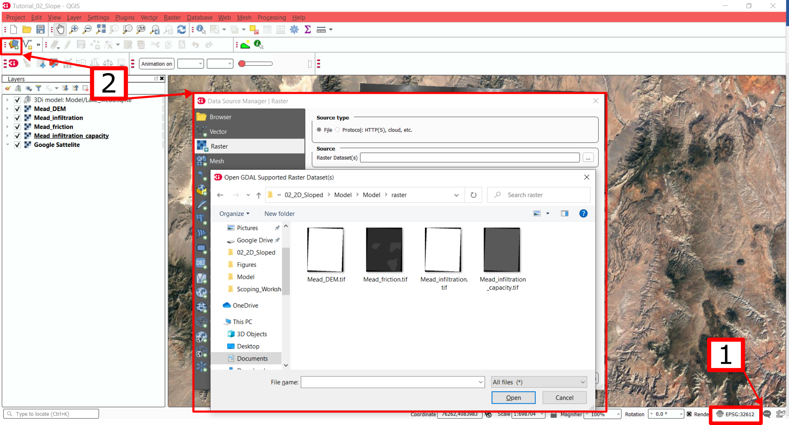
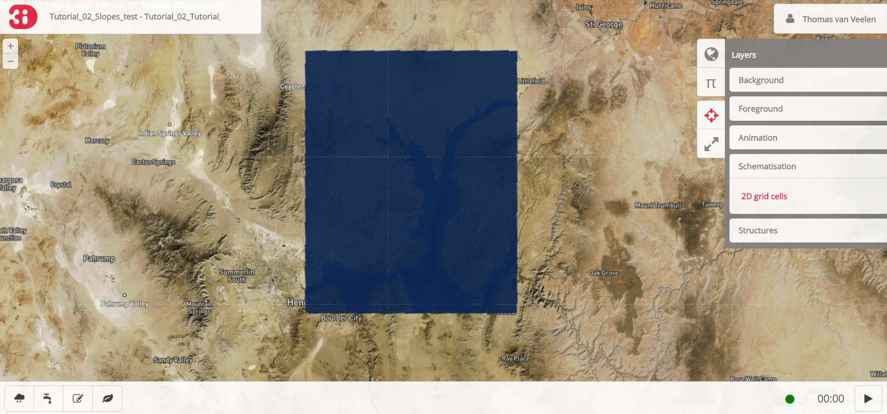

Tutorial 2: 2D flow model
==========================

Welcome to the tutorial for 2D flow over a sloped terrain.
In this tutorial, we will build a basic 2D flow model in mountainous terrain using 3Di.
We will start from an .sqlite similar to that of Tutorial 1 and build our model step by step.
At the end of this tutorial, you will have a basic working model that you can run on the 3Di live site. 

The selected area is that of Lake Mead in the USA.
The lake is enclosed between the mountains of Nevada, Utah, and Arizona.
The area contains strong elevation differences and steep slopes, which changes the hydrodynamics.
Specifically, the standard assumption that the variation in water level is much smaller than the variation in bed level does not hold in this terrain.
Therefore, different settings are required, which will be explored in this tutorial. 

Furthermore, this tutorial will introduce friction and infiltration rasters.
These rasters have been highly simplified for the purpose of this tutorial.
As with any other component of the tutorials, the data and outcomes cannot be used to draw conclusions of the real-world location that was the inspiration for this tutorial. 

You will learn the following skills in this tutorial:

* Edit an existing .sqlite model database.
* Insight in the relevant settings for sloping terrain.
* Couple a friction raster to your 3Di-model. 
* Couple an infiltration raster to your 3Di-model.

Before you start, please make sure to:

* Install the 3Di modeller interface `here <https://docs.3di.live/modeller-interface-downloads/3DiModellerInterface-OSGeo4W-3.10.9-1-Setup-x86_64.exe>`_. 
* Gain access to the 3Di web portal. Please see the :ref:`guide_to_portal` for instructions.
* Download the starter pack for this tutorial, which includes a partially completed .sqlite-database and rasters (DEM, friction, infiltration, infiltration capacity) for Lake Mead `here <https://nens.lizard.net/media/3di-tutorials/3di-tutorial-02.zip>`_.

Model initialisation
---------------------

Model preparation
+++++++++++++++++++++

Unpack the starter package and save the contents into a folder.
You should have a partially configured .sqlite, and a folder named “raster”.
The raster folder contains a DEM, a friction map, an infiltration map, and an infiltration capacity map.
The partially configured .sqlite matches the settings of Tutorial 1: flat 2D (<link>), with an updated aggregation time step.

Loading the model in the 3Di modeller interface
++++++++++++++++++++++++++++++++++++++++++++++++

Our model must be imported in the 3Di modeller interface to view and modify its contents.
The model can be loaded via the 3Di toolbar (part of the 3Di toolbox plug in) by following these steps: 

1.	Open the 3Di modeller interface.
2.	Create a new project.
3.	[1] In the figure below; Select the “select 3Di results” button on the 3Di Toolbar (white database icon).
4.	[2] Select “load” in the model section, and select the Lake_Mead.sqlite database provided with this tutorial. The “load” button may not be visible on all screens and zoom settings. It can help to enlarge the pop-up window. 
5.	[3] You should now see the 3Di model as part of your QGIS layers.

Now load the rasters into QGIS to view your data.

6.	[1] Set the project coordinate system to EPSG:32612 (UTM zone 12N) in the bottom right of your window. If you are asked to choose a conversion, select a conversion that is valid for Utah, USA.
7.	[2] Add the add the DEM via “Layer”  “Add layer”  “Add raster layer”. Now select Mead_DEM.tif from the “raster” folder. 
8.	Repeat step g to add the friction raster named Mead_friction.tif, the infiltration raster named Mead_infiltration.tif, and the infiltration capacity raster Mead_infiltration_capacity.tif.

    Empty LP_burrows.sqlite and DEM loaded into the 3Di modeller interface and projected on a google satellite background map.

Model building
--------------

Set the model name
++++++++++++++++++

As a first step, let us set the name for the model.
This is contained in the global settings table.
Rename the model via the following steps

a.	[1] Right-click the v2_global_settings table.
b.	[2] Select “Open attribute table”.

c.	[1] Select “Switch to form view” in the bottom right corner.
d.	[2] Select “Toggle editing mode” in the top left corner.
e.	[3] Set the name to “Tutorial_2D_slope”.

Keep the global settings open on editing mode for the next step. 

Add rasters to the model
++++++++++++++++++++++++

This tutorial includes three rasters: the digital elevation model (DEM), the friction raster, and the infiltration rasters.
The DEM is mandatory for every model.
The friction and infiltration rasters are among the most commonly used data sets for 3Di models.
The friction raster controls the bottom resistance of the bottom to the flow.
The infiltration raster controls the infiltration rate of surface water into the soil.
Finally, the infiltration capacity raster sets the capacity of the soil to store water.

The DEM and the friction raster must be added through the global settings, contained in the v2_global_settings table.
Continue to modify this table.

a.	[1] Select the tab “Terrain information”. 
b.	[2] Add the DEM file by adding “raster/Mead_DEM.tif” to the field “dem_file”. The part “raster/” is a relative path with respect to the .sqlite. It denotes that the DEM is stored in the raster folder. 
c.	[3] Set the epsg_code to “32612”.
d.	[4] Add the friction file by adding “raster/Mead_friction.tif” to the field “frict_coef_file”. 
e.	[5] Set the frict_coef to 0. This global value will not be used in the model, as we have defined a spatially varying friction raster for the full domain.
f.	[6] The coefficients in the friction raster are Manning coefficients. Check that this matches the field “frict_type”.
g.	Unselect “Toggle editing mode” in the top left corner (see [2] in the image above), and save changes. You can now close the pop-up window.

The infiltration and infiltration capacity rasters control the spatially varying infiltration rate in mm/h and the maximum infiltration capacity in mm respectively for each grid cell.
They are added to the model via the infiltration settings, which are contained in the v2_simple_infiltration table.

a.	[1] Right-click the v2_simple_infiltration table.
b.	Select “Open attribute table”.
c.	[2] Select “Switch to form view” in the bottom right corner.
d.	[3] Select “Toggle editing mode” in the top left corner.
e.	[4] Add the infiltration raster by adding “raster/Mead_infiltration.tif” to the field “infiltration_rate_file”. 
f.	[5] Add the infiltration capacity raster by adding “raster/Mead_infiltration_capacity.tif” to the field “max_infiltration_capacity_file”.
g.	[6] Set the infiltration rate to 0. This global infiltration rate is overwritten by the spatially varying infiltration raster.
h.	Unselect “Toggle editing mode” in the top left corner, and save changes. You can now close the pop-up window.

You now have a model spatially varying elevation, friction, and infiltration, but the model settings are representative for flat areas. 

Modify the settings for mountain environments
+++++++++++++++++++++++++++++++++++++++++++++

3Di must be configured differently for areas with steep slopes than for flat areas,
due to the strong variations in water level that may occur within a grid cell (see <Link to 2.2.2 of the model concepts> for a technical description>).
We will modify the settings file, which was created for a flat area, such that it can be applied to sloping areas instead.
Here we will only discuss the settings that must be changed.
A full overview of all settings can be found at https://docs.google.com/spreadsheets/d/1qHTS0TdwnYaCYRaohDAVvkaGW2sJ1pt8IX31HZ7OcBY.

First, we will set the numerical settings. Modify the numerical settings via the v2_numerical_settings table.

a.	Right-click the v2_numerical_settings table.
b.	Select “Open attribute table”.
c.	[1] Select “Switch to form view” in the bottom right corner.
d.	[2] Select “Toggle editing mode” in the top left corner.
e.	[3] Select the tab “Limiters”.
f.	[4] Set the limiter values as in the table below.

.. csv-table:: Limiters
    :header: "Setting", "Value", "Comments"

    "limiter_grad_1d", "1"
    "limiter_grad_2d", "0"
    "limiter_slope_crossectional_area_2d", "3", "For sloped areas"
    "limiter_slope_friction_2d", "1", "For sloped areas"

g.	Select the tab “Thresholds”
h.	Set the thin_water_layer_definition to 0.3. This value is in meters.
i.	Select the tab “Miscellaneous”
j.	Set the frict_shallow_water_correction to 3.  

Second, we will change how infiltration is computed in the model.
In flat areas, infiltration is typically computed in the wet subgrid cells only.
This method does not work in mountainous terrain, where the elevation differences within a cell are large.
Therefore, the infiltration will be computed over the whole surface.
This is implemented through the “infiltration_surface_option”.
Documentation on the infiltration settings can be found at :ref:`infiltration`.

a.	Right-click the v2_simple_infiltration table.
b.	Select “Open attribute table”.
c.	[1] Select “Switch to form view” in the bottom right corner.
d.	[2] Select “Toggle editing mode” in the top left corner.
e.	[3] Set the infiltration_surface_option to 1.

Complete the location-specific settings
++++++++++++++++++++++++++++++++++++++++

Lake Made is a large lake with an area of 640 km2 at maximum capacity.
This leads to an extensive model domain of approximately 90 by 110 km.
The grid and the output settings are adjusted to account for the large model domain.
The initial water level will also be modified to match the elevation of the lake.

First, we will set the grid cell size and the table step size to improve the calculation speed of the model.
The grid cell size will be set to 400 m in accordance with the large domain.
The table step size controls at which vertical resolution properties (other than elevation) are translated from the subgrid domain to the computational domain.
A table step size of 10 m is selected for this model. This is very coarse for a typical 3Di model, but it is justified here due to the large elevation differences at the subgrid level.
Both properties are part of the global settings.

a.	Right-click the v2_global_settings table.
b.	Select “Open attribute table”.
c.	[1] Select “Switch to form view” in the bottom right corner.
d.	[2] Select “Toggle editing mode” in the top left corner.
e.	[3] Select the tab “Grid”.
f.	[4] Set the grid_space to 400. This value is in meters.
g.	[5] Set the table_step_size to 10.  This value is in meters.
h.	Keep the global settings table open.

According to our elevation map, Lake Mead is located at around 340m above sea level.
The deepest point of Lake Mead has a depth of 160 m at full capacity.
Therefore, we set the initial water level at 500m.

a.	Select the tab “Terrain Information”.
b.	Set the initial_waterlevel to 500. This value is in meters.
c.	Keep the global settings table open

The discharge of precipitation into Lake Mead takes a long time due to the large model domain.
The number of time steps and the time between model outputs is increased to reflect the slow time scale.
More time steps and a larger output time step are selected to account for the slower drainage. 

a.	 Select the tab “Time”.
b.	Set the nr_timesteps to 1440. This amounts to a model duration of 12 h, as the time step is 30 s.
c.	Set the output_time_step to 900.  This value is in seconds.

The aggregation time step is also set to 900 s. This has already been set correctly in your .sqlite. 

With the completion of the location-specific settings, we have built a basic working 2D flow model for mountainous terrain. 

Model validation
-----------------

A short description of the model validation is given here.
A comprehensive guidance with visual support is provided in Tutorial 1. 

Verify the model rasters using the raster checker
++++++++++++++++++++++++++++++++++++++++++++++++++

Before sending our model to the web portal, it is important to validate that our model contains no errors.
The raster checker is part of the 3Di toolbox and performs 18 checks to verify the quality of the DEM.
The raster checker checks all the rasters that are included in the model.
These are the DEM, the friction raster, the infiltration raster and the infiltration capacity raster.
In order to use the raster checker, follow these steps:

a.	[1] Select the ‘’commands for working with 3Di models’’ button. On the right of your screen, a tab ‘3Di’ will open.
b.	[2] Expand the ‘Step 1 – Check data’ line and click on the raster checker.
c.	[3] In the pop-up screen, select ‘spatialite: Lake_Mead’ and click ‘OK’. 

The following screen will appear:

Verify the model schematisation using the schematisation checker
++++++++++++++++++++++++++++++++++++++++++++++++++++++++++++++++++

The second validation that we have to perform before sending the model to the web portal is that of the model schematisation.
For this, we use the schematisation checker.
It checks the model tables for many possible errors that cause the model to crash when you want to compile the model.
In order to check your model schematisation, follow steps a and b from the previous step, but now select ‘schematisation checker’.
Again, select ‘spatialite:Lake_Mead’ and select the destination for the output file.
Select ‘Run’.

The output file is an excel file in which all the warnings and errors that were found are listed.
You may get the error “Value in v2_aggregation_settings.aggregation_in_space should be of the type integer”.
This is a known error in the schematisation checker, which will be removed in a future update.
If you get this error, you can ignore it.

If you do not get any further warnings or errors, your model is successfully validated and is ready to upload to the web portal.

Model activation
----------------

Upload your model to the repository
+++++++++++++++++++++++++++++++++++

The first step towards running your model in the web portal is to upload your model to the 3Di model databank. Follow these steps:

a.	Create a new .zip file with the Lake_Mead.sqlite database and the raster folder. Be mindful that the folder structure in the .zip file matches that of your schematisation. Based on the settings in this tutorial, you zip file should contain your .sqlite database and the folder “raster”. The DEM, friction and infiltration rasters should be in this folder “raster”. 
b.	Go to https://models.lizard.net/model_databank/
c.	Select “Upload new model”. Make sure that you are logged in for this step.
d.	Fill in the details of your models and include the .zip file. Be sure to select 3Di-v2 as your model type
e.	Press “Submit”

Compile your model
+++++++++++++++++++

Now your model is stored in the model databank and it is ready for compilation. 

a.	Go to https://3di.lizard.net/models/
b.	Use the search function to retrieve your model. Search for the name that you gave your model is step 10d. You may have to select “also show repositories that do not have inp files yet”. It may take some time for the model to show here, after you have uploaded it to the model databank.
c.	Select “initialize inp generation” for your model.

Your model will now be compiled.
The blue bar “no models” will turn into a green bar with the text “success” when the model is successfully compiled.
You can now select the model to view the details of your model.
The model is now also available on the 3Di live site.

Run your model
++++++++++++++

You have now build a 2D flow model for mountainous terrain from scratch!
You can now run your model via the 3Di live site (https://3di.lizard.net/) or via the API https://api.3di.live/v3.0/swagger/.

    
    The final model on the 3Di live site. The initial water level can be seen in dark blue through the grid. 