Tutorial 1: 2D flat model
=========================

Welcome to 3Di and your first tutorial.
In this tutorial, we will build a basic 2D flooding model in 3Di.
We will start from scratch and build our model step by step.
We will finish with a working model that you can play around with on the 3Di live site.
This model is based on the Laugharne and Pendine Burrows in the United Kingdom.
The burrows enclose a flat area of reclaimed salt marshes that are currently used as farmland.
While this tutorial represents a real-world area, it is important to keep in mind that some processes will be simplified for the purpose of this tutorial. 

You will learn the following skills in this tutorial:

* Prepare an empty 3Di model.
* Couple a digital elevation model (DEM) to your 3Di-model. 
* Configure the settings of a 2D model.
* Validate your model input using the raster checker.
* Validate your model schematization using the schematization checker.
* Compile your model on the 3Di live site. 

Before you start, please make sure to:

* Install QGIS (`<https://www.qgis.org/>`_). 
* Install the 3Di toolbox in QGIS. Please see :ref:`plugin_installation` for instructions.
* Gain access to the 3Di web portal. Please see :ref:`guide_to_portal` for instructions.
* Download the Taf dataset for this tutorial `here <https://nens.lizard.net/media/3di-tutorials/3di-tutorial-01.zip>`_. 
    
    :sub:`The digital elevation model contains United Kingdom public sector information licensed under the Open Government Licence v2.0.`

Model initialisation
--------------------

Model preparation
+++++++++++++++++++++

Before we can start building our model, we need prepare our model and organize our data.
The Taf dataset that you have downloaded (see before you start) contains an empty .sqlite database and a digital elevation model (DEM) of the Laugharne and Pendine Burrows called dem_2m_LPB.tif.
The structured .sqlite database contains all elements that can be included in a 3Di model.
It will slowly be filled in when you build a model. Rename empty.sqlite to LP_Burrows.sqlite.

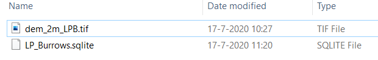

Loading the model in QGIS
+++++++++++++++++++++++++++++++++++

Our model must be imported in QGIS to view and modify its contents.
The model can be loaded via the 3Di toolbar (part of the 3Di toolbox plug in) by following these steps: 

A.	Open QGIS.
B.	Create a new project.
C.	Click the “select 3Di results” button on the 3Di Toolbar (white database icon).
D.	Select “load” in the model section, and select the LP_Burrows.sqlite database provided with this tutorial.
E.	You should now see the 3Di model as part of your QGIS layers.

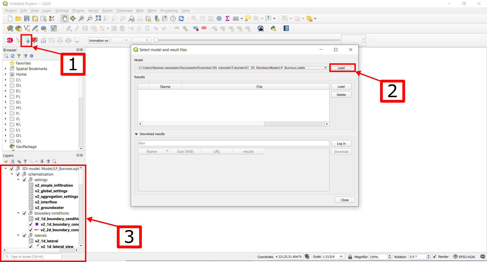

You can also import the DEM as a raster layer.
This can improve your feel with the data, but it is not strictly required.
It is advised that you set your project reference EPSG:27700 (British National Grid) for this tutorial.

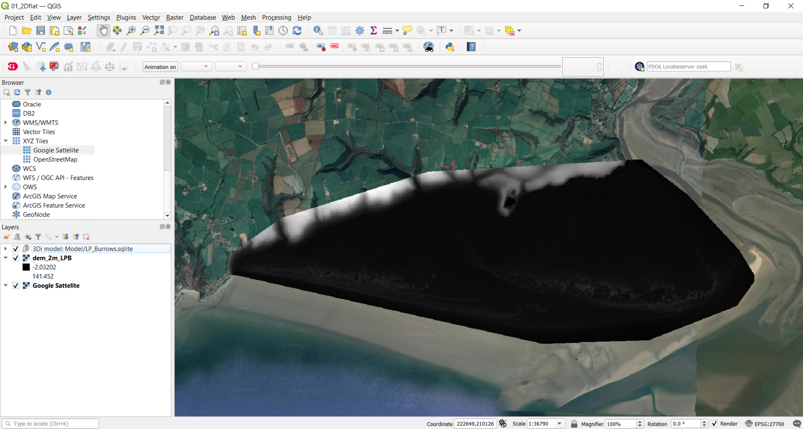

    Empty LP_burrows.sqlite and DEM loaded into QGIS and projected on a google satellite background map.

Model building
--------------

Complete the global settings
++++++++++++++++++++++++++++++++++++++

The global settings are contained in the v2_global_settings table. Open the settings by

A.	Right-click the v2_global_settings table.
B.	Select “Open attribute table”.

.. figure:: image/03_global_settings.png
    :alt: Global settings

C. Select “Switch to form view” in the bottom right corner.
D. Select “Toggle editing mode” and in the top right corner.
E. Select “Add feature”.

.. figure:: image/04_toggle_editing.png
    :alt: Toggle editing

Now we can start to configure all settings.
3Di requires you to complete all mandatory settings before changes can be saved.
Attempts to save the settings before all mandatory field have been completed will result in an error message.
A list of mandatory settings and detailed descriptions can be found `here <https://docs.google.com/spreadsheets/d/1OGusrQRQkzF8lA9MSxm2oGHmGIcN8rnng0VbafidSTg/>`_.
Finally, please not that these settings have been selected specifically for this tutorial.

Let us now fill in the settings of each tab. 

.. csv-table:: General
    :header: "Setting", "Value for this tutorial", "Comments"

    "id", "1"
    "name", "Tutorial_2D_flow"
    "use_0d_inflow", "0: do not use 0d inflow", "Use only when point sources are present"
    "use_1d_flow", "No", "This tutorial does not define channels"
    "use_2d_rain", "Yes", "Enables rainfall"
    "use_2d_flow", "Yes", "Enables 2D flow"

.. csv-table:: Grid
    :header: "Setting", "Value for this tutorial", "Comments"

    "grid_space", "64", "Minimum grid cell size in metres"
    "kmax", "1", "See <link to grid refinement documentation>"
    "table_step_size", "0.10", "See <link to grid refinement documentation>"

.. csv-table:: Terrain information
    :header: "Setting", "Value for this tutorial", "Comments"

    "dem_file", "dem_2m_LPB.tif"
    "epsg_code", "27700", "British national grid"
    "frict_coef_file", "NULL", "Only used for spatially varying friction"
    "frict_coef", "0.06", "Farmland"
    "frict_type", "2: Manning"
    "frict_avg", "No"
    "initial_groundwater_level_file", "NULL", "No groundwater"
    "initial_groundwater_level", "NULL"
    "initial_groundwater_level_type", "(NULL)"
    "initial_waterlevel_file", "NULL", "Only for spatially varying initial water level"
    "initial_waterlevel", "-10", "in metres; selected for a dry start"
    "water_level_ini_type", "max"
    "interception_file", "NULL", "No interception"
    "interception_global", "NULL"
    "wind_shielding_file", "NULL", "No wind"

.. csv-table:: Time
    :header: "Setting", "Value for this tutorial", "Comments"

    "start_date", "2020-01-01"
    "start_time", "2020-01-01 00:00:00"
    "sim_time_step", "30", "in seconds"
    "timestep_plus", "No", "Only when extra control over the timestep is required"
    "minimum_sim_time_step", "NULL"
    "maximum_sim_time_step", "NULL"
    "nr_timesteps", "240", "for a 2 hour simulation"
    "output_time_step", "120", "in seconds"

.. csv-table:: Setting id's
    :header: "Setting", "Value for this tutorial", "Comments"

    "interflow_settings_id", "NULL", "No interflow"
    "groundwater_settings_id", "NULL", "No groundwater"
    "numerical_settings_id", "1", "Reference to the model specific numerical settings"
    "simple_infiltration_settings_id", "1", "Reference to the model specific infiltration settings"
    "control_group_id", "NULL", "No control groups"

.. csv-table:: Extra options 1D (not relevant as this tutorial does not contain 1D elements)
    :header: "Setting", "Value for this tutorial", "Comments"

    "advection_1d", "0: Do not use advection 1d", "No 1D elements"
    "dist_calc_points", "10000", "No 1D elements"
    "manhole_storage_area", "NULL", "No 1D elements"
    "max_angle_1d_advection", "NULL", "No 1D elements"
    "table_step_size_1d", "NULL", "No 1D elements"

.. csv-table:: Extra options 2D
    :header: "Setting", "Value for this tutorial", "Comments"

    "advection_2d", "1: Use advection 2d"
    "dem_obstacle_detection", "No"
    "guess_dams", "No"
    "dem_obstacle_height", "NULL", "Obstacles not activated"
    "embedded_cutoff_threshold", "NULL"
    "flooding_threshold", "1e-06"
    "table_step_size_volume_2d", "NULL"

Don’t forget to save your changes after completing all settings.

Complete the infiltration settings
++++++++++++++++++++++++++++++++++++++++++++

The settings for the infiltration mechanism are contained in the v2_simple_infiltration table. 

.. image:: image/05_infiltration.png
    :alt: infiltration

Editing the table work in a similar manner as with the v2_global_settings table. Complete the following settings:

.. csv-table:: General
    :header: "Setting", "Value for this tutorial", "Comments"

    "id", "1", "Must match the simple_infiltration_settings_id in the v2_global_settings_table"
    "display_name", "infiltration"
    "infiltration_rate", "360", "in mm/hour; uniform silty sand is assumed in this tutorial"
    "infiltration_rate_file", "NULL", "Only used for spatially varying infiltration rates"
    "max_infiltration_capacity_file", "NULL", "infinite infiltration capacity is assumed in this tutorial"
    "infiltration_surface_option", "0", "See <link to infiltration documentation>"

Complete the numerical settings
+++++++++++++++++++++++++++++++++++++++++

The numerical settings are contained in the v2_numerical_settings table.

.. image:: image/06_numerical.png
    :alt: Numerical settings

As with the previous settings, open the attribute table, toggle the editing mode and add a feature.
Complete the following settings:

.. csv-table:: General
    :header: "Setting", "Value for this tutorial", "Comments"

    "id", "1", "Must match the numerical_settings_id in the v2_global_settings_table"

.. csv-table:: Limiters (not used in this tutorial, only for sloping areas)
    :header: "Setting", "Value for this tutorial", "Comments"

    "limiter_grad_1d", "1"
    "limiter_grad_2d", "0"
    "limiter_slope_crossectional_area_2d", "0"
    "limiter_slope_friction_2d", "0"

.. csv-table:: Matrix
    :header: "Setting", "Value for this tutorial", "Comments"

    "convergence_cg", "1e-09"
    "convergence_eps", "1e-05"
    "use_of_cg", "20"
    "use_of_nested_newton", "0: when the schematisation does not include 1D-elements …"
    "max_degree", "5: for surface flow only"
    "max_nonlin_iterations", "20"
    "precon_cg", "1"
    "integration_method", "0"

.. csv-table:: Thresholds
    :header: "Setting", "Value for this tutorial", "Comments"

    "flow_direction_threshold", "1e-06"
    "general_numerical_threshold", "1e-08"
    "thin_water_layer_definition", "0.05"
    "minimum_friction_velocity", "0.05"
    "minimum_surface_area", "1e-08"

.. csv-table:: Miscellaneous
    :header: "Setting", "Value for this tutorial", "Comments"

    "cfl_strictness_factor_1d", "1"
    "cfl_strictness_factor_2d", "1"
    "frict_shallow_water_correction", "0"
    "pump_implicit_ratio", "1"
    "preissmann_slot", "0"

Complete the aggregation settings
+++++++++++++++++++++++++++++++++++++

The aggregation settings control the aggregation of model results.
They are contained in the v2_aggregation_settings table.
Open the attribute table and toggle editing mode.
However, select “switch to table view” this time.
The different rows of the table refer to different model output categories.
For each category, set the global_settings_id at 1.
Retain the default values for all other settings.

.. image:: image/07_v2_aggregation.png
    :alt: Aggregation Settings

With the completion of the aggregation settings, we have built a basic working 2D flow model. 

Model validation
----------------

Verify the model rasters using the raster checker
+++++++++++++++++++++++++++++++++++++++++++++++++++++

Before sending our new model to the web portal, it is important to validate that our model contains no errors.
The :ref:`rasterchecker` is part of the 3Di toolbox and performs 18 checks to verify the quality of the DEM.
The raster checker can also be applied to other 3Di-related rasters when relevant.

.. image:: image/08_rasterchecker.png
    :alt: RasterChecker

A log of the performed test is written to the log file in the location as denoted in the result prompt.
This location is typically the location of your DEM-file.
The log file can be opened to view additional details of the checks performed.

Verify the model schematisation using the schematisation checker
++++++++++++++++++++++++++++++++++++++++++++++++++++++++++++++++++++

The second validation is that of the model schematisation.
This is checked with the :ref:`schematisationchecker` in the 3Di toolbox.
It checks the model tables for many possible errors that could lead to crashes when the model is compiled.

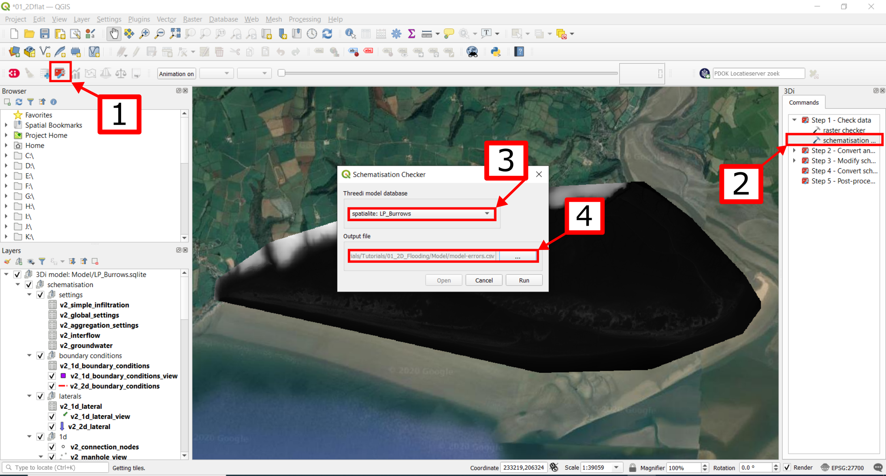

Now open the log file at your specified location.
You may find the error “Value in v2_aggregation_settings.aggregation_in_space should to be of type integer”.
This is a known bug in the schematisation checker, which will be removed in a future update.
You should not find any other warnings.

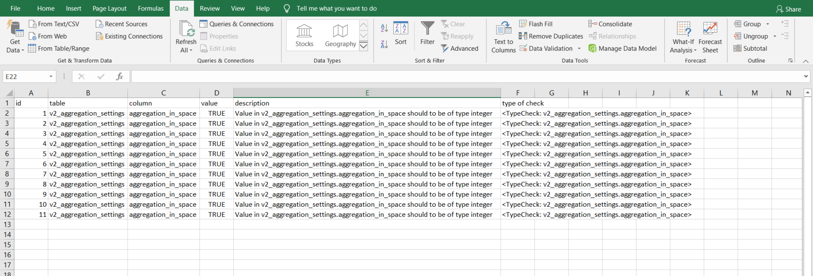

Log of the schematisation checker

If you do not get any further warnings or errors, your model is successfully validated and is ready for activation.

Model activation
----------------

Upload your model to the repository
++++++++++++++++++++++++++++++++++++++

The first stage towards running your model in the web portal is to upload you model to the 3Di model databank.
Take the following actions:

Create a new .zip file with your new LP_Burrows.sqlite database and your DEM dem_2m_LPB.tif. Here we name it Tutorial_01_2D_flow.zip Be mindful that the folder structure in the .zip file matches that of your schematisation. Based on the settings in this tutorial, your .sqlite database and your DEM should be in the same folder. Exclude the log files from your .zip folder.

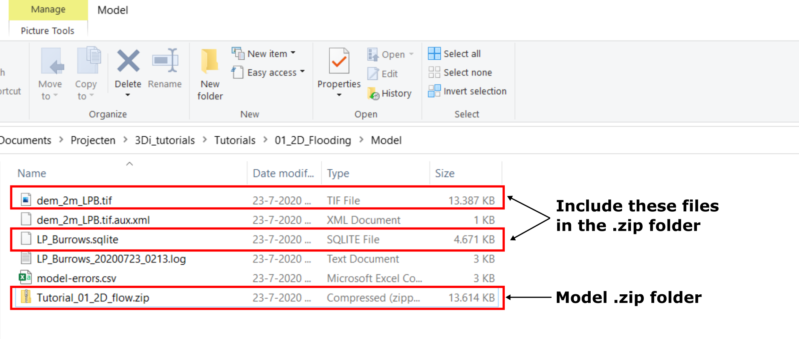

	
Go to `<https://models.lizard.net/model_databank/>`_.
Select “Upload new model”. Make sure that you are logged in for this step.

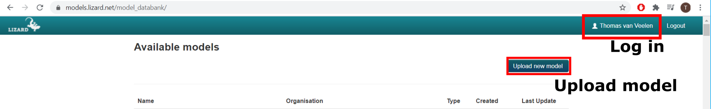

	
Fill in the details of your models. Be sure to select 3Di-v2 as your model type. Select “Submit” when you have completed the form.

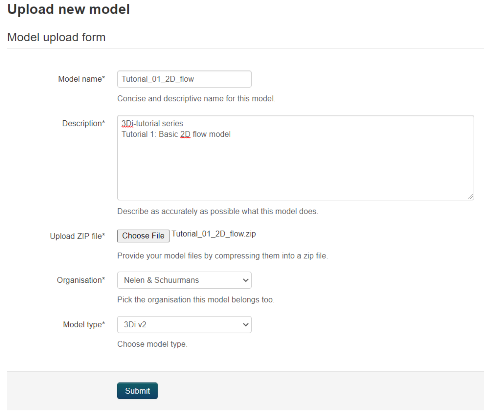

Compile your model
++++++++++++++++++++++

Now your model is stored in the model databank, it is ready for compilation. 

A. Go to https://3di.lizard.net/models/.
B. Use to search function to retrieve your model. Search for the name that you gave your model in step 9d. You may have to select “also show repositories that do not have inp files yet”.
C. Select “initialize inp generation” for your model.

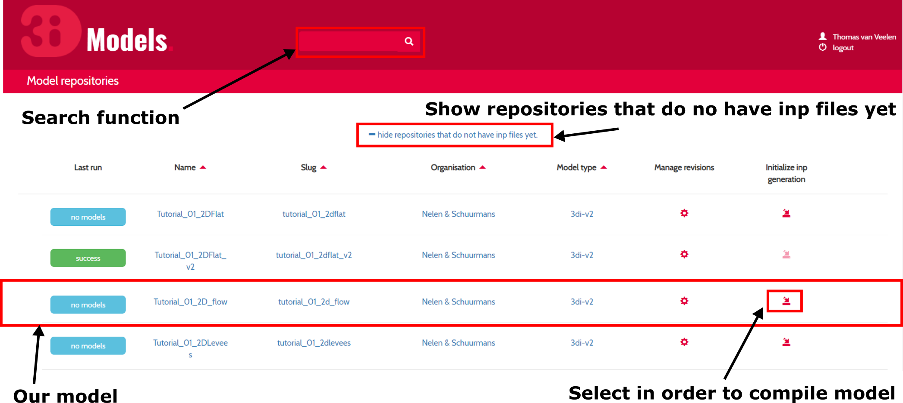

Your model will now be compiled.
The blue bar “no models” will turn to a green bar with the text “success” when the model is successfully compiled.
You may have to wait a few minutes and refresh the page.
Once completed, you can select the model to view its details.
The model is now also available on the 3Di live site.

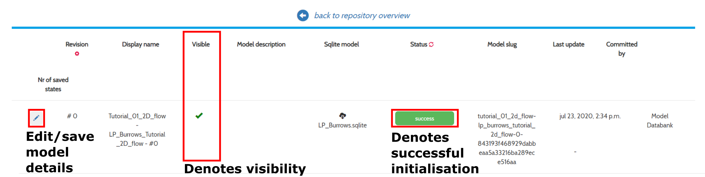

    Your screen after a successful compilation

Run your model
++++++++++++++++++

You can now run your model via the 3Di live site (:ref:`running_model`) or via the API (:ref:`apicalculations`).
It will be available under the name “LP_Burrows_Tutorial_2D_flow”.

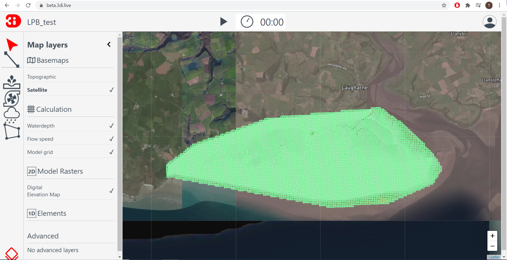

Congratulations on building a 2D flooding model from scratch.