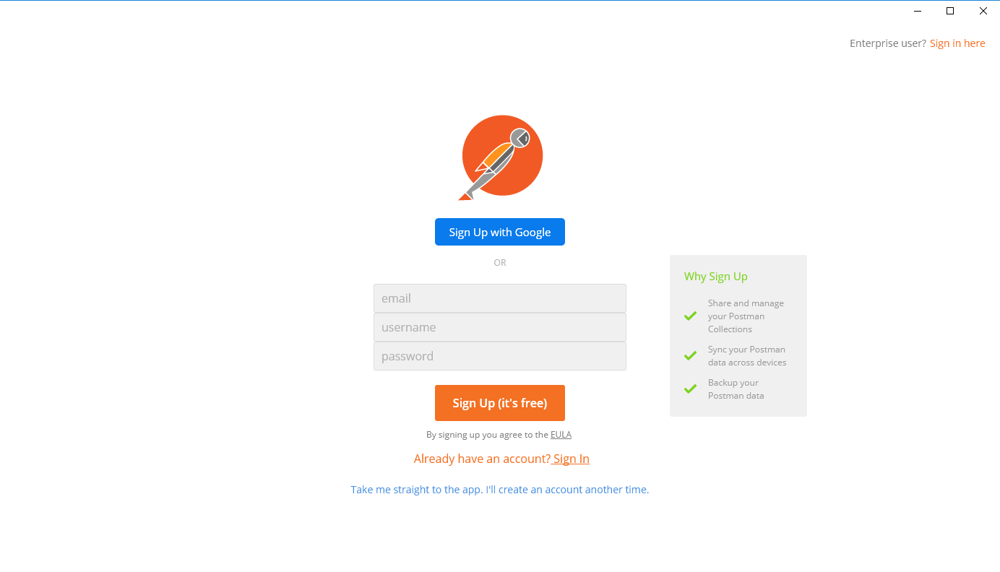
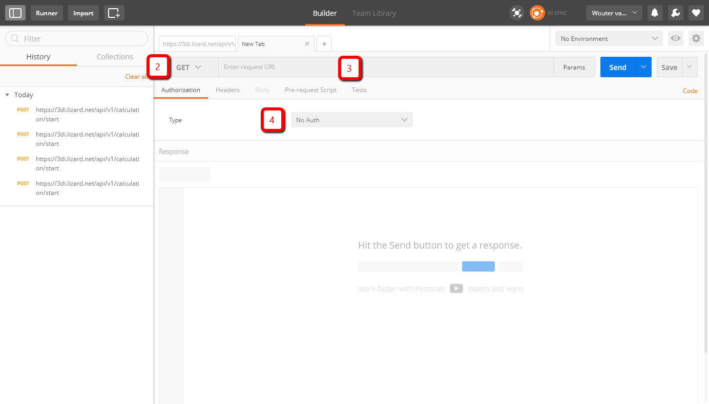
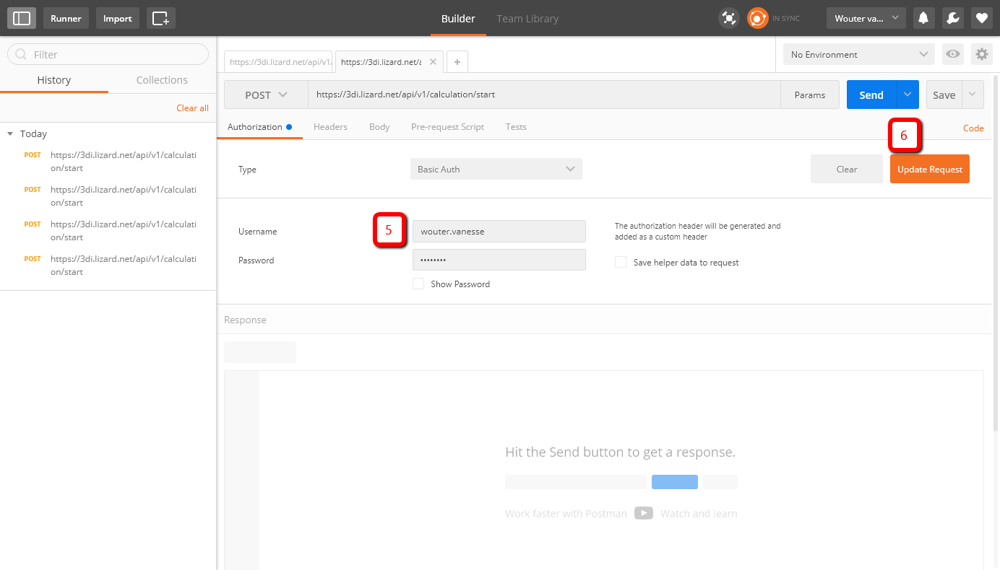
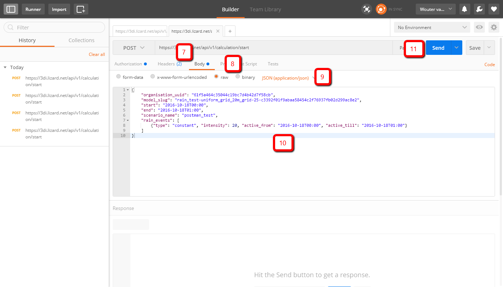

API
===

With the API you can request simulations without having to acces the 3Di web portal and follow your simulation. It is ideal for making various calibration runs. Also, it allows you to use several types of external forcing not available through the web portal and save and use states or restart files.

Visit https://3di.lizard.net/api/v1/calculation/start for all options.

Using POSTMAN
-------------

The first step is to install POSTMAN as an extension on Google Chrome.

Then take the following steps:

1. Log-in using a POSTMAN account. This account is not linked to 3Di.

   Postman Login

2. Select POST (instead of GET) left of URL

3. Enter this URL: https://3di.lizard.net/api/v1/calculation/start

4. Select basic authorisation

   Postman URL

5. Enter your 3Di username and password

6. Select update request

   Postman Update Request

7. Click on Body 

8. Select 'raw' 

9. Select JSON from the drop-down

10. Enter the raw json body, that's the part between {} and consists of multiple lines.

11. Click Send

   Postman Send

   
Note that postman stores your password which poses a possible security risk.