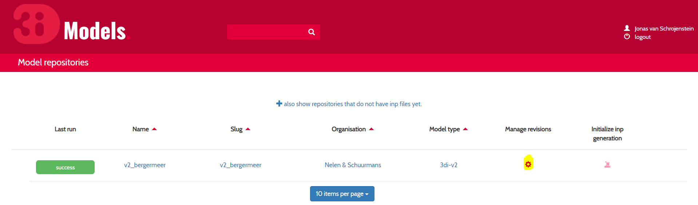
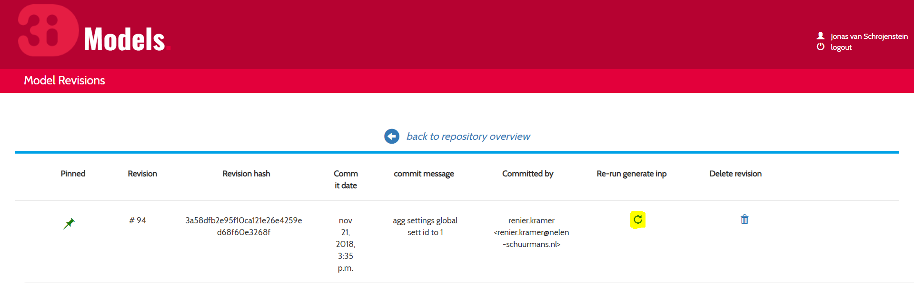

.. _apicalculations:

API - V1
========================

With the API you can request simulations without having to access the 3Di web portal and follow your simulation. It is ideal for making various calibration runs. Also, it allows you to use several types of external forcing not available through the web portal and save and use states or restart files.

Visit https://3di.lizard.net/api/v1/calculation/start/ for all options.

Using POSTMAN
-------------

The first step is to install POSTMAN as an extension on Google Chrome.

Then take the following steps:

1. Log-in using a POSTMAN account. This account is not linked to 3Di.

.. figure:: image/d_postman_login.png
   :alt: Postman Login

   Postman Login

2. Select POST (instead of GET) left of URL

3. Enter this URL: https://3di.lizard.net/api/v1/calculation/start/

4. Select basic authorisation

.. figure:: image/d_postman2_url.png
   :alt: Postman URL

   Postman URL

5. Enter your 3Di username and password

6. Select update request

.. figure:: image/d_postman3_updaterequest.png
   :alt: Postman Update Request

   Postman Update Request

7. Click on Body 

8. Select 'raw' 

9. Select JSON from the drop-down

10. Enter the raw json body, that's the part between {} and consists of multiple lines.

11. Click Send

.. figure:: image/d_postman4_send.png
   :alt: Postman Send

   Postman Send

   
Note that postman stores your password which poses a possible security risk.

*Times*

All dates and times used in the API are based on the so-called ISO8601 standards. You can use your local times and add the off set to UTC Time. More about these standards can be found on `Wikipedia <https://en.wikipedia.org/wiki/ISO_8601>`_. In the example below:

    2016-06-22T18:00+02:00

This rainfall event will start at 18:00 hour local time.

API v3
========================

API v3 is available here: https://api.3di.live/v3.0/swagger/

Here you can find a more `detailed technical overview <https://nens.github.io/threedi-openapi-client/usage/>`_.  of our API.

To use the API v3 with your own model you need to re-run inpy for your model. After that it will appear in both API v1 and v3. Here a small reminder how to re-run inpy on your models. Go 3di.lizard.net/models and search for your model. Then click on the gear icon:

	
In the next page click on the reload icon:

		
	
It will depend on your model size and settings how long this will take.

**Please note** that
We have made a change on inpy July 5h 2019. After that change it is not allowed anymore to have levees outside the DEM. 
So if you re-run a model that was last run before that date first check your levees!
