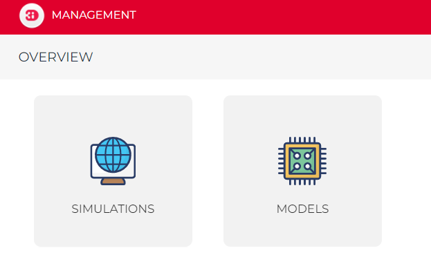

.. _management_screens_manual:

3Di Management overview
========================

To use 3Di Management, open your browser and go to https://management.3di.live and log in with your username and password. If you do not have a 3Di account yet, or do not know your username and password, please contact the :ref:`servicedesk`.

After logging in to 3Di Management, there are several possibilities:

* :ref:`3di_management_schematisations`
* :ref:`3di_management_models`
* :ref:`3di_management_api_key`
* :ref:`3di_management_users`
* :ref:`3di_management_simulations`
* :ref:`3di_management_live_status`

   The homepage of 3Di Management.

In the top right, you can change organisations if you have access to multiple organisations. 
You can log out by clicking *<your user name>* > *Logout* in the top right.

.. _3di_management_schematisations:

Schematisations list
====================
If you click the *Schematisations* tile in the overview, you will see a list of all :ref:`schematisations <schematisation>` within your organization. This list of schematisations can be exported to an Excel file.

You can find a specific schematisation by searching its Name, Tag, or Creator using the search bar. Once you locate the desired schematisation, you can click on its name to open the detailed view. 

Schematisation detail page
==========================

The schematisation detail page consists of the following sections:

- Schematisation
- Revision
- 3Di Model of this revision
- Predefined simulation data (if applicable)

Schematisation
--------------

Describes the schematisation. In this section you can change the properties of the schematisation, such as the name, description, and tags. You can also transfer the schematisation to another organisation or delete the schematisation.

Revision
--------

This section gives information on the selected revision. To view the properties of another revision of this schematisation, click *Choose other* revision.
In this section you can download the SQLite file and rasters for this revision.

3Di Model of this revision
--------------------------

If a 3Di Model has been generated for this revision, this section shows the properties of the 3Di Model, such as model name, model size (nodes and line count), extent and location, 

.. _regenerate_3di_model:

(Re-)generate 3Di Model
^^^^^^^^^^^^^^^^^^^^^^^

Under the heading *Re-generate*, you can see if the 3Di Model is still up to date, i.e. if it has been generated with the most recent 3Di framework version. If it says here that "The model is **not** up to date", you may want to re-generate the 3Di Model. In most cases, this will not be necessary, but if there are any problems with this 3Di Model, please re-generate the 3Di model to see if this solves the issues.

To re-generate the 3Di model, click *Re-generate this 3Di model*.

Simulation templates
^^^^^^^^^^^^^^^^^^^^

This table gives an overview of the simulation templates that are available for this 3Di model.

Predefined simulation data (if applicable)
------------------------------------------

This section shows initial (ground)water level rasters and saved states that are available for the selected 3Di model.

.. _3di_management_models:

Models
======
When you click the *Models* tile in the overview, you will be presented with a list of all :ref:`models <threedimodel>` associated with your organization.

These models can be visualized on the map within the map view. Furthermore, the list of models can be exported to an Excel file, which can prove useful if you intend to manage your 3Di models more efficiently."

.. _3di_management_api_key:

Personal API Key
================
When you click the *Personal API Key* tile in the overview, you will be presented with a list of all the Personal API keys associated with your organisation. You have the ability to *Revoke* keys that are no longer in use. If you need to generate a new Personal API Key, follow these steps:

1. Click *+New Item*.
2. Provide a name for the key.
3. Click *Submit*.
4. Once submitted, you can copy the generated key for your use.

.. _3di_management_users:

Users
=====

You only have access to this functionality if you have the *Manager* role.

In this screen, you can:

1. :ref:`Invite new users<inviting_new_users>`
2. :ref:`Adjust existing rights<adjusting_existing_rights>`

.. _inviting_new_users:

Inviting new users
------------------

If a new user needs access to 3Di from the organisation, this can be granted by the Manager from the Users section of 3Di Management.

.. figure:: /image/m_threedi_overzicht_rechten.png
    :scale: 50%
    :alt: Overview of the 3Di management page with multiple users.

    The Users section of 3Di Management

#. Click `+ NEW USER` at the top right of the screen.
#. Type the user's email in the 'email' field

	.. figure:: /image/m_threedi_uitnodiging_rechten.png
		:scale: 50%
		:alt: Invitation screen for new users of 3Di. Enter an email and select the roles for the new user.

		The invitation screen for new users. You select the roles by clicking on them.

#. Select the roles the user will have (see :ref:`roles`)
#. Click *SAVE*.
#. Success! The invitation has been sent and will be in the new user's mailbox within 5 minutes. An existing user can use the invitation link to accept the invitation.
 
A new user can create an account by using the :ref:`a_singing_up` guide. When accepted, the user will appear in the *User Management* overview.

.. tip:: Clicking 🛈 will also show you an overview of the roles and the rights associated with them.

.. tip:: If the email does not appear in the inbox after 5 minutes, first check your spam folder. If the invitation is not there either, you can always contact the `servicedesk <mailto:servicedesk@nelen-schuurmans.nl>`_.

.. _adjusting_existing_rights:

Adjusting existing rights
-------------------------

In the *User rights* overview screen, you can manage the rights of existing users.
Here you see the following information of users who have rights for your organisation:

1. Username
2. Roles
3. Email

By clicking on the plus sign next to the roles of a user, you can start adjusting the rights.
The plus button will then change to *SAVE*. Once the rights are as desired, click *SAVE* to confirm.

.. figure:: /image/m_threedi_rechten_bestaande.png

.. _removing_users:

Removing users
--------------

You can remove a user from your organisation by removing all the user's roles. 
This will not delete the account of the user, but just revoke that user's right to your organisation. If you want to entirely deactivate a user's account, contact the :ref:`servicedesk`.

You cannot revoke your own *Manager* role.	

.. _roles:

User roles
----------

Each user is assigned one or more *Roles*, which give them the rights to perform certain sets of actions.

Viewer
^^^^^^

As a viewer, you can read data from the API of the respective organisation, and you can follow simulations of others.
These users cannot start or create simulations themselves.

Simulation runner
^^^^^^^^^^^^^^^^^

With this role, users can start simulations themselves with 3Di models provided by the organisation.
This role always goes in combination with the *Viewer* role to ensure that the user can also follow the simulation.

Creator
^^^^^^^

Creator rights are needed to provide new schematisations and models to 3Di. Creators can also change or remove schematisations and 3Di models, and read data from the API.
To run simulations, the *Simulation runner* role is necessary, also if you already have the *Creator* role.

Manager
^^^^^^^

*Managers* give and take roles from other users.
A manager can also revoke the rights of another manager.
So, make sure to only give manager role to trusted parties.

.. tip:: In some situations, organisations are created for specific projects.
    If the data within this project falls under your organisation and you want to appoint a manager for this, 
    please contact the `servicedesk <mailto:servicedesk@nelen-schuurmans.nl>`_.

.. _3di_management_simulations:

Simulations
===========
When you click the *Simulations* tile within the overview, you will be presented with a comprehensive list of all :ref:`simulations <simulation_and_simulation_templates>` associated with your organisation. This list provides insights into various aspects of the simulations:

- *Name*: This denotes the name of the simulation.
- *Model*: It reveals the name of the corresponding schematization.
- *User*: This field displays the user responsible for initiating the simulation.
- *Status*: Here, you can discern the simulation's status (finished/crashed).
- *Type*: This indicates the platform used for conducting the simulation (live/api).
- *Tags*: Tags assigned to the simulation for categorization.
- *Started*: The date when the simulation was initiated (dd/mm/yyyy).
- *Length*: The duration of the simulation.
- *Project*: The project to which the simulation is associated.

To locate a specific simulation, you can perform a search based on the Simulation name, Model name, or Username using the search bar. You also have the option to fine-tune your search using the checkboxes beneath the search bar:

- *Only show my own simulations*: This filters the list to display simulations executed by you.
- *Only API simulations*: This narrows down the list to show simulations executed through the Modeller Interface.
- *Only live site simulations*: This displays simulations conducted via 3Di live.
- *Hide crashed simulations*: This excludes simulations that experienced crashes.

Once you find the desired simulation, clicking on its *Name* will open an overview. Within this overview, you have the following capabilities:

- Download the simulation results.
- Navigate to the corresponding model for which the simulation was conducted.
- View the initial conditions and events of the simulation.
- Save the simulation as a template for future use.

.. _3di_management_live_status:

Live status
===========
When you click on the *Live status* tile in the overview, you will be presented with an overview containing the following information:

- The current number of licenses being utilized by your organization.
- The count of simulations that are currently queued.
- The number of simulations that are actively running at the moment.
- Simulations that have completed while you were browsing this page.
