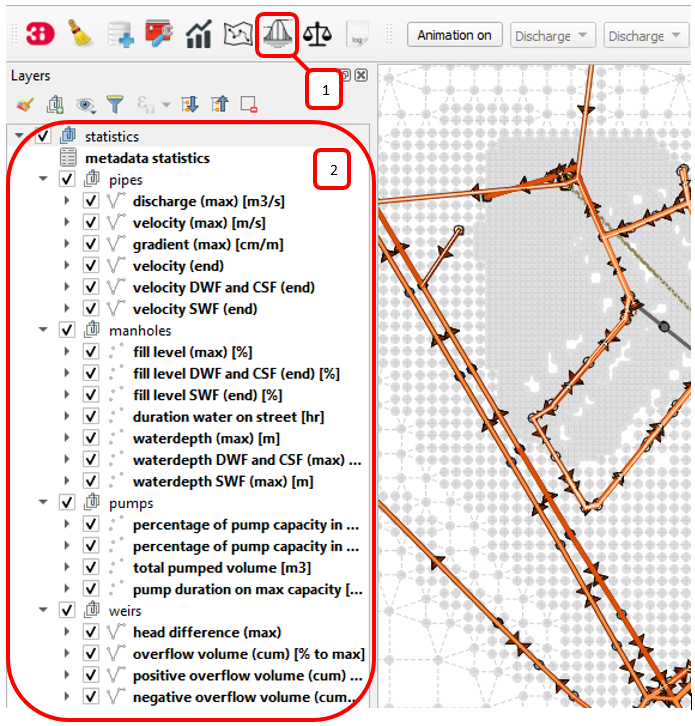

.. _qgisplugin:

Modeller Interface 
=================================

Introduction
--------------
The modeller interface consists of QGIS with a 3Di Toolbox as a QGIS plugin on top for working with 3Di models and netCDF results. Since the Plugin Release of March 4th 2019, the plugin is only supported by QGIS 3.4.5. An older version of the plugin will remain available for QGIS 2.18. 
As a user you can choose to either:

- Install the `Modeller Interface <https://docs.3di.lizard.net/modeller-interface-downloads/3DiModellerInterface-OSGeo4W-3.4.13-1-Setup-x86_64.exe>`_  or
- Install QGIS, and install the 3Di toolbox as a QGIS plugin

For more information on installing the plugin see `3Di Toolbox plug-in <https://github.com/nens/threedi-qgis-plugin/wiki>`_. For more information on viewing and editing 3Di models in QGIS see :ref:`adjust_model`. 
The section below explains the use of various options of the modeller interface. More subjects will be added regularly.

.. _plugin_installation:

Installation of plugin
------------------------

* QGIS 3.4 64bit Long term release(`Get QGIS <http://www.qgis.org/en/site/forusers/download.html#>`_ use the standalone installers)

    After installation of QGIS, set the interface language and locale to American English. This makes it easier to understand the instructions in this documentation. Also, some locales do not support scientific notations of numbers, required for very small numbers (e.g. 1e-09).

    * Go to Settings > Options > General
    * Tick the box 'Override System Locale'
    * For User Interface Translation, choose 'American English'
    * For Locale, choose 'English UnitedStates (en_US)'
    * Restart QGIS

* QGiS 3Di plug-in specially designed for 3Di (`Get 3Di plug-in <https://github.com/nens/threedi-qgis-plugin/wiki>`_)

The 3Di Toolbox works for:

- QGIS 3.10.x (LTR after february 2020)
- 64-bit version of QGIS (see below for more details)
- 3Di v2 results

For a more extended description of installing QGIS, the 3Di-Toolbox and troubleshooting go to: https://github.com/nens/ThreeDiToolbox/wiki/Installation

To install the 3Di-Toolbox plugin follow the steps below: 

1) Open QGIS and via the menu bar go to 'Plugins > Manage And Install Plugins'. 
2) Go to 'Settings'. 
3) Add a plugin repository
4) Fill in a name and copy the URL: https://plugins.lizard.net/plugins.xml into the URL box. 
5) Go to 'All' and choose '3Di toolbox' from the list
6) Install the plugin.

.. figure:: image/d_qgispluging_pluginmanager.png
    :alt: QGIS Plugin Manager
    
.. figure:: image/d_qgispluging_pluginmanager_addlizard_repo.png
    :alt: Add Lizard repo Plugin

.. figure:: image/d_qgispluging_pluginmanager_install_toolbox.png
    :alt: Install 3Di Toolbox

.. _plugin_overview:

7) To install the 3Di API client follow steps 1-4 above. Now you choose 3Di API client. 
8) To active the panel of the API client, choose plugins --> 3Di API client --> 3Di API client. Now the panel will be available.

Overview of the 3Di API client
------------------------------

After installation of the plugin, a panel is available. If you don't see this panel, check the installation instructions.

.. figure:: image/d_qgisplugin_apiclient_overview.png
    :alt: API client overview

The API client panel consists of the following parts:

- Build (not implemented yet)
- Check (not implemented yet, please see the schematisation and raster checker in the 3Di toolbox below)
- Upload 
- Simulate 
- Results

.. _simulate_api_qgis:

Start
--------

To start simulating you first need to login and choose several options. 
Start by clicking **start**. In the pop-up window choose **Load from Web**

.. figure:: image/d_qgisplugin_apiclient_start.png
    :alt: Load from web
	
Afer providing your username and password a connection is being made with the API.

.. figure:: image/d_qgisplugin_apiclient_login.png
    :alt: Load from web
	
Users that have access to run simulations for more than one organisation will get a menu in which they choose the organisation: 

.. figure:: image/d_qgisplugin_apiclient_login_choose_organisation.png
    :alt: Choose organisation

Now choose only simulate (only option available at the moment):

.. figure:: image/d_qgisplugin_apiclient_choose_simulate.png
    :alt: Choose simulate 

	
Choose the model that you like to run simulations on:

.. figure:: image/d_qgisplugin_apiclient_login_choose_model.png
    :alt: Choose simulate 
	
Now you're ready to start simulating
	
Simulate
--------

Please note that the current implementation is in **beta** and only supports rainfall events and doesn't take into account laterals and initial waterlevels. 

To start simulating click the simulate button. The following window will be shown:

.. figure:: image/d_qgisplugin_apiclient_runningsimulations.png
    :alt: Choose simulate 
	
In this window an overview of current simulations within the organisation. In this panel simulations can be started, but also running simulations can be stopped.
When starting a new simulation, you need to define a name for the simulation. Other users within your organisation will see this, and it can be used to look up simulations later. 

.. figure:: image/d_qgisplugin_apiclient_new_simulation.png
    :alt: Choose new simulation 
		
The first step in any simulation is choosing the duration of the simulation:

.. figure:: image/d_qgisplugin_apiclient_choose_duration.png
    :alt: Choose duration
	
Then you can choose between a design rain, constant rain or a custom rainfall event. For all events an off set can be defined. The offset is the duration between start simulation and the start of the rainfall event. 

.. figure:: image/d_qgisplugin_apiclient_rain_custom.png
    :alt: Choose custom rain

When choosing a custom rain, the csv format is minutes, rainfall in mm for that timestep

.. figure:: image/d_qgisplugin_apiclient_csv_format.png
    :alt: Example CSV

After choosing all the settings check the overview, press Next and Add to Queue. The simulation will start up when there is a session available on the servers within your organisation.

.. figure:: image/d_qgisplugin_apiclient_preview_simulation.png
    :alt: Example CSV
	

Results
--------
	
After a simulation is finished the results will be stored on our servers for 7 days. The files can be download via the Results button.

.. figure:: image/d_qgisplugin_apiclient_download_panel.png
    :alt: Example CSV

After download the NetCDF can be loaded together with the spatialite using the 3Di Toolbox as described below.

    
Overview of the 3Di Toolbox
---------------------------

After installation of the plugin a toolbar is added to the QGIS interface. The different tools are explained below. 
In the Modeller Interface the 3Di toolbar is directly available.

.. figure:: image/d_qgispluging_toolbox_overview.png
    :alt: Plugin overview

1) Clear cache 
2) :ref:`load_model_results`
3) :ref:`3ditoolbox`
4) :ref:`graph_tool` 
5) :ref:`sideviewtool`
6) Statistical tool
7) :ref:`waterbalance`
8) :ref:`animationtool`

    
.. _load_model_results:
    
Load 3Di model and results
--------------------------

A model schematisation can be loaded by clicking the database icon with the blue plus-sign (number 2 in the Figure above). A new window will be opened. 

1) Under 'Model' you need to load the Sqlite containing your model 
In case you are loading you model schemetisation for checking and editing your Sqlite, step 2 is not necessary.  
2) Under 'Results' you can load the NetCDF containing your simulation results (usually named *results_3di.nc*). It is important to select a result file that belongs to the model you used for your simulation (i.e. your NetCDF must be generated by the sqlite you loaded. Do not use an old or changed Sqlite). 
3) After the loading finished, click 'Close' to return to the QGIS interface

.. figure:: image/d_qgisplugin_select_model_results.png
    :alt: Load 3Di model and results

.. _view_model_results:
    
View and edit 3Di model a schematisation
----------------------------------------

After loading your 3Di model schematisation, there are several ways to inspect your model. We have added the following features to assist you in editing the model schematisation:

- Drop down menus
- Immediate validation
- Automated field fill
- Multi-line fields for time series 

Drop down menus
^^^^^^^^^^^^^^^

We have added drop down menus for multiple value attributes in tables. This to assist you in selecting the proper values. The figure below shows an example for selecting a shape for a cross section definition. 

.. figure:: image/d_qgisplugin_vm_dropdown.png
    :width: 25pc
    :height: 25pc
    :alt: Drop down menu example

Immediate validation
^^^^^^^^^^^^^^^^^^^^^

For obligatory fields, we have added non-binding constraints. In fields that are correctly, green checks will appear next to the fields after there are filled. An orange cross will appear in case, the field is mandatory, but not filled. 

.. figure:: image/d_qgisplugin_vm_validation.png
    :width: 25pc
    :height: 25pc
    :alt: Validation example

Multi-line fields for time series
^^^^^^^^^^^^^^^^^^^^^^^^^^^^^^^^^

Multi-line fields are designed for editing time series. In the example of the Figure, the time serie of a discharge boundary condition is edited.

.. figure:: image/d_qgisplugin_vm_timeseries.png
    :width: 50pc
    :height: 25pc
    :alt: Timeseries example

Automated field fill 
^^^^^^^^^^^^^^^^^^^^

Some fields are automatically filled to assist in making your model schematisation. Here is an overview of the fields that are filled automatically:

- The cross-section location fetches the corresponding channel-id automatically
- Channels and culverts automatically fill connection node ids when drawing between nodes with `snapping <https://docs.qgis.org/3.4/en/docs/user_manual/working_with_vector/editing_geometry_attributes.html#setting-the-snapping-tolerance-and-search-radius>`_.
- Invert level from culverts. If invert level is empty culverts assumes the invert level based on manhole bottom_level 

On top of that, some default values for some of the mandatory fields are set. This helps you build models faster. The following default values will be set, in case they are left blank. The listed values are defaults, so please change them if required for your specific application.

You need to set your QGIS locale to 'English UnitedStates' in order for this functionality to work properly. See the :ref:`Before you begin > Software <software>` section for instructions.

**v2_global_settings:**

============================= ===============
Column name						Default value 
============================= ===============
dem_obstacle_detection				0
dist_calc_points					10000
flooding_threshold					0.001
frict_avg							0
frict_type						2: Manning
guess_dams							0
numerical_settings_id 				1
start_date						today
start_time						today 00:00
table_step_size  					0.01
============================= ===============

**v2_aggregation_settings:**

============================= =========================
Column name						Default value 
============================= =========================
aggregation_in_space			False
============================= =========================

**v2_2d_lateral:**

============================= ===============
Column name						Default value 
============================= ===============
type  							1: surface
============================= ===============

**v2_connection_nodes:**

============================= ===============
Column name						Default value 
============================= ===============
code  							new
============================= ===============

**v2_channel:**

============================= ============================================================
Column name						Default value 
============================= ============================================================
display_name					new
code							new
zoom_category					5
connection_node_start_id		id of connection node on start point (when snapped)
connection_node_end_id			id of connection node on end point (when snapped)
============================= ============================================================

**v2_culvert:**

=============================== ============================================================
Column name						Default value 
=============================== ============================================================
display_name					new
code							new
calculation_type				101: isolated
dist_calc_points				10000
invert_level_start_point		bottom_level of manhole when snapped to one
invert_level_end_point			bottom_level of manhole when snapped to one
frict_type: 					2: Manning
discharge_coefficient_positive	0.8
discharge_coefficient_negative	0.8
zoom_category					4
connection_node_start_id		id of connection node on start point (when snapped)
connection_node_end_id			id of connection node on end point (when snapped)
=============================== ============================================================

**v2_pipe:**

============================= ===============
Column name						Default value 
============================= ===============
display_name					new
code							new
calculation_type				1: isolated
dist_calc_points				10000
friction_type					2: Manning
zoom_category					3
============================= ===============

**v2_simple_infiltration:**

============================= ===============
Column name						Default value 
============================= ===============
display_name  					new
infiltration_surface_option		0
============================= ===============

**v2_weir:**

=============================== ==============================
Column name						Default value 
=============================== ==============================
display_name					new
code							new
crest_type						4: short crested
discharge_coefficient_positive	0.8
discharge_coefficient_negative	0.8
friction_value					0.02
friction_type					2: manning
zoom_category					3
external						True
=============================== ==============================

**v2_orifice:**

=============================== ==============================
Column name						Default value 
=============================== ==============================
display_name					new
code							new
crest_type						4: short crested
discharge_coefficient_positive	0.8
discharge_coefficient_negative	0.8
friction_value					0.02
friction_type					2: Manning
zoom_category					3
=============================== ==============================

**v2_manhole:**

============================= ===============
Column name						Default value 
============================= ===============
display_name					new
code							new
zoom_category					1
manhole_indicator				0: inspection
============================= ===============

**v2_pumpstation:**

============================= ===========================================================================
Column name						Default value 
============================= ===========================================================================
display_name					new
code							new
type 							1: pump behaviour is based on water levels on the suction side
zoom_category					3
============================= ===========================================================================

**v2_cross_section_definition:**

============================= ===============
Column name						Default value 
============================= ===============
code  							new
============================= ===============

**v2_cross_section_location:**

============================= ===============
Column name						Default value 
============================= ===============
code  							new
friction_type					2
============================= ===============

**v2_obstacle:**

============================= ===============
Column name						Default value 
============================= ===============
code  							new
============================= ===============

**v2_levee:**

============================= ===============
Column name						Default value 
============================= ===============
code  							new
============================= ===============

**v2_grid_refinement:**

============================= ===============
Column name						Default value 
============================= ===============
display_name					new
code							new
refinement_level				1
============================= ===============

**v2_grid_refinement_area:**

============================= ===============
Column name						Default value 
============================= ===============
display_name					new
code							new
refinement_level				1
============================= ===============

**v2_numerical_settings:**

==================================== =================
Column name								Default value 
==================================== =================
limiter_grad_1d							1
limiter_grad_2d							0
limiter_slope_crossectional_area_2d		0
limiter_slope_friction_2d				0
convergence_cg							0.000000001
convergence_eps							0.00001
use_of_cg								20
max_nonlin_iterations					20
precon_cg								1
integration_method						0
flow_direction_threshold				0.000001
general_numerical_threshold				0.00000001
thin_water_layer_definition				0.05
minimum_friction_velocity				0.05
minimum_surface_area					0.00000001
cfl_strictness_factor_1d				1
cfl_strictness_factor_2d				1
frict_shallow_water_correction  		0
pump_implicit_ratio						1
preissmann_slot							0
==================================== =================

**v2_impervious_surface:**

============================= =========================
Column name						Default value 
============================= =========================
display_name					new
code							new
area							area based on geometry
zoom_category					0
============================= =========================

**v2_surface:**

============================= =========================
Column name						Default value 
============================= =========================
display_name					new
code							new
area							area based on geometry
zoom_category					0
============================= =========================

**Notables:**
The 3Di database has some fields that are not in use. To clean the view, we have hidden them in the form view. They are still available in the database. Moreover, we have made some field names easier to read: for example, prefixes are excluded (e.g. \pipe_).

.. _3ditoolbox:

Toolbox for working with 3Di models
--------------------------------------

The 3Di toolbox is actived by clicking the toolbox icon in the 3Di-Toolbox bar. 

.. figure:: image/d_qgisplugin_activate_toolbox.png 
    :alt: 3Di Toolbox Bar

After clicking the toolbox icon, a new window is opened. Click the arrow next to the *Tools* icon to open the toolbox and view the different tools that are available. 

.. figure:: image/d_qgisplugin_toolbox_window.png 
    :alt: Toolbox Window

.. _rasterchecker:

Raster checker
^^^^^^^^^^^^^^
The *Raster checker* is launched with the QGIS 3.4.5 version of the Plugin. This tool checks the rasters for your 3Di model schematisation. The tool verifies for example:

- The correct nodata value

- Consistent projection between rasters

- Alignment of all rasters

There are up to 18 checks performed. It is strongly recommended to run this tool before updating the model repository. The model generation will be unsuccessfull, when it encounters any inconsistencies in your rasters. 

To use the *Raster checker*, set up a connection with the SQlite of your model. 

1) Open the *Data Source Manager* under the drop down menu *Layer* on top of the screen. 
2) Go to *SpatiaLite* and click *New*. Browse to the location of your model Sqlite and open it. 
3) Now you can close the *Data Source Manager* window.

.. figure:: image/d_qgisplugin_load_sqlite.png
    :alt: Data Source Manager

4) The *Raster checker* can be accessed by opening the Toolbox. 
5) The *Raster checker* can be found under *Step 1 - Check data*. By double clicking *raster_checker.py* the *Raster checker* is opened in a seperate window. 

.. figure:: image/d_qgisplugin_activate_rasterchecker.png
    :alt: Data Source Manager

6) Under *Model schematisation database* you can choose the spatialite of your model. 
7) Click *OK* to start the *raster checker*. When the tool is finished the following message pops-up:

.. figure:: image/d_qgisplugin_rasterchecker_done.png 
    :alt: Raster checker Done

8) The log-file of the raster checker can be found at the same location as the location of the SQlite. The log-file can be opened with a text editor such as Notepad. The log-file looks similar to:

.. figure:: image/d_qgisplugin_rasterchecker_log_header.png
    :alt: Rasterchecker Done

Here, one can also find the overview of the 18 checks that are performed. 

9) The performed checks are numbered 1 to 18. This number is called a *check_id*. 
10) Under sub-heading *Found following raster references*, there is a list with the rasters used in your model schematisation.

Further down in the log-file, the outcome of the *raster checker* for each raster is shown.

.. figure:: image/d_qgisplugin_rasterchecker_log_checks.png
    :alt: Rasterchecker Feedback

11) The first column, named *level*, shows the importance of the notification (info, warning or error). Errors need to be solved.
12) The second column, named *setting_id*, refers to the id of the row in the v2_global_settings table of the sqlite, where the raster reference can be found. 
13) The third column contains the *check_id*. 
14) The fourth column is the *feedback*, it contains the outcome of the specific verification check. 
15) If one of your rasters is not aligned with the DEM (bathymetry file), check_id 18 will give an error. Make sure all your rasters have the same extent and and have nodata pixels at the same location. 

.. _schematisationchecker:

Schematisation checker
^^^^^^^^^^^^^^^^^^^^^^

The *schematization checker* analyses your 3Di model database (.sqlite file) for completeness and consistency between tables. With the checker you can make sure most database errors are found before sending the model to the 3Di INP-server for model generation. 

In order to use the *schematization checker* follow these steps:

1. Start *QGIS*
2. Add a connection to the model database (*Layer* -> *Data Source Manager*, Select *SpatiaLite* on the left and create a *'New’* connection or connect to an existing connection)
3. Open the *schematization checker* by opening the *Toolbox* in the 3Di Plugin, select *Step 1: check data*, select *schematisation_checker.py*
4. Select the SpatiaLite connection of the model database and the location where to store the output of the schematisation checker. Click *run* to run the schematisation checker. Click *open* to open the output.

The output is a comma seperated value file, which can be opened in, for example, Excel. It contains 6 columns: *id, table, column, value, description and check*:

- **id**: identification number of the row where a check encounters an error.
- **table**: the table in which the error occurs.
- **column**: the column which contains the error.
- **value**: the current value in the cell
- **description**: description of the error
- **check**: the type of check that found the error, described below

**What is checked?**

There are currently different general checks applied on all tables and columns of the model database. These checks are:

- TypeCheck
- NotNullCheck
- ForeignKeyCheck
- EnumCheck
- UniqueCheck
- GeometryCheck
- GeometryTypeCheck

Apart from the general checks on the database data and structure there are more 3Di specific checks:

- BankLevelCheck
- CrossSectionShapeCheck
- TimeSeriesCheck
- Use0DFlowCheck

**TypeCheck** Every cell in every table will be checked if the type of the entered value is correct. A values in cell is expected to be a(n): 
- integer (-4, 0,1,2, etc…)
- real (3.6, -5.2)
- text
- varchar (text of limited length)
- geometry (point, linestring or polygon)
- bool (bolean, true or false)
- datetime (2019-07-02 14:27+02:00)

**EnumCheck** Some cells expect specific values. For example, the type of a boundary condition is either 1, 2, 3 or 5 (respectively water level, velocity, discharge or Sommerfeld). Any value other than the enumerated values will result in an EnumCheck error.

**NotNullCheck** If a cell is *NULL* it id empty. For some cells this is allowed, but others cells are obliged to contain a value. If this obligation is not met, a NotNullCheck error is given.

n.b. An empty text or varchar does not equal NULL.

**ForeignKeyCheck** Many tables contain foreign key columns which refer to other tables. An example is the column *connection_node_start_id* in the table *v2_channel*. This column refers to the column *id* in the table *v2_connection_node*. If a channel is entered with *connection_node_start_id = 1*, there should be an entry in the table *v2_connection_nodes* with *id = 1*. If this is not the case a ForeignKeyCheck error will be given.

**UniqueCheck** Some values have to be unique. An example is the name column in *v2_global_settings*. If multiple rows are entered with the same name, a UniqueCheck error will be given.

**GeometryCheck** If an entered geometry is invalid the GeometryCheck error will be returned. The most occurring reason for invalid geometries is self-intersection of polygons.

**GeometryTypeCheck** This check makes sure the geometry type (point, linestring or polygon) is consistent with the expected geometry type.

**BankLevelCheck** Check if the row *bank_level* of *v2_cross_section_locations* table is not NULL, when the corresponding channel is of the type *connected* or *double_connected*.

**CrossSectionShapeCheck** Each type of cross-section shape requires certain input. This check verifies if all cross-section shapes are well posed: 

- *Rectangle*: A width is required, a height is optional. The dimensions should be positive decimal numbers.
- *Circle*: Only a "width" is required. This is diameter of the circle and should be a positive decimal number.
- *Egg*: Only a "width" is required. The height is 1.5 times the width. This value should be a positive decimal number.
- *Tabulated rectangle or trapezium*: A list of widths and heights are required. The lists should contain only positive decimal numbers seperated by spaces and contain the same amount of values. The first value of *height* should always be 0. The height list should be increasing. In case the width is set to 0 m at the heighest increment, the cross-section is closed. 

**TimeseriesCheck** This check verifies if time series are correctly defined. It checks whether the time steps in that table are all the same. 

**Use0DFlowCheck** If 0D flow is configured in the global settings table, there should be at least 1 (impervious) surface defined in the model.

.. _importsufhyd:

Import from SUF-HYD
^^^^^^^^^^^^^^^^^^^

SUF-HYD is a Dutch standardized format for transferring data of sewerage systems for hydraulic analyses. This tool allows an automated import of the sewerage data in the 3Di model database. 

Before you can use the tool, make sure you have :ref:`downloaded an empty spatialite <empty_database>`. The SUF-HYD data will be imported to this spatialite. Save the Sqlite to a location fo choice on your computer.

The tool can be accessed by :ref:`activating the toolbox <3ditoolbox>` and double clicking 'import_sufhyd.py' under 'Step 2 - Convert and import data' 

1) First, make sure you have a connection with the sqlite you want to import your data to (see the first 3 steps under :ref:`rasterchecker`). 
2) After opening the tool, select a SUF-HYD file and the database (sqlite) to import the data into and click 'OK'

The data from the SUF-HYD will be loaded into the sqlite. A log file of this process can be found at the same location as the SUF-HYD file. This file has the name of your SUF-HYD with a *.hyd.log* extension. You can open this log file with a text editor such as Notepad. This log-file gives a summary of data errors and warnings. 

The following objects are imported:

* Manhole (``*KNP``)
    * The number of inhabitants will be added as an *Impervious surface*.

Note: the shape of the manhole is refered as 'rnd' = round, 'sqr' = square and 'rect' = rectangle

*    Pipe (``*LEI``)

    *    The number of inhabitants will be added as *Impervious surface*
	
*    Pump station (``*GEM``)

    *    If multiple stages are defined, this will be transformed into seperate pumpstations. Up to 10 stages are supported
	
*    Weir (``*OVS``)

    *    Flow direction (str_rch) is translated into discharge coefficients with a value of 0
    *    An end node with boundary condition is not automatically added.
	
*    Orifice (``*DRL``)

    *    Flow direction (str_rch) is translated into discharge coefficients with a value of 0
	
*    Boundary (``*UIT``)

    *    The water level will be the average definition (bws_gem). If not present the summer water level is used and otherwise the winter water level.
	
*    Extra manhole storage (``*BOP``)

    *    The defined storage area is added to a manhole on the bottomlevel of the manhole. The defined bottom_level of the storage (niv_001) is ignored.
    *    Only one storage area is supported
	
*    *Drainage area/ Impervious surface (``*AFV``)*

*    Linkage nodes (``*KPG``)

    *    The 'fictive' linkages (with typ_gkn == 01) are ignored, only real nodes are combined.
    *    The second node (ide_kn2) is removed. Impervious surfaces and pipes linked to the removed node are redirected to the first node. Extra manhole storage will be lost.

Viewing and Analysing 3Di results
---------------------------------

We have various tools developped to assist users in analysing a viewing their results. In this section, some of these are described.

.. _waterbalance:

The water balance tool
^^^^^^^^^^^^^^^^^^^^^^

The water balance tool computes the water balance in a sub-domain of your model. It uses the incoming and outgoing flows in that domain and visualizes the various contributions of the flow in graphs. The development was an initiative of Deltares and jointly developed with Nelen & Schuurmans. The water balance tool is co-funded by the Top Sector Water (Ministry of Economic Affairs)

This is the only results tool that requeres the generation of specific results. Therefore, we also discuss the input requirements of this tool.

.. _waterbalanceactivate:

**Settings to use the water balance tool**

To be able to use the water balance tool, aggregated results are required for a range of variables. This to ensure, that the shown water balance is consistent and complete. 
    
The aggregation settings can be found and configured in the spatialite-table *v2_aggregation_settings*. For more information on the aggregation settings, see :ref:`aggregationnetcdf`. The default settings for the water balance tool are listed below.

.. csv-table:: Aggregation settings for water balance tool
   :file: other/water_balance_aggregation_settings.csv
   :widths: 5, 10, 20, 15, 15, 20
   :header-rows: 1
   

Of course, the time step, cq, the period over which is aggregated, is adjustable. For new models, these settings are included in the empty spatialite database (:ref:`empty_database`). For existing models, these settings must be added to the *v2_aggregation_settings* -table. These SQL queries will help you in doing so:

Empty v2_aggregation_settings table::

    DELETE FROM v2_aggregation_settings;
  
Add aggregation settings for all rows in the global settings table::

    INSERT INTO v2_aggregation_settings(global_settings_id, var_name, flow_variable, aggregation_method, aggregation_in_space, timestep)
    SELECT id, 'pump_discharge_cum', 'pump_discharge', 'cum', 0, output_time_step FROM v2_global_settings
    UNION
    SELECT id, 'lateral_discharge_cum', 'lateral_discharge', 'cum', 0, output_time_step FROM v2_global_settings
    UNION
    SELECT id, 'simple_infiltration_cum', 'simple_infiltration', 'cum', 0, output_time_step FROM v2_global_settings
    UNION
    SELECT id, 'rain_cum', 'rain', 'cum', 0, output_time_step FROM v2_global_settings
    UNION
    SELECT id, 'leakage_cum', 'leakage', 'cum', 0, output_time_step FROM v2_global_settings
    UNION
    SELECT id, 'interception_current', 'interception', 'current', 0, output_time_step FROM v2_global_settings
    UNION
    SELECT id, 'discharge_cum', 'discharge', 'cum', 0, output_time_step FROM v2_global_settings
    UNION
    SELECT id, 'discharge_cum_neg', 'discharge', 'cum_negative', 0, output_time_step FROM v2_global_settings
    UNION
    SELECT id, 'discharge_cum_pos', 'discharge', 'cum_positive', 0, output_time_step FROM v2_global_settings
    UNION
    SELECT id, 'volume_current', 'volume', 'current', 0, output_time_step  FROM v2_global_settings
    UNION
    SELECT id, 'qsss_cum_pos', 'surface_source_sink_discharge', 'cum_positive', 0, output_time_step FROM v2_global_settings
    UNION
    SELECT id, 'qsss_cum_neg', 'surface_source_sink_discharge', 'cum_negative', 0, output_time_step FROM v2_global_settings
    ;
	
Note that the above query sets the aggregation time step equal to the output time step. If you want to use different aggregation time step, make sure to use the same time step for all aggregation variables in order to enable the use of the water balance tool.

	UPDATE v2_aggregation_settings SET time_step = [fill in a number];
	
**Using the water balance tool**

In a few steps, one can get insight in the water balance of their own system.

1) Define a spatialite and the results that are to be analysed by loading your model and results using the 'Select 3Di results'-button in the toolbox.  

2) The water balance tool is activated by clicking the balance icon in the 3Di-Toolbox bar. 

.. figure:: image/d_qgisplugin_waterbalance1.png 
    :alt: 3Di Toolbox Bar
    
In case, the aggregated results are missing or incomplete the following error pops up:

.. figure:: image/d_qgisplugin_wb_error_no_aggregation.png 
    :alt: Error no aggregation settings
    
    
3) Draw a polygon to define the domain of the model for the area of interest. This can be done by clicking at multiple locations within the model domain. Click *Finalize polygon* to finish the polygon. The graph shows the water balance over time for the selected area. 

4) By right-clicking the graph, a menu appears in which the range of the x-axis and y-axis can be adjusted. The visible x-axis determines the period over which the water balance is calculated. 

5) The button *Hide on map* the polygon over which the water balance is calculated is hidden.

.. figure:: image/d_qgisplugin_wb_draw_polygon.png 
    :alt: Draw polygon to define water balance area
    

    
**Display settings**

6) The different colours show the different flow types, explained in the legend on the right. 
7) By hovering over a flow type in the legend, the corresponding plane lights up in the graph and the corresponding flow lines will be marked with red dotted lines in the map of the model. 
8) The different flow types can be activated and deactivated in the graph by clicking the box next to the flow type name. 
9) All flow types can be activated or deactivated using the buttons *activate all* and *deactivate all*. 
10) In the water balance menu different display options can be chosen. In the first drop-down menu (default = '1d and 2d') you can choose to display only 1D-flow ('1d') or 2D-flow ('2d') or both ('1d and 2d'). 
11) In the second drop-down menu (default = 'everything') you can choose to display all flows ('everything') or only the main flows ('main flows').
12) In the last drop-down menu (default = 'm3/s') you can choose to display flow ('m3/s') or cumulative volume ('m3'). 

Note: the different flow types are 'stacked' in the graph. This means the flow volumes are added to each other when activating multiple flow types. 

Volume change is shown in the graph as well. In this case, the volume change is the result of the total positive and negative flow (inflow and outflow of the area). The volume change is not stacked but shown as a separate line in the graph. 

.. figure:: image/d_qgisplugin_wb_marked_flow.png 
    :alt: Marked flow types
    
**Total balance**

13) By clicking the button *Show total balance* a new screen will pop-up, showing the total volume balance over the period set on the x-axis of the graph (shown in title). 
14) To adjust this period, close the screen with the bar diagrams, right click on the water balance graph, open the option *x-axis*, activate the option *manual* and set the minimum and maximum time. Then, click again on *Show total balance* to create the water balance diagrams for the new time range. 

.. figure:: image/d_qgisplugin_showbalance_axis.png
    :alt: Adjust axis range

The top diagram shows the net water balance from all domains. The bottom diagrams show the water balance per domain. 

.. figure:: image/d_qgisplugin_wb_totalbalance_new_qgis3.png
    :alt: Total balance

It is possible to save the graphs as an image or export the water balance data to a CSV-file.

15) To save an image of the graphs, right-click on one of the graphs. Choose 'Export' in the menu that opens. A new window opens.
16) In the first box you can choose the items you want to export. Click 'Entire Scene' to export all graphs or choose one of the 'Plot'-items to export a graph seperately. 
17) In the second box you can choose the export format. Choose 'Image file' for an image and choose 'CSV from plot data' to export the actual data. 
18) Click 'Export' to generate your figure. 

.. figure:: image/d_qgisplugin_export_wb_graph.png
    :alt: Export waterbalance graph

**Explanation of flow types**

In the overviews the flow is split in several domains. These distinguish themselves based on how the flow is computed. Therefore, you will find the 2D flow, groundwater and the 1D flow domain. Below a more detailed doscription of the various components.

*2D Surface water domain*

- *2D Boundary flow:* Inflow and outflow through 2D boundaries
- *2D Flow:* Inflow and outflow in the surface domain crossing the borders of the polygon
- *Lateral flow to 2D:* Sources or sinks based on 2D laterals
- *2D: 2D flow to 1D:* Flow exchange between the 2D surface domain and the 1D network elements within your polygon (for example, surface run-off from rain into a 1D-channel or water that overflows the banks in your channel). 
- *2D: 2D flow to 1D (domain exchange):* Flow exchange between the 2D surface domain and the 1D network elements crossing the borders of your polygon
- *In/exfiltration (domain exchange):* Flow exchange between the 2D surface domain and the 2D groundwater domain
- *Rain:* Incoming water from rain
- *Constant infiltration:* Flow out of the 2D domain based on simple infiltration
- *Interception:* Intercepted volume

*2D Groundwater domain*

- *Groundwater flow:* Inflow and outflow through the 2D groundwater domain crossing the borders of your polygon
- *In/exfiltration (domain exchange):* Flow exchange between the 2D surface domain and the 2D groundwater domain (generally inflowing water through infiltration). 
- *Leakage:* sources or sinks based on leakage

*1D Network domain*

- *0D Rainfall runoff on 1D:* Inflow volume from 0D module
- *1D Boundary flow:* Inflow and outflow over a 1D boundary
- *1D Flow:* Inflow and outflow in 1D network elements crossing the borders of your polygon
- *1D Laterals:* Sources and sinks based on 1D laterals
- *1D: 2D flow to 1D:* Flow exchange between the 2D surface domain and the 1D network elements (e.g. surface runoff from rain into a 1D-channel) within your polygon
- *1D: 2D flow to 1D (domain exchange)* Flow exchange between the 2D surface domain and the 1D network elements crossing the borders of your polygon
- *Pump:* pumped volume

.. _graph_tool:

Graphs of time series
^^^^^^^^^^^^^^^^^^^^^

The graph tool can be used for visualizing model results over time. for example, it allows users to quickly plot the water level variation of a specific node or the discharge variation of a flow link (e.g. a channel or pipe) over time. The information is quickly at hand in just a few steps. All the variable that are saved in the NetCDF are available. They are structured on flow lines and nodes, depending on how they are defined in the computational core. An overview of the variables in the NetCDF can be found in the section :ref:`3dinetcdf`. 

The following steps are required to view your results:
1) First, make sure you have loaded a model schematisation and the corresponding results (NetCDF) into your QGIS project using :ref:`load_model_results`.
2) Activate the graph tool by clicking the *graph* button in the 3Di toolbar. A new panel with the title *3Di result plots* is launched in your QGIS-project. 
3) In the layer overview window go to the layer group *results: results_3di* and activate the 'flow-lines' layer or the 'nodes' layer: 

.. figure:: image/d_qgisplugin_graphtool_activateresults.png
    :alt: Results layers

4) Activate the *Select features* tool in QGIS, by clicking this logo in the *Attributes toolbar* from QGIS: 

.. figure:: image/d_qgisplugin_graphtool_selectiontool.png
    :alt: Selection tool

5) Select the specific nodes or flow lines. You can select multiple nodes or flow lines simultaneously, but for speed purposes it is advised to limit it to a maximum of 20 features.

6) Click the *Add* button in the *3Di results plot* panel. The results for the selected features are loaded from the NetCDF and visualized over time in the graph.

.. figure:: image/d_qgisplugin_graphtool_graphwindow.png
    :alt: Results graph example

7) You can switch between node and flow line results by activating the tab *Q-graph* for flow lines and *H-graph* for nodes. 
8) In the drop-down menu on the right side of the panel you can choose the type of results you want to see. The y-axis shows the corresponding range and unit of the results type. The x-axis shows the time. *Note: the time is often displayed in kilo-seconds (ks). 1 ks = 1000 seconds ≈ 16.7 minutes.*
9) Below the drop-down menu there is an overview of the nodes/flow lines you selected, with the id of the node/flow line and the type. In this overview you can activate or deactivate the results in the graph by clicking the checkbox next to it. A feature can be deleted by first selecting it in this overview and then clicking the *Delete* button below the overview. 
10) The data from the graph can also be exported to an image or csv-file. Right-click the the graph figure and choose 'Export' from the drop-down menu. A new window pops-up in which you can choose the output format and settings. 

.. _animationtool:

Animation tool
^^^^^^^^^^^^^^

To understand the behaviour of your water system, it is important to get insight in the flow that changes in space and in time. The *Animation* tool allows a spacial view of the results, which can be played back and forth in time. Water level, velocities and discharges can be visualized by this tool.

1) Activate the *Animation* tool by clicking 'Animation on'. A blue progress bar appears at the top of the map-window. Wait till this progess bar has disappeared before you continue. 
2) The first drop-down menu defines the kind of results you will see on the flow lines (e.g. discharge, velocity). 
3) The second drop-down menudefines the kind of results you will see on the nodes (e.g. water level). 
4) The slider scrolls through time and allows you to go back and forth through the results of your simulation. 
5) The timestep of the slider is shown in the box on the right side. Time notation is in DAYS:HOURS:MINUTES from the start of the  simulation. 

.. figure:: image/d_qgisplugin_animation_on.png
    :alt: Animation on bar

When the *Animation* tool is activated, temporary layers are created to show the chosen results:

.. figure:: image/d_qgisplugin_animationlayers.png
    :alt: Animation layers

The thickness of the lines scale with the the size of the flow over the lines. The arrows indicate the flow direction. The colours of the nodes, represent different values of the node results.

When groundwater is not used in the model, the layers 'line_results_groundwater' and 'node_results_groundwater' can be turned off. 

An example of the animated flow lines is shown in the figure below. 

.. figure:: image/d_qgisplugin_stroming.png
    :alt: Animation flow

Here, the purple arrows show flow over the 2D domain. The pink arrows show the flow from the 1D domain to the 2D domain or vice versa. In this case this is flow from the terrain into a sewerage manhole. The blue arrows show the flow in the 1D network.

The line results can also be filtered to distinguish between type of flow. To do this, right click on the 'line_results' layer and choose 'Filter' from the drop-down menu. A new window will pop up: 

.. figure:: image/d_qgisplugin_filter.png
    :alt: Filter

Double click on 'type' and click 'Sample' to see which types are available. In the 'filter expression' field you can specify the types of flow lines you want to show, e.g. "type" = '2d'. In the Figure below, an example of filtered 2D flow is shown. 

.. figure:: image/d_qgisplugin_2d_flow.png
    :alt: Filter

.. _sideviewtool:

Side view tool
^^^^^^^^^^^^^^

.. figure:: image/d_qgisplugin_sideviewtool.png
    :alt: Sideview tool

1) Activate the *Show side view* tool by clicking the map icon in the 3Di toolbar. 
2) A new panel opens. Click ‘Choose sideview trajectory’. 
3) A new layer is created and is directly shown with yellow lines. These yellow lines are all possibile trajectories for a sideview. Choose a starting point by clicking on a yellow line (point A). By clicking on a second yellow line (point B), the end of your trajectory is defined. The tool automatically detects the shortest route from point A to B. The trajectory is shown as a red line on the map. The sideview of this trajectory is shown in the graph. 
4) A trajectory can contain multiple points. Just click on the next point on the yellow line (point C) and the sideview of the shortest route from point B to C is automatically added to the graph. 
5) The graph contains the following elements: 

    a. The pipe/channel dimensions, represented by the grey area.
    b. Dimensions and locations of manholes.
    c. Green line: surface levels of manholes
    d. Green dotted line: drain levels of manholes
    e. Blue line: the water level.

6) The slider in the *Animation* tool can be used to scroll through time. 

.. _statisticaltool:

Statistical tool
^^^^^^^^^^^^^^^^^^

The statistical tool can ben used to calculate sewerage statistics from 3Di results. To use it, first make sure you load a 3Di model together with the results you want to calculate the statistics from. 

1) Activate the Statistical Tool by clicking the statistics icon in the 3Di toolbar. The tool will immediately start calculating the statistics and a progressbar at the top of the map window shows the progress. 
2) When the calculations are finished, new layers are added to the QGIS project. These layers contain statistics from the 3Di results on pipes, manholes, pumps and weirs. The layers are explained below. 

*Note: DWF = Dry Weather Flow, CSF = Combined Sewer Flow, SWF = Storm Water Flow*

**Metadata_statistics**

- *table:* Refers to the table, see below 
- *field:* Refers to the fieldname, see below
- *from_agg:* If set to 0 the statistics are derived using actual values on the output time step. This is the case if no aggregation value is available. Not using an aggregation netcdf makes the statistics derived using this tool less accurate
- *input_param:* For advanced users: Refers to the input parameter from the NetCDF
- *timestep:* When not derived from aggregation netcdf it is important what timestep has been used. It gives an indication of the accuracy of the value.

**Pipes**

- *Discharge (max):* Maximum discharge which occurs during the simulation
- *Velocity (max):* Maximum velocity which occurs during the simulation 
- *Gradient (max):* Maximum gradient of the waterlevel in the pipe 
- *Velocity (end):* Velocity in the pipe occuring at the last timestep
- *Velocity DWF and CSF (end)*: Velocity at the last timestep for DWF and CSF pipes
- *Velocity SWF (end):* Velocity at the last timestep for SWF pipes

**Manholes**

- *Fill level (max):* Percentage of manhole that is filled based on maximum water level occuring during the simulation
- *Fill level DWF and CSF (end):* Percentage of manhole that is filled based on water level at the last time step of the simulation for DWF and CSF manholes. 
- *Fill level SWF (max):* Percentage of manhole that is filled based on water level at the last time step of the simulation for SWF manholes. 
- *Duration of water on street:* The total amount of time the water level in the manhole is higher than the surface level of the manhole during the simulation. Note that the unit is in hours, so 0.25 hr means 15 minutes. 
- *Waterdepth (max):* The max water depth above the manhole surface level that is occuring during the simulation. Values greater than 0 mean there is water on the street. 
- *Waterdepth DWF and CSF (max):* The max water depth above the manhole surface level that is occuring during the simulation for DWF and CSF manholes. Values greater than 0 mean there is water on the street. 
- *Waterdepth SWF (max):* The max water depth above the manhole surface level that is occuring during the simulation for SWF manholes. Values greater than 0 mean there is water on the street. 

**Pumps**

- *Percentage of pump capacity in use (max):* The percentage of the total pump capacity that is used at the moment the pump is pumping at max. 
- *Percentage of pump capacity in use (end):* The percentage of the total pump capacity that is used at the last time step of the simulation. 
- *Total pumped volume:* The total volume that is pumped over the entire simulation. 
- *Pump duration on  max capacity:* The total amount of time the pump is pumping at its max capacity. 

**Weirs**

- *Head difference (max):* The maximum difference in head between the two sides of the weir. 
- *Overflow volume (cum):* The total cumulative volume that has flown over the weir. 

