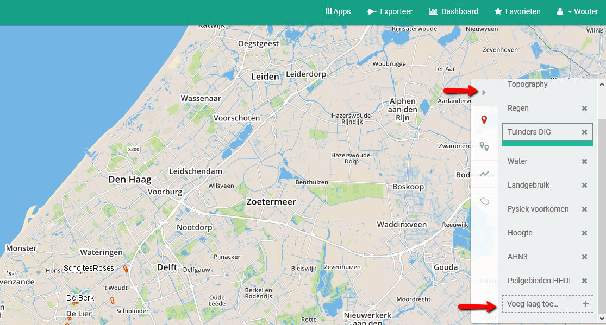
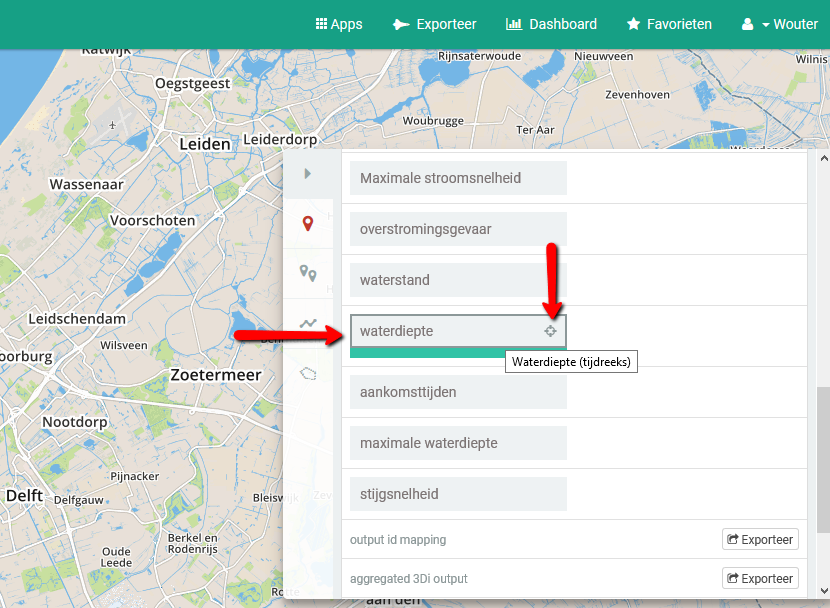
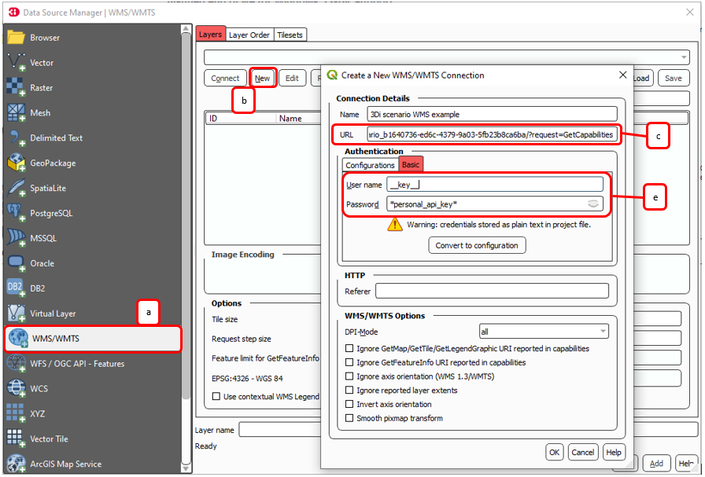
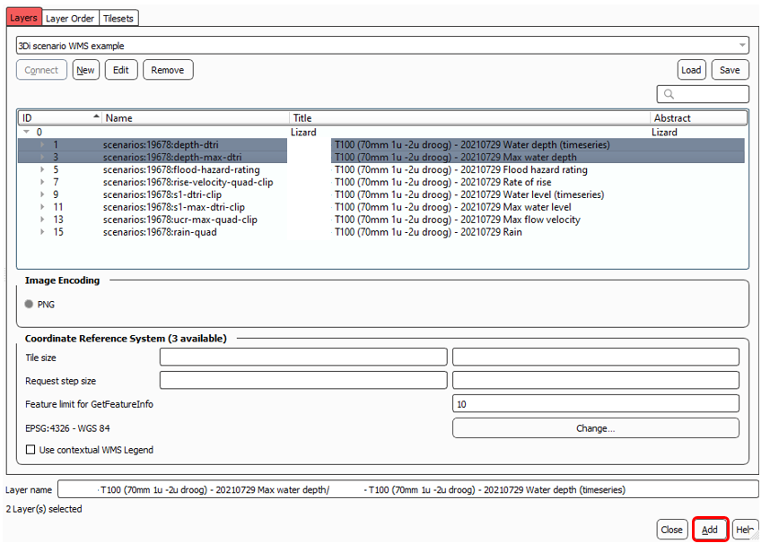
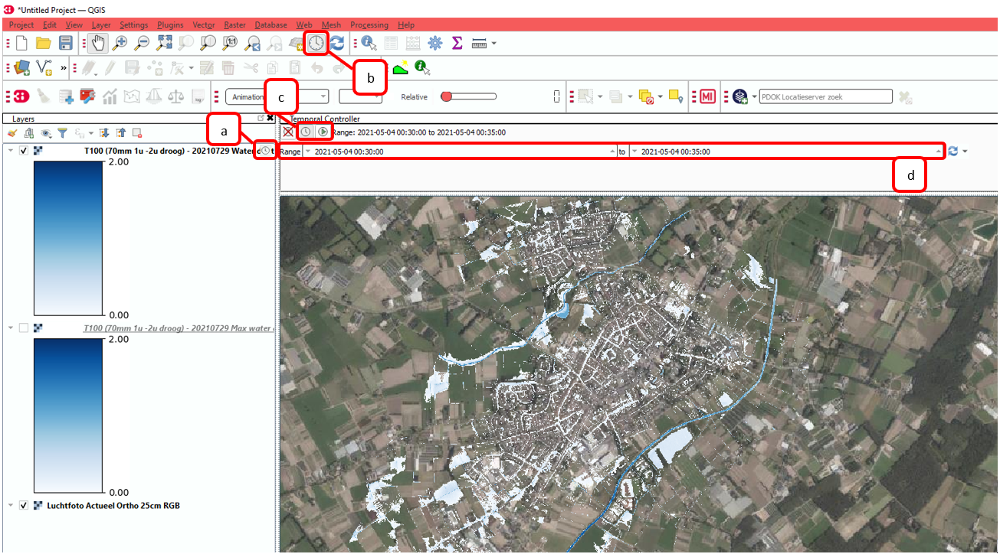

.. _scenario_archive:

Scenario Archive
=================

3Di users that have access to Lizard can view and playback stored scenarios. Depending on your contract and location you may be able to view estimates of damage caused by inundation or flooding (waterschadeschatter).
For Lizard users, you can view your scenanrio's here: https://demo.lizard.net/viewer/
If scenario's are set to public, you do not need an account to view them.
If you also have Lizard management rights, you can manage your scenario's here: https://demo.lizard.net/management/data_management/scenarios
For more information, please visit the Lizard documentation page: https://docs.lizard.net/c_scenarios.html 

After simulating with 3Di, the scenario can be processed to several rasters to visualise your results. These rasters can be viewed using the Lizard portal and in the 3Di Modeller Interface using WMS. *Note: these post-processed results are only available for Lizard subscription holders.*

The following results are available: 

**Water levels:**
Water level relative to mean sea level (m) at a certain time step or maximum water level per calculation cell. 

**Water depth:**
Water depth (m) relative to surface level (water level minus surface level). Surface level is defined by the DEM used by the model. 

**Rainfall:**
Rain intensity per calculation cell (mm/h).

**Maximum flow velocity:**
Maximum flow velocity per calculation cell (m/s). Can for example be used for flood damage estimations. 

**Rise velocity:** 
Rate of rise (m/s), defined by the difference in water level per second. Can for example be used for flood damage estimations. 

**Flood hazard rating:**
Rating used to indicate the degree of danger caused by flooding. 
The flood hazard rating is calculated as follows: 

HR = d * (v + 0.5) + DF

| Where:
| HR = (flood) Hazard Rating
| d = depth of flooding (m)
| v = flow velocity (m/s)
| DF = debris factor 

When water depth is smaller than or equal to 0.25 than DF = 0.5, else DF = 1. 

View stored results
---------------------

To view results in Lizard, follow these steps

#.. Go to Lizard (e.g. demo.lizard.net) and Log on.

#.. Expand the layer view and scroll down to add another layer

#.. Search for your scenario name and select it, then go back

.. figure:: image/d_lizard_add_layer2.png
   :alt: Lizard add layer 2

#. Select your scenario in the layers panel. Here you can view several processed results and download raw results. Select the layer ‘waterdiepte’ (or waterdepth).

#. Then click the small vizier on the selected layer. This will zoom your view to your model extent and the correct period in time in which your scenario was stored (see time frame at the bottom of your screen).

#. To playback your scenario click the play button. To pause click it again. You will notice that the image will sharpen as soon as you pause playback. You may also click on a point on the map to view a graph of the water depth at that location.

#. Raw results can be downloaded from the menu directly. To download a raster select the export button and select the result you would like. You must choose a spatial projection and resolution. All data within your current view is exported. When the export is ready for download you receive a message in your inbox.

   
   Lizard export button
   
Stored results can be managed using the following URL: <your-organisation>.lizard.net/management/scenarios

Damage Estimation 
---------------------

Depending on your location Lizard provides estimates of damage caused by inundation or flooding. To use the damage estimation your study or model area must be within the Netherlands. 

The damages are estimated based on the land-use type, depth of the inundation, year of the month and repair time and are closely linked to the dutch waterschadeschatter.nl. The damage can be used by selecting the 'damage estimation' option and providing the parameters. The land-use map can be viewed in lizard and is fixed. The water depth is derived using the maximum water level and the most recent AHN elevation. The damage estimation does not use the DEM provided in the model.

.. figure:: image/d_store_results.png
   :alt: Store results
   
.. figure:: image/d_store_results2.png
   :alt: Store results 2

The estimated damages are available on a 0.5 m x 0.5 m resolution. Direct, indirect and total damages are available in separate raster layers. In addition, a CSV formatted file with total damages can be downloaded from Lizard.

Further documentation (only in Dutch) can be downloaded from :download:`here <pdf/nabewerking-3di-resultaten-in-lizard.pdf>`. The used damage table are available in :download:`Excel <other/3di-v2.2018-05-15.xlsx>` and :download:`CFG <other/3di-v2.2018-05-15.cfg>` (for use on `waterschadeschatter.nl <https://www.waterschadeschatter.nl>`_. The damage estimation in Lizard was developed together with Hoogheemraadschap Hollands Noorderkwartier.

Load rasters in 3Di Modeller Interface using WMS
-------------------------------------------------
To view post-processed results from your 3Di scenario in the 3Di Modeller Interface follow the following steps: 

| 1. Find the scenario UUID in the scenario management screen of your Lizard portal. Go to ``{yourportal}.lizard.net``, click on **Management > Data > 3Di Scenarios** and search for your scenario. After opening, you can copy the UUID from the URL. 

| 2. Compose WMS url. Fill out the name of the Lizard portal you are using and the UUID of your scenario in the following URL: 
| ``https://{yourportal}.lizard.net/wms/scenario_{UUID of scenario}/?request=getcapabilities``

| For example: 
| https://demo.lizard.net/wms/scenario_c30ef7f2-c871-4d70-a087-8f078f9ebafd/?request=GetCapabilities

.. TODO: dit moet helemaal anders, kan eigenlijk allemaal weg. In lizard docs pull request: https://docs.lizard.net/e_lizardwms.html#di-scenarios. aanpassen. uitleggen scenario>dan kun je het gewoon kopieeren. en dan hier naar lizard docs verwijzen. 

| 3. In the 3Di Modeller Interface connect to the Lizard WMS server using the Data Source Manager. 
| a) Choose WMS/WMTS as data source.
| b) Create a new connection.
| c) Give your scenario a name and copy the URL composed in the previous step. 
| d) Under *Authentication* choose *Basic*.
| e) You need to use a personal API key. If you do not have one yet, you can create one in the Lizard management portal. Go to yourportal.lizard.net, go to **Management > Personal API keys > +New Item.** Use *__key__* as username and the personal API key you created as password. See the `Lizard documentation <https://docs.lizard.net/d_apitechnical.html#apiauthenticationanchor>`_ for more information. 
| f) Click *OK* to save the connection. 

1. When the connection is created, several layers appear (expand the *Title*-section to view full names of the layers). The layers can be added to the project by selecting them and clicking *Add*. 

| 5. The water depth, water level and rain rasters can also be viewed as timeseries.
| a) A temporal raster is indicated by a small clock icon in the layer panel.
| b) Activate the *Temporal Controller* by clicking the clock sign on the toolbar.
| c) Turn on *Fixed range temporal navigation* or *Animated temporal navigation*.
| d) Choose for which time step of your simulation you want to see the water level or depth. 

