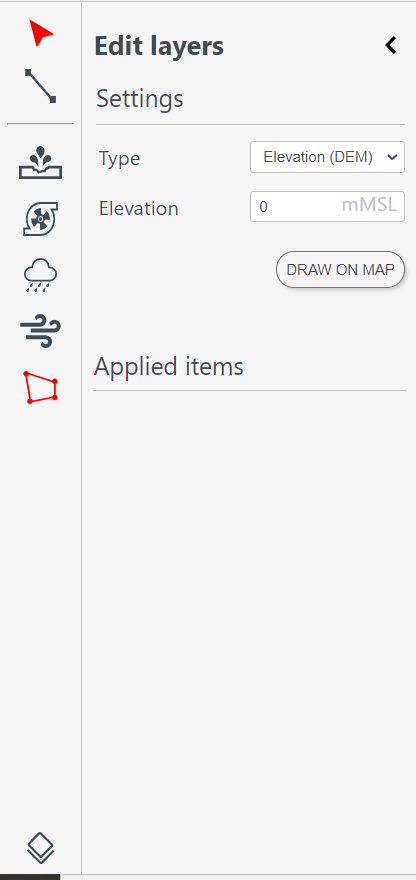
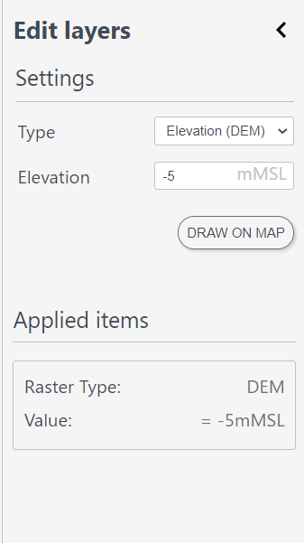
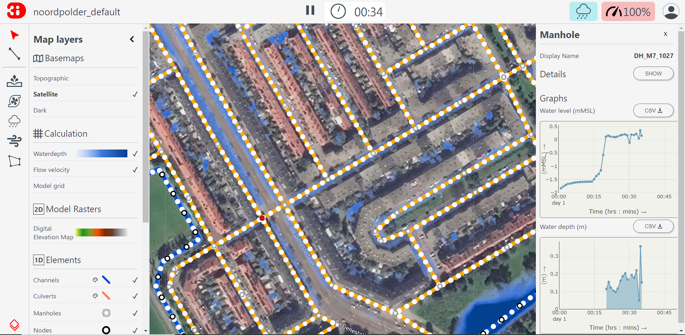

.. _simulate_w_live_site:

Using the live site
====================

.. _running_model:

Running a 3Di model
--------------------

This section helps you get started with interactive simulation with the integral 3Di modeling tools. Through the 3Di portal (version 2.0) the models of your organization can be loaded and simulations can be started. During the session others can follow the simulations 'live'. Also interventions can be done in the model during the simulation. Results are presented in real-time. All the steps from adjusting the input of water to viewing the calculation results are described in this section.

Start the simulation
--------------------

The simulation starts by pressing the *Play* button at the top of the screen. The calculation time is displayed next to the *Play* button. 

By default, the point information tool is switched on. With it you can click anywhere on the map to visualize the time series at that location. Default waterdepth and waterlevel will be shown. If the model contains groundwater that graph is also shown. 

The time series can all be downloaded in CSV format. The points over time that are shown are the points calculated by the 3Di calculation core and are independent from the output time step that the modeller has set.

.. figure:: image/d3.1_point_location.png
	:alt: Point selection

Also the height of a cross section can be displayed, together with the water level in that transect. Click for both starting and ending point of the cross section in any place on the map (within the 2D model domain).

.. figure:: image/d3.1_side_view.png
	:alt: Cross section selection
	
The side view shows the elevation in green and the water in blue. By hovering over the graph with the mouse, exact values can be seen. Keeping this graph open during a flood event will show you how the water level is slowly rising. Note that in the example also groundwater is available in the model indicating an extra blue line. 

The buttons at the mid left of the screen are used to interactively adjust the forcing of the model:

- add a discharge point (2D)
- add a pumping point (2D)
- add rainfall
- add wind

The functioning of these buttons is described in the following sections.

NOTE: The result of forcing water is not visible until the simulation is running.

	
Discharge or pump point
----------------------------

With the discharge icon a constant source (or sink in case of a pump) of water can be added to the model. Select the icon and click at a location on the map to point the location. You can then change the rate (in m3/s) you want to apply. The water that is taken out of the model will not flow back into the model and is considered a loss. 

Rainfall
--------

Through the precipitation icon rainfall can be added to the model. The following options are available:

* **Radar**: use historical rainfall data (only available in the Netherlands).
* **Design**: use a design event. This event is homogeneous over the entire model area and heterogeneous in time.
* **Constant**: a homogeneous event in both space and time across the entire model range.

These three options for adding rainfall all cover the entire model area

When the rainfall is active a cloud icon appears on the top right of the screen. Information about the rainfall event can be accessed by keeping the rainfall tab open. Active and past (inactive) events are shown in this tab 

.. figure:: image/d3.2_rainfall.png
	:alt: Rainfall event
	
The numbers of the design rainfall point the following rainfall events:
Rain 3 till 10 are the Dutch C2100 rainfall events
Rain 11 till 16 are the DPRA rainfall events
	
DEM edit/ Raster edit
------------------------------------------------

A DEM edit is a tool in the live site, it allows to adjust the height of the bathymetry. This can be done at any time during the simulation. 

To edit the bathymetry of the model, make sure the DEM-layer is activated. This can be done via the maplayers menu and clicking on the 'Digital Elevation Model' layer. The elevation edit is in absolute numbers in m MSL. If you are not sure about the elevation to use, use the side view tool to check the height in the model. In some cases it might be useful to also turn on the model grid layer.

After entering a value, click 'Draw on map' and start clicking. 

.. figure:: image/d_draw_dem_polygon.png
   :alt: Performing a dem edit
   
After finalizing the polygon by clicking again on the first point, click on confirm. The Edit then shows in the applied items section

The result can be checked using the 'Side view' tool.

Please note that if there is water on the 2D while editing, and the edit lowers the surface the calculation core needs a few time steps to get to a new water level in the DEM edit location. 

Wind 
---------

A compass card appears after clicking on the leaf icon followed by clicking on the wrench icon. By clicking in the compass card a homogeneous wind field with a specific direction and speed can be set up for the whole model (**v2**).

.. figure:: image/d3.6_wind.png
	:alt: Wind speed, direction and duration

1D network
----------

Channels and structures can be included as 1D elements in the model. The channels show the direction of flow with the help of moving points. The direction and speed are based on the flow velocity in the channel. The different sizes of the points are based on thhe discharge. The results (discharge, water level, waterdepth and flow velocity) are available at the structures by selecting them.

Discharge and velocity are in the lines:

.. figure:: image/d3.7_1d_network.png
	:alt: 1D network
	

And water level and water depth are in the nodes:

	
	
It is also possible to adapt some properties of structures during the calculation. This includes among others the closing of a culvert or increasing the pumping capacity.

Breaches 
--------------------

If breach locations are predefined in the model, these can be activated as follows:

#. Check whether breaches are turned on in the map layer menu. 
#. Zoom in to a breach location
#. By clicking a breach location a pop-up screen with settings for this breach appears.

.. figure:: image/d3.8_breach_location.png
	:alt: Breach location

To show the flow rate over time, select a breach location using the point information tool. 

Store results
--------------

Results can be stored by clicking *Quit Simulation* and then *Store Results*. There are two options:
- Download results directly via the browser
- Store them to the lizard platform

In stored (raw) results can also be downloaded using the 3Di QGIS plugin. Note that these raw results are only available for 7 days.

The options in Lizard storage are as follows:

- raw data and logging
- basic processed results
- arrival time map
- damage estimation (NL only)

The *basic processed results* option includes the following derivations from simulation results for Lizard users:

.. figure:: image/d3.9_store_results.png
	:alt: Storing results

- Water level - temporal
- Water depth - temporal
- Maximum flow velocity
- Maximum rate of rise
- Maximum water depth
- Flood hazard rating

The *damage estimation* option uses a module called *WaterSchadeSchatter* (currently only available in The Netherlands)
which provides two products derived from the maximum water depth.

- Damage estimation map
- Damage estimation table