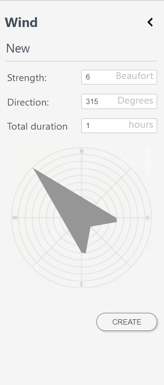

.. _simulate_w_live_site:

Using the 3Di Live Site
=========================

Through the 3Di live site (version 2.0) the models of your organisation can be loaded and simulations can be started. During the session others can follow the simulations 'live'. Also interventions can be done in the model during the simulation. Results are presented in real-time. All the steps from adjusting the input of water, to viewing the calculation results are described in this section.

For instructions how to login to and use the 3Di live site see :ref:`guide_to_portal`.

Start the simulation
--------------------

The simulation starts by pressing the **Play** button at the top of the screen. The calculation time is displayed next to the 'Play' button. 

To change the calculation speed (the real time speed at which your simulation is shown) see: :ref:`user_menu`.

.. _simulation_interventions:

Simulation interventions
-------------------------

The buttons at the mid left of the screen are used to interactively adjust the forcing of the model:

- add a :ref:`discharge_tool` (2D)
- add a :ref:`pump_tool` (2D)
- add :ref:`rain_tool`
- add :ref:`wind_tool`

The functioning of these buttons is described in the following sections.

NOTE: The result of forcing water is not visible until the simulation is running.

.. _discharge_tool:

Discharge point
^^^^^^^^^^^^^^^^^^

With the **Discharge tool** a constant source of water can be added to the model. Select the icon and change the amount of water you want to apply. In the dropdown menu you can change the unit. You can also change the duration of the discharge. Click **PLACE ON MAP** and click a location on the map that should be the source. The water will start flowing from this location over the 2D domain.
When you press the **Play** button the intervention will become active.

.. figure:: image/d3.6_discharge.png
	:alt: Discharge tool

.. _pump_tool:

Pumping point
^^^^^^^^^^^^^^^

With the **Pump tool** a constant sink of water can be added to the model. Select the icon and change the amount of water you want to pump out of the model. In the dropdown menu you can change the unit. You can also change the duration of the pumping. Click **PLACE ON MAP** and click a location on the map that should be the pump. The water will be pumped out from the 2D domain from this location (1D pumps should be added in the model schematisation). The water that is taken out of the model will not flow back into the model and is considered a loss.
When you press the **Play** button the intervention will become active.

.. _rain_tool:

Rainfall
^^^^^^^^^^^

Through the **Rain tool** icon, rainfall can be added to the model. The following Type's are available:

* **Constant**: a homogeneous event in both space and time across the entire model range.
* **Radar**: use historical rainfall data (only available in the Netherlands).
* **Design**: use a design event. This event is homogeneous over the entire model area and heterogeneous in time.

These three options for adding rainfall all cover the entire model area.

When choosing a **Constant** type of precipitation, the rain intensity (in mm/h) and duration of the rain must be defined. The rain intensity is uniform and constant in the given time frame.

The option **Radar** is only available in the Netherlands and uses historical rainfall data that is based on radar rain images. Providing temporally and spatially varying rain information. The Dutch Nationale Regenradar is available for all Dutch organisations that have the NRR module. On request, the information from other radars can be made available to 3Di as well. In order to apply this type of rain a historical time frame needs to be set. 

When choosing the option **Design**, a number between 3 and 16 must be selected. These numbers correlate to predetermined rain events, with differing return periods, that fall homogeneous over the entire model. Numbers 3 to 10 originate from `RIONED <https://www.riool.net/bui01-bui10>`_ and are heterogeneous in time. Numbers 11 to 16 have a constant rain intensity. When selecting a design rain the total rainfall and duration information will change in the tab.

For a more detailed description on rainfall, see: :ref:`rain`.

When the rainfall is active a cloud icon appears on the top right of the screen. Information about the rainfall event can be accessed by keeping the rainfall tab open. Active and past (inactive) events are shown in this tab 

.. figure:: image/d3.2_rainfall.png
	:alt: Rainfall event

.. _wind_tool:

Wind
^^^^^^

A compass card appears after clicking on the **Wind tool** icon. By clicking in the compass card a homogeneous wind field with a specific direction and speed can be set up for the whole model (v2). This direction can also be filled in numerically. The strength and duration of the wind can be changed. Because the wind is constant for the whole model you only need to press **CREATE**. When the wind is active a wind icon appears on the top right of the screen.

Breaches 
^^^^^^^^^

If breach locations are predefined in the model, these can be activated as follows:

#. Check whether breaches are turned on in the map layer menu. 
#. Zoom in to a breach location
#. By clicking a breach location a pop-up screen with settings for this breach appears.

.. figure:: image/d3.8_breach_location.png
	:alt: Breach location

To show the flow rate over time, select a breach location using the point information tool. 

Real time results during a simulation
-------------------------------------

By default, the **selection tool** (top left) is switched on. With it you can click anywhere on the map to visualize the time series at that location. Default water depth and water level will be shown. If the model contains groundwater that graph is also shown. 

The time series can all be downloaded in CSV format. The points over time that are shown are the points calculated by the 3Di calculation core and are independent from the output time step that the modeller has set.

.. figure:: image/d3.1_point_location.png
	:alt: Point selection

Also the height of a cross section can be displayed with the **Line-selection tool**, together with the water level in that transect. Click the start and end point in any place on the map for the cross section (within the 2D model domain).

.. figure:: image/d3.1_side_view.png
	:alt: Cross section selection
	
The side view shows the elevation in green and the water in blue. By hovering over the graph with the mouse, exact values can be seen. Keeping this graph open during a flood event will show you how the water level is slowly rising. Note that in the example also groundwater is available in the model indicating an extra blue line. 

Store results
--------------

Results can be stored by clicking **User menu** (top right) then clicking **Quit Simulation** and then **Quit, Store Results**. There are two options:

- Download results directly via the browser
- Store them to the lizard platform

Stored (raw) results can also be downloaded using the"3Di Models and Simulations" in the 3Di Modeller Interface, see: :ref:`view_model_results_with_modeller_interface`. Note that these raw results are only available for 7 days.

The options in Lizard storage are as follows:

- raw data and logging
- basic processed results
- arrival time map
- damage estimation (NL only)

The **Basic processed results** option includes the following derivations from simulation results for Lizard users:

.. figure:: image/d3.9_store_results.png
	:alt: Storing results

- Water level - temporal
- Water depth - temporal
- Maximum flow velocity
- Maximum rate of rise
- Maximum water depth
- Flood hazard rating

The **Damage estimation** option uses a module called *WaterSchadeSchatter* (currently only available in The Netherlands)
which provides two products derived from the maximum water depth.

- Damage estimation map
- Damage estimation table