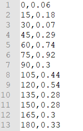
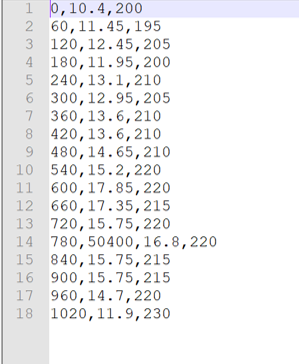

.. _simulate_api_qgis:

Using the Modeller Interface
=============================

To start simulating with the Modeller Interface, you first need to start up the **3Di API Client** plugin, load your model and add a scenario.

.. _start_up_api_qgis:

Start up the 3Di API Client
----------------------------

Start up the Modeller Interface. Click on **Plug-ins** from the menu bar and open the dropdown menu. Click on **3Di API Client** to start up the plugin.
For a guide on how to install the Modeller Interface or the API Client see :ref:`3di_instruments_and_downloads`.

*screenshot toevoegen*

.. _load_model_api_qgis:

Load model
------------

Load your model by clicking **start** in the 3Di API Client. In the pop-up window choose **Load from Web**.

*screenshot toevoegen*

.. figure:: image/d_qgisplugin_apiclient_start.png
    :alt: Load from web
	
*After providing the Base API URL and your username and password a connection is being made with the API.*

*The Base API URL is in most cases https://api.3di.live/v3.0/. If you want to connect to our second calculation center in Taiwan, the base API URL is https://api.3di.tw/v3.0/ . <-dit klopt niet meer toch?*

.. figure:: image/d_qgisplugin_apiclient_login.png
    :alt: Load from web
	
Users that have access to run simulations for more than one organisation will get a menu in which they choose the organisation: 

.. figure:: image/d_qgisplugin_apiclient_login_choose_organisation.png
    :alt: Choose organisation

Now choose **only simulate** (only option available at the moment):

.. figure:: image/d_qgisplugin_apiclient_choose_simulate.png
    :alt: Choose simulate 

	
Choose the model that you like to run simulations on, and click **Load model**:

.. figure:: image/d_qgisplugin_apiclient_login_choose_model.png
    :alt: Choose simulate 
	
On load of the model the following files are retrieved from the server:

- cells
- breaches (only when present in your model)

.. figure:: image/d_qgisplugin_load_model_cells_breaches.png
    :alt: Loaded model with Cells and Breach 

Cells represent the computational grid comprised of computational cells. This file can help analyze modelling results when used in an overlay with the model schematization. 
For theoretical information, see :ref:`grid`.

Breaches can be used for breach calculations. The number of the breach as shown in the map canvas is the number required in the wizard. Alternatively, you can also select a breach before starting the wizard, see :ref:`addleveebreaches`. This breach will then be used in the calculation. For theoretical information, see :ref:`breaches`.

Note: if the files have been downloaded before the Modeller Interface will use the cached version. 
		
	
Simulate
---------

To start a simulation, click on the **SIMULATE** button. Next, the following window will be shown:

.. figure:: image/d_qgisplugin_apiclient_runningsimulations.png
    :alt: Choose simulate 
	
This window shows an overview of current simulations for the specific organisation. In this panel simulations can be started and stopped. 

To stop a simulation, select the simulation you want to stop and click on **Stop Simulation**. 

To start a simulation you can either use 'Load template' or 'New simulation'. Both options will enable you to fill in scenario information and start a simulation.

Using **Load template** enables you to re-use a previously stored scenario template. All the previous defined settings are automatically filled into the scenario information. This information can still be edited, before you run the simulation.

Selecting **New Simulation** will start a simulation with a new scenario that still needs to be filled in. After clicking 'new simulation' the start screen of the wizard is shown:

.. figure:: image/d_qgisplugin_apiclient_start_screen_new_simulation.png
    :alt: Choose new simulation 
	
In this window the various options, to be used in the simulation calculation, can be defined.

**Boundary conditions**
Not configurable yet. Boundary conditions are taken from the spatialite directly.

**Initial conditions**
To define the use of a (previously) saved state or initial water levels in 1D, 2D or Ground water.

**Laterals**
To select laterals to use in the model.

**Breaches**
To select a breach to open in the model.

**Precipitation**
To define precipitation in the model.

**Wind**
To define wind in the model.

**Multiple simulations** (becomes available when using either breaches or precipitation)
To define multiple simulations with rainfall or breaches. Useful when simulating multiple events on the same model. 

**Generate saved state after simulation**
To save the end result of the simulation as a saved state.

**Post-processing in Lizard**
This is a feature that is only available for users of organisations that have a Lizard account. It enables you to store the results in the cloud and it triggers automated post-processing of water depth, water levels, time of arrival, flood hazard rating and damage estimations maps. 
See :ref:`simulate_api_qgis_post_processing` on how to use post-processing.

**Check** the options you want to be used in the calculations of your simulation, and click **Next**.
    
The next step is to name the simulation. You and other users within your organisation will be able to find this simulation and its results based on the name. It can also be used to look up simulations later. 

Adding tags can clarify for other users what your simulation calculated or can be used to assign a simulation a certain project name or number.

.. figure:: image/d_qgisplugin_apiclient_new_simulation.png
    :alt: Choose new simulation 

The first step in any simulation is choosing the simulation duration:

.. figure:: image/d_qgisplugin_apiclient_choose_duration.png
    :alt: Choose duration
	
The next steps depend on the selection of options from the initial screen of the wizard. Unchecked options will be omitted by the wizard.

.. _simulate_api_qgis_initial_conditions:

Initial conditions
"""""""""""""""""""""

Initial conditions either refer to the use of saved state file, or the use of initial water level in 1D, 2D or groundwater (2D). 

.. figure:: image/d_qgisplugin_apiclient_initialconditions_start.png
    :alt: Choose initial conditions
	
1D options:

- Predefined: this refers to the initial water level as defined in the column initial_waterlevel in the connection nodes in the spatialite. 
- Global value: this would be a generic initial water level value in m MSL which is applied in all 1D nodes of the model.

2D Surface Water options:

- Raster: this refers to the initial water level raster as uploaded with the model to the model databank.
- Aggregation settings: This can min, max or average 
- Global value: this would be a generic initial water level value in m MSL which is applied in all 2D nodes of the model.

2D Groundwater options:

- Raster: This refers to the initial water level raster as uploaded with the model to the model databank.
- Global value: This would be a generic initial water level value in m MSL which is applied in all 2D ground water nodes of the model.

.. _simulate_api_qgis_laterals:

Laterals
""""""""""

Laterals can be uploaded using .csv format for either 1D or 2D. 

.. figure:: image/d_qgisplugin_apiclient_laterals_start.png
    :alt: Choose laterals 

The CSV file format is generated by a right-mouse click on table: v2_1d_lateral. Then choose export --> save features as --> 

Select csv as output format. Choose a filename and location to store and click OK. the file should like like this:

.. figure:: image/d_qgisplugin_apiclient_laterals_export_csv_example.png
    :alt: Export laterals as csv

*Important note: Units in the CSV are seconds (for time steps) and m3/s (for the flows).*

.. _simulate_api_qgis_breaches:

Breaches
"""""""""

A breach can be selected using the menu below:

.. figure:: image/d_qgisplugin_apiclient_breaches.png
    :alt: Breaches 

When choosing the model to calculate in a breaches file was downloaded from the server. The number of the breach as shown in the map canvas is the number required in the wizard. Alternatively, you can also select a breach before starting the wizard. This breach will then be used in the calculation. 

.. _simulate_api_qgis_precipitation:

Precipitation
""""""""""""""""""

There are several options to define a precipitation event for your simulation. In the drop-down menu, one can choose Constant, Custom, Design and Radar events. For all events an offset can be defined. The offset is the duration between start simulation and the start of the rainfall event. 

.. figure:: image/d_qgisplugin_choose_type_of_precipitation.png
    :alt: Choose type of precipitation

When choosing a **Constant** type of precipitation, the stop after and rain intensity (in mm/h) must also be defined. The stop after is the duration between the start of the simulation and the end of the rain event. The rain intensity is uniform and constant in the given timeframe. The rain intensity preview provides the rain intensity throughout the simulation in the form of a histogram. 

.. figure:: image/d_qgisplugin_apiclient_rain_constant.png
    :alt: Choose constant rain

When choosing the option **Custom**, the event is defined in a CSV-file. The format is in minutes, and the rainfall in mm for that time step. Please keep in mind that the duration of the rain in the custom format cannot exceed the duration of the simulation. The interpolate option will gradually change the rain intensity throughout a time series. Without the interpolate function the rain intensity will stay constant within a time step and will make an abrupt transition to the next time step.

.. figure:: image/d_qgisplugin_apiclient_rain_custom.png
    :alt: Choose custom rain

When choosing the option **Design**, a design number between 1 and 16 must be filled in. These numbers correlate to predetermined rain events, with differing return periods, that fall homogeneous over the entire model. Numbers 1 to 10 originate from `RIONED <https://www.riool.net/bui01-bui10>`_ and are heterogeneous in time. Numbers 11 to 16 have a constant rain intensity: 

Rain 11 statistically occurs once every 100 years. The duration of this event is 1 hour with a constant rain intensity of 70 mm/h. (T= 100.0 year, V=70 mm, Standard rain event (local) from Delta Programme 2019).

Rain 12 statistically occurs once every 250 years. The duration of this event is 1 hour with a constant rain intensity of 90 mm/h. (T=250.0 year, V=90 mm, Standard rain event (local) from Delta Programme 2019).

Rain 13 statistically occurs once every 1000 years. The duration of this event is 2 hours, with a constant rain intensity of 80 mm/h. (T=1000.0 year, V=160 mm, Standard rain event (local) from Delta Programme 2019).

Rain 14 statistically occurs once every 100 years. The duration of this event is 48 hours, with a constant rain intensity of 2.5 mm/h. (T=100.0 year, V=120 mm, Standard rain event (regional) from Delta Programme 2019).

Rain 15 statistically occurs once every 250 years. The duration of this event is 48 hours, with a constant rain intensity of 2.7 mm/h. (T=250.0 year, V=130 mm, Standard rain event (regional) from Delta Programme 2019).

Rain 16 statistically occurs once every 1000 years. The duration of this event is 48 hours, with a constant rain intensity of 3.4 mm/h. (T=1000.0 year, V=160 mm, Standard rain event (regional) from Delta Programme 2019).

These so-called design rain events are time series, which are traditionally used to test the functioning of a sewer system in the Netherlands.

.. figure:: image/d_qgisplugin_apiclient_rain_design.png
    :alt: Choose design rain

**Radar - NL Only** is only available in the Netherlands and uses historical rainfall data that is based on radar rain images. Providing temporally and spatially varying rain information. The Dutch `Nationale Regenradar <https://nationaleregenradar.nl/>`_ is available for all Dutch applications. On request, the information from other radars can be made available to 3Di as well.

.. figure:: image/d_qgisplugin_apiclient_rain_radar.png
    :alt: Choose radar rain

.. _simulate_api_qgis_multi_sim:

Multiple simulations
"""""""""""""""""""""
This option becomes available when using either breaches or precipitation. You can define multiple simulations with different rainfall or breaches. Useful when simulating multiple events on the same model.

.. _wind_apiclient:

Wind
"""""""""

To define wind in the model. Wind in 3Di applies to 2D surface water. Read more about :ref:`wind_effects` here.

You can choose between a Constant or a Custom type of wind. For both events an offset and a drag coefficient can be defined. The offset (start after) is the duration between the start of the simulation and the start of the wind event. The drag coefficient has a default value of 0,005. By increasing the drag coefficient, you increase the influence of the wind. 

When choosing a Constant wind event, the stop after, wind speed and direction must also be defined. The stop after is the duration between the start of the simulation and the end of the wind event. 
The (meteorological) wind direction is defined as the direction from which the wind originates, measured in degrees clockwise from due north. Therefore, wind blowing toward the south has a direction of 0 degrees. You can either use the wind rose to depict which way the wind is blowing, or enter the direction manually. 

.. figure:: image/d_qgisplugin_apiclient_wind_constant.png
    :alt: Choose Constant wind

When choosing a Custom wind, the CSV format is minutes, wind speed in m/s and wind direction, both for that time step. The interpolate options will gradually change the wind speed or wind direction throughout a time series. Without the interpolate functions the wind speed and wind direction will stay constant within the time steps and will make an abrupt transition to the next time step.

.. figure:: image/d_qgisplugin_apiclient_wind_custom.png
    :alt: Choose Custom wind

After choosing all the settings check the overview, press Next and Add to Queue. The simulation will start up when there is a session available on the servers within your organisation.

.. figure:: image/d_qgisplugin_apiclient_preview_simulation.png
    :alt: Overview new simulation

.. _simulate_api_qgis_post_processing:

Post-processing in Lizard
----------------------------

Storing your results in Lizard and automated post-processing is only available for users of organisations with a Lizard account.
This function will generate maps of water depth for each output time step, a maximum water depth for the whole simulation water levels for each output time step, a maximum water level for the whole simulation, time of arrival, flood hazard rating and damage estimations. 
The damage estimations are only available in the Netherlands. Contact us at servicedesk@nelen-schuurmans.nl if you like to use this option and don't have access yet.

.. figure:: image/d_qgisplugin_apiclient_postprocessing_lizard.png
    :alt: Example CSV
	
*Basic processed results*

Stores the 3Di output files in the Lizard platform:

- Result NetCDF (containing actual values)
- Aggregate NetCDF (availability and content dependent on user settings. required for water balance tool in Modeller Interface)
- Grid administration (gridadmin.h5 file. required to load NetCDF results in Modeller Interface)
- Calculation core logging (A zip containing logfiles)

As a service, the following maps are available in Lizard:

- water depth maps per output time step
- maximum water depth map
- flood hazard rating
- rise velocity
- water level
- max water level
- max velocity
- rainfall 

All maps can be downloaded as GTiff, either via the interface demo.lizard.net or via the lizard API.

*Arrival time map*

When this is checked a map with arrival time is being calculated showing the time of arrival of water per pixel in hours. 

*Damage estimation*

Only available in the Netherlands: automated estimate of damage as a result of flooding. Takes into account water depth and duration of flood. Result is the following damage maps:

- Water depth (WSS)
- Damage (direct)
- Damage (indirect)
- Total damage

And a damage summary in csv format. For more information check the documentation here: https://docs.3di.lizard.net/d_results_from_lizard.html

.. _simulate_api_qgis_results:

Results
----------
	
For information on how to get, view and analyse results, see :ref:`view_model_results_with_modeller_interface`.

old table
-----------

The most used API options are included in the newest version of the plugin. Important consideration is a difference between API v1 and v3 how initial waterzylevels, laterals and boundaries are handled. The current status is as follows:

============================= =========================== =========================================== ==================================
Forcings                        Live site                  3Di API Client Wizard                       OpenAPI Client
============================= =========================== =========================================== ==================================
Boundary conditions            SQLite                      SQLite                                      SQLite, can be overwritten*
Initial water level 2D         SQLite, always 'max'        Add raster/global in wizard                 Add raster/global to simulation
Initial water level 1D         SQLite                      Add predefined/global in wizard             Add predefined to simulation
Initial water level GW         SQLite                      Add predefined/global in wizard             Add predefined to simulation
Laterals  1D and 2D            Not used                    Add in wizard with CSV**                    Add CSV
Breaches			           Open in gui                 Open breach using wizard                    Open breach 
Precipitation                  Add using live site         Add using wizard***                         Add to simulation     		
Wind                           Add using live site    	   Add using wizard			                   Add to simulation
Control Structures	           Not used from SQLite        Not used from SQLite                        Add to simulation  
DWF (inflow)                   Not used from SQLite        Add as laterals, use dwf calculator         Add to simulation as lateral CSV
Settings                       SQLite                      SQLite                                      SQLite, can be overwritten
============================= =========================== =========================================== ==================================

This is a temporary situation, simulation templates will be implemented on our servers. In these templates users will be able to predefine the forcings and settings that users want to use in a model. A model can contain multiple simulation templates

*When overwriting the boundary conditions, both 1D and 2D need to be supplied 

**When using the laterals as a CSV note that units of the laterals in the wizard are expected in m3/s

***CSV files can contain up to 300 entries

This means that for *boundary conditions* nothing changes between API v1 and v3. Values are taken from the spatialite. The following requirements still hold for the boundary conditions: 

- number of entries have to be exactly the same
- time has to be the same value (e.g. al time series have 0, 10, 20, 40 as time. It is not possible to have a boundary condition with the time as 0,15,20,40)

*Initial water levels* are taken from the spatialite if the users selects this in the wizard, see the section on initial conditions below for a 'how to'. 

*Laterals* are not taken into account when added to the spatialite. The user has to add them to the API call for them to be taken into account. See the section on laterals below for a 'how to'. 

*DWF (inflow)* In API v1 inflow on connection nodes is being calculated based on nr of inhabitants per impervious surface and the mapping to the connection nodes. In API v3 users can calculate the inflow separately using the dwa calculator tool. The output of this tool is a csv with lateral inflow. This csv can be used in the 3Di API Client. In this approach is more transparant and generic usable for different countries.

