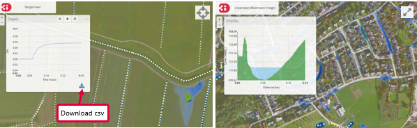
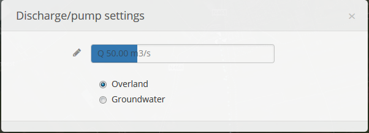

.. _running_model:

Running the 3Di model
=====================

This section helps you get started with interactive simulation with the integral 3Di modeling tools. Through the 3Di portal (version 2.0) the models of your organization can be loaded and simulations can be started. During the session others can follow the simulations 'live'. Also interventions can be done in the model during the simulation. Results are presented in real-time. All the steps from adjusting the input of water to viewing the calculation results are described in this section.

*The 3Di portal supports both version 1.0 as version 2.0 models. When a functionality is specifically valid for only one version, this is indicated with* **v1** *or* **v2** *.*

Start the simulation
--------------------

The simulation starts by pressing the *Play* button at the bottom right of the screen. The calculation time is displayed next to the *Play* button. 

.. figure:: image/d3.1_start_simulation.png
	:alt: Start a simulation

By default, the point information tool is switched on. With it you can click anywhere on the map to visualize the time series at that locations. The time series can also be downloaded in CSV format (figure below on left).

Also the height of a cross section can be displayed, together with the water level in that transect. Click for both starting and ending point of the cross section in any place on the map (within the model domain, figure below on right).

The buttons at the bottom left of the screen are used to interactively adjust the forcing of the model. The functioning of these buttons is described in the following sections.

NOTE: The result of forcing water is not visible until the simulation is running. The color scheme of the water depth is adjustible through the :ref:`layers_menu` under *Animation* at *WMS color range*.

Rainfall
--------

Through the precipitation icon rainfall can be added to the model. When clicking on the map, a blue circle and the icon of a raincloud appear on the map. The size of the raincloud is proportional to the size of the window. Zooming out will result in a larger raincloud and vice versa. Using the menu at the bottom left of the screen the intensity of rainfall can be adjusted.

The above example is about the so-called *local only* rain event. By pressing the *additional settings* button (wrench icon) a new menu opens with different options for the rainfall:

* **Radar**: use historical rainfall data.
* **Design**: use a design event. This event is homogeneous over the entire model area and heterogeneous in time.
* **Constant**: a homogeneous event in both space and time across the entire model range.

These three options for adding rainfall all cover the entire model area, in contrast to the *local only* event.

When the rainfall is active a cloud icon appears on the bottom right of the screen. Information about the rainfall event can be accessed by clicking this icon.

.. figure:: image/d3.2_rainfall.png
	:alt: Rainfall event

Pump (or constant discharge)
----------------------------

With the tap icon a constant source (or sink) of water can be added to the model. Select the tap and click at a location on the map to add the pump. You can then change the rate (in m3/s) you want to apply. A positive value means water is added to the model, a negative value means water is taken out of the model. The water that is taken out of the model will not flow back into the model and is considered a loss. The icon which is displayed on the map changes from a tap into a hose for negative values. 

By pressing the *additional settings* button (wrench icon) a new menu opens with more options for changing the pump settings. Here it can be selected whether the pump will add (or extract) water from the surface water (overland) or the groundwater. The latter is only possible if the model contains a groundwater component (**v2**). Using the marker icon exact values can be chosen. 

Flood Fill (v1)
---------------

With the droplet icon part of the model can be put under water, a so called flood fill (**v1**).

* Choose the water level (in meters) and click on the map.
* Starting at the chosen location, the model is filled with water up to the water level selected. The flood fill option will look for a flow path (using the DEM).
* The result of the flood fill becomes visible as soon as the user starts the calculation.

By clicking the *additional settings* button (wrench icon) an additional settings becomes available. It can be selected whether the flood fill value is considered an absolute value (e.g. relative to a global reference level, like MSL), or as a relative value (i.e. relative to the local elevation).

Customize model layers (v1)
---------------------------

After choosing a foreground layer (:ref:`Layers_menu`) various 2D layers can be adjusted by clicking on the drawing icon (**v1**). It depends on the model which layers can be adjusted. By selecting the *additional settings* button (wrench icon), the layer that needs to be adjusted and the value can be selected.

Using the polygon button on the left of the screen, a polygon can be drawn on the map. The polygon is finalized when either clicking on the first point again or double clicking. In the plane the new value (visible at the bottom of the screen) is used in the rest of the calculation for the specific layer that was adjusted. The changes take effect as soon as the user starts the calculation.

.. figure:: image/d3.5_customize_layers.png
	:alt: Customize model layers

Wind (v2)
---------

A compass card appears after clicking on the leaf icon followed by clicking on the wrench icon. By clicking in the compass card a homogeneous wind field with a specific direction and speed can be set up for the whole model (**v2**).

.. figure:: image/d3.6_wind.png
	:alt: Wind speed and direction

1D network
----------

Channels and structures can be included as 1D elements in the model. The channels show the direction of flow with the help of moving points. The direction and speed are based on the flow velocity in the channel. The different sizes of the points are based on the flow rate. The results (flow rate, water level, waterdepth and flow velocity) are available at the structures by selecting them.

.. figure:: image/d3.7_1D_network.png
	:alt: 1D network

It is also possible to adapt some properties of structures during the calculation. This includes among others the closing of a culvert or increasing the pumping capacity.

Breaches (v2)
--------------------

If breach locations are predefined in the model, these can be activated as follows (**v2**):

#. Make the breach locations visible by clicking the globe icon, *Structures* and *Breaches* in succession. The breach locations will show as red points when zoomed in far enough. 
#. By clicking a breach location a pop-up screen with settings for this breach appears.
#. Using the gear icon the breach can be opened and settings can be altered.

.. figure:: image/d3.8_breach_location.png
	:alt: Breach location

To show the flow rate over time, select a breach location using the point information tool. 

Advanced settings
-----------------

Advanced settings are available by clicking the pi icon in the top right corner. In this menu some advanced settings can be altered. 

.. figure:: image/d3.9_advanced_settings.png
	:alt: Advanced settings

.. _reset_model:

Reset model and log out
-----------------------

After applying changes to the model, it can be reset to the default situation by clicking *Reset model* in the :ref:`user_menu`. When you are finished showing or running the model you can turn of the *Director* option and log off. The session will remain available for two hours. If you want to end the session, choose *Quit session* before logging off. 