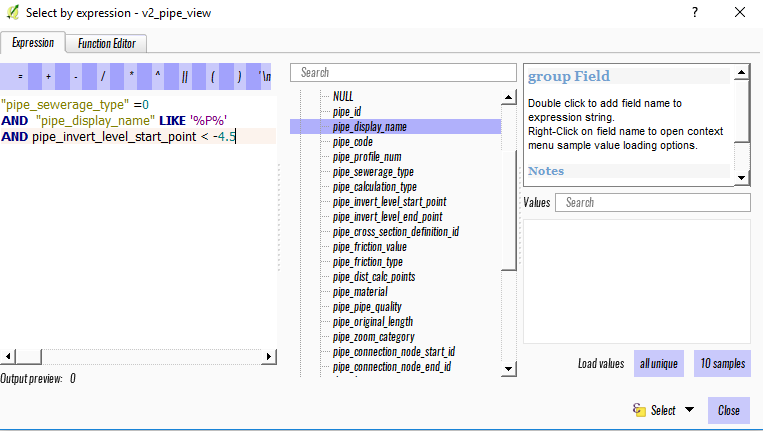

.. _guide_to_modeler_interface:

Guide to the 3Di QGIS plugin 
============================

Installation
------------

Releases of the plugin are available at the Lizard QGIS plugin repository. To add the plugin open QGIS and via the menu bar go to `Plugins > Manage And Install Plugins'. Go to 'Settings' ('extra' in Dutch version). Add a plugin repository ('plug-in opslagplaatsen' in Dutch) with name: 'Lizard' and URL: https://plugins.lizard.net/plugins.xml and reload. Go to 'all' and install the plugin by selecting '3di toolbox'. New versions of the plugin are upgradeable via the same menu.

The plugin works with QGIS 2.18 (LTR) and up, it is recommended to use the latest version of the 2.18 release (the plugin is tested against this version).

Under Windows, it is recommended to use 64-bit version of QGIS (a compiled 64-bit version of the netCDF library is included. For the 32-bit version of QGIS you have to install/ compile a version of the python netCDF library under QGIS yourself).

How to use
----------

You can access the plugin functionality via the plugin menu in QGIS, or, via the buttons on the toolbar (see screen shot above). The buttons on the toolbar are respectively for: (1) about information, (2) adding 3Di results (data sources), (3) opening the toolbox, (4) opening the graph tool, (5) opening the side view tool.

Adding data sources
^^^^^^^^^^^^^^^^^^^^

For most use cases you will want to add data sources:

1.	Click on the Select 3di results button.
2.	Select and load your Spatialite and netCDF files.

The plugin will automatically generate the network layers from the netCDF and add it to the map if you select a netCDF with geometry information. 

Graph tool
^^^^^^^^^^

The graph tool is for visualizing time series. Click on the graph tool button to open it in a dock. You can now select features with the standard selection toolbar:

.. figure:: image/d_qgis_selection_tools.png
	:scale: 100%
	:alt: Selection tools
on the map if you have an active layer and add them to the graph using the Add button. Multiple features are supported. 

It is also possible to use advanced selection criteria with the select by attributes. 

This example selects all pipes where the sewerage type is CSF, invert level is below -4.5 and the display name contains a 'P'.

The following layers are supported to select from:

*    the network layers generated from the netCDF
*    v2 views
*    (sewerage views)
The following parameters can be selected for pipes:

*    Velocity
*    Discharge
*    Wet cross section area
*    Discharge pump
The following parameters can be selected for manholes:

*    Volume
*    Water level
*    Rain intensity
*    Wet surface area
*    Discharge lateral
*    Infiltration rate simple
*    Maximum water level
The graph tool has built-in support for adjusting the axes and also for exporting to various formats. Right-click on the graph to see the options.

Here an example of the graph tool:

.. figure:: image/d_qgis_graph_tool.png
	:scale: 100%
	:alt: Graph tool in QGIS
By right clicking on the graph, many styling options are shown. Feel free to experiment.

On the right hand side, in the legend, you can click one of the colors of the lines. The selected line will highlight in the graph. Also graph lines can toggled on and off.

Animation
^^^^^^^^^^^^^^^^
The 3Di toolbox comes equiped with an animation toolbar:

.. figure:: image/d_qgis_animation_toolbar.png
	:scale: 100%
	:alt: Animation toolbar in QGIS
To activate the animation toolbar click **Animation on**. 
The following layers will be added to the layers panel:

*    Node results groundwater
*    Node results
*    Line results groundwater
*    Line results

In case of a 1D model an animation for dischare looks like this:

.. figure:: image/d_qgis_animation_discharge.png
	:scale: 50%
	:alt: Animation toolbar in QGIS

This animation can be done for nodes, lines for both overland flow as groundwater flow.

**Note 1** The animation works only if you click and drag the animation slider with your mouse.
**Note 2** There are two drop down boxes next to one another. The first is for animation on the flow lines, the second is for animations on the connection nodes. 

Side view
^^^^^^^^^^

Currently side views only work if you have loaded a Spatialite and a netCDF (see Adding data sources). Make sure you generate a new set of lines and nodes from the netCDF after selection.

1.	Click on the side view button to open the side view tool. This will generate the necessary layers.
2.	Click on **Choose sideview** trajectory and click on a feature to select a start location. Click on another feature to select an end location and the tool will draw a path. Note: in channels is still a bug related to the length
3.	Use the slider in the animation toolbar to view the water level through time.

.. figure:: image/d_qgis_side_view_example.png
	:scale: 50%
	:alt: Side view example in QGIS

	
Toolbox
----------------------------

Step 1 - Check data
^^^^^^^^^^^^^^^^^^^^

No automatic data checks are available 

Step 2 - Convert and import data
^^^^^^^^^^^^^^

**Sufhyd Import**

Sufhyd is a Dutch standardized format for transfering data of sewersystems for hydraulic analyses.
After opening the tool, select a sufhyd file and the database to import the data into. The database selection is based on the database links you have created in QGIS. To add a Postgres database connection, first go to the left toolbar in QGIS and select the Elephant. To add a Sqlite database, select the feather.
Make sure you use an (empty) database created by the 3di commandline Turtle tools (otherwise the database will not be recognized by 3di).
Below a list of objecttypes that are parsed by the import. Some objects are ignored (there will be a warning about this in the logfile). Also some fields are ignored by the import, also this will be mentioned in the logfile if data is found.
After the import a message will be showed with a summary of the number of data errors and warnings. A more detailed summary can be found in the QGIS log (in the right-below corner of QGIS) and a full log can be found in the same directory as original sufhyd under the name 'import_sufhyd.log'.
List of parsed objects:

*    Manhole (*KNP)
    *    The number of inhabitants will be added as Impervious surface. 
    *    Attention: the shape of the manhole is refered as 'rnd' = round, 'sqr' = square and 'rect' = rectangle
*    Pipe (*LEI)
    *    The number of inhabitants will be added as Impervious surface
*    Pumpstation (*GEM)
    *    If multiple stages are defined, this will be transformed into seperate pumpstations. Up to 10 stages are supported
*    Weir (*OVS)
    *    Flow direction (str_rch) is translated into discharge coefficients with a value of 0
    *    An end node with boundary condition is not (yet) automatically added.
*    Orifice (*DRL)
    *    Flow direction (str_rch) is translated into discharge coefficients with a value of 0
*    Boundary (*UIT)
    *    The waterlevel will be the average definition is taken (bws_gem), if not present the summer waterlevel is used and otherwise the winter waterlevel.
*    Extra manhole storage (*BOP)
    *    The defined storage area is added to a manhole on the bottomlevel of the manhole. The defined bottom_level of the storage (niv_001) is ignored.
    *    Only one storage area is supported
*    Drainage area/ Impervious surface (*AFV)
*    Linkage nodes (*KPG)
    *    The 'fictive' linkages (with typ_gkn == 01) are ignored, only real nodes are combined.
    *    The second node (ide_kn2) is removed. Impervious surfaces and pipes linked to the removed node are redirected to the first node. Extra manhole storage will be lost.

Step 3 - Modify Schematisation
^^^^^^^^^^^^^^^^^^^^^^^^^^^^^^
**Guess indicators**
Guess indicators will 'guess' for values based on other values.
After opening, the database can be selected. The database selection is based on the database links you have created in QGIS. To add a Postgres database connection, first go to the left toolbar in QGIS and select the Elefant. To add a Sqlite database, select the feather.
Currently supported are:

*    Pipe friction: Guess friction based on pipe material.
*    Manhole indicator: Add flag to manhole if it is pumpstation basin, an boundary or just a manhole.
*    Manhole area. Calculates the connection node storage area based on the shape, length and with of a manhole

The processing can be performed only for the fields that are empty or overwrite the current values (the guess manhole area can only be used on empty fields).

Step 4 - Convert schematisation
^^^^^^^^^^^^^^^^^^^^^^^^^^^^^^^

No automated tools available at this moment.

Step 5 - Post-process results
^^^^^^^^^^^^^^^^^^^^^^^^^^^^^^

This part of toolbox contains several custom scripts:

*    calc_manhole_statistics.py: calculate statistics on manholes and connection nodes
*    calc_structure_statistics.py: calculate statistics on structures
*    generate_netcdf_layer.py: calculate netCDF layer again if you haven't done so

These functions are included in the statistical tool for sewerage model and will be deprecated soon.

Statistical tool sewerage models
--------------------------------

For easy check of sewerage results a statistical tool is included in the plugin. It summarizes results from the NetCDF and plots them on the map. 

Metadata statistics
^^^^^^^^^^^^^^^^^^^
Not all statistics can be calculated from the aggregation NetCDF. To see which NetCDF is used to calculate statistics, either aggregation or standard NetCDF, you can open this table.

.. figure:: image/d_statistics_plugin_metadata_table.png
	:scale: 100%
	:alt: Statistics table for the plugin

In the screenshot of an example table. it contains the following fields: id, table, field, from_agg, input_param, time_step. **id** shows the id in this table, **table** shows the table name in the sqlite that is referred to. **Field** refers to the field name in the table in the sqlite that data is coming from. **From_agg** containts a 1 or a 0. If it is a 1, it means the data is extracted from the aggregation NetCDF, if it is 0, it is extracted from the standard NetCDF. The standard NetCDF contains an actual value per output time step. This **time_step** (in seconds) is important to assess the value of the statistics. E.g. an output of 1800 means that every half an hour an actual value is taken from the NetCDF. For calculation duration of Water on Street this means in the above shown example that every half an hour a value is known. We advise to use a smaller time step to analyse the model for this detail. 

Manholes
^^^^^^^^

**Maximum waterdepth in the streets** is calculated as follows:
$ max(h(t_{n} ))-SL  $
Where SL stands for Surface Level
**Waterdepth in manholes during the last timestep** 
$ h(t_{max} )-MBL $
with MBL=manhole bottom level
**Filled percentage of manhole storage areas**
$ (h(t_{max} )-MBL)/(SL-MBL) * 100\% $
with MBL = manhole bottom level and SL = Surface Level

Duration of water on streets (with SL=surface level):
$ COUNTIF((h(t_{n} )-SL)>0)* \delta t_{avg} $
with SL = Surface Level

Pipes
^^^^^^^^^^

**Discharge (max) ** is maximum discharge in a pipe. **Velocity (max) ** is maximum velocity in a pipe. 

**gradient** is calculated as follows:
:math:`| h_{pipestart} - h_{pipeend} | / l_{pipe}`

Where h = water level and l = geometrical length of pipe
To determine the maximum discharge the timestep with the absolute largest discharge is determined first: 

$ Q_{(t)} $ if  $ \Sigma |Q_{(t)}|  $  is maximal 

Flow velocity during last timestep
$ u(t_{max} ) $

Flow velocity is shown for the whole system but also seperate for Dry Weather Flow and Combined Sewer Flow, and Storm Water Flow. 

Pumps
^^^^^^^^
Q_cap = pumpcapacity in l/s

**Percentage of maximum pumpcapacity** during last timestep:
Q(t_max )/(Q_cap/1000)∙100%

**Max percentage pumpcapacity**
(MAX(Q(t_n )))/(Q_cap/1000)∙100%

**Total pumped volume**
〖VOL〗_tot=∑_(t=0)^(t_max)▒(Q(t)) ∙ ∆t_avg

**Duration of maximum pump capacity (in hours)**
〖VOL〗_tot/(Q_cap/1000)/3600 

Weirs
^^^^^^

**Overflow volume:**
∑_(t=1)^(t_max)▒(Q(t)) ∙ ∆t_avg

**Positive overflow volume**
∑_(t=0)^(t_max)▒(Q(t)>0) ∙ ∆t_avg

**Negative overflow volume**
∑_(t=0)^(t_max)▒(Q(t)<0) ∙ ∆t_gem

**Overflow hydraulic gradient**
h_(s,start)= 〖WL〗_(max,start)-crest_level 
h_(s,end)= 〖WL〗_(max,end)-crest_level 

**Lay-out overflow gradient**
MAX(h_(s,start),h_(s,end))

**Maximum overflow discharge**
MAX(|Q_n |)

**Maximum overflow velocity**
MAX(|u_n |)