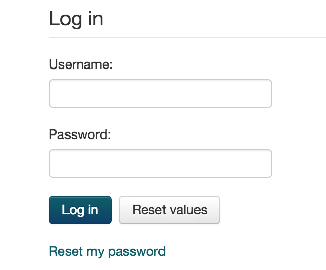
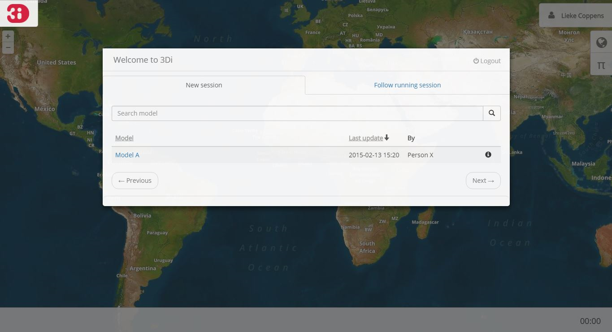
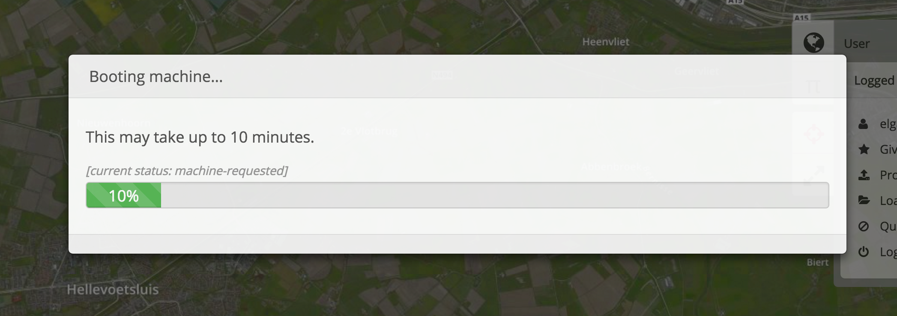
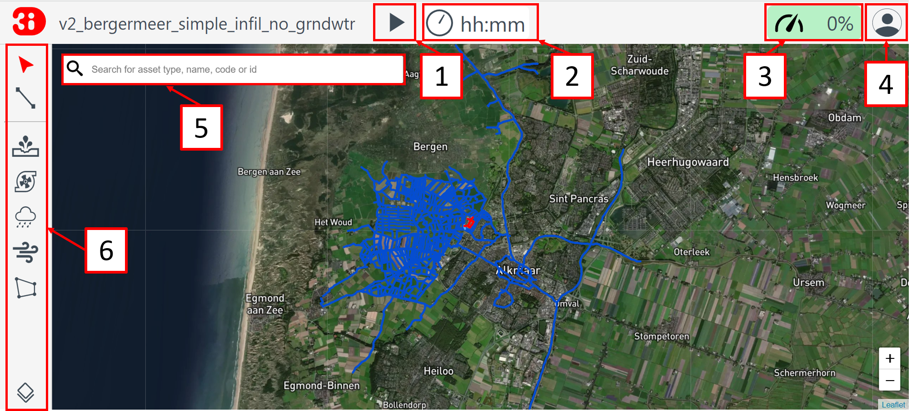
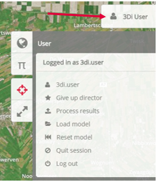
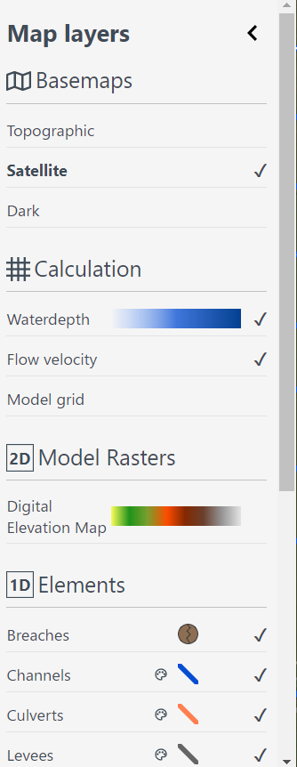
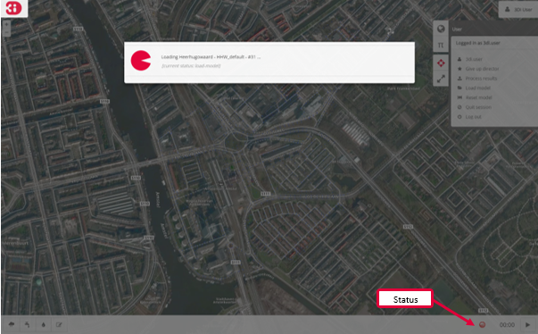

.. _guide_to_portal:

Guide to the 3Di portal
=======================

Login
------

Follow the steps below to access the 3Di portal:

#) Start the internet browser (Chrome or Firefox) and go to: https://3di.lizard.net/ 
#) Log in with your username and password.

	* Username and password can be requested via servicedesk@nelen-schuurmans.nl.
	* You can clear the fields by clicking the **Reset values** button.
	* Forgot your password? Request a new password via **Reset my password**.

	
Welcome to 3Di
--------------

After logging in to the 3Di portal, the screen *Welcome to 3Di* will show:

In this screen, there are two possibilities:

* Start a new session using the *New session* tab.
* Follow an ongoing session via the *Follow running session* tab.

Start a new session
--------------------

Select the *New session* tab and select the model you want to start.

* A new session will be started.
* The approximate time it will take to start the machine is shown when **Booting machine**.
* It may take several minutes to load the model.

*For each organization, the number of simultaneous sessions is limited according to the agreement (contract). If the limit is reached, the message "Your organization is already running X sessions" will show. The amount of server time used is subtracted from the time available within the agreement.*

Following a session
--------------------

Through the tab *Follow running session* an active session of your organization can be followed. The number of followers of a session is not limited.

Main session
------------

When starting or following a session, the model will show in the complete extent. On the top left you can see the name of the loaded model, and if applicable, the revision number. At the top right you can see the user name with which you logged in. The map is zoomed in on the model area.

If the model contains 1D-elements, they are immediately visible. Depending on which 1D elements are present in the model, you will see:

* **Watercourses** (light blue dots).
* **Structures**, such as weirs, culverts and pumping stations.
* **Sewer pipes** (red dots for dry weather flow, blue dots for rainwater flow).
* **Calculation points** (white and grey dots).

For the visualization of the 2D domain of the model, see the :ref:`layers_menu`.

.. _user_menu:

User menu
----------

Click the user name at the top right of the screen to show the user menu. The user menu has the following options:

* **Give up director status** (see :ref:`director_status`).
* **Process results** to archive the results of the run.
* **Load model** to load another (version of the) model (see :ref:`load_model`).
* **Reset model** to reset the model (see :ref:`reset_model`).
* **Quit session** to end the current session (NOTE: After closing the session it may take several minutes until a new session can be started).
* **Logout** to logout the user (NOTE: After logout, the session will stay available for 2 hours for other users of the same organization).

.. _director_status:

Director status
----------------

After starting a new session you'll be made *Director* automatically. Other users can follow the director via the *Follow running session* tab. A session can be followed by more than one user at once but only one user, the director, can run and adjust the model. A follower can take over the session by clicking on the *Director* option in the user menu. The name of the director of the session will be displayed, so everybody can see who the director is. The director can also give up his status via *Give Up director* option. When another user is director, the star icon will be displayed on the bottom right. 

*Time out
After 30 minutes of inactivity you will automatically lose your director status. After two hours of inactivity, the session will be closed.*

.. _layers_menu:

Layers menu
----------------

Click on the globe at the top right of the screen. The layers menu appears. One of the options is to visualize the 2D domain of the model, on the basis of the DEM (height map):

* Click on **Foreground** and then **DEM** (1).
* The 2D model domain is now visible. The green color represents lower values, orange represents higher values (2).
* By clicking again on **DEM** you can make this map layer invisible again.
* Under the **Foreground** tab, also the other 2D layers are displayed, if used in the model.

In the *Animation* menu you will find the options to customize the color scaling of water depth and to adapt the interpolation method in the display:

* **Linear interpolation**: In a linear interpolation the water levels that are shown on the map are linearly interpolated between the cells and the result is visually more attractive. This is the default.
* **Nearest interpolation**: The interpolation *nearest* better reflects the computational results of the model, but looks less good. This option is only advised for 3Di experts to better analyze the computational results.

In the layers menu also other options can be selected:

* **Background**: select the map layers to be shown on the background.
* **Foreground**: select the model layers to be shown.
* **Schematisation**: select the schematization of the model.
* **Structures**: if present in the model, structures such as dikes and breach sites are listed here.

.. _load_model:

Load model
----------

After selecting a model, either when starting a session or using the button *load model* in the user menu, the model will be loaded.

If the model was loaded successfully, the status indicator on the bottom right turns green. At the top left of the window the name, and, where applicable, the revision number is visible.

The status indicator at the bottom right indicates the status of the model both during loading and simulation. The status indicator can show three colors:

* **Green**: the simulation is not (yet) started, waiting for user.
* **Orange**: the simulation is running and interaction is possible.
* **Red**: something is wrong and no interaction with the model is possible.

By clicking the status indicator the current status is shown in text.

