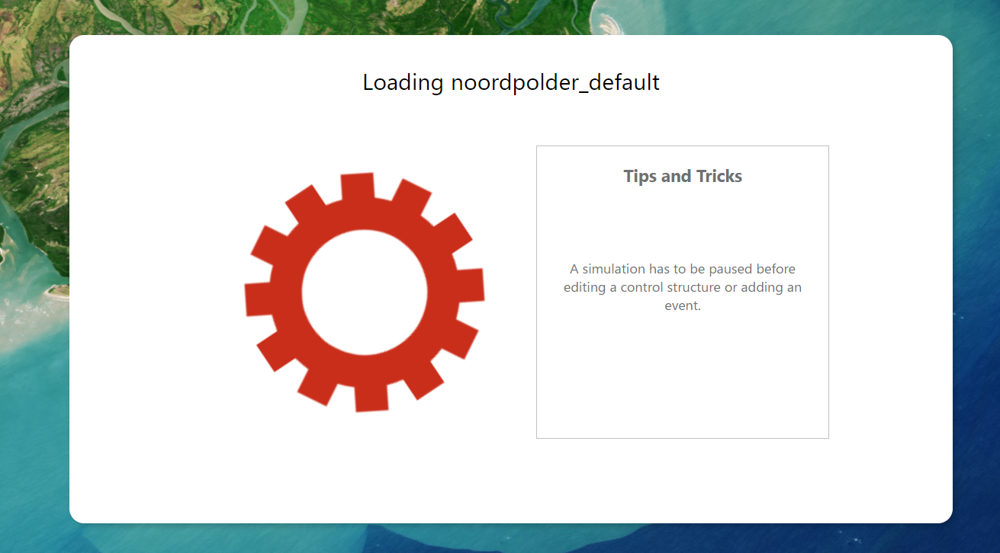

.. _guide_to_portal:

Guide to the 3Di portal
=======================

Login
------

Follow the steps below to access the 3Di portal:

#) Start the internet browser (Chrome or Firefox) and go to: https://3di.live
#) Log in with your username and password.

	* Username and password can be requested via servicedesk@nelen-schuurmans.nl.
	* You can clear the fields by clicking the **Reset values** button.
	* Forgot your password? Request a new password via **Reset my password**.

.. figure:: image/d2.1_login.png
	:scale: 50%
	:alt: Login screen
	
Welcome to 3Di
--------------

After logging in to the 3Di portal, the screen *Welcome to 3Di* will show:

.. figure:: image/d2.2_login.png 
	:alt: Welcome to 3Di screen

In this screen, there are two possibilities:

* Start a new session using the *New session* tab.
* Follow an ongoing session via the *Follow session* tab.

Start a new session
--------------------

Select the *New session* tab and select the model you want to start.

* A new session will be started.
* During the start up of the model tips for use of the site will be shown.
* It may take several minutes to load the model. Actual loading time is dependent on model size, calculation grid and table step size.

*For each organization, the number of simultaneous sessions is limited according to the agreement (contract). If the limit is reached, the message "Your organization is already running X sessions" will show. The amount of server time used is subtracted from the time available within the agreement.*

Following a session
--------------------

Through the tab *Follow session* an active session of your organization can be followed. The number of followers of a session is not limited.

Main session
------------

When starting or following a session, the model will show in the complete extent. On the top left you can see the name of the loaded model. At the top right you can see the user menu icon and a % indicating the load of the model on the server.

.. figure:: image/d2.6_main.png 
	:alt: Main session

 
The left bar from top to bottom contains: 

- point tool
- side view tool
- add a discharge point (2D)
- add a pumping point (2D)
- add rainfall
- add wind
- edit the DEM of the model
- show maplayers

For the visualization of the model elements, see the :ref:`layers_menu`.

.. _user_menu:

User menu
----------

Click the user icon  at the top right of the screen to show the user menu. The user menu has the following options:

* **Calculation speed** 

.. figure:: image/d2.8_user_menu.png 
	:alt: User menu

**Calculation speed** 
Calculation speed on the live site is slowed down in case of fast models. This is done because the live site is meant to have live insights in what is happening. If the model is too fast, it is hard to understand the flows. If you don't want this option to be turned on, toggle the 'off' radio button. The model most likely will speed up in case the % on the top right of the screen was not indicating 100%. In case the server load is already at 100%, no gain will be seen in calculation speed on the live site.

	
.. _layers_menu:

Layers menu
----------------

Click on the globe at the top right of the screen. The layers menu appears. 

If the model contains 1D-elements, they are immediately visible. Depending on which 1D elements are present in the model (and turned on in the maplayers menu, you will see:

- Breaches (shown after zooming in)
- Channels
- Culverts
- Levees
- Manholes (shown after zooming in)
- Nodes
- Sewers 
- Pump stations 
- Weirs

Colors for all these layers can be changed to reflect user preferences

In the maplayers menu the background map can be chosen:

- Topographic
- Satellite
- Dark

In the calculation section all layers are shown that indicate a results of the simulation on the map:

- Waterdepth
- Flow velocity
- Model grid 

Model rasters:

 - Digital Elevation Model. This shows the DEM that is used in the model. 

Advanced:

- Here other raster layers will be shown if present in the model:

All layers can toggled on or off by simply clicking on them in the layer menu. 

.. _notables:

Notables
----------

- When inactive for too long, the session will close 'This simulations is no longer active. You may start a new simulation.'
- Editing of structures or DEM can only be done after *pausing* a simulation.
- In the current setup special attention to models with initial water levels in 2D and laterals. 
- Initial water level in 2D is taken into account, but only with the 'mean' parameter.
- Laterals in a model are at the moment not used in the live site.
- The color scheme of the water depth can not be changed in the live site
- The language of the site will change depending on the language settings of your browser. Currently mandarin, english and dutch are supported. Please keep in mind that model elements are never translated. 
- Manholes are turned off by default. Turning them on and zooming out might cause the live site to slow down.
- Water depth is not shown in the channel nodes.