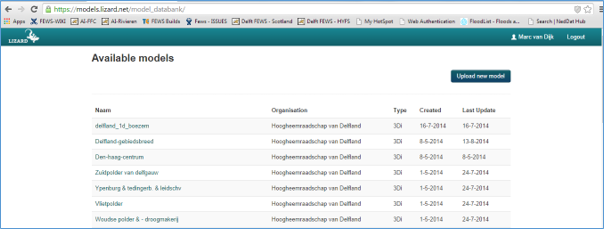
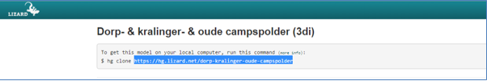
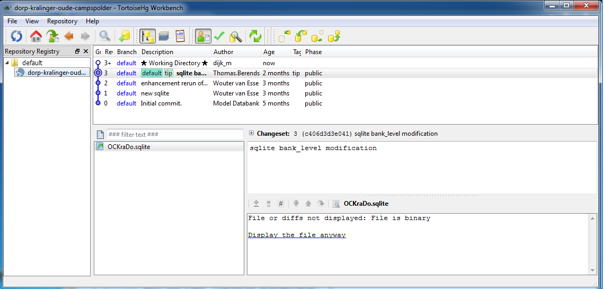
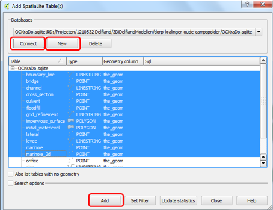
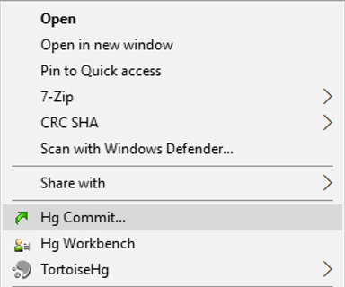
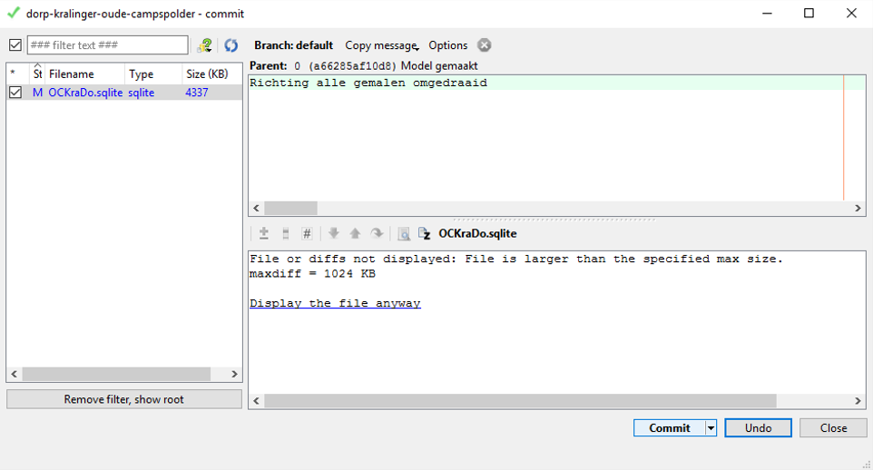
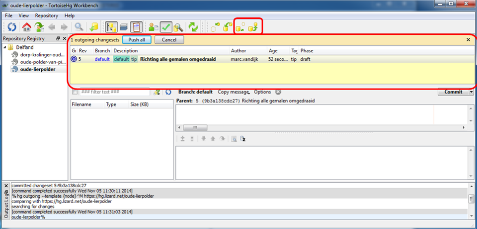
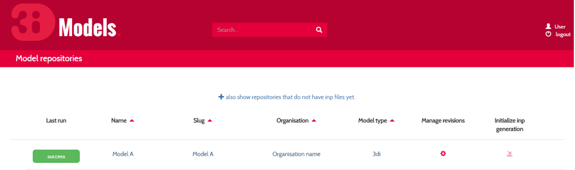
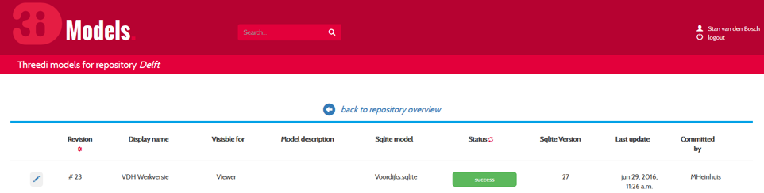

.. _model_installation_guide:

Versions and scenarios
========================

This section of the tutorial is intended to help modellers and specialists to get their 3Di models ready to run. It explains how to download, adjust and upload the models. If you don't know how to run a model in the portal yet, please refer to :ref:`guide_to_portal` and :ref:`running_model`. The first parts of this section give an overview on how to get a model ready to use on the 3Di portal. The last part contains more in depth explanation for advanced users.

3Di model database and schematisations
--------------------------------------

The 3Di models are all located in a secure model database. The model database is a *repository* that tracks *revisions* of the uploaded models. Through a model page, the models from the model database can be made available in the 3Di portal (see :ref:`showing_model_in_portal`). 

In order to be able to extract the data from the model database, to adjust models and to upload the models again, TortoiseHG Workbench and QGIS are needed (see :ref:`before_you_begin`). TortoiseHG Workbench is used to retrieve the files from the 3Di models from the repository and place them locally on a computer. The model can be adjusted with the QGIS model schematisation and again uploaded to the repository using TortoiseHG. 

The model database can be accessed via the Internet address `https://models.lizard.net <https://models.lizard.net>`_. After starting the model database website you can log in with the 3Di username and password. You will see the following page with a list of models that can be downloaded.

In this part of the tutorial we assume that the model only has one version. When using multiple versions, see :ref:`multiple_scenarios`. By selecting the desired model from the list of models you can retrieve the repository address of the model in the model database.

Download 3Di repository using TortoiseHG Workbench
-----------------------------------------------------------

After installing the TortoiseHG program it can be used to download the active model from the repository by going through the following steps:

* From the Windows Start menu, launch the TortoiseHg Workbench program.
* Ensure that a directory exists on the computer to which the models can be downloaded.
* In TortoiseHG open the File menu and select **Clone Repository**.
* In the **Source** field, enter the correct address for that 3Di repository (from models.lizard.net, excluding the part *$ hg clone*).
* In the **Destination** field, enter the correct directory address where the 3Di model should be saved.
* The **Hg command** field will update automatically, you don't need to change anything here.
* Press **Clone** to download the model to the local computer. Enter your username and password when required.

.. figure:: image/d4.3_TortoiseHG_clone.png
	:alt: Clone menu TortoiseHG

In the same way, other models can be downloaded, beginning with the third step in the above list of actions. 

After correctly downloading the files from the 3Di repository the downloaded repository will be visible in the Repository Registry, top left panel in TortoiseHG. In the top right panel all revisions of the repository are available, with the top one being the most recent. This most recent revision is also available in the download directory as chosen by the user. To make other revisions available, see :ref:`previous_revision`. 

The downloaded files can be divided into three groups:

* The **SpatiaLite** (.sqlite) contains all geometric information and settings of the model. 
* The **raster files** are stored in the folder subgrid. 
* The remaining files are general settings for the model with, e.g., groundwater and evaporation settings.

For using multiple scenarios in one repository, see :ref:`multiple_scenarios`. For downloading previous revisions, see :ref:`previous_revision`.

.. _adjust_model:

Adjusting the 3Di model database in QGIS
-----------------------------------------

After downloading the repository, the revisions can be adjusted using QGIS. Normally adjustments will be limited to SpatiaLites and rasters. However, it is important to realise that other users can also download and adjust the model. If the model has been downloaded a while ago, someone may have changed the model in the mean time. In that case, the repository has to be synchronised locally (see :ref:`working_together`). If the repository has just been downloaded, this is not necessary. 

After installation of QGIS, the program can be used to adjust the downloaded model. This tutorial does not give detailed instructions for QGIS, it is expected that users can already use this package. If more information on QGIS is needed, please click `this link <http://qgis.org/en/docs/index.html>`_. As an example we will reverse the pump direction at a pumping station, by adjusting the SpatiaLite. See :ref:`database-overview` for an overview of the layers and fields in the SpatiaLite. To add a layer from a SpatiaLite to QGIS, in this case *pumpstation*, follow the steps below:

* From the Windows Start menu start the QGIS Desktop program.
* Select the option **Add SpatiaLite Layer** by clicking the feather icon in the toolbox on the left.
* Select **New** and create a connection to the Sqlite database (.sqlite) of the required model: \<model directory>\<model name>\XXX.sqlite.
* Choose **Connect** to connect to the selected database.
* Select the desired layers you want to see in QGIS and click **Add**. For this example we add at least the layer *pumpstation*.
* If desired, add layers without geometry by ticking the box **Also list tables with no geometry**. This applies to the *Settings table* and *Boundary Point*.

By default the pump direction of a pumping station is similar to the direction of the branch (waterway) where the pumping station is located. In order to change the direction, the following actions should be carried out after adding the layer *pumpstation* to QGIS:

* Select the pumpstation map layer.
* Select the **Identify Features** button on the QGIS toolbar.
* Select a pumpstation on the map.
* Activate the **Toggle Editing** button on the QGIS toolbar.
* In the **Identify Results** screen, press the right mouse button and activate *Edit feature form*.
* Adjust allowed_flow_dir property from 1 to -1.
* Press **OK** button to close the Attributes window.
* Press **Close** to close the Identify Results window.
* Deactivate the Toggle Editing button on the QGIS toolbar and press **Save** to save the adjustment in the database.

.. figure:: image/d4.4_QGIS_interface.png
	:alt: QGIS interface for model adjustments

Synchronising 3Di repository with TortoiseHG Workbench
-------------------------------------------------------

After adjusting the 3Di model the modified files can be synchronised with the model database using the TortoiseHG program. This is the so called *pushing* of a revision. After this step the repository in the model database is up to date and the model can be made visible in the 3Di portal (see :ref:`showing_model_in_portal`). First, close the QGIS program and ensure that the Sqlite file of the model is not opened by another program. Before the revision can be pushed, the adjustments have to be *committed* on the local computer.

* Use Windows Explorer to navigate to the folder which contains all models.
* Right click on the subfolder containing the model adjustments.
* Click **HgCommit**.
* In the panel on the left tick the boxes that need to be committed. Note: newly added files are ticked off by default.
* Give a description of the changes in the top right panel, e.g., *Reversion of all pump directions*.
* Press the **Commit** button to capture your adjustments in the local repository.
* The **revision number** will now be increased.

The above steps can be repeated multiple times before the adjustments are pushed. By doing so you have the advantage of having the possibility to restore previous revisions if one of the adjustments turns out to be incorrect (see :ref:`previous_revision`). After one or more commits are made and detected by TortoiseHG, the adjustments can be pushed to the model database. 

* Click on the **Detect outgoing changes** button in the TortoiseHG toolbar to see the local commits (top right in figure below).
* Select all commits and click the **Push all** button. 
* Enter the username and password.

After the push, all 3Di model adjustments are sent to the central model database making it up to date.

.. _showing_model_in_portal:

Showing 3Di model on 3Di portal
--------------------------------

Now that the adjusted 3Di model is pushed to the model database the model must be made visible to be able to perform calculations on the 3Di portal. The generation of input files for the computation heart starts automatically after the push. The calculation heart uses the input files to perform calculations and sends the results to the 3Di portal for visualisation. 

Before a model can be used for calculations, the input files must be generated successfully and the model must be visualised on the portal. To check whether the input files have been generated successfully and to make the model visible on the 3Di portal we use the model administration page. 

The administration page can be accessed through `3di.lizard.net/models <http://3di.lizard.net/models>`_. This page shows a list of all available model repositories. Per repository only the last three revisions are being stored. When a revision needs to be stored for a longer period, this can be managed by clicking **Manage revisions**. In this menu you can *pin* a revision, keeping it available even when the revision is no longer part of the last three revisions. 

By clicking the name of the repository it shows an overview of the model scenarios with associated revisions.

* Use the **marker** button at the left to change the *Display name*, *Visible for* and *Model description* columns.
* **Revision** indicates the number of the revision. This is the same number as can be seen in TortoiseHG.
* The **Display name** is the name under which the model can be found in the 3Di portal.
* Adjust the **Visible for** criteria to select who has the right to see the model in the live site. Most end users have the *Viewer* level.By default the level will be *Admin*.
* The **Model description** can contain additional information which is visible on the portal.
* The **Status** of the model indicates whether the revision has been successfully converted into a 3Di model. The generation of input files can fail when the model schematisation is incorrect. Click on the status (Success/Fail) to view the log of the conversion.
* **Sqlite Version** indicates which version of the sqlite is present.
* **Last update** indicates when the input files were generated from the revision.
* **Committed** indicates who was the last to push changes for the model.

After a model scenario has been made visible, it can be visualised on the 3Di portal. 

.. _multiple_scenarios:

Advanced: multiple scenarios in one repository
----------------------------------------------

In one repository several scenarios or version of the same model can be stored. This can be done in two ways:

#) **Add (copy of the) SpatiaLite in the repository.** By creating a new version or copy of the SpatiaLite (.sqlite) an additional model can be added.

#) **Adding an additional line in the settings table of the SpatiaLite.** The settings table includes the settings for the computational grid, time step and subgrid raster files which are used in each scenario. The scenarios use the same information from the other layers in the SpatiaLite.

Pay attention to the following when using multiple scenarios: 

* When using several scenarios, the duration of the activation of the model in the 3Di model page increases because input files have to be generated for all scenarios.
* The new SpatiaLite must be added in TortoiseHG as "Large File". To do so, in the commit-screen right click on the new SpatiaLite and choose *Add large files ...* and check the file thereafter. 

.. _working_together:

Advanced: working together on one model
---------------------------------------

Everyone with the correct rights can adjust a model. Therefore it is possible to work on the same model simultaneously with multiple persons. However, this can result in conflicts. Therefore, it is important to communicate clearly and pay attention to the following:

* Check regularly whether the local revision of the repository is the most recent one by clicking on the **check for incoming changes** button in TortoiseHG. If available, the new revision will appear at the top of the list with revisions. Right click on the name of the revision, followed by the **pull incoming changes** button, this will update the files on the local computer to the most recent version. After this step new adjustments can be made, as described in :ref:`adjust_model`. 
* Make sure that changes are being committed and pushed within a reasonable time frame to keep the model database up to date. Please consider that every push results in generation of input files resulting in a high workload on the server. 

A good rule of thumb is to check whether the local repository is up to date before pushing or adjusting the model, and to only push once a day. 

.. _previous_revision:

Advanced: restoring a previous revision
---------------------------------------

It is possible to restore previous revisions and adjust them further. This might be useful when new revisions are corrupt. To work with multiple scenarios of the same model, it is advisable to follow the method as described in :ref:`multiple_scenarios`. 

A specific revision can be put on a local computer using the following steps:

* Start TortoiseHG Workbench
* Dubble click the desired repository
* Right click the revision which you want to restore
* Click **Update**
* Tick **Discard local changes, no backup (-C/--clean)**
* Click **Update**
* Enter username and password