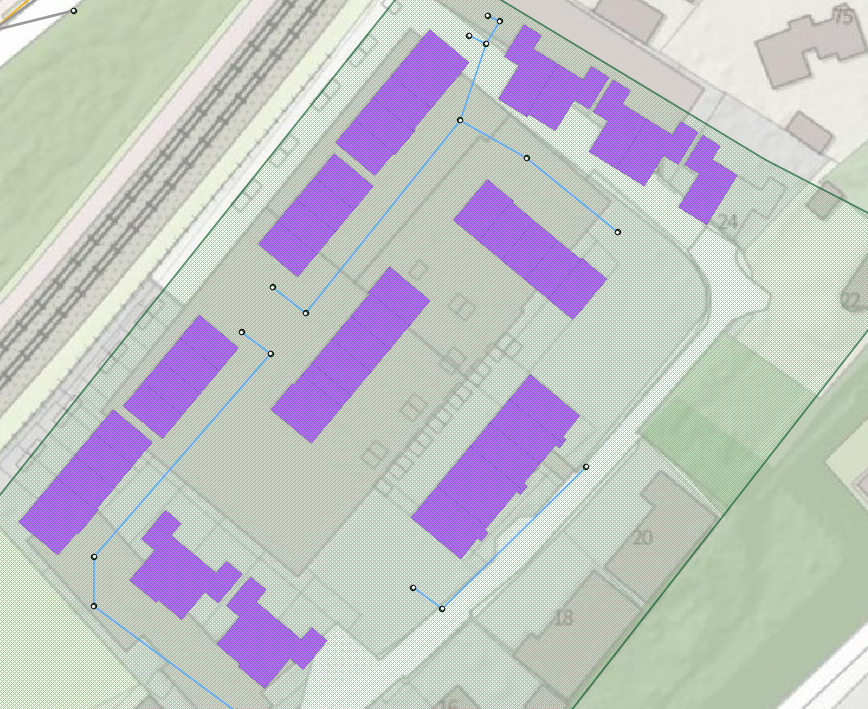
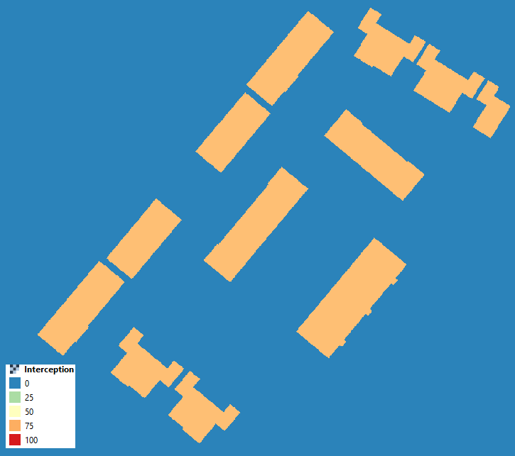

.. _combine_0d_2d_rain:

Combine direct rainfall and sewerage inflow
===========================================

Generally, rain falls directly on the surface, before it finds its way into the sewer system. In urban areas however, a significant part of the rain falls on buildings. There, it can flow to the sewer system through rain pipes or it can be stored. 3Di can be used to model any sanitary, storm and combined sewer system, with water entering the model using the 0D inflow in combination with 2D rainfall. In The Netherlands, there is a system called NWRW, which formed the basis for the 0D inflow model. This is described in more detail in the next section.

.. _0d_inflow:

0D inflow
---------

0D inflow is a module in 3Di that computes the amount of rain that falls on a surface and arrives in the 1D network. These surfaces represent (urban) elements, which are coupled to the sewer system. For example buildings, or more distant roads which are included in the 1D domain only. The type of surface determines whether there is volume stored, infiltrated or delayed in flowing to the 1D network. In short, the 0D inflow module computes the rainfall volume (area x rainfall_intensity x delta t) for each time step for each impervious area or surface area. 

The impervious surfaces table uses the Dutch NWRW model. In this model, a surface is defined by certain characteristics. It can be for example sloping or flat, paved or unpaved etc. These characteristics are translated to hydrological parameters like storage and delay of inflow. These are translated into a discharge hydrograph which is added as a lateral inflow to the sewer system. The surface table works similar to the impervious surface table but differs because you have to specify all the hydrological parameters of the surface yourself (i.e. infiltration, outflow delay, storage). For more information on 0D rainfall: :ref:`rain`.

     
   Impervious surfaces which facilitate the 0D inflow.

2D rain
-------

Rain which falls in the 2D domain precipitates on every computational cell where a DEM is defined. After the rain has fallen on the surface model it flows freely and interacts with connected 1D elements and therefore might enter the sewer system through manholes. 

Hybrid models
-------------

Key to properly representing the precipitation processes in urban areas is the combination of 0D and 2D inflow, so called "hybrid modelling". To account for rain that falls on roofs or other surfaces, that should be coupled to the sewer system (through drain pipes). This is obtained by including these areas in the 0D inflow module. However in that case, it should be excluded from the 2D rainfall. 

There are two ways to exclude rain from falling in the 2D domain:

- Interception (Section :ref:`interception`);

- Removing the (impervious) surfaces from the 2D rasters;

Interception is a parameter which can be defined as a (2D) raster. It specifies the amount of rain which can be intercepted. This parameter can also be used to intercept only precipitation where 0D-inflow surfaces are defined. 

To generate such a raster you could follow these steps:
- Create a raster with only zero-values
- Define at the locations of the surfaces an interception value that exceeds the total rainfall event. For example, if the total rainfall is 70 mm, an interception of >70 mm should be specified at the location of the surfaces.

The advantage of using interception is that the other rasters are not affected. Therefore it remains possible to have flow through (or below if using groundwater) the surfaces. A disadvantage is that the model becomes larger and might become too large for grid generation. 

     
   An example of a interception raster

Removing the (impervious) surfaces from the 2D rasters is the second option to exclude precipitation from the 2D domain. 2D rain falls only where the DEM is defined. Therefore, by removing the (impervious) surfaces from the DEM (turning them into nodata) the precipitation is removed from the 2D domain. As all 2D rasters have to overlap precisely, one should remove the surfaces from the DEM and all other rasters present (i.e. infiltration, friction). The advantage of this method is that there is no additional raster required. A disadvantage might be that flow through (larger) surfaces will be obstructed.

.. figure:: image/d_hybride_dem.png
   :alt: hybride_dem
     
   Hybrid DEM with removed surfaces to limit 2D rainfall.