Tutorial 5: Building a 1D model
===============================

Welcome to the tutorial for building a 1D model in 3Di. In this tutorial, you will learn to work with a 1D flow model in 3Di. We will start with a database file (.sqlite) that is already partly filled in. The sqlite is not yet complete, so we will add information to the model to get a basic working model that you can run on the 3Di live site.
The system in the .sqlite is a non-existent combined sewerage system. The model does not represent a real-world system, but is meant to get acquainted with the different components of a 1D combined sewerage system.

You will learn the following skills in this tutorial:

*	Edit an existing .sqlite model database
*	Get acquainted with the different elements of a 1D combined sewerage system
*	Configure the settings of a 1D model
*	Validate your model schematization using the schematization checker
*	Compile your model on the 3Di live site

Before you start, please make sure to:

* Install the 3Di Modeller Interface. Please see :ref:`3di_instruments_and_downloads` for instructions.
* Install the 3Di toolbox in the Modeller Interface. Please see :ref:`plugin_installation` for instructions.
* Gain access to the 3Di web portal. Please see the :ref:`guide_to_portal` for instructions.
* Download the dataset for this tutorial `here <https://nens.lizard.net/media/3di-tutorials/Tutorial_1D_gemengd.zip>`_.

Model initialisation
--------------------

Model preparation
+++++++++++++++++

Unpack the starter package and save the contents into a folder. The dataset that you downloaded for this tutorial contains an partially configured .sqlite database.

Loading the model in the 3Di Modeller Interface
++++++++++++++++++++++++++++++++++++++++++++++++

Our model must be imported in the 3Di Modeller Interface to view and modify its contents.
The model can be loaded via the 3Di toolbar (part of the 3Di toolbox plug in) by following these steps:

A.	Open the 3Di Modeller Interface.
B.	Create a new project.
C.	Select the **select 3Di results** button on the 3Di Toolbar (white database icon). [1]
D.	Select the **load** button in the window that pops up, and select the 1D_tutorial.sqlite database in your model folder. [2]
E.	You should now see the 3Di model as part of your Modeller Interface layers. [3]

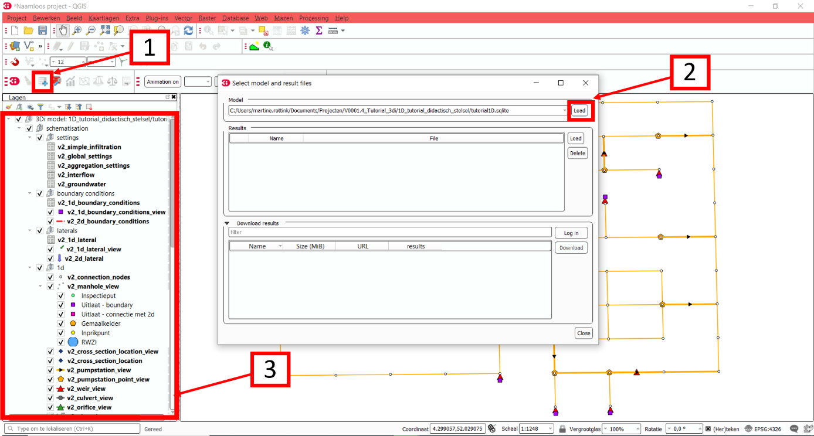

The outlook of the model is depicted in the figure below. Depending on the coordinate system of your screen, it is possible that the model looks a bit ‘distorted’. You can solve this by changing the coordinate system in the lower right corner to EPSG:28992.

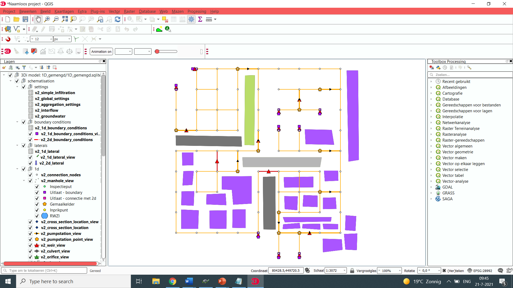

Model building
--------------

Compile the global settings
+++++++++++++++++++++++++++

The global settings are contained in the v2_global_settings table. For every 3Di model, the v2_global_settings table must be filled in. Follow these steps:

A. **Open** the attribute table v2_global_settings. [1]
#. Select **Toggle editing mode** in the top right corner. [2]
#. Select **Add feature**. [3]
#. Select **Switch to form view** in the bottom right corner. [4]

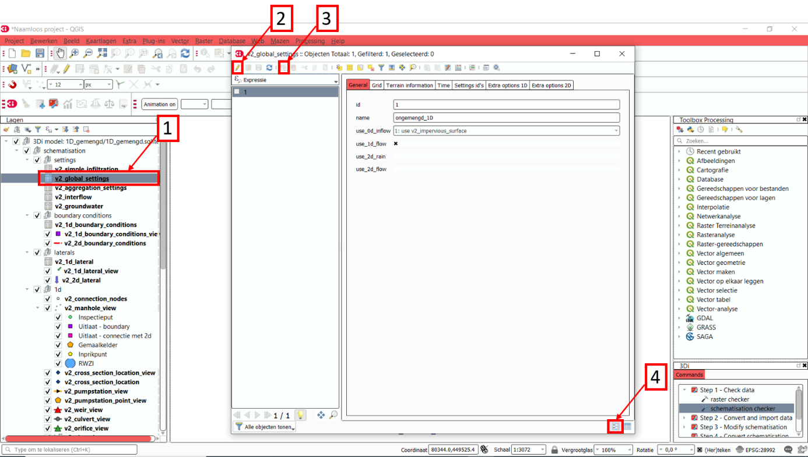

Now we can start to configure all settings.
3Di requires you to complete all mandatory settings before changes can be saved.
Attempts to save the settings before all mandatory field have been completed will result in an error message.
A list of mandatory settings and detailed descriptions can be found :download:`in the database overview <pdf/database-overview.pdf>`.
Finally, please note that the following settings have been selected specifically for this tutorial.

Let us now fill in the settings of each tab in the global settings table.

.. csv-table:: General
    :header: "Setting", "Value for this tutorial", "Comments"

    "id", "1"
    "name", "1D_tutorial"
    "use_0d_inflow", "Use_0d_inflow	1: use v2_impervious_surface", "In contrast to the 2D models in the previous tutorials, we use 0D inflow (using the NWRW  model) for the 1D model"
    "use_1d_flow", "Yes"
    "use_2d_rain", "No", "In this tutorial, we look at a 1D model, without a 2D component"
    "use_2d_flow", "No", "In this tutorial, we look at a 1D model, without a 2D component"

.. csv-table:: Grid
    :header: "Setting", "Value for this tutorial", "Comments"

    "grid_space", "2", "In a 1D model the grid space is not used, but in order to upload the model this value needs to be filled in."
    "kmax", "1", "In a 1D model the grid space is not used, but in order to upload the model this value needs to be filled in."
    "table_step_size", "0.01", "See :ref:`computational_grid`"

.. csv-table:: Terrain information
    :header: "Setting", "Value for this tutorial", "Comments"

    "dem_file", "NULL"
    "epsg_code", "NULL"
    "frict_coef_file", "NULL"
    "frict_coef", "0.026", "The friction value is not used, but must be filled in in order to upload the model"
    "frict_type", "2: Manning", "The friction type is not used, but must be filled in in order to upload the model"
    "frict_avg", "NULL"
    "initial_groundwater_level_file", "NULL"
    "initial_groundwater_level", "NULL"
    "initial_groundwater_level_type", "(NULL)"
    "initial_waterlevel_file", "NULL"
    "initial_waterlevel", "-99", "The initial water level is not used, but must be filled in in order to upload the model"
    "water_level_ini_type", "max", "The initial water level type is not used, but must be filled in in order to upload the model"
    "interception_file", "NULL"
    "interception_global", "NULL"
    "wind_shielding_file", "NULL"

The terrain information is not relevant for a 1D model, but some information must be filled in, in order to upload the model.

.. csv-table:: Time
    :header: "Setting", "Value for this tutorial", "Comments"

    "start_date", "2020-01-01"
    "start_time", "2020-01-01 00:00:00"
    "sim_time_step", "30", "in seconds"
    "timestep_plus", "No", "Only when extra control over the timestep is required"
    "minimum_sim_time_step", "NULL", "This can be relevant for a 1D model"
    "maximum_sim_time_step", "NULL"
    "nr_timesteps", "240", "for a 2 hour simulation"
    "output_time_step", "60", "in seconds"

.. csv-table:: Setting id's
    :header: "Setting", "Value for this tutorial", "Comments"

    "interflow_settings_id", "NULL", "No interflow"
    "groundwater_settings_id", "NULL", "No groundwater"
    "numerical_settings_id", "1", "Reference to the model specific numerical settings"
    "simple_infiltration_settings_id", "NULL", "No infiltration"
    "control_group_id", "NULL", "No control groups"

.. csv-table:: Extra options 1D (not relevant as this tutorial does not contain 1D elements)
    :header: "Setting", "Value for this tutorial", "Comments"

    "advection_1d", "1: Use advection 1d", "There are 1D elements"
    "dist_calc_points", "10000"
    "manhole_storage_area", "NULL", "With this setting, you create a storage area with a specified area connected to every manhole"
    "max_angle_1d_advection", "NULL"
    "table_step_size_1d", "NULL", "Only if you want to overwrite the value given under ‘grid’"

.. csv-table:: Extra options 2D
    :header: "Setting", "Value for this tutorial", "Comments"

    "advection_2d", "0: Do not use advection 2d", "There are no 2D components"
    "dem_obstacle_detection", "NULL"
    "guess_dams", "NULL"
    "dem_obstacle_height", "NULL"
    "embedded_cutoff_threshold", "NULL"
    "flooding_threshold", "0.001"
    "table_step_size_volume_2d", "NULL"

The extra options 2D is not relevant for a 1D model.

Don’t forget to save your changes after completing all settings, by clicking on **save edits** in the top left corner.

Complete the aggregation settings
+++++++++++++++++++++++++++++++++

The aggregation settings control the aggregation of model results.
They are contained in the v2_aggregation_settings table.

As with the previous settings, open the attribute table [1] and toggle the editing mode [2]. However, select **switch to table view** this time [3].

The different rows of the table refer to different model output categories. For each category, set the global_settings_id to 1. You can either do this manually by filling in 1's in the column [4], or by:

A. Selecting the column global_settings_id in the drop down menu
B. Typing a 1 in the bar
C. Clicking **update All**
D. And pressing **save edits**

Retain the default values for all other settings.

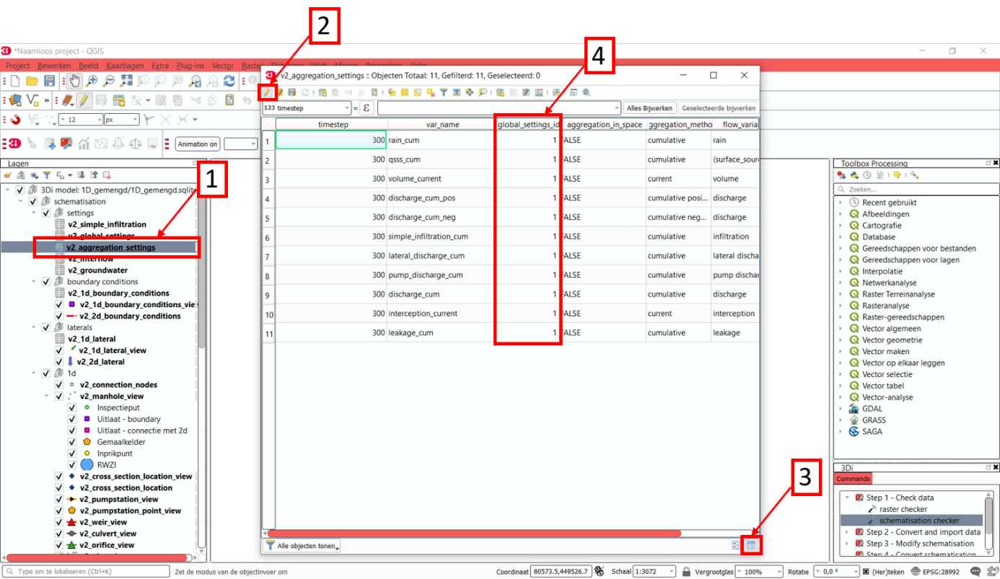

Complete the numerical settings
+++++++++++++++++++++++++++++++

The numerical settings are contained in the v2_numerical_settings table which can be found under advanced numerics. As with the previous settings, open the attribute table, toggle the editing mode, switch to form view and add a feature.
Complete the following settings:

.. csv-table:: General
    :header: "Setting", "Value for this tutorial", "Comments"

    "id", "1", "Must match the numerical_settings_id in the v2_global_settings_table"

.. csv-table:: Limiters (not used in this tutorial, only for sloping areas)
    :header: "Setting", "Value for this tutorial", "Comments"

    "limiter_grad_1d", "1"
    "limiter_grad_2d", "0"
    "limiter_slope_crossectional_area_2d", "0"
    "limiter_slope_friction_2d", "0"

.. csv-table:: Matrix
    :header: "Setting", "Value for this tutorial", "Comments"

    "convergence_cg", "1e-09"
    "convergence_eps", "1e-05"
    "use_of_cg", "20"
    "use_of_nested_newton", "1: When the schematization includes 1D-elements with closed-profiles"
    "max_degree", "700: for 1D flow"
    "max_nonlin_iterations", "20"
    "precon_cg", "1"
    "integration_method", "0"

.. csv-table:: Thresholds
    :header: "Setting", "Value for this tutorial", "Comments"

    "flow_direction_threshold", "1e-06"
    "general_numerical_threshold", "1e-08"
    "thin_water_layer_definition", "0.05"
    "minimum_friction_velocity", "0.05"
    "minimum_surface_area", "1e-08"

.. csv-table:: Miscellaneous
    :header: "Setting", "Value for this tutorial", "Comments"

    "cfl_strictness_factor_1d", "1"
    "cfl_strictness_factor_2d", "1"
    "frict_shallow_water_correction", "0"
    "pump_implicit_ratio", "1"
    "preissmann_slot", "0"

The overview of all settings for this tutorial can be referenced `here <https://docs.google.com/spreadsheets/d/1qHTS0TdwnYaCYRaohDAVvkaGW2sJ1pt8IX31HZ7OcBY/edit?usp=sharing>`_.
.. TODO:Deze link nog aanpassen naar de pdf als die er is

Complete the v2_pipe settings
+++++++++++++++++++++++++++++

We will zoom in on the different components of the model. The model in the .sqlite contains a network of pipes. The different parameters of these pipes can be set in the table v2_pipe. The values and a short explanation of the parameters is given in the tables below.
To save time, it is recommended to adjust the parameters for the different pipes at the same time. This can be done by following these steps:

A. **Open** the attribute table v2_pipe. [1]
#. Select **Toggle editing mode** and in the top right corner. [2]
#.	Select **Switch to table view** with the button in the lower right corner. [3]
#.	**Select** the parameter that needs to be adjusted in the box above the table. [4]
#.	Fill in the value that needs to be inputted. [5]
#.  and choose **Adjust all**. [6]

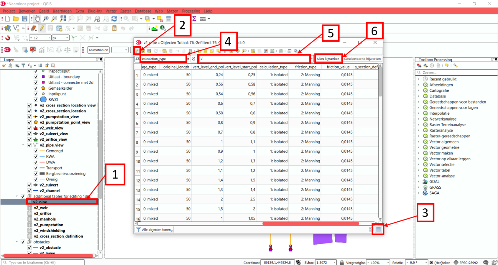

.. csv-table:: General
    :header: "Setting", "Value for this tutorial", "Comments"

    "Id", "N/A", "The id’s are already filled in"
    "display_name:", "N/A", "The display names are already filled in"
    "Code", "N/A", "The codes are already filled in"
    "Calculation_type", "1: Isolated", "See below"
    "Dist_calc_points", "1000", "See below"

Calculation type: You have different choices for the calculation type. You can choose between embedded, isolated, connected, broad crest en short crest. An elaborated explanation of these calculation types can be found in the 3Di documentation: :ref:`calculation_types`. In this model, we set the calculation_type for all pipes to ‘isolated’. This means that the 1D pipe cannot exchange water.

Dist_calc_points: This parameter controls the distance between the calculation points on the pipe. In this tutorial, set this parameter to 1000. Since all pipes are shorter than 1000 m, this means that there are no calculation points on the pipes; the water levels, velocities and discharges are calculated on the connection nodes.

.. csv-table:: Characteristics
    :header: "Setting", "Value for this tutorial", "Comments"

    "Invert_level_start_point", "N/A", "The start invert level is the level of the pipe at the start of the pipe; these are already filled in"
    "Invert_level_end_point", "N/A", "The end invert level is the level of the pipe at the end of the pipe; these are already filled in"
    "Friction_value", "0.0145", "Default Manning friction value for concrete pipes"
    "Calculation_type", "2: Manning"
    "Cross_section_definition_id", "N/A", "Link to the v2_cross_section_definition table, where the cross sections of the pipes are defined. These are already filled in."
    "Material", "N/A", "Already filled in"

.. in martines documents stond 0,0145 maar volgensmij moet dit een punt zijn. dus dat heb ik ervan gemaakt. Ik heb alleen geen tijd om het te controleren

.. csv-table:: Visualization
    :header: "Setting", "Value for this tutorial", "Comments"

    "Sewerage_type", "N/A", "Already filled in. '0:mixed', since we are modelling a mixed sewerage system."
    "Zoom_level", "N/A", "Already filled in. This parameter determines the visibility in the 3Di live site."

.. csv-table:: Characteristics
    :header: "Setting", "Value for this tutorial", "Comments"

    "Connection_node_start_id", "N/A", "Already filled in; the connection node that is connected to the start of the pipe."
    "Connection_node_end_id", "N/A", "Already filled in; the connection node that is connected to the end of the pipe."

Complete the v2_manhole settings
++++++++++++++++++++++++++++++++

The different pipes in the model are connected via connection nodes. Open de v2_connection_nodes attribute table. As you can see in this table, each connection node has an id, code and a storage area. For a 1D sewerage model, you do not have to fill in the initial water levels for the connection nodes. The model will then be empty at the start of each model run. All parameters in the v2_connection_nodes table are already filled in, so you can close the table again.

Next, open the v2_manhole attribute table. Each connection node is connected to a manhole. The different parameters for these manholes can be set in the v2_manhole table. The values and a short explanation of the parameters are given in the tables below. To save time, it is recommended to adjust the parameters for the different manholes simultaneously. This can be done in the same manner as was described for the v2_pipe table.

.. csv-table:: General
    :header: "Setting", "Value for this tutorial", "Comments"

    "Id", "N/A", "The id’s are already filled in"
    "display_name", "N/A", "The display names are already filled in"
    "Code", "N/A", "The codes are already filled in"
    "Connection_node_id", "N/A", "The id of the connection node that is connected to the manhole. These are already filled in."
    "Calculation_type", "1: isolated or 2: connected", "See below"

Calculation_type: You can choose here between embedded, isolated and connected. An elaborated explanation of these calculation types can be found in the 3Di documentation: :ref:`calculation_types`. As was described above, the calculation type depends on the manhole type. Set the calculation type to ‘connected’ for inspection manholes, by following these steps:

A. **Open** the attribute table v2_manhole. [1]
#. Select **Toggle editing mode** and in the top right corner. [2]
#.	Select **Switch to table view** with the button in the lower right corner. [3]
#.	**Select** the parameter that needs to be adjusted in the box above the table. [4]
#.	Fill in the value that needs to be inputted. [5]
#.  and choose **Adjust all**. [6]

By setting the calculation type of the inspection manholes to ‘connected’, these manholes can exchange with a storage area that was defined in the global settings with the parameter manhole_storage_area (under Options_1D ). As soon as the water level in the manhole exceeds the drain level, the water in the manhole can exchange with a storage area that has a surface area of 100 m2.

In the same manner, set the calculation type of the manhole features that are either outlets or pump station to ‘1: isolated’. By setting the calculation type of these manholes to isolated, these manholes cannot exchange water with the surface.

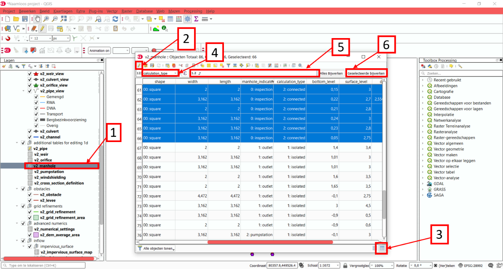

.. csv-table:: Characteristics
    :header: "Setting", "Value for this tutorial", "Comments"

    "Shape", "00: square", "Are already filled in"
    "Width", "N/A", "Are already filled in"
    "Length", "N/A", "Are already filled in, usually 0.8 is chosen."
    "Surface_level", "N/A", "Are already filled in. See below"
    "Drain_level", "Surface_level – 0.15", "See below"
    "Bottom_level", "N/A", "Are already filled in. See below"

Bottom level, drain level and surface level: For each manhole, you have to enter 3 levels, that are visualized in the figure below.

-	The bottom level represents the bottom of the manhole
-	The surface level represents the top of the manhole
-	The drain level is a level that is introduced in 3Di to indicate the water exchange level. In reality, the drain level and the surface level are the same. However, a model is a simplification of a real-world situation. This is visualized in the figure below, which depicts a road with a manhole in the middle and two road gullies at either side of the road, where the top of the two road gullies lies somewhat lower than the top of the manhole. In this tutorial, this is schematized as a single manhole with a sewerage pipe. In reality, the water in the sewerage system will start exchanging with the surface when the water level in the system exceeds the top of the road gullies. These gullies are not schematized in this model and therefore an extra level, the drain level, is introduced.

.. figure:: image/t_05_schematisation.png
    :alt: Schematisation road

In the .sqlite, the surface levels are already entered, but the drain levels are not yet filled in. We want to set these drain levels 15 cm below the surface level. This can be done by following these steps:

A. **Open** the attribute table v2_manhole. [1]
#. Select **Toggle editing mode** and in the top right corner. [2]
#.	Select **Switch to table view** with the button in the lower right corner. [3]
#.  **Open** the field calculator. [4]

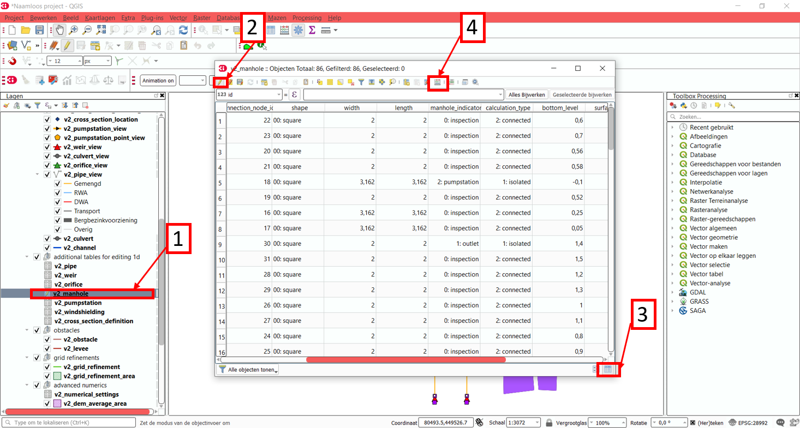

E. **Select** **Bestanden velden verniewen**. [5]
#. **select** the parameter "drain_level". [6]
#. Type the following expression in the box: "surface_level" -0.15. [7]
#. Press **OK**. [8]

.. Bestanden velden verniewen dit nog omzetten naar engels met nieuwe screenshot!

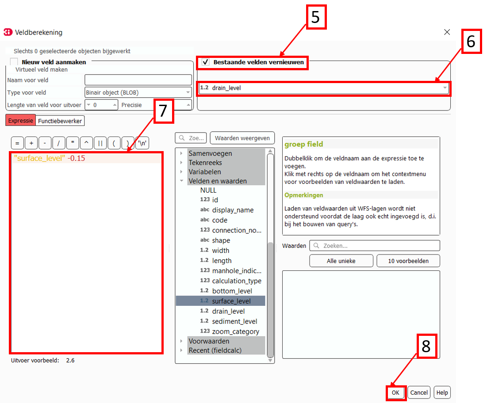

.. csv-table:: Visualization
    :header: "Setting", "Value for this tutorial", "Comments"

    "Zoom_category", "-"
    "Manhole_indicator", "0: inspection, 1: outlet or 2: pumpstation", "See below"

Manhole_indicator: This parameter indicates the type of manhole. Although this parameter does not influence the 3Di calculations, it is still recommended to use it since it will make the visual overview of the model in the Modeller Interface better understandable. You can distinguish between inspection, outlet and pumpstation. In the .sqlite, the manhole_indicator for the different manholes is already set.

Complete the v2_weir settings
+++++++++++++++++++++++++++++

Since the model in the .sqlite is a mixed sewerage system, the outlets in the model are all connected to a weir. Only if the water level exceeds the crest level of the weir, water can flow out of the sewerage system. Also, there are 6 internal weirs included in the model. The different parameters for these weirs can be set in the v2_weir table. The values and a short explanation of the parameters are given in the tables below. To save time, it is recommended to adjust the parameters for the different pipes at the same time. This can be done in the same manner as was described for the v2_pipe table.

.. csv-table:: General
    :header: "Setting", "Value for this tutorial", "Comments"

    "Id", "N/A", "The id’s are already filled in"
    "display_name", "N/A", "The display names are already filled in"
    "Code", "N/A", "The codes are already filled in"

.. csv-table:: Characteristics
    :header: "Setting", "Value for this tutorial", "Comments"

    "Crest_level", "N/A", "The crest levels are already filled in"
    "Crest_type", "N/A", "The crest types are already filled in"
    "Discharge_coefficient_positive", "0,8"
    "Discharge_coefficient_negative", "0,8"
    "Friction_value", "0,02", "Default Manning friction value for a short crested weir."
    "Friction_typ", "Manning"
    "Cross_section_definition_id", "N/A", "Link to the v2_cross_section_definition table, where the cross sections of the weirs are defined. These are already filled in."

.. csv-table:: Visualization
    :header: "Setting", "Value for this tutorial", "Comments"

    "Zoom_category", "N/A", "Determines the visibility in the 3Di live site; already filled in"
    "Sewerage", "Yes", "Already filled in"
    "External", "No", "Already filled in"

.. csv-table:: Connection nodes
    :header: "Setting", "Value for this tutorial", "Comments"

    "Connection_node_start_id", "N/A", "Already filled in"
    "Connection_node_end_id", "N/A", "Already filled in"

Complete the v2_pumpstation settings
++++++++++++++++++++++++++++++++++++

At some locations in the 1D sewerage system, pumpstations schematized in the model. The different parameters for these pumpstations can be set in the attribute table v2_pumpstation. Open the attribute table to see these parameters. In this tutorial, the different parameters for the pumpstations are already schematized in the model, so we don’t have to change anything. More details on the parameters in the v2_pumpstation table can be found in this general overview: :ref:`pump`.

Complete the v2_boundary_conditions settings
++++++++++++++++++++++++++++++++++++++++++++

Each outlet of the 1D model consists of a weir connected to a 1D boundary condition. These boundary conditions can be found in the attribute table v2_1d_boundary_conditions. Open the attribute table to see these conditions. In this tutorial, the boundary conditions for the different outlets are already inputted in the model, so we don’t have to change anything.
Note that the boundary conditions are all water level boundaries, where the water level is set to -10 m for the entire computation time of the model. Since the level of the sewerage pipes and manholes is much higher than -10 m, this means that water can always flow out of the model, once it reaches a level higher than the crest level of the weirs.

Complete the v2_impervious_surface settings
+++++++++++++++++++++++++++++++++++++++++++

The input for the 1D model in this tutorial comes from the 0D inflow module in 3Di. In this module, the rainfall volume is calculated for each time step and each 0D surface individually (area x rainfall intensity x time step). Based on the formulation of the impervious area, the discharge hydro-graph (discharge over time) is calculated as a lateral discharge on its downstream 1D connection node. More information on the 0D inflow module can be found in the 3Di documentation: :ref:`rain`.

In order to add impervious surfaces for 0D inflow to the model, we need the v2_impervious_surface table and the v2_impervious_surface_map table. In the v2_impervious_surface table, the different surfaces are defined. Subsequently, these surfaces are linked to a connection node in the v2_impervious_surface_map table. We are now going to add a surface for 0D inflow to the model:

A. **Open** the attribute table v2_impervious_surface. [1]
#. Select **Toggle editing mode** in the top right corner. [2]
#. Select **Object polygoon toevoegen**. [3]
#. Draw a new polygon in the model and right-click when the surface is ready.
#. A pop-up screen appears where different parameters need to be filled in.
#. Fill in the surface_class. You can choose which class you want to add. [4]
#. Fill in the surface_inclination. You can choose which inclination you want to add. [5]
#. click on **OK** and save your changes. [6]
#. Remember the id of the surface that you just added.

.. ook hier weer dingen in het nederlands...

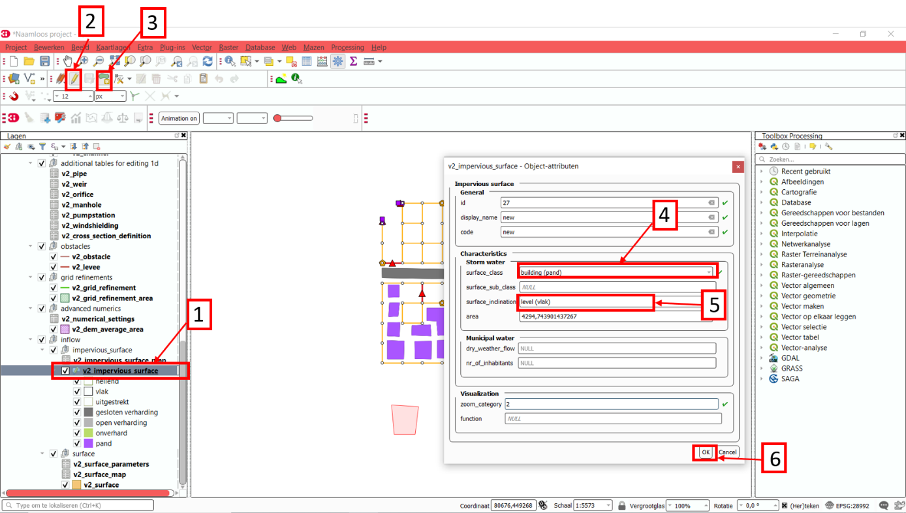

J. **Select** the v2_impervious_surface_map attribute table. [1]
#. Select **Toggle editing mode** in the top right corner. [2]
#. Select **Add feature**. [3]
#. Enter the id of the surface that you just added as ‘impervious_surface_id’. [4]
#. Enter the id of the connection node that you want to link to the surface as the ‘connection_node_id’. [5]
#. Set the percentage to 100. This means that 100% of the rainfall that falls on the surface is discharged to the connection node. [6]
#. Choose **OK** and save your changes.

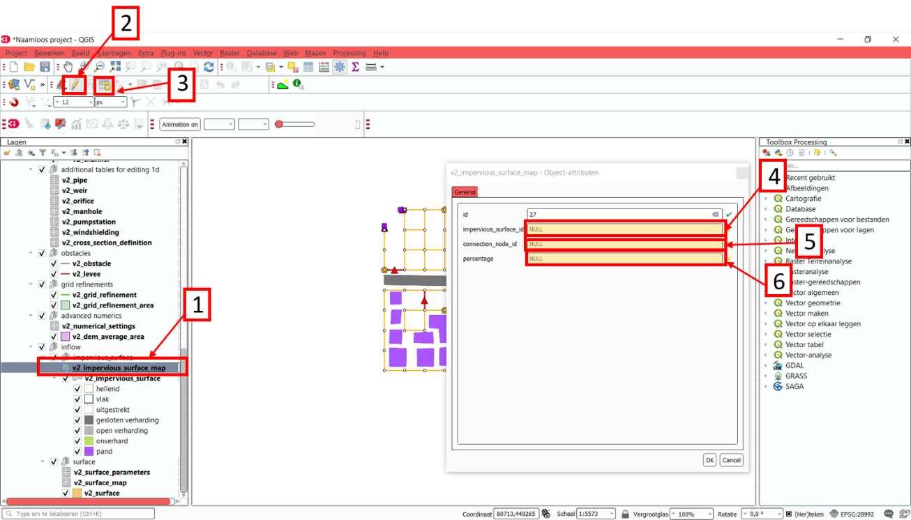

Model validation
----------------

A short description of the model validation is given here.
A comprehensive guide with visual support is provided in Tutorial 1 (:ref:`post_processing`) and for a general guide see :ref:`checking_model`.

Verify the model schematisation using the schematisation checker
++++++++++++++++++++++++++++++++++++++++++++++++++++++++++++++++++

Before sending the model to the web portal we want to check the schematization. We can use the schematization checker for this. It checks the model tables for many possible errors that cause the model to crash when you want to compile the model. In order to check your model schematization, follow these steps:

A.	Select the **commands for working with 3Di models** button. On the right of your screen, a tab "3Di" will open. [1]
B.	Expand the "Step 1 – Check data" line and click on the **raster checker**. [2]
C.	In the pop-up screen, select ‘spatialite: 1D_gemengd' and click **OK**.

The following screen will appear:

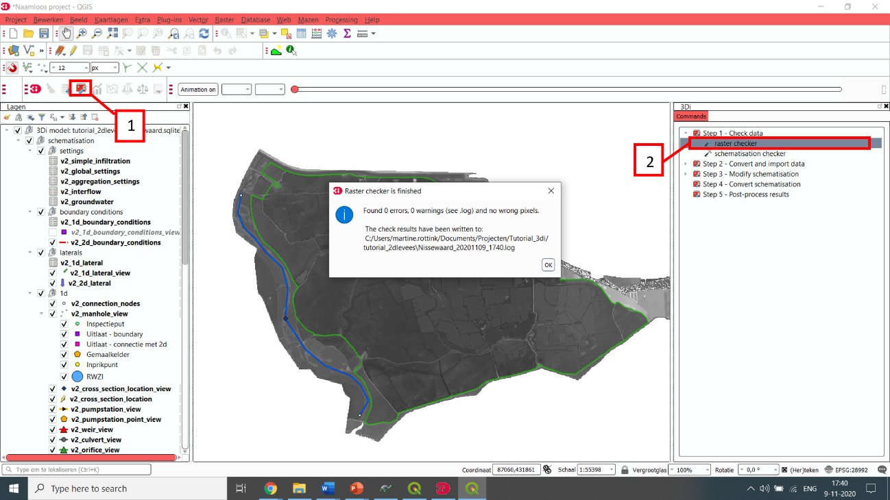

The output file is an excel file in which all warnings and errors that were found are listed. You may get a few errors that are known errors in the schematization checker. These errors will be removed in the future and may be ignored for now. These errors include:

-	“Value in v2_aggregation_settings.aggregation_in_space should be of the type integer”
-	“Invalid timeseries”
-	“Pumpstation.lower_stop_level should be higher than Manhole.bottom_level”

If you do not get any further warnings or errors, your model is successfully validated and is ready to upload to the web portal.

Model activation
----------------
A short description of the model activation is given here. A comprehensive guidance with visual support is provided in Tutorial 2 (:ref:`model_activation`).

Upload your model to the repository
+++++++++++++++++++++++++++++++++++

The first step towards running your model is to upload your model to the 3Di model database. Follow these steps:

A.	Create a new .zip file with the 1D_gemengd.sqlite database.
B.	Go to https://models.lizard.net/model_databank/
C.	Select **Upload new model**. Make sure that you are logged in for this step.
D.	Fill in the details of your models and include the .zip file. Be sure to select **3Di-v2** as your model type. Note: when you name your model, make sure to include your name in order to make the model name unique (so: “Tutorial_1D_yourName” instead of “Tutorial_1D”)
E.	Press **Submit**.

Compile your model
+++++++++++++++++++

Now your model is stored in the model database and it is ready for compilation.

A.	Go to https://3di.lizard.net/models/
B.	Use the search function to retrieve your model. Search for the name that you gave your model in the previous section. You may to select **also show repositories that do not have inp files yet**. It may take some time for the model to show here, after you have uploaded it to the model database.
C.	Select **initialize inp generation** for your model.

Your model will now be compiled.
The blue bar “no models” will turn into a green bar with the text “success” when the model is successfully compiled.
You can now select the model to view the details of your model.
The model is now also available on the 3Di live site.

Run your model
++++++++++++++

You have now build a 1D flow model for a mixed sewerage system! You can now run your model via the 3Di Live Site (:ref:`guide_to_portal`) or via the 3Di Modeller Interface (:ref:`simulate_api_qgis`).
It will be available under the name you gave it.
