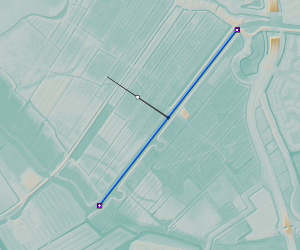

..  _flood_model:

Tutorial 4: Building a 2D flow model with channels and breaches
=======================================================================

Introduction
-------------
In this tutorial, you are going to build a basic 2D flood model for an area with with a potential breach location in the :ref:`3Di Modeller Interface <mi_what_is>`. We will start with a model for which the basic parameters are already filled in, and expand the model step by step. We will finish this tutorial with a working model that you can play around with on :ref:`3Di Live <3di_live_introduction>`. 

Our area of interest is the municipality of Nissewaard on the island of Voorne-Putten in the Netherlands. The municipality of Nissewaard consists of urban area and farmland. Whilst this tutorial represents a real-world area, it is important to keep in mind that some processes will be simplified for the purpose of this tutorial.

Learning objectives
--------------------
You will learn the following in this tutorial:

* Create a schematisation from an existing spatialite.
* Add channels to a 2D model.
* Add boundary conditions to a channel.
* Create a potential breach event in a 2D model.
* Simulate the model with a breach event.

Preparation
------------
Before you get started:

* Make sure you have a 3Di account. Please contact the :ref:`servicedesk` if you need help with this.
* Install the 3Di Modeller Interface, see :ref:`3di_instruments_and_downloads`.
* Download the dataset for this tutorial `here <https://nens.lizard.net/media/3di-tutorials/3di-tutorial-04.zip>`_.

Creating a new schematisation
------------------------------
Follow these steps to convert the existing Spatialite to a :ref:`schematisation`:

#) Unpack the starter package and save the contents into a folder. The dataset that you downloaded for this tutorial contains an partially configured .sqlite database and a digital elevation model (DEM) for a part of the Nissewaard municipality. This DEM is called dem_Nissewaard.tif and is located in the folder named "rasters". The structured .sqlite database contains all elements that can be included in a 3Di model. The basic settings are already filled in.

#) Open the 3Di Modeller Interface.

#) Click on the 3Di Models and Simulations icon (|modelsSimulations|). You should now see the 3Di Models and Simulations panel.

#) In the *Schematisation* section of the 3Di Models and Simulations panel, click the *New* button (|newschematisation|). The *New schematisation* wizard is shown.

#) Fill in a schematisation name, such as 'Tutorial 2D flow model <your_name>'. Select the organisation you want to be the owner of the new schematisation (most users have rights for only one organisation). Tags are optional, you can leave this field empty for now.

#) Since we are creating a schematisation from an existing Spatialite, select the *Choose file* option. Select the Nessewaard.sqlite file you downloaded and click *Create schematisation*.

Viewing the schematisation
--------------------------
The schematisation must be imported in the 3Di Modeller Interface to view and modify its contents. The schematisation can be loaded by following these steps:

#) At the top of the 3Di Models & Simulations panel, click on the (blue, underlined) name of your schematisation. Windows Explorer will open; browse to *work in progress/schematisation* and copy the path from the Windows Explorer address bar.

#) In the 3Di Schematisation Editor toolbar, click the *Load from Spatialite* button (|load_from_spatialite|). Paste the path to the spatialite and click *Open*.

#) Add a background map from OpenStreetMap by clicking *Web* in the Main Menu > *Quick Map Services* > *OSM* > *OSM Standard*.

#) In the Layers panel, reorder the layers such that the OpenStreetMap layer is below the 3Di schematisation.

You should now see the DEM file located below The Oude Maas.

Adding a channel
-----------------

We are going to add a :ref:`channel` to the model. A channel :ref:`flows <channelflow>` from one connection node to another, has a :ref:`calculation type <calculation_types>` and a :ref:`channel geometry <cross_section_of_1d_element>`. These parameters will be filled in, in the following steps:

#) In the *Layers* panel, in the *1D* group, click the *Channel* layer.

#) Click the *Toggle editing mode* button (|toggle_editing|) in the top left.

#) Click on the *Add line feature* button (|add_line|).

#) Begin by clicking on a desired starting location for your channel. Next, click on the location where you want the channel to end. Ensure that the channel remains within the Digital Elevation Model (DEM). 

#) To stop drawing the channel, simply right-click. A popup screen with the Feature Attributes should now appear.

#) Fill in the following parameters in the *channel* tab:

   * ID: filled in automatically
   * Code: give your channel a code or name so you can later identify it
   * Display name: give your channel a code or name so you can later identify it
   * Calculation type: Connected
   * Distance between calculation points [m]: 15
   * Connection nodes: filled in automatically

#) Fill in the following parameters in for both connection nodes the *Connection nodes* tab:

   * Connection node ID: filled in automatically
   * Node code: give your connection node a code or name so you can later identify it
   * Node initial water level [m]: 3
   * Node storage area [m2]: 0.1

#) Fill in the following parameters in the *Cross section locations* tab:

   * ID: filled in automatically
   * Code: rectangle_channel
   * Reference level [m]: 0
   * Bank level: 4
   * Friction type: Manning
   * Friction value: 0.0022
   * shape: Open rectangle
   * width [m]: 10

#) Click *OK*.

#) Click the *Toggle editing mode* button in the toolbar and save your edits to this layer.

Adding a boundary condition
----------------------------

In order for water to flow through the channel a boundary condition must be added. As the channel is a :ref:`1D object <1d_objects>`, so a 1D boundary condition will be added with the following steps:

#) In the *Layers* panel, in the *1D* group, click the *1D Boundary condition* layer.

#) Click the *Toggle editing mode* button (|toggle_editing|) in the top left.

#) Click on the *Add point feature* button (|add_point|).

#) Hover over the end on your channel until you see a pink square. Click on the pink square and fill in the following parameters:

   * ID: filled in automatically
   * Connection node ID: filled in automatically (this id number is related to the previously added connection nodes)
   * Boundary type: Waterlevel
   * Timeseries:

        - 0,3.0
        - 15,3.5
        - 9999,3.5

#) Do the same for the other end of your channel but fill *Discharge* in for *Boundary type*.

#) Click the *Toggle editing mode* button in the toolbar and save your edits to this layer.

Potential Breach
------------------
Now that we have added a connected channel to our model, we are going to add a potential breach location. A potential breach forms a link between the 1D and 2D part of the model. For more theoretical information on breaches, see: :ref:`breaches`. 

Follow these steps to add a potential breach:

#) In the *Layers* panel, in the *1D2D* group, click the *Potential breach* layer.

#) Click the *Toggle editing mode* button (|toggle_editing|) in the top left.

#) Click on the *Add line feature* button (|add_line|).

#) Hover over the middle of your channel until a pink square appears. Click on the pink square. Now click somewhere else within your DEM. Right-click to stop drawing.

#) Fill in the following parameters:

   * ID: filled in automatically
   * Code: a name to identify your potential breach
   * Display name: a name to identify your potential breach
   * Exchange level [m MSL]: 3
   * Max breach depth [m]: 5
   * Levee material: Sand
   * Channel ID: filled in automatically

#) Click *OK*.

#) Click the *Toggle editing mode* button in the toolbar and save your edits to this layer.

The final result should look something like this:

Uploading the schematisation
----------------------------
The next step is to check the schematisation, upload its as a first :ref:`revision` and process it into a :ref:`threedimodel`. All these steps are covered by the upload wizard.

#) In the 3Di Schematisation Editor toolbar, click *Save to Spatialite* (|save_to_spatialite|). Wait for this process to finish.

#) Click on the 3Di Models and Simulations icon (|modelsSimulations|). You should now see the 3Di Models and Simulations panel.

#) Click the upload button (|upload|) in the 3Di Models and Simulations panel.

#) In the dialog that has appeared, click *New upload* and click *Next*.

#) Click *Check schematisation*. This will check your schematisations for any errors that make it impossible to generate a valid 3Di model and simulation template.

#) Continue to the next screen. Here you have to fill in a commit message that describes the changes your have made relative to the previous revision. As this is the first revision of this schematisation, you can instead give provide a short description of what you upload. For example: "Default settings, added channel with potential breach".

#) Click *Start upload*. Check if it is the upload is successful and if the uploaded data is successfully processed into a 3Di model.  

Your 3Di model is now ready for simulation! The model is now also available on `3Di Live <https://www.3di.live/>`_ and the `management screens <https://management.3di.live>`_.

Running a simulation 
--------------------

You will now start a simulation with the 3Di model you have created. 

#) In the 3Di Models and Simulations panel, click *Simulate* (|simulate|) > *New simulation*.  

#) Select your model and simulation template and click *Next*. A new dialog opens with several options for your simulation.  

#) Check the box for *Include breaches*. Click *Next*.

#) Give your simulation a name. Click *Next*.

#) Set the duration of your simulation to 4 hours. Click *Next*.

#) Accept the Boundary conditions as they are by clicking *Next*.

#) Accept the Initial conditions as they are by clicking *Next*.

#) Accept the Breaches as they are by clicking *Next*.

    .. of moet hier wel iets anders ingesteld worden?

#) Accept the simulation settings as they are by clicking *Next*. 

#) Check the summary of your simulation and click *Add to queue*.  

Your simulation will start as soon as a calculation node is available for your organisation. Note: the number of available calculation nodes depends on your 3Di subscription. 

In the 3Di Models and Simulations panel, click *Simulate*. An overview is given of all running simulations for your organisation(s). Here you can follow the progress of your simulation.

.. to acces the results.. (dit nog toevoegen aan deze tutorial?)

.. can remove the section below here if you do not find it necessary. 

Running a simulation with 3Di Live
""""""""""""""""""""""""""""""""""""

It is also possible to simulate your model with 3Di Live:

#) Go to `3di.live <https://www.3di.live/>`_.

#) Find your model. It will be available under the name you gave it, followed by the revision number. Click *Start*.

#) Zoom into your channel (blue line) and potential breach (brown line).

#) Click the Play button at the top centre to start the simulation.

#) You can open a breach by clicking on the breach and clicking on the settings button. You can adjust the breach settings when your simulation is paused.

.. |load_from_spatialite| image:: /image/pictogram_load_from_spatialite.png
	:scale: 80%

.. |toggle_editing| image:: /image/pictogram_toggle_editing.png
    :scale: 80%

.. |add_line| image:: /image/pictogram_addline.png
    :scale: 80%

.. |add_point| image:: /image/pictogram_addpoint.png
    :scale: 80%

.. |upload| image:: /image/pictogram_upload_schematisation.png
    :scale: 80%

.. |modelsSimulations| image:: /image/pictogram_modelsandsimulations.png
    :scale: 90%

.. |save_to_spatialite| image:: /image/pictogram_save_to_spatialite.png
	:scale: 80%

.. |newschematisation| image:: /image/pictogram_newschematisation.png
    :scale: 80%

.. |Simulate| image:: /image/pictogram_simulate.png
    :scale: 80%
    