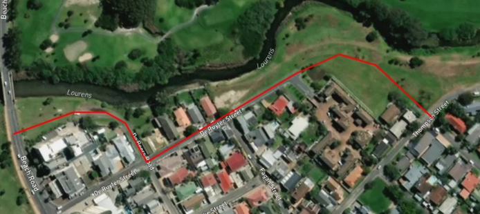

Tutorial 5: Flood mitigation measures
=====================================

Introduction
-------------
In this tutorial we will simulate a flood and apply flood mitigation measures during a simulation in :ref:`3Di Live <3di_live_introduction>`.

The selected area is the town Strand in Western Cape, South Africa. The river Lourens runs past this city and will be flooded in this tutorial.

Learning objectives
-------------------

You will learn the following in this tutorial:

* Creating a simulation template
* Adding discharge to a river during a simulation
* Adding a flood barrier during a simulation.

Preparation
-----------

Before you get started:

* Make sure you have a 3Di account. Please contact the :ref:`servicedesk` if you need help with this.
* Install the 3Di Modeller Interface, see :ref:`3di_instruments_and_downloads`.
* Download the dataset for this tutorial `here <https://nens.lizard.net/media/3di-tutorials/3di-tutorial-05.zip>`_.

.. Checken dat Wolf zipje erop heeft gezet.

Creating a new schematisation
------------------------------
Follow these steps to convert the existing Spatialite to a :ref:`schematisation`:

#) Unzip the downloaded dataset for this tutorial and save the contents into a folder. The dataset for this tutorial contains a partially configured .sqlite database, a digital elevation model (DEM) and an initial water level raster.

#) Open the 3Di Modeller Interface.

#) Click the 3Di Models and Simulations icon (|modelsSimulations|). You should now see the 3Di Models and Simulations panel.

#) In the *Schematisation* section of the 3Di Models and Simulations panel, click the *New* button (|newschematisation|). The *New schematisation* wizard is shown.

#) Fill in a schematisation name, such as 'Tutorial 2D flood adaptation <your_name>'. Select the organisation you want to be the owner of the new schematisation (most users have rights for only one organisation). Tags are optional, you can leave this field empty for now.

#) Since we are creating a schematisation from an existing Spatialite, select the *Choose file* option. Select the 'Strand - Western Cape.sqlite' file you downloaded and click *Create schematisation*.

Viewing the schematisation
--------------------------
The schematisation must be imported in the 3Di Modeller Interface to view and modify its contents. The schematisation can be loaded by following these steps:

#) At the top of the 3Di Models & Simulations panel, click the (blue, underlined) name of your schematisation. This will open Windows Explorer. Browse to *work in progress/schematisation* and copy the path from the Windows Explorer address bar.

#) In the 3Di Schematisation Editor toolbar, click the *Load from Spatialite* button (|load_from_spatialite|). Paste the path to the spatialite and click *Open*.

#) Add a background map from OpenStreetMap by clicking *Web* in the Main Menu > *Quick Map Services* > *OSM* > *OSM Standard*.

#) In the Layers panel, reorder the layers such that the OpenStreetMap layer is below the 3Di schematisation.

You should now see the DEM and schematisation of the town Strand with a useful background-layer.

Uploading the schematisation
----------------------------
We will now upload the schematisation as a first :ref:`revision` and process it into a :ref:`threedimodel`. All these steps are covered by the upload wizard.

#) Click the upload button (|upload|) in the 3Di Models and Simulations panel.

#) In the dialog that has appeared, click *New upload* and click *Next* twice.

#) Fill in a commit message. As this is the first revision of this schematisation, you can give provide a short description of what you upload. For example: "Initial upload". *Tip*: it is good practice to be explicit and clear in your commit messages.

#) Click *Start upload*. Check whether the upload is successful and the schematisation is successfully processed into a 3Di model.  

Your 3Di model is now ready to run simulations! 

Starting the simulation with discharge in 3Di Live
---------------------------------------------------

Now we have created a model, we need to add a forcing to the model. In this case we are going to add discharge to the Lourens river:

#) :ref:`Load <loading_model_3di_live>` the created model in 3Di Live.

#) Add a discharge to the Lourens river.

    * Click the :ref:`discharge_tool_3di_live` button (|discharge_tool|).
    * Set the *Amount of water* to 30 m³/s. 
    * Set the *Duration* to 24 hours.  
    * Click *Place on Map* and place the discharge lateral on the map near the Broadway Boulevard bridge.

#) Click the *Play* button at the top centre.

#) Pause the simulation after 1 hour of simulated time (01:00).

#) Zoom to the areas that are beginning to flood. 

#) Use the :ref:`point_selection_tool` (|selection_tool|) on the flooded area. In the panel at the right, graphs are displayed that show how the situation is developing in this location: the water level (in m MSL), water depth (m) and rainfall intensity (m/s) are shown.

#) Now use the :ref:`line_selection_tool` (|line_selection_tool|) to draw a side view of the flooded area. As the simulation progresses, the water level is updated automatically every output timestep. 

#) Take a screenshot of the inundation you see on the map after 1 hour (Ctrl + Print Screen) save the image.  

#) Use the *Line selection tool* to determine the water level of the inundated area and write it down.

Saving the simulation as a template
-----------------------------------
The simulation (including the discharge you added) can be saved as a template. This is very useful if you want to reuse the simulation, including all :ref:`simulation_settings`, :ref:`initials_forcings_events`. This is especially useful for comparing a simulation with and without flood adaptation measures or saving a simulation with a lot of additional forcings (discharge, rain, wind, etc.) for later use.

#) Click *Restart simulation* in the user menu (|user_menu|). 

#)	Select *Store results instead of restarting*

#)	Select *Create simulation template from simulation*

#)	Choose a template name (Like: 'Discharge 30 m³/s for 24 hours') and make sure the boxes *Include events*, *Include initials* and *Include settings* are checked. Then click *Store results*.

Adding a flood barrier to your simulation
-------------------------------------------
First we need to determine where the flood barrier should be placed. To do that we need to analyse the elevation of the inundated area and determine the direction the water comes from.

Analysing where the barrier should be placed
^^^^^^^^^^^^^^^^^^^^^^^^^^^^^^^^^^^^^^^^^^^^
In the previous simulation we saw some inundation in the urban area adjacent to the Lourens river. In this part of the tutorial, we will attempt to reduce this inundation. To do this in real life, we would need to create a barrier (e.g. using sandbags or a mobile barrier). In 3Di Live we can simulate this using the :ref:`Flood barrier tool<flood_barrier_tool_3di_live>`.

Roads are a very useful location to place flood barriers due to their even surfaces and easy access.

#) :ref:`Load<loading_model_3di_live>` your model in the 3Di Live.

#) Select the template you just created, and click *Start*.

#) Use the :ref:`line_selection_tool` (|line_selection_tool|) to analyse the elevation of the riverbank in the inundated urban area and the elevation of the De Ruyter Street (in the south-west of your modelled area).
   
   The Line selection tool shows a low point in the De Ruyter Street around the area where the flooding began. Placing a barrier here, would reduce most of the flooding. Unfortunately, some buildings would not be protected by the barrier. 

#) Use the *Line selection tool* to find a more suitable location for the barrier, so it would protect more buildings. Make sure the location would also be suitable in a real life scenario.
   
   The ideal location for the flood barrier would be between the buildings and the river. But if we take a closer look at the satellite image, we can see that there are walls around each garden. In a crisis, it might take too long to first break down these walls to be able to properly place the flood barrier. The De Beers Road, however, is a realistic area for the flood barrier and will also protect the buildings on the corner of De Beers Road and Beach Road.

Add a barrier to your simulation
^^^^^^^^^^^^^^^^^^^^^^^^^^^^^^^^
As we have seen earlier in this tutorial, the inundation reaches 2.35 m MSL, if there is no flood barrier. Therefore, we need to place a flood barrier with a height of at least 2.5 m MSL at the designated location. Now that we know where the barrier needs to be placed and how high it needs to be, it is time to add it to our simulation:

#) Click the :ref:`flood_barrier_tool_3di_live` button (|barrier_tool|).

#)	Use an elevation of 2.5 m MSL. This is the flood barrier's crest level.

#)	Click *Draw on map*.

#)	Draw a flood barrier on the map as is shown in the figure below. When you are finished drawing, click *Confirm*.

#)	Select the barrier using the Selection tool to check whether the height is correct and see the total length of the placed flood barrier.

#)	Start the simulation and let it run for 1 hour.

#)	To make a quick comparison, take a screenshot of the results and paste it next to the screenshot of the model without barrier. Did the flood barrier properly protect the urban area?

   Location of the barrier.

.. |modelsSimulations| image:: /image/pictogram_modelsandsimulations.png
    :scale: 90%

.. |newschematisation| image:: /image/pictogram_newschematisation.png
    :scale: 80%

.. |load_from_spatialite| image:: /image/pictogram_load_from_spatialite.png
	:scale: 80%

.. |discharge_tool| image:: /image/pictogram_discharge_tool.png
    :scale: 80%

.. |line_selection_tool| image:: /image/pictogram_line_selection_tool.png
    :scale: 75%

.. |selection_tool| image:: /image/pictogram_selection_tool.png
    :scale: 80%

.. |user_menu| image:: /image/pictogram_user_menu.png
    :scale: 60%

.. |barrier_tool| image:: /image/pictogram_barrier_tool.png
    :scale: 80%

.. |upload| image:: /image/pictogram_upload_schematisation.png
    :scale: 80%