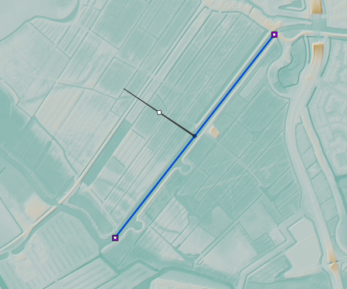

..  _flood_model:

Tutorial 4: Building a dike breach flood model
==============================================

Introduction
-------------
In this tutorial, you are going to build a model that simulates a flood caused by a levee breach. The model will be built using the :ref:`3Di Modeller Interface <mi_what_is>`. At the end of this tutorial, you will have a basic working model that you can run simulations with.

Our area of interest is the municipality of Nissewaard on the island of Voorne-Putten in the Netherlands. The municipality of Nissewaard consists of urban area and farmland. While this tutorial represents a real-world area, it is important to note that some processes have been simplified for the purpose of this tutorial.

Learning objectives
--------------------
You will learn the following in this tutorial:

* Adding 1D channels to a model
* Adding boundary conditions to a 1D channel
* Adding a linear obstacle to a model
* Creating a potential breach
* Simulating the model with an active breach event

Preparation
------------
Before you get started:

* Make sure you have a 3Di account. Please contact the :ref:`servicedesk` if you need help with this.
* Install the 3Di Modeller Interface, see :ref:`3di_instruments_and_downloads`.
* Download the dataset for this tutorial `here <https://nens.lizard.net/media/3di-tutorials/3di-tutorial-04.zip>`_.

Unzip the dataset for this tutorial and save the contents into a folder. The dataset that you downloaded for this tutorial contains a digital elevation model (DEM) for a part of the Nissewaard municipality. The DEM is located in the folder named "rasters". 

Creating a new schematisation
-----------------------------

The first step is to create a new :ref:`schematisation`:

#) Open the 3Di Modeller Interface.

#) Click the 3Di Models and Simulations icon |modelsSimulations|. You should now see the 3Di Models and Simulations panel. If this is the first time you use the 3Di Models and Simulation panel, you will need to go through :ref:`some steps to set it up<setting_up_models_and_simulations>`.

#) In the *Schematisation* section of the 3Di Models and Simulations panel, click the *New* button |newschematisation|. The *New schematisation* wizard is shown.

#) Fill in a schematisation name, such as 'Tutorial dike breach model <your_name>'. Select the organisation you want to be the owner of the new schematisation (most users have rights for only one organisation). Project and Tags are optional, you can leave these fields empty for now. Since we are creating a schematisation from scratch, select the *Create new Geopackage* option. Click *Next*.

#) Read the explanation on the second page of the *New schematisation* wizard. Click *Next*.

#) Fill in the following Schematisation settings:

    * The coordinate reference system: is read from the DEM file and filled in automatically (EPSG:28992 - Amersfoort / RD New)

    * Digital elevation model: browse to the DEM file you have downloaded (dem_Nissewaard.tif)

    * Computational cell size: 20

    * The model area is predominantly: Flat

    * Use 1D flow

    * No 0D flow

    * Friction type: Manning

    * Friction file: Leave empty

    * Global 2D friction coefficient: 0.03

    * Simulation time step: 30 s

    * Typical simulation duration: 3-12 hours

#) Click *Create schematisation*. 

    A popup message will tell you that the the schematisation was created, asking you if you want to add it to the project. 

#) Click *Yes*

    You should now see the DEM south of the river "Oude Maas".

#) Add a background map from OpenStreetMap by clicking *Web* in the Main Menu > *Quick Map Services* > *OSM* > *OSM Standard*.

#) In the *Layers* panel, reorder the layers such that the OpenStreetMap layer is below the 3Di schematisation.

Uploading the schematisation
----------------------------
We will now upload the schematisation as a first :ref:`revision` and process it into a :ref:`threedimodel`. All these steps are covered by the upload wizard.

#) Click the upload button |upload| in the 3Di Models and Simulations panel.

#) In the dialog box that has appeared, click *New upload* and click *Next*.

#) Click *Check schematisation*. This will check your schematisations for any errors that would make it impossible to generate a valid 3Di model and simulation template. It should not produce any errors, warnings or info level messages. Click *Next*.

#) Fill in a commit message. As this is the first revision of this schematisation, you can give provide a short description of what you upload. For example: "Default settings, DEM only".

#) Click *Start upload*. Check whether the upload is successful and the schematisation is successfully processed into a 3Di model.  

Your 3Di model is now ready to run a simulation!  

Adding a potential dike breach to the schematisation
----------------------------------------------------

We now have a schematisation with a DEM and the essential settings filled in.

First, we will incorporate the 1D elements, including a channel and boundary conditions. Next, we will introduce the 2D elements, particularly a linear obstacle to represent the dike. Finally, we will add a potential breach.

.. _adding_a_channel:

Adding a channel (1D)
^^^^^^^^^^^^^^^^^^^^^
We are going to add a :ref:`channel` at the 'Scheepvaart- en Voedingskanaal' in the north of our model domain. See the :ref:`t4reference-image` for a reference.

A channel :ref:`flows <channelflow>` from one connection node to another, has a :ref:`exchange type <calculation_types>` and a line geometry. Create a channel by following these steps:

#) In the *Layers* panel, locate the *1D* group and select the *Channel* layer.

#) Click the *Toggle editing mode* button |toggle_editing| in the top left.

#) Click the *Add line feature* button |add_line|.

#) Begin by clicking at the desired starting location for your channel. Next, click along the 'Scheepvaart- en Voedingskanaal' until you reach the channel end. Ensure that the channel remains fully within the Digital Elevation Model (DEM). 

#) Right-click to stop drawing the channel. A popup screen with the Feature Attributes should now appear.

#) Fill in the following parameters in the *channel* tab:

   * ID: <filled in automatically>
   * Code: give your channel a code so you can identify it later
   * Display name: this is the name the channel will be displayed with in 3Di Live 
   * Exchange type: 102: Connected
   * Distance between calculation points [m]: 15
   * Ignore all the attributes in the Groundwater exchange group
   * Connection nodes: <filled in automatically>

#) In the *Connection nodes* tab, fill in the following parameters for both connection nodes:

   * Connection node ID: <filled in automatically>
   * Node code: give your connection node a code or name so you can later identify it
   * Node initial water level [m]: 3
   * Node storage area [m2]: <Leave empty>

#) Fill in the following parameters in the *Cross section locations* tab:

   * ID: <filled in automatically>
   * Code: rectangle_channel
   * Reference level [m]: 0
   * Bank level: 4
   * Friction type: Manning
   * Friction value: 0.026
   * Shape: Open rectangle
   * Width [m]: 50

#) Click *OK*.

#) Click the *Toggle editing mode* button in the toolbar and save your edits to this layer.

The 'Reference level' corresponds to the bed level of the channel. The 'Bank level' indicates the level at which the channel is allowed to :ref:`exchange <1d2d_exchange>` with the 2D domain.

.. _adding_boundary_conditions:

Adding boundary conditions (1D)
^^^^^^^^^^^^^^^^^^^^^^^^^^^^^^^

We let water flow into the channel by adding 1D boundary conditions.

#) In the *Layers* panel, locate the *1D* group and select the *1D Boundary condition* layer.

#) Click the *Toggle editing mode* button |toggle_editing| in the top left.

#) Click the *Add point feature* button |add_point|.

#) Hover over the end of your channel until you see a pink square. Click the pink square and fill in the following parameters:

   * ID: <filled in automatically>
   * Connection node ID: <filled in automatically> (This is related to the previously added connection nodes)
   * Boundary type: 1: Water level
   * Time series: Delete the existing empty row, then copy and paste the following text. 

Time series text::
    
    0,3.5
    15,3.5
    9999,3.5

#) Do the same for the other end of your channel but with different time series:

Timeseries text::
    
    0,3.0
    15,3.0
    9999,3.0

#) Click the *Toggle editing mode* button in the toolbar and save your edits to this layer.

The use of two distinct time series generates a flow within the channel, carrying water from one end to the other. The direction of this flow is determined by the time series' starting points; water will naturally move from a higher water level (3.5 m MSL) to a lower water level (3.0 m MSL).

Adding a dike (2D)
^^^^^^^^^^^^^^^^^^

The dike at this location is included in the DEM. However, if the dike is narrower than the 2D cells, it may not affect the exchange between 2D cells. Put more simply, water may flow through the dike in such cases. See :ref:`surface_flow_cross_sections` and :ref:`obstacles` for a more elaborate explanation of this. To prevent leakage of the dike, we will add a :ref:`obstacle`. Follow these steps, and reference the DEM and the :ref:`t4reference-image` to draw the obstacle:
       
#) In the *Layers* panel, locate the *2D* group and select the *Obstacle* layer.

#) Enable editing mode by clicking the *Toggle editing mode* button |toggle_editing| located in the top left corner.

#) Click the *Add line feature* button |add_line|.

#) To begin drawing the dike, click at a starting location adjacent to the starting point of the channel, aligning it with the visible dike on the DEM. Next, trace the dike along the 'Scheepvaart- en Voedingskanaal' visible in the DEM. Continue until you have reached the location where you want the dike to end.

#) Right-click to stop drawing the dike. A popup screen with the Feature Attributes should now appear.

#) Fill in the value '3' for the *Crest level [m MSL]* of the dike, then click *OK*.

#)  Click the *Toggle editing mode* button |toggle_editing| in the toolbar to exit editing mode and save your edits to this layer.

.. _adding_potential_breach:

Potential Breach (1D-2D)
^^^^^^^^^^^^^^^^^^^^^^^^

Now that we have added a channel with exchange type *connected*, the next step is to introduce a potential breach location. This breach is a link between the 1D and 2D domains of the model. Once the breach is activated and water flows through it, the breach will grow deeper and than wider. In our scenario, the potential breach will simulate a dike breach, where water can flow through the dike onto the fields behind the dike. For more theoretical information on breaches, see: :ref:`breaches`. 

See the :ref:`t4reference` for a reference of where to draw the potential breach. To add a potential breach, follow these steps:

#) In the *Layers* panel, locate the *1D2D* group and select the *Potential breach* layer.

#) Click the *Toggle editing mode* button |toggle_editing| in the top left.

#) Click the *Add line feature* button |add_line|.

#) Hover over your channel until a pink square appears. Click the pink square. Now click at the other side of the dike. Right-click to stop drawing.

#) Fill in the following parameters:

   * ID: <filled in automatically>
   * Code: a code to identify your potential breach
   * Display name: a name to identify your potential breach
   * Initial exchange level [m MSL]: 4
   * Final exchange level [m MSL]: 1
   * Levee material: 1: Sand
   * Channel ID: <filled in automatically>

#) Click *OK*.

#) Click the *Toggle editing mode* button in the toolbar and save your edits to this layer.

If the water level in the channel rises above the *initial exchange level*, water will start flowing through the potential breach, i.e. it works as a generic 1D2D connection. The breach can also be activated to simulate an event in which the dike fails for some reason, and water starts flowing the hole in the dike. The *final exchange level* signifies the level that the bottom of the breach will grow down to. When this level has been reached, the breach will no longer grow deeper and start widening.

The final result should look similar to this, with the location of the channel (blue), the boundary conditions (purple), the dike obstacle (brown), and the potential breach (black) from the channel to the field behind the dike:

.. _t4reference:

.. _t4reference-image:

.. figure:: image/t_04_reference.png
    :alt: Reference image
    :scale: 50%
    
    Reference image

Adding a channel outside of the DEM
-----------------------------------

A channel can also be added to the schematisation if it is outside of the DEM. If you want to do this you need to add an :ref:`exchange_line`. This line will link the 1D channel to the 2D domain of the DEM. Follow these steps:

#) Add a channel like you did in :ref:`adding_a_channel`, but this time draw the channel in the middle of the Spui (as shown on OpenStreetMap), between the southern edge of the model domain and the town of Nieuw-Beijerland. Note that this channel is located outside of the DEM.

#) Add the boundary conditions like you did in :ref:`adding_boundary_conditions`.

#) In the *Layers* panel, locate the *1D2D* group and select the *Exchange line* layer.

#) Click the *Toggle editing mode* button |toggle_editing| in the top left.

#) Click the *Add line feature* button |add_line|.

#) Draw the exchange line parallel to your channel. Ensure that the exchange line remains within the DEM. 

#) Right-click to stop drawing the Exchange line. A popup screen with the Feature Attributes should now appear.

#) Fill in the following parameters in the *channel* tab:

    * ID: <filled in automatically>
    * Code: fill in a code or name you can identify it by
    * Exchange level [m MSL]: <leave empty>
    * Channel ID: ID of the channel outside of the DEM

#) Click *OK* and click the *Toggle editing mode* button in the toolbar and save your edits to this layer.

#) Add a potential breach in the same way as you did in :ref:`adding_potential_breach`. Make sure to snap the start of the potential breach to the channel and let it end on the DEM behind the exchange line.

Uploading a revision
----------------------
The next step is to check the schematisation, upload it as a new :ref:`revision` and process it into a :ref:`threedimodel`. 

#) Click the 3Di Models and Simulations icon |modelsSimulations|. You should now see the 3Di Models and Simulations panel.

#) Click the upload button |upload| in the 3Di Models and Simulations panel.

#) In the dialog box that appears, click *New upload* and click *Next*.

#) Click *Check schematisation*. This will check your schematisations for any errors that make it impossible to generate a valid 3Di model and simulation template.

#) Continue to the next screen. Here you have to fill in a commit message that describes the changes your have made relative to the previous revision. For example: "Added channel with potential breach". *Tip*: it is good practice to be explicit and clear in your commit messages.

#) Click *Start upload*. Check whether the upload is successful and the schematisation is successfully processed into a 3Di model.  

Your 3Di model is now ready to run a simulation! The model is now also available on `3Di Live <https://www.3di.live/>`_ and the `management screens <https://management.3di.live>`_.

Running a simulation 
----------------------

You will now start a simulation with the 3Di model you have created in the 3Di Modeller Interface: 

#) In the 3Di Models and Simulations panel, click *Simulate* |simulate| > *New simulation*.  

#) Select your model and simulation template and click *Next*. A dialog box opens with several options for your simulation.  

#) Check the box *Include breaches* (keep *Include initial conditions* and *Include boundary conditions* checked). Click *Next*.

#) Give your simulation a name. Click *Next*.

#) Set the duration of your simulation to 4 hours. Click *Next*.

#) Accept the Boundary conditions as they are by clicking *Next*.

#) Accept the Initial conditions as they are by clicking *Next*.

#) Fill in the following parameters for Breaches and then click *Next*.

    * ID of breach: 1 (if your model only contains 1 breach)
    * Duration until max depth: 0.100 hours
    * Start after: 3600 sec

#) Accept the simulation settings as they are by clicking *Next*. 

#) Check the summary of your simulation and click *Add to queue*.  

The 'Duration till max depth' refers to the time it takes for the breach to reach its maximum depth after it starts forming. The speed at which the maximum width of the breach is attained depends on the material properties. As for the 'Start after' parameter, it is set to begin one hour after the start of the simulation.

Your simulation will start as soon as a calculation node is available for your organisation. Note: the number of available calculation nodes depends on your 3Di subscription. 

In the 3Di Models and Simulations panel, click *Simulate*. An overview is given of all running simulations for your organisation(s). Here you can follow the progress of your simulation.

.. TODO: to acces the results.. (dit nog toevoegen aan deze tutorial?)

Running a simulation with 3Di Live
^^^^^^^^^^^^^^^^^^^^^^^^^^^^^^^^^^^^

It is also possible to run simulations with this model in 3Di Live:

#) Go to `3di.live <https://www.3di.live/>`_.

#) Find your model. It will be available under the name you gave it, followed by the revision number. Click *Start*.

#) Zoom to your channel (blue line) and potential breach (brown line).

#) Click the Play button at the top to start the simulation.

#) You can open a breach by clicking the potential breach and clicking the settings button. You can adjust the breach settings when your simulation is paused.

.. |toggle_editing| image:: /image/pictogram_toggle_editing.png
    :scale: 80%

.. |add_line| image:: /image/pictogram_addline.png
    :scale: 80%

.. |add_point| image:: /image/pictogram_addpoint.png
    :scale: 80%

.. |upload| image:: /image/pictogram_upload_schematisation.png
    :scale: 80%

.. |modelsSimulations| image:: /image/pictogram_modelsandsimulations.png
    :scale: 90%

.. |newschematisation| image:: /image/pictogram_newschematisation.png
    :scale: 80%

.. |Simulate| image:: /image/pictogram_simulate.png
    :scale: 80%
    