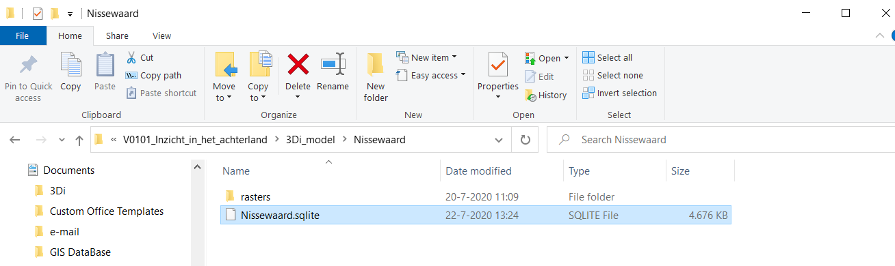
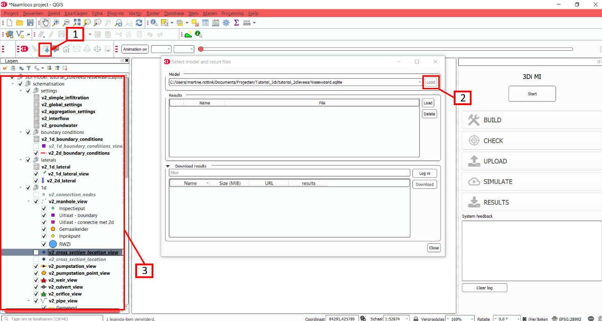
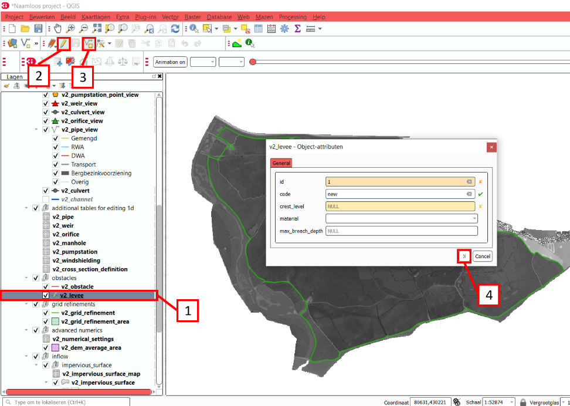
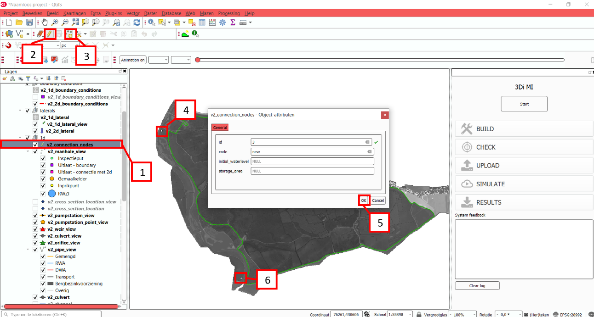
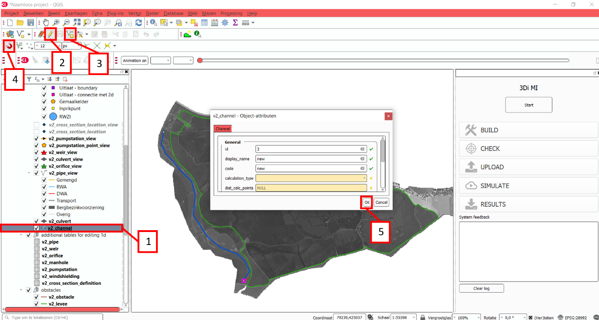
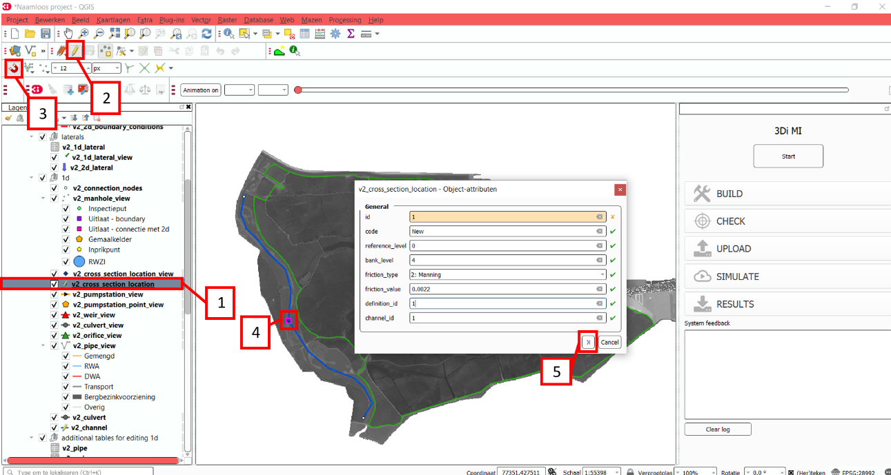
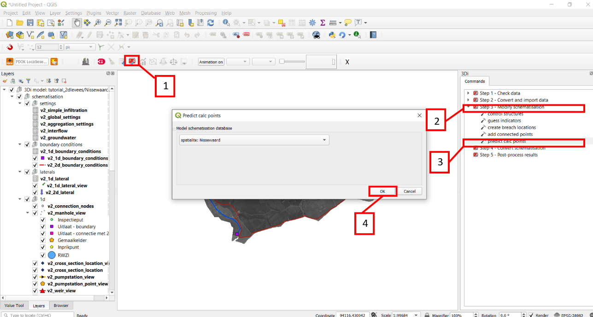
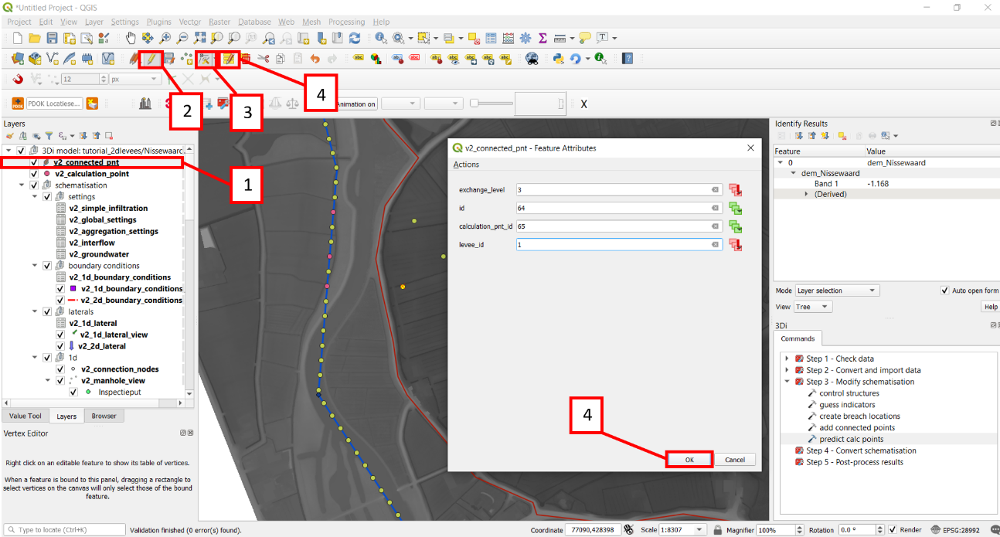
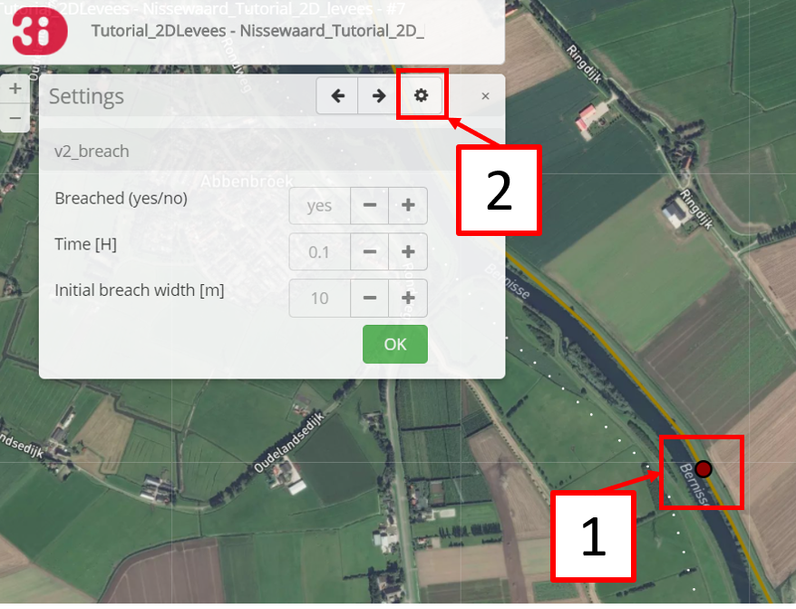

..  _flood_model:

Tutorial 4: Building a 2D flow model with levees, channels and breaches
=======================================================================

In this tutorial, you are going to build a basic 2D flood model for an area with levees, with a breach location. We will start with a model for which the basic parameters are already filled in, and expand the model step by step. We will finish this tutorial with a working model that you can play around with on the Live Site. Our area of interest is the municipality of Nissewaard on the island of Voorne-Putten in the Netherlands. The municipality of Nissewaard consists of urban area and farmland. Whilst this tutorial represents a real-world area, it is important to keep in mind that some processes will be simplified for the purpose of this tutorial.

In this tutorial, you will learn the following skills:

* Add levees to a 2D model.
* Add channels to a 2D model.
* Create a breach event in a 2D model.
* Run the model with the breach event in the 3di Live Site.

Before you start, please make sure to:

* Install the 3Di Modeller Interface. Please see :ref:`3di_instruments_and_downloads` for instructions.
* Install the 3Di toolbox in the Modeller Interface. Please see :ref:`plugin_installation` for instructions.
* Gain access to the 3Di web portal. Please see the :ref:`guide_to_portal` for instructions.
* Download the dataset for this tutorial `here <https://nens.lizard.net/media/3di-tutorials/3di-tutorial-04.zip>`_.

Model initialisation
--------------------

Model preparation
+++++++++++++++++

Unpack the starter package and save the contents into a folder. The dataset that you downloaded for this tutorial contains an partially configured .sqlite database and a digital elevation model (DEM) for a part of the Nissewaard municipality. This DEM is called dem_Nissewaard.tif and is located in the folder named "rasters". The structured .sqlite database contains all elements that can be included in a 3Di model. The basic settings are already filled in. For a step-by-step instruction for filling in these parameters, see :ref:`tutorial2_2dflatmodel`.

Loading the model in the 3Di Modeller Interface
++++++++++++++++++++++++++++++++++++++++++++++++

Our model must be imported in the 3Di Modeller Interface to view and modify its contents.
The model can be loaded via the 3Di toolbar (part of the 3Di toolbox plug in) by following these steps:

A.	Open the Modeller Interface.
B.	Create a new project.
C.	Select the **select 3Di results** button on the 3Di Toolbar (white database icon). [1]
D.	Select the **load** button in the window that pops up, and select the Nissewaard.sqlite database in your model folder. [2]
E.	You should now see the 3Di model as part of your Modeller Interface layers. [3]

Now load the rasters into Modeller Interface to view your data.

A.	Set the project coordinate system to EPSG:28992 (Amersfoort/RD New) in the bottom right of your window.
B.	Add the add the DEM via **Layer** > **Add layer** > **Add raster layer**. Now select dem_Nissewaard.tif from the “raster” folder.

Model building
--------------

Levees
++++++

In the model area for this tutorial, different levees are present. This can also be observed from the DEM for this area. For more information on levees, see: :ref:`obstacles`.

When you are building a model of a certain area and you want to include the levees, you will need data on the location, height, material and maximum breach depth of the levees in that area. In this tutorial, we are going to draw a levee around the area and assume a uniform height for this levee of 3 meters above NAP. Furthermore, we will assume that the levee is made of clay and has a maximum breach depth of 3 meters.

Levees can be implemented in the v2_levee table. Follow these steps:

A. Make sure the DEM of the model area is opened in QGIS and places below the 3Di Model in the Modeller Interface layers, this way you can see the levee that you draw.
B. Right click on the v2_levee table and select **Open attribute table**. [1]
C. Select **Toggle editing mode**. [2]
D. In the main screen, click on the **Add line feature** button. [3]
E. **Draw** your levee in the main screen. You can follow the white lines at the boundaries of the DEM (these indicate the levees). It is important that the levees are drawn within the DEM. You cannot have a levee outside of the DEM. When you are finished with drawing the levee, **right-click** with the mouse. Then the 'Object-attribute' screen will pop-up.
F. Fill in the following parameters:

   * id: filled in automatically
   * code: give your levee a code or name so you can later identify it
   * crest_level: 3 (we assume a uniform crest level of 3 meters)
   * material: 2: clay
   * max_breach_depth: 3

G. Click **OK** and untoggle the editing mode. [4]

Your levee should look something like this:

.. to do: Screenshot invullen van waar levee moet lopen, nu niet helemaal duidelijk aan het verhaal.

Channel
+++++++

Now that we have added the levees to the model, we are going to add a channel to the model. For more information on channels, see: :ref:`1d_objects` and see :ref:`channelflow`.

Channels are drawn in between connection nodes which act as the start and endpoint of the channel. If you want to make a more elaborate model and include structures in the channel (for example a weir), you have to add extra connection nodes to link these structures to a channel (they cannot be placed on top of a channel). For now, we just want to add one channel, so we need to add two connection nodes to the v2_connection_nodes table.

After a channel is added to a model, a channel geometry needs to be assigned to the channel. This is done in two steps. First, we have to define a cross section profile in the v2_cross_section_definition table, and second, we have to link this profile to the channel via the v2_cross_section_location table.

Lastly, we have to add boundary conditions to the channel. These boundary conditions have to be linked to the connection nodes. Boundary conditions are used to describe the behavior of the system outside the domain of interest.

So to add a channel or network of channels we will alter the following tables:

* v2_connection_nodes (point geometry)
* v2_channel (line geometry)
* v2_cross_section_definition (no geometry)
* v2_cross_section_location (point geometry)
* v2_boundary_conditions (point geometry)

First we will add the start and end connection node of the channel:

A. Select the v2_connection_nodes table. [1]
#. Select **Toggle editing mode**. [2]
#. Click on the **Add point feature** button. [3]
#. Click on a desired location on your map to add a connection. Make sure the connection nodes are located within the DEM layer. After clicking in the screen the 'Object-attribute' screen will pop-up.[4]
#. Fill in the following parameters:

   * id: filled in automatically
   * code: give your connection node a code or name so you can later identify it
   * inital_waterlevel: 3
   * storage_area: 0.1

#. Then click **OK** and untoggle the editing mode. [5]
#. Do the same for location [6]

Next, we are going to add a channel:

A. Select the v2_channel table. [1]
#. Select **Toggle editing mode**. [2]
#. Click on the **Add line feature** button. [3]
#. Click the **enable snapping** button. The enable snapping button helps you to make sure you connect to a certain point in the map. [4]
#. Hover with your mouse over the upper connection point, until a purple square appears. If you click when the purple square appears, you have connected the channel to the connection point.
#. **Draw** the channel by clicking on different locations, as done in the figure below. In order to make sure the channel is connected to the other connection point, again click when the purple square is visible. Similar to drawing the levee, it is important that the channel is drawn within the DEM. You cannot have a channel outside the DEM. When you are finished with drawing the channel, **right-click** with the mouse. Then the 'Object-attribute' screen will pop-up.
#. Fill in the following parameters:

   * id: filled in automatically
   * display_name: give your channel a code or name so you can later identify it
   * code: give your channel a code or name so you can later identify it
   * calculation_type: 102:connected
   * dist_calc_points: 50

#. Then click **OK** and untoggle the editing mode and click **Save**. [5]

For more information on calculation types, see: :ref:`calculation_types`.

Adding channel geometry:

A. Right click on the v2_cross_section_definition table and select **Open attribute table**. [1]
#. Select **Toggle editing mode**. [2]
#. Fill in the following parameters: [3]

   * id: filled in automatically
   * code: rectangle_channel
   * shape: 1: rectangle
   * width: 10
   * height: 3

#. Untoggle the editing mode and click  **save**. [4]

For more information on cross section shapes, see: :ref:`cross_section_of_1d_element`.

.. figure:: image/t_04_adding_cross_section_definition.png
    :alt: Adding a cross section definition

A. Select the v2_cross_section_location table. [1]
#. Select **Toggle editing mode**. [2]
#. Click on the **Add point feature** button.
#. Click the **enable snapping** button. The enable snapping button helps you to make sure you connect to a certain point in the map. [3]
#. Hover with your mouse over the channel that you have drawn. Click when a purple square becomes visible. Then the 'Object-attribute' screen will pop-up. [4]
#. Fill in the following parameters:

   * id: filled in automatically
   * code: give your cross section location a code or name so you can later identify it
   * reference_level: 0
   * bank_level: 4
   * friction_type: 2: Manning
   * friction_value: 0.0022
   * definition_id: 1 (this id number is related to the previously added cross section definition)
   * channel_id: 1 (this id number is related to the previously added channel)

#. Untoggle the editing mode and click  **save**. [5]

Lastly, we add boundary conditions:

A. Right click on the v2_1d_boundary_conditions table and select **Open attribute table**. [1]
#. Select **Toggle editing mode**. [2]
#. Fill in the following parameters:

   * id: filled in automatically
   * connection_node_id: 1 (this id number is related to the previously added connection nodes)
   * boundary_type: 1: waterlevel
   * timeseries:
        - 0,3.0
        - 15,3.5
        - 9999,3.5

#. Click on the **add feature** button and enter the same parameters. Only this time, enter 2 in the connection_node_id box.
#. Untoggle the editing mode and click  **save**. [4]

.. figure:: image/t_04_adding_boundary_condition.png
    :alt: Adding a cross section location

Breach location
+++++++++++++++

Now that we have added a connected channel to our model, we are going to add a breach location. For more theoretical information on breaches, see: :ref:`breaches`. For a more detailed guide on how to add a levee breach, see: :ref:`addleveebreaches`.

Follow these steps to add a breach:

A. Click on the **Commands for working with 3di models** button. [1]
#. Open 'Step 3 - Modify schematisation'. [2]
#. Choose **predict calc points**. [3]
#. Choose Nissewaard.sqlite and click **OK**. [4]

In your schematisation, two tables have now been added: v2_connected_pnt and v2_calculation_point. These tables are also visualised in your screen: a lot of points are added along the channel.

.. to do: Voorbeeld screenshot van de tabellen toevoegen.
.. to do: eventueel nog uitleggen wat deze stap nou heeft gedaan.

In order to add a breach, we have to move one of the connected points in the model from its location in the channel to the other side of the levee.

E. Select the v2_connected_pnt table. [1]
#. Select **Toggle editing mode**. [2]
#. Click on the **vertex tool** button.  [3]
#. Click on one of the connected points in the channel and drag the point to the other side of the levee. Then the 'Object-attribute' screen will pop-up.
#. Fill in the following parameters:

   * exchange_level: 3
   * id: filled in automatically
   * calculation_pnt_id: filled in automatically
   * levee_id: 1

#. Untoggle the editing mode and click  **save**. [4]

..  to do: Screenshot opnew maken! zitten nu twee 4en in. Ik weet niet waarom de 4 van multiple atributes modify'en is gemarkeerd. komt niet terug in de tekst.

The displaced connected point is now the link between the 2D grid cell in which it is placed and the corresponding calculation point in the channel. In other words, this connection point now forms a link between the 1D and 2D part of the model. More information about calculation points, connected points and breaches can be found in the 3Di documentation.

.. to do: hier nog de juiste verwijzingen in de tekst verwerken.

Model validation
----------------

A short description of the model validation is given here. For a general guide see :ref:`checking_model`.

Verify the model rasters using the raster checker
++++++++++++++++++++++++++++++++++++++++++++++++++

Before sending our model to the web portal, it is important to validate that our model contains no errors. The raster checker is part of the 3Di toolbox and performs 18 checks to verify the quality of the DEM. The raster checker checks all the rasters that are included in the model. In our case, this is only the DEM for the area of Nissewaard, but in more sophisticated models you can also include other rasters, like friction and infiltration.

In order to use the raster checker, follow these steps:

A. Select the **commands for working with 3Di models** button. On the right of your screen, a tab "3Di" will open. [1]
B. Expand the "Step 1 – Check data" line and click on the **raster checker**. [2]
C. In the pop-up screen, select ‘spatialite: Nissewaard' and click **OK**. [3]

.. TODO: aanpassen, raster checker is niet meer. model wordt nu gecheckt tijdens het uploaden. 1 keer aanpassen voor alle tutorials

The following screen will appear:

.. figure:: image/t_04_raster_checker.png
    :alt: Raster checker

Verify the schematisation using the schematisation checker
++++++++++++++++++++++++++++++++++++++++++++++++++++++++++++++++++

The second validation that we have to perform before sending the model to the web portal is that of the schematisation.
For this, we use the schematisation checker.
It checks the model tables for many possible errors that cause the model to crash when you want to compile the model.
In order to check your schematisation, follow steps a and b from the previous step, but now select **schematisation checker**.
Again, select ‘spatialite: Nissewaard' and select the destination for the output file.
Select **Run**.

The output file is an excel file in which all the warnings and errors that were found are listed.
You may get the error “Value in v2_aggregation_settings.aggregation_in_space should be of the type integer”.
This is a known error in the schematisation checker, which will be removed in a future update.
If you get this error, you can ignore it.

If you do not get any further warnings or errors, your model is successfully validated and is ready to upload to the web portal.

Model activation
----------------
A short description of the model activation is given here. A comprehensive guidance with visual support is provided in Tutorial 2 (:ref:`tutorial2_2dflatmodel`).

Upload your model
+++++++++++++++++

See :ref:`uploading_schematisation` for how to upload your model.

The model is now also available on the `3Di Livesite <https://www.3di.live/>`_ and the `management screens <https://management.3di.live>`_.

Run your model
++++++++++++++

You have now build a 2D flow model for mountainous terrain from scratch!
You can now run your model via the 3Di Live Site (:ref:`guide_to_portal`) or via the 3Di Modeller Interface (:ref:`simulate_api_qgis`).
It will be available under the name you gave it.

It is important to note that you have to open your breach in the 3Di Live Site. In the 3Di Live Site, breaches are depicted as a brown dot [1].  You can open a breach by clicking on the breach and clicking on the settings button [2]. Here you can open the breach. Also, you can set the time it takes for the breach location to be fully breached (Time [H]) and the initial breach width.

