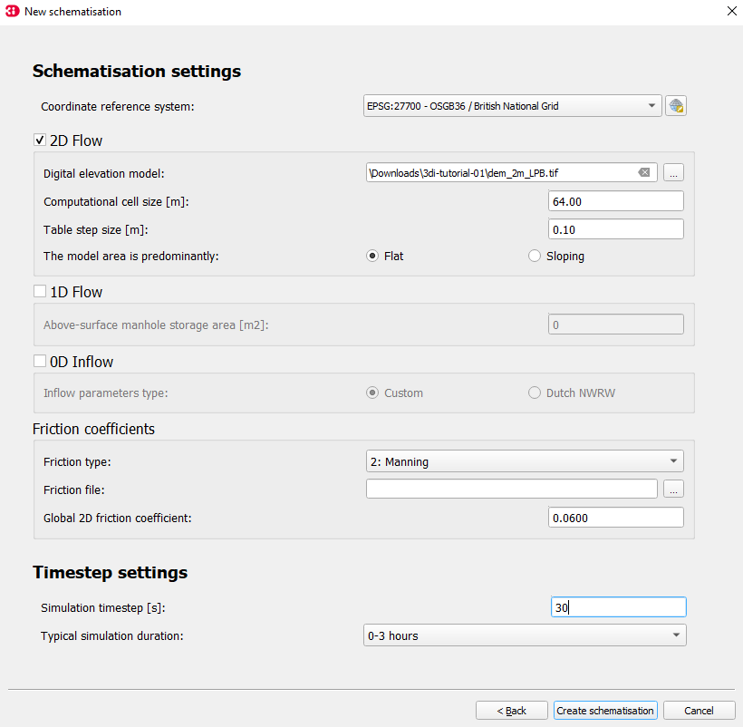
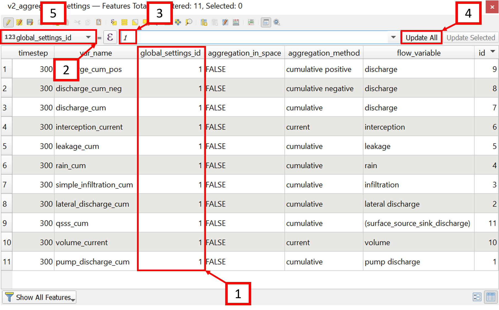
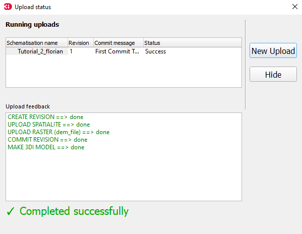

.. _tutorial2_2dflatmodel:

Tutorial 2: Building a Basic 2D Flow Schematisation
==========================================

Introduction
------------

In this tutorial, you will build a schematisation to model basic 2D flow in 3Di.
We will start from scratch with an empty sqlite and build a schematisation step by step.
The final product will be a working 3Di model that can be used on the 3Di Live site.
The schematisation will be a representation of the Laugharne and Pendine Burrows, which are located in Carmarthenshire (Wales).
The burrows enclose a flat area of reclaimed salt marshes that are currently used as farmland.
Although the schematisation represents a real-world area, some processes will be simplified for the sake of this tutorial. Please keep this in mind while analysing the results of your simulations.

**In this tutorial you will**:

* Re-practice :ref:`the workflow of creating a new schematisation <tutorial1_workflow>`.
* Couple a digital elevation model (DEM) to your schematisation. 
* Configure the settings of a 2D model.
* Validate your model input with the raster checker.
* Validate your model schematization with the schematization checker.
* Generate a 3Di Model and play with it on the 3Di Livesite. 

**Before you start, please make sure to**:

* Install the 3Di Modeller Interface. Please see :ref:`3di_instruments_and_downloads` for instructions. 
* Install the 3Di toolbox in the Modeller Interface. Please see :ref:`plugin_installation` for instructions.
* Gain access to the 3Di Live Site. Please see :ref:`guide_to_portal` for instructions.
* Download the Taf `dataset <https://nens.lizard.net/media/3di-tutorials/3di-2d_flow_tutorial.zip>`_ , which contains a digital elevation model (DEM) of the Laugharne and Pendine Burrows called dem_2m_LPB.tif and an empty .sqlite database, which can be ignored. 
    
    :sub:`The digital elevation model contains United Kingdom public sector information licensed under the Open Government Licence v2.0.`

Building the Schematisation
---------------------------

Creating a new Schematisation
+++++++++++++++++++++++++++++

As we are building a schematisation from scratch, the workflow explained in :ref:`Tutorial 1 <tutorial1_workflow>` will be used to initialize a new schematisation.
If you haven't followed this tutorial yet, please do so before continuing this tutorial.

Name your newly created schematisation **'Tutorial2_<your_name>'**, select the correct organisation and check the 'Create new Spatialite' box. 
Press the 'Next' button twice and fill in the data as provided in :numref:`schem-settings`. Select your downloaded DEM .tif file for the Digital elevation model field. 

    Initial Schematisation settings

Setting up your QGIS project
+++++++++++++++++++++++++++++
When your schematisation has successfully been generated, it can be added to your QGIS project. During this process, you might get a warning prompt on an outdated database schema version. If so, select **Yes**.
Your spatialite should now be visible in your Layers panel. 

It is convenient (but not required) to add the DEM to your project as well.
This is simply done by navigating to the folder of your schematisation, navigate to 'work in progress'>'schematisation'>'rasters' and finally drag your DEM file into your QGIS project. 
Please make sure that you use the DEM file from your project folder in stead of your download folder. Changes made to your DEM file will not be tracked if you use the wrong file.

Another way to make building your schematisation visually easier is to add a background. A good option would be the Google Satellite background map:

a.  In your browser panel, right-click on “XYZ Tiles” and select “new connection”. If the browser panel is not visible in your 3Di modeller interface, select “view” > “panels” > “browser panel” from the top menu bar. [1] 
b.  Fill in Name as “Google Satellite” and URL as ``https://mt1.google.com/vt/lyrs=s&x={x}&y={y}&z={z}``. [2] 
c.  Select “OK”. The Google Satellite layer should now be visible in your browser panel. You may need to click the small triangle to the left of “XYZ tiles” if the layer does not become immediately visible. [3] 
d.  Double-click the Google Satellite layer to load it into your project. [4] 
e.  Reorder the layers such that the Google Satellite layer is below the 3Di model. This will ensure the visibility of the model components at later stages. [5] 

Lastly, it is advised to set your project reference to EPSG:27700 (British National Grid) for this tutorial. 
This can be done in the bottom right of your QGIS/MI window. 

Your QGIS project should now look like this:

.. figure:: image/e_qgis-project.png
    :alt: QGIS project setup.
    :name: qgis-setup

    The proposed setup of your QGIS project including i) your Spatialite loaded, ii) the DEM added, iii) a background layer, and iv) a projection of 27700.

Set up your Schematisation settings
+++++++++++++++++++++++++++++++++++
The most fundamental element to building a Shematisation is choosing your correct settings.
We will go through all required settings for a basic 2D flow model. A list of mandatory settings and detailed descriptions can be found :download:`in the database overview <pdf/database-overview.pdf>`.
Extra elements, such as 1D channels, levees or hydraulic structures, are discussed in the other tutorials.

Complete the global settings
^^^^^^^^^^^^^^^^^^^^^^^^^^^^^^^^

The global settings are found in the v2_global_settings table. Open the settings by

A.	Right-click the v2_global_settings table. [1]
B.	Select **Open attribute table**. [2]

.. figure:: image/03_global_settings.png
    :alt: Global settings

C. Select **Switch to form view** in the bottom right corner. [1]
D. Select **Toggle editing mode** and in the top right corner. [2]

.. figure:: image/04_toggle_editing.png
    :alt: Toggle editing

Now everything is set up to configure the global settings.
3Di requires you to complete all mandatory settings before changes can be saved. These are recognized by the orange color when not filled in. 
For an overview of the mandatory settings, checkout the :download:`database overview pdf <pdf/database-overview.pdf>`.
Attempts to save the settings before all mandatory field have been completed will result in an error message.

The settings that we will use for the 2D flow simulations in the Laugharne and Pendine Burrows Model are as follows (some settings allready have been filled in due to the settings that you have set during the Schematisation creation):

.. csv-table:: General
    :header: "Setting", "Value for this tutorial", "Comments"

    "id", "1"
    "name", "Tutorial_2D_flow"
    "use_0d_inflow", "0: do not use 0d inflow", "Use only when point sources are present"
    "use_1d_flow", "No", "This tutorial does not define 1D channels"
    "use_2d_rain", "Yes", "Enables rainfall"
    "use_2d_flow", "Yes", "Enables 2D flow"

.. csv-table:: Grid
    :header: "Setting", "Value for this tutorial", "Comments"

    "grid_space", "64", "Minimum grid cell size in metres"
    "kmax", "1", "See :ref:`computational_grid`"
    "table_step_size", "0.10", "See :ref:`computational_grid`"

.. csv-table:: Terrain information
    :header: "Setting", "Value for this tutorial", "Comments"

    "dem_file", "rasters/dem_2m_LPB.tif"
    "epsg_code", "27700", "British national grid"
    "frict_coef_file", "NULL", "Only used for spatially varying friction"
    "frict_coef", "0.06", "Farmland"
    "frict_type", "2: Manning"
    "frict_avg", "No"
    "initial_groundwater_level_file", "NULL", "No groundwater"
    "initial_groundwater_level", "NULL"
    "initial_groundwater_level_type", "(NULL)"
    "initial_waterlevel_file", "NULL", "Only for spatially varying initial water level"
    "initial_waterlevel", "-10", "in metres; selected for a dry start"
    "water_level_ini_type", "max"
    "interception_file", "NULL", "No interception"
    "interception_global", "NULL"
    "wind_shielding_file", "NULL", "No wind"

.. csv-table:: Time
    :header: "Setting", "Value for this tutorial", "Comments"

    "start_date", "2020-01-01"
    "start_time", "2020-01-01 00:00:00"
    "sim_time_step", "30", "in seconds"
    "timestep_plus", "No", "Only when extra control over the timestep is required"
    "minimum_sim_time_step", "0.01"
    "maximum_sim_time_step", "30"
    "nr_timesteps", "240", "for a 2 hour simulation"
    "output_time_step", "120", "in seconds"

.. csv-table:: Setting id's
    :header: "Setting", "Value for this tutorial", "Comments"

    "interflow_settings_id", "NULL", "No interflow"
    "groundwater_settings_id", "NULL", "No groundwater"
    "numerical_settings_id", "1", "Reference to the model specific numerical settings"
    "simple_infiltration_settings_id", "1", "Reference to the model specific infiltration settings"
    "control_group_id", "NULL", "No control groups"

.. csv-table:: Extra options 1D (not relevant as this tutorial does not contain 1D elements)
    :header: "Setting", "Value for this tutorial", "Comments"

    "advection_1d", "0: Do not use advection 1d", "No 1D elements"
    "dist_calc_points", "10000", "No 1D elements"
    "manhole_storage_area", "NULL", "No 1D elements"
    "max_angle_1d_advection", "NULL", "No 1D elements"
    "table_step_size_1d", "NULL", "No 1D elements"

.. csv-table:: Extra options 2D
    :header: "Setting", "Value for this tutorial", "Comments"

    "advection_2d", "1: Use advection 2d"
    "dem_obstacle_detection", "No"
    "guess_dams", "No"
    "dem_obstacle_height", "NULL", "Obstacles not activated"
    "embedded_cutoff_threshold", "NULL"
    "flooding_threshold", "1e-06"
    "table_step_size_volume_2d", "NULL"

.. tip::
    Do not forget to save your changes after completing all settings, by clicking on **save edits** in the top left corner.

Complete the infiltration settings
^^^^^^^^^^^^^^^^^^^^^^^^^^^^^^^^^^^^

The settings for the infiltration mechanism are contained in the v2_simple_infiltration table, which can be found just above the global settings.
Right-click again to open the Attribute Table [1], toggle editing [2], add a new feature [3] and start editing the settings to the provided values in :numref:`inf_settings`.

.. image:: image/05_infiltration.png
    :alt: infiltration

Editing the table work in a similar manner as with the v2_global_settings table. Complete the following settings:

.. csv-table:: General
    :name: inf_settings
    :header: "Setting", "Value for this tutorial", "Comments"

    "id", "1", "Must match the simple_infiltration_settings_id in the v2_global_settings_table"
    "display_name", "infiltration"
    "infiltration_rate", "360", "in mm/hour; uniform silty sand is assumed in this tutorial"
    "infiltration_rate_file", "NULL", "Only used for spatially varying infiltration rates"
    "max_infiltration_capacity_file", "NULL", "infinite infiltration capacity is assumed in this tutorial"
    "infiltration_surface_option", "0", "See :ref:`infiltration`"

Complete the aggregation settings
^^^^^^^^^^^^^^^^^^^^^^^^^^^^^^^^^^^^

The aggregation settings control the aggregation of model results.
They are contained in the v2_aggregation_settings table.

As with the previous settings, open the attribute table, toggle the editing mode and add a feature. However, select **switch to table view** this time.

The different rows of the table refer to different model output categories.
For each category, set the global_settings_id at 1 if this is not the case yet. You can either do this manually by filling in 1's in the column [1], or by:

A. Selecting the column global_settings_id in the drop down menu [2]
B. Typing a 1 in the bar [3]
C. Clicking **update All** [4]
D. And pressing **save edits** [5]

Retain the default values for all other settings.

Complete the numerical settings
+++++++++++++++++++++++++++++++

The numerical settings are contained in the v2_numerical_settings table which can be found under advanced numerics.

.. image:: image/06_numerical.png
    :alt: Numerical settings

As with the previous settings, open the attribute table, toggle the editing mode, switch to form view and add a feature if the settings do not yet contain one.
Change the settings, where required, to the following values:

.. csv-table:: General
    :header: "Setting", "Value for this tutorial", "Comments"

    "id", "1", "Must match the numerical_settings_id in the v2_global_settings_table"

.. csv-table:: Limiters (not used in this tutorial, only for sloping areas)
    :header: "Setting", "Value for this tutorial", "Comments"

    "limiter_grad_1d", "1"
    "limiter_grad_2d", "0"
    "limiter_slope_crossectional_area_2d", "0"
    "limiter_slope_friction_2d", "0"

.. csv-table:: Matrix
    :header: "Setting", "Value for this tutorial", "Comments"

    "convergence_cg", "1e-09"
    "convergence_eps", "1e-05"
    "use_of_cg", "20"
    "use_of_nested_newton", "0: when the schematisation does not include 1D-elements …"
    "max_degree", "5: for surface flow only"
    "max_nonlin_iterations", "20"
    "precon_cg", "1"
    "integration_method", "0"

.. csv-table:: Thresholds
    :header: "Setting", "Value for this tutorial", "Comments"

    "flow_direction_threshold", "1e-06"
    "general_numerical_threshold", "1e-08"
    "thin_water_layer_definition", "0.05"
    "minimum_friction_velocity", "0.05"
    "minimum_surface_area", "1e-08"

.. csv-table:: Miscellaneous
    :header: "Setting", "Value for this tutorial", "Comments"

    "cfl_strictness_factor_1d", "1"
    "cfl_strictness_factor_2d", "1"
    "frict_shallow_water_correction", "0"
    "pump_implicit_ratio", "1"
    "preissmann_slot", "0"

All the settings should now be up to date, which means you are good to go validate and upload your Schematisation.

Validate and upload your Schematisation & Generate a 3Di Model
-----------------------------------------------------------
Following the basic workflow (explained in :ref:`Tutorial 1 <tutorial1_workflow>`), we are now checking the Schematisation, uploading it to the 3Di Management screens and generate a 3Di model by:

#) Pressing the Upload button in the Models & Simulations plugin.

#) Clicking the New Upload button, followed by the Next button.

#) Clicking the Check Schematisation button. This should result in no errors. If you did get a warning or error, please thoroughly check the preceding steps. Otherwise, click Next.

#) Select Upload for the Spatialite and Terrain Model, fill in a commit message such as "First Commit Tutorial 2 <name>", select UPLOAD AND PROCESS and click the Start Upload button.

After waiting for about 2 minutes, you should see the following window:

Run your 3Di Model on the Livesite
----------------------------------

You can now find your 3Di Model via the `3Di Live Site <https://www.3di.live/>`_ or via the 3Di Modeller Interface and use it for simulations. The Schematisation can also be found in the `Management screens <https://management.3di.live/>`_.

.. image:: image/17_livesite.png
    :alt: Live calculation in the live site

You have now succesfully build a 2D flow model Schematisation from scratch!