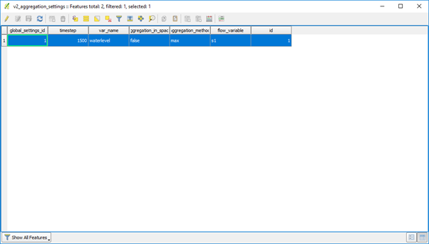

Aggregated output
=================

Results for a 3Di simulation are normally written in two one results file called `subgrid_map.nc`. This file contains the flow information at different times in the simulation. The interval at which these flow information are written is defined by the user via the parameter `output_time_step`. 
Sometimes summarized results during certain intervals in the simulation is also very useful information. For this purpose an aggregated results file is available called `flow_aggregate.nc`. The configuration for this aggregation file is available in the models spatialite and the table is called v2_aggregation_settings. 
The configuration with its options will be explained below. The layout of the table is:

Configuration options
---------------------

var_name
^^^^^^^^

A user-defined variable name to dinstinguish between aggregated configuration of variables.

flow_variable
^^^^^^^^^^^^^

Flow variable for which to determine aggregated results. The flow variables for which to determine aggregated results are:

* discharge
* flow_velocity
* infiltration
* pump_discharge
* rain
* volume
* waterlevel
* wet_cross-section
* wet_surface
* lateral_discharge

aggregation_method
^^^^^^^^^^^^^^^^^^

The different aggregation methods that can be used on a flow variable are:

* max = maximum value of variable in timestep (configurated interval)
* min = minimum value of variable in timestep (configurated interval)
* avg = average value of variable in timestep (configurated interval)
* cum = This is integration over time of variable [dt * variable]. For instance cumulative net volume across flowline in timestep (configurated interval)
* cum_positive = This is integration over time of variable in positive direction [dt * variable]. For instance cumulative volume across flowline in positive direction for timestep (configurated interval)
* cum_negative = This is integration over time of variable in negative direction [dt * variable]. For instance cumulative volume across flowline in negative direction for timestep (configurated interval)

timestep
^^^^^^^^

Timestep is the interval in seconds for writing and determining the aggregated flow results. An example is when the maximum waterlevel needs to be determined every 300 seconds. Every 300 seconds the maximum waterlevel in that interval is determined and written to file at the end of this interval.
aggregation_in_space
When the user wants the flow information to be summed over the entire domain, the aggregation_in_space field can be set to true. For instance the when the maximum volume for the entire domain is desired at certain intervals. 

Output layout
-------------

The variable name of the aggregated flow results in the flow_aggregate.nc is named based on the following convention:

<flow_variable>_<aggregation _method> 

When this name is already in use, because has defined it twice the name will switch to:

<var_name>_<aggregation _method> 

Every aggregated results has it’s own time variable in the aggregated result file at which the aggregated flow results were written. This variable will be named based on the following convention:
time_<aggregation_variable>
