.. _tutorial1_workflow:

Tutorial 1: Workflow of building a 3Di model - Old route (pre-klondike)
==========================================================================

.. note:: This tutorial described the old route of building a 3Di model. 
    After the Klondike release, you do not need Tortoise and Inpy anymore. This tutorial will be updated. 

Welcome to 3Di and your first tutorial. In this tutorial, we will go through the basic steps of building a 3Di model. 
These are the pre-processing steps before you can start building your model and the post-processing steps after you 
have built your model. These basic steps will return in every 3Di model that you will build. We will work with a 
pre-build model. Upon completion of this tutorial, you will have an understanding of the workflow surrounding building 
a 3Di model and you will be ready to start building models yourself in the next tutorials.

We will use a simple model of the Laugharne and Pendine Burrows in the United Kingdom. The burrows enclose a 
flat area of reclaimed salt marshes that are currently used as farmland. Whilst this tutorial represents a 
real-world area, it is important to keep in mind that the model is greatly simplified for the purpose of this 
tutorial. 

You will learn the following skills in this tutorial:

* Load an existing model into the 3Di modeller interface,
* Upload you model to the 3Di model repository,
* Initialise your model in the 3Di model repository,
* View your model on the 3Di live site,
* Update your model using TortoiseHG. 

Before you start, please make sure to:

* Install the 3Di modeller interface. Please see :ref:`3di_instruments_and_downloads` for instructions.
* Install TortoiseHG. Please see `TortoiseHG <https://tortoisehg.bitbucket.io/download/index.html>`_ for instructions.
* Gain access to the 3Di web portal. Please see :ref:`guide_to_portal` for instructions.
* Click `here <https://nens.lizard.net/media/3di-tutorials/3di-tutorial-01.zip>`_ to download the Laugharne and Pendine Burrows model for this tutorial.
    
Pre-processing: loading a model into the 3Di modeller interface
-----------------------------------------------------------------

3Di models are built from a spatialite database plus a set of supporting data rasters. The spatialite database is the file with the .sqlite extension. The spatialite database contains the model settings and features like channels, weirs, and levees. The supporting data rasters contain geospatial information like elevation, friction and infiltration. They must be prepared in a GeoTIFF format with extension .tif. The minimum requirement for any 3Di model is a spatialite database with model settings and an elevation raster. The latter is commonly referred to as a digital elevation model (DEM).

The Laugharne and Pendine Burrows model folder contains two models. Open model 1. It contains a spatialite database and one elevation raster in the folder “rasters”. This folder contains a DEM of the study area.

.. figure:: image/00_model_folder.png
    :scale: 30%
    
To start working on a model, the spatialite database must be loaded into the 3Di modeller interface. Load the LP_Burrows.sqlite model via the following steps:

a.  Open the 3Di modeller interface on your computer.
b.  Create a new project.
c.  Select the “select 3Di results” button on the 3Di Toolbar (white database icon). [1]
d.  Select “load” in the model section, and select the LP_Burrows.sqlite from the Model 1. The “load” button may not be visible on all screens and zoom settings. It can help to enlarge the pop-up window. [2]
e.  You should now see the 3Di model as part of your project layers. [3] 
f.  Set the project coordinate system in accordance with your model. This model is created in the British national grid with code EPSG:27700. [4] 
g.  Add the DEM to your project by dragging it from your file explorer to the layers panel. [3]

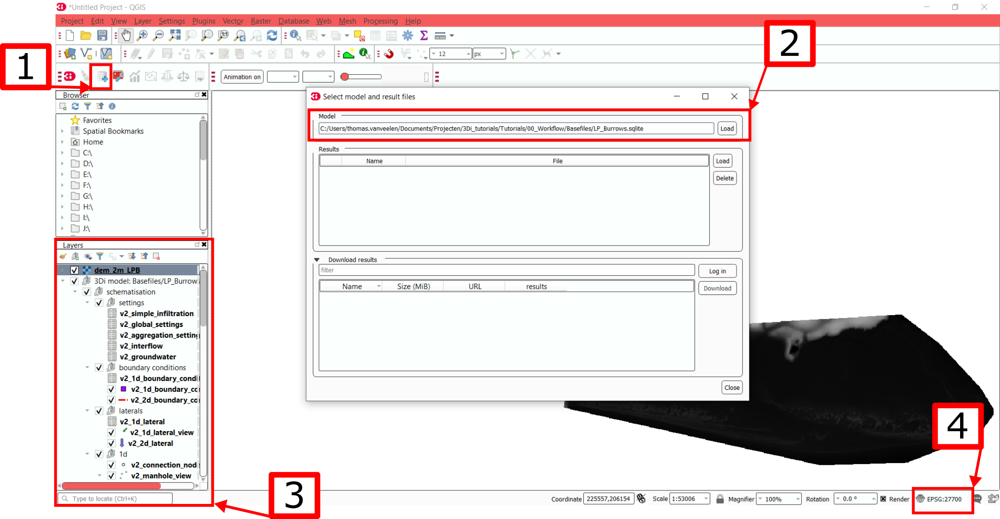

It is recommended to use a background map to get a feeling for the area that you are modelling. A good option would be the Google Satellite background map:

a.  In your browser panel, right-click on “XYZ Tiles” and select “new connection”. If the browser panel is not visible in your 3Di modeller interface, select “view” > “panels” > “browser panel” from the top menu bar. [1] 
b.  Fill in Name as “Google Satellite” and URL as ``https://mt1.google.com/vt/lyrs=s&x={x}&y={y}&z={z}``. [2] 
c.  Select “OK”. The Google Satellite layer should now be visible in your browser panel. You may need to click the small triangle to the left of “XYZ tiles” if the layer does not become immediately visible. [3] 
d.  Double-click the Google Satellite layer to load it into your project. [4] 
e.  Reorder the layers such that the Google Satellite layer is below the 3Di model. This will ensure the visibility of the model components at later stages. [5] 

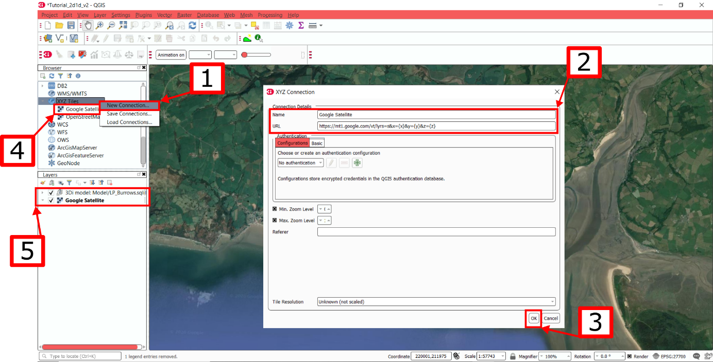

Your screen should now look like the image below. The model is successfully loaded and ready to be worked on. As you will add more features to your model, you will see more elements in the 3Di modeller interface. These options will be extensively covered in the following tutorials. Here we will make no changes to the model, but focus on uploading our model to the repository.

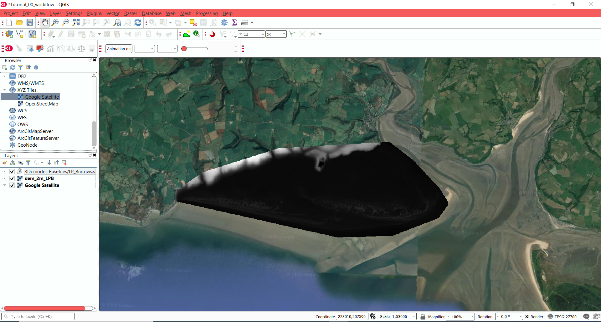

.. _post_processing:

Post-processing
---------------------

Five steps are required for running your completed 3Di model successfully on the 3Di live site or via the API. These steps included checking your model for errors and activating your model in the 3Di repository. This procedure is referred to as post-processing.

Raster checker
++++++++++++++++++++++++++++++++++++++
It is important to validate that our model contains no errors. The :ref:`rasterchecker` is part of the 3Di toolbox and performs 18 checks to verify the DEM and other rasters.

a.  Open the 3Di toolbox. The toolbox will appear as an extra panel in your QGIS window. [1] 
b.  Select the raster checker under the check data tab. [2] 
c.  Select the ‘Spatialite: LP_Burrows” in the pop-up window, and press “ok”. [3] 

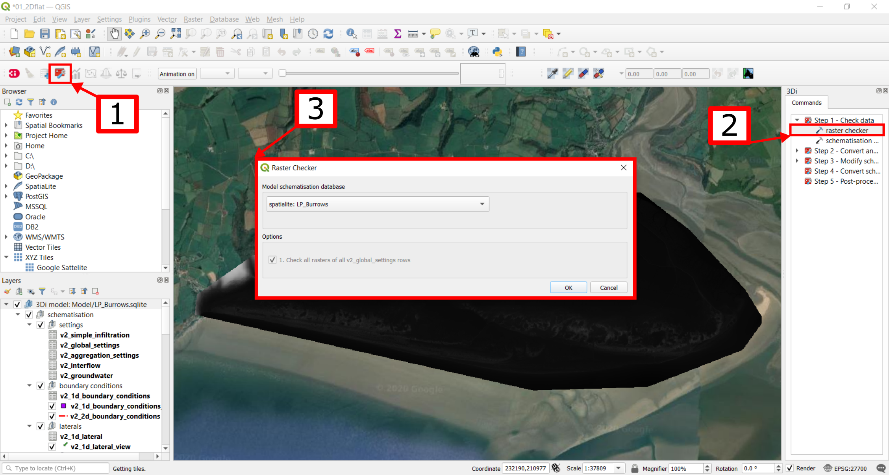

d.  A pop-up window with the result appears. There should be 0 errors and 0 warnings. If any warnings appear, please see the :ref:`rasterchecker` tutorial on how to read the log file. [4]

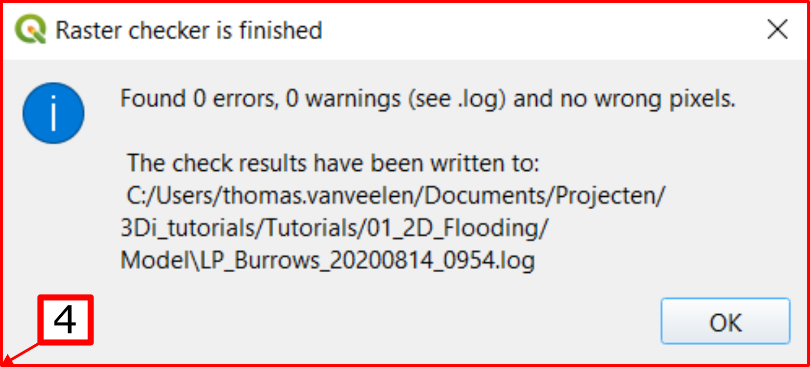

A log of the performed test is written to the log file in the location as denoted in the result prompt. This location is typically the location of your spatialite database. The log file can be opened to view additional details of the checks performed. 

Schematisation checker
++++++++++++++++++++++++++++++++++++++
The second validation is that of the model schematisation. This is checked with the :ref:`schematisationchecker` in the 3Di toolbox. It checks the model tables for many possible errors that could lead to crashes when the model is compiled. 

a.  Open the 3Di toolbox. The toolbox will appear as an extra panel in your QGIS window. [1] 
b.  Select the raster checker under the check data tab. [2] 
c.  Select the ‘Spatialite: LP_Burrows” in the pop-up window. [3] 
d.  Specify the path for saving the log file. Set the path to the same folder as the LP_Burrows.sqlite. [4] 

.. figure:: image/06_schemachecker_.png

Now open the log file. You may find the error “Value in v2_aggregation_settings.aggregation_in_space should to be of type integer”. This is a known bug in the schematisation checker, which will be removed in a future update. You should not find any other warnings.

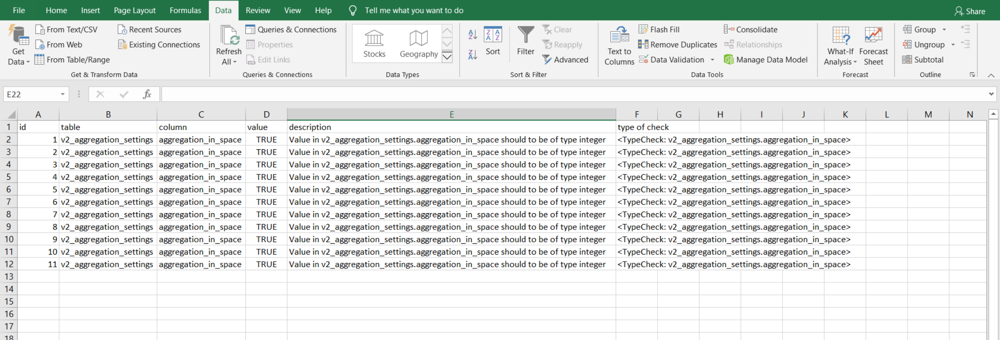

   
   Log of the schematisation checker
   
If you do not get any further warnings or errors, your model is successfully validated and is ready for activation.

Uploading your model to the repository
++++++++++++++++++++++++++++++++++++++
The first stage towards running your model is to upload you model to the 3Di model databank. Take the following actions:

a.  Create a new .zip file with your new LP_Burrows.sqlite database and your DEM rasters folder. Here we name it Tutorial_workflow.zip. Be mindful that the folder structure in the .zip file must match that of your schematisation. This will be discussed further in the next tutorial. 

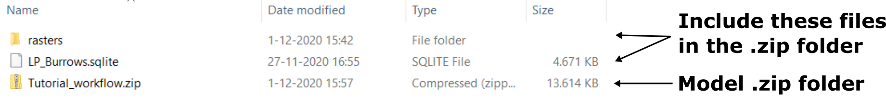

b.  Go to https://models.lizard.net/model_databank/.
c.  Select “Upload new model”. Make sure that you are logged in for this step.

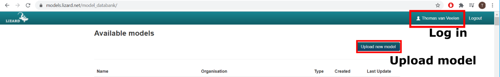

d.  Fill in the details of your models as in the figure below. Be sure to select 3Di-v2 as your model type. Select “Submit” when you have completed the form.

.. figure:: image/10_model_upload.png
   :alt: ini_model

   
   Initialising your model
 
Now that your model is stored in the model databank, it is ready to be initialised:

a.  Go to https://3di.lizard.net/models/.
b.  Use to search function to retrieve your model. Search on the model name: Tutorial_workflow. [1] 
c.  Select “also show repositories that do not have inp files yet”. [2] 
d.  Select “initialize inp generation” for your model. [3] 

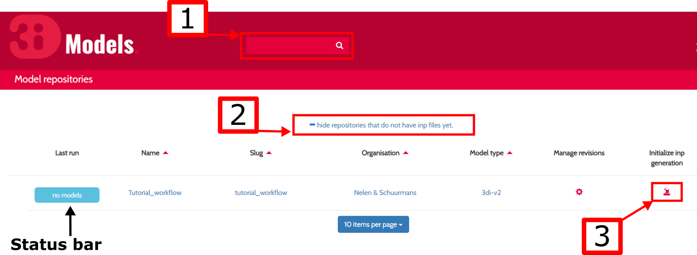

Your model will now be initialised. The blue status bar “no models” will turn to a green bar with the text “success” when the model is successfully initialised. You may have to wait a few minutes and refresh the page. If the model is not successfully initialised, it will show a red bar with the text “failed”. This message indicates that the model contained an error. The log file can be viewed by clicking on the status bar. If you have followed the instructions correctly, your model will initialise successfully.

Running your model
++++++++++++++++++++++++++++++++++++++

You can now run your model via the 3Di live site `3Di livesite <http://3di.live#>`_ or via the :ref:`apicalculations`. It will be available under the name “LP_Burrows_Workflow”.

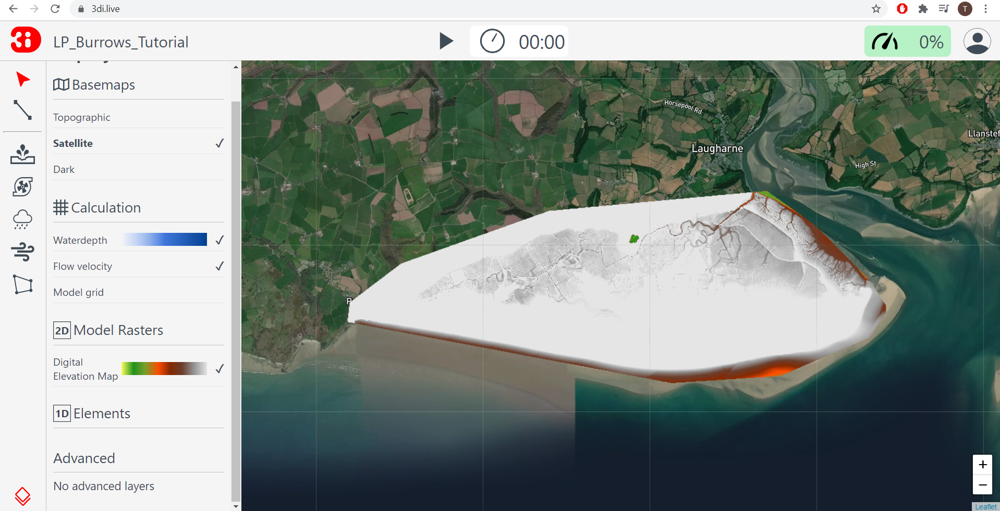

Model updating via TortoiseHG
---------------------------------

Models are often updated, for example by adding new features, changing settings, or bugfixes. Instead of having to go through the full post-processing routine again, models can simply be updated through an SVN client such as TortoiseHG. We will set up a connection between the 3Di model repository and your local connection. This enables you to exchange information with the model repository without having to upload a new model database every time. This saves time and ensures that your model versions are grouped in the model repository. The model repository also allows for multiple people to work alongside each other on the same model.

Clone the base model
++++++++++++++++++++++++++++++++++++++

A connection is set up by cloning a model from the repository to your local computer through TortoiseHG. Cloning means that a model from the repository is copied to a local folder on your computer.  Follow these steps:

a.  Go to 3Di Model repository at https://models.lizard.net/model_databank/.
b.  Select the model that you built. It is important that you select your own model, as it is a shared repository in which you will modify and update the original model. [1] 
c.  Copy the model link. This is the part after “$ hg clone”.  [2] 

.. figure:: image/13_databank.png

d.  Open the application TortoiseHG Workbench on your computer.

.. figure:: image/14_tortoise_.png
   :scale: 80%

e.  Select “File > Clone repository”. [1] 
f.  Paste the link from step 3 in the box “source:”. [2]
g.  For the destination, create a new empty folder on your computer named “Model_repo” via “browse…”. [3] 
h.  Select “Clone”. You will be prompted for your 3Di username and password. When completed, the model will be copied from the repository to your computer. [4] 

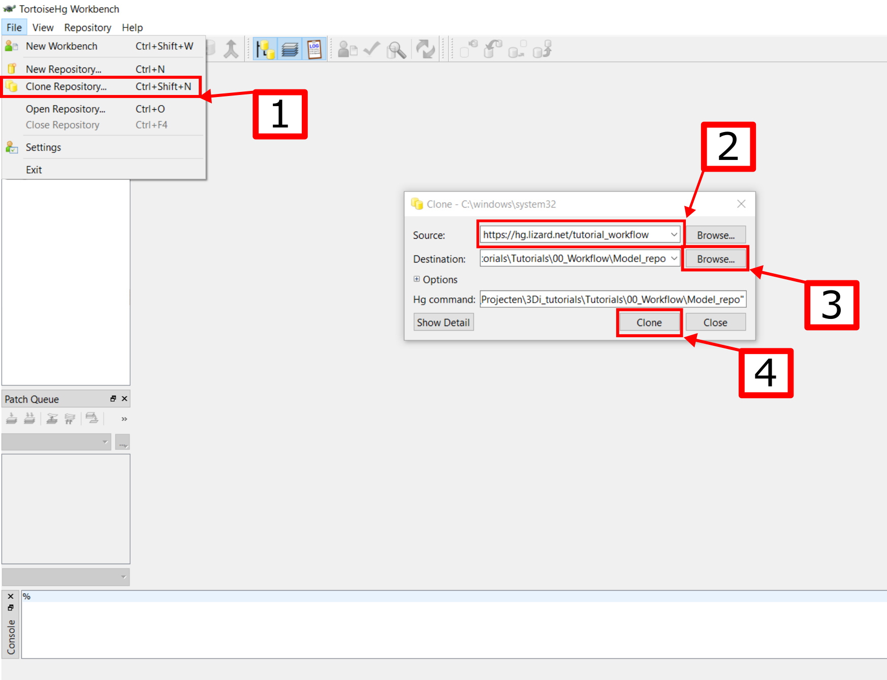

When the model has been copied, TortoiseHG will shows several panels with information on your model. We will highlight the most important panels.

a.  The repository registry shows the model connections that have been set up, including the clone we just made. [1] 
b.  The revision history provides a log of the modifications made to the model. Each model update to the 3Di repository is referred to as a revision. [2] 
c.  The change log lists the files that have been changed since the last revision. [3] 
d.  The change set can be used to comment on new revisions. [4] 

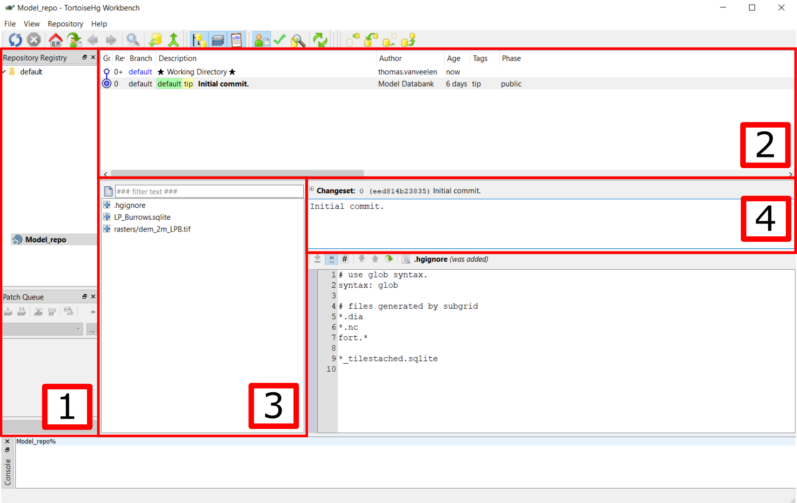

   
   Reupload updated model to the repository

Let us suppose that we want to replace model 1 by model 2 from the Basefiles.zip-file provided at the start of this tutorial. This is referred to as pushing a new model revision. Follow the following steps:

a.  Locate the LP_Burrows.sqlite in the folder “Model 2” in “Basefiles.zip”provided at the start of the tutorial.
b.  Copy LP_Burrows.sqlite from the folder “Model 2” to the folder “Model_repo”. Replace the existing .sqlite database.
c.  In TortoiseHG select your working directory. [1] 
d.  Select the renew button. [2] 
e.  “M LP_Burrows.sqlite” should appear in the change log. The adjective “M” indicates that the file has been modified in your local directory. [3]
f.  Type “1D channels added” in the change set. This message will be published in the 3Di model repository. It helps others to track changes made to the model. [4] 
g.  Select “Commit”. A new revision (“1”) will now be added to the revision history. [5] 

.. figure:: image/17_commit.png

h.  Select Revision 1. [1] 
i.  Select “Push outgoing changes”. [2] 
j.  A confirmation prompt will appear. Select “Yes”.
k.  You will be prompted for your 3Di username and password. Complete these.

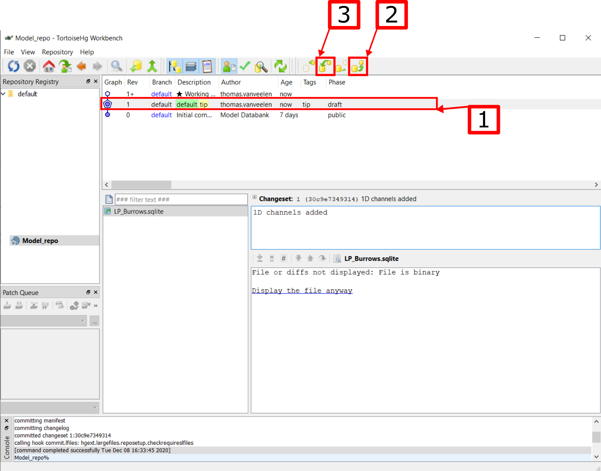

You have now pushed an updated model to the 3Di model repository in the form of a new revision. The model repository will be updated with the new spatialite database. The new revision can be downloaded by everyone within your organisation. To “pull” someone else’s revision to your local computer, select the “pull incoming changes” button in TortoiseHG ([3] in the figure above).  

Rasters with model data can be updated in the same way as spatialite databases. A model push can contain multiple changes to the spatialite database and rasters.

Update visibility
++++++++++++++++++++++++++++++++++++++

Models that are pushed to the repository through TortoiseHG will be initialised automatically. It is not required to “initialize inp generation” as is the case for new models. However, updated models are not visible by default on the live site. Change this as follows:

a.  Go to https://3di.lizard.net/models/.
b.  Use to search function to retrieve your model, i.e. “Tutorial_workflow”.
c.  Wait until the inp generation is completed. The status bar will turn green when this process is completed. [1] 
d.  Click on the name of your model. [2] 

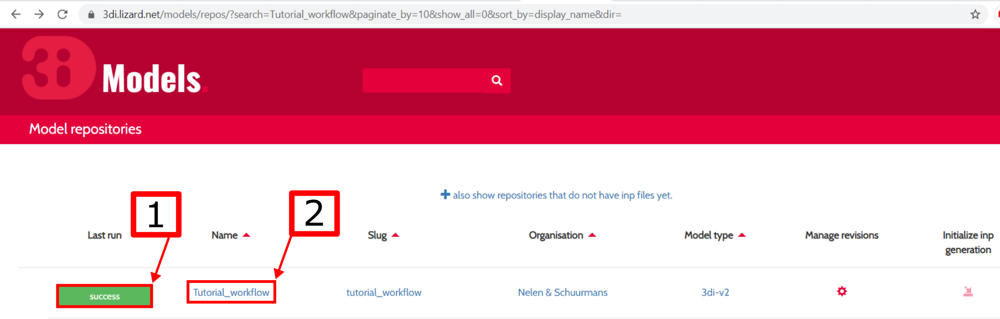

e.  An overview of all revisions now appears. Select the pencil icon, [1] 
f.  tick the marker in the column “visible”, [2] 
g.  save the edit by selecting the save icon (same location as the pencil icon). [3] 

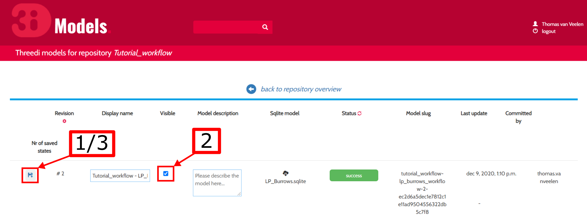

The updated model is now available on the `3Di livesite <http://3di.live#>`_  or via an API. The model will again be available under the name “LP_Burrows_Workflow”. 

Congratulations on completing this first tutorial on the 3Diworkflow! You are now ready to build your own models in the next tutorials.

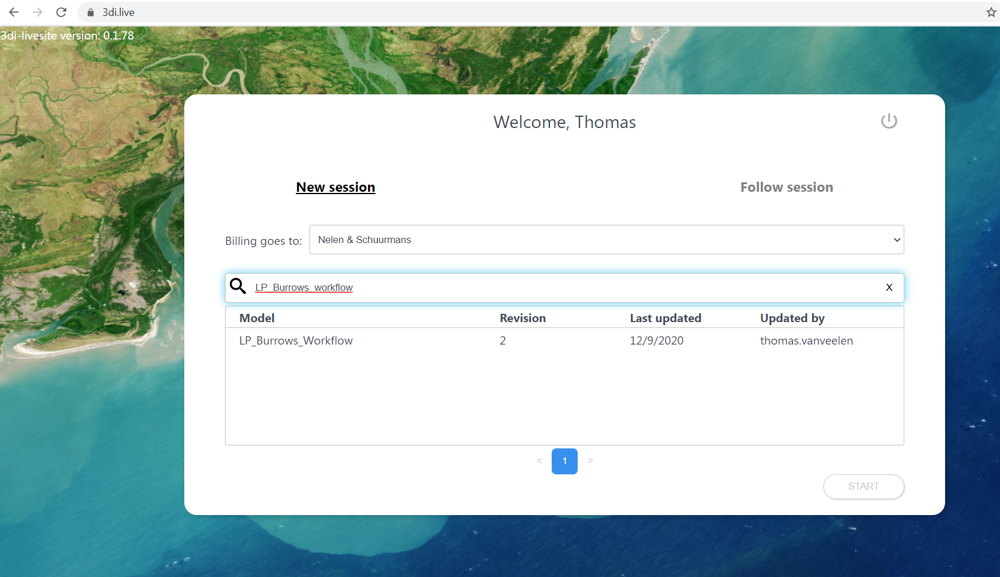

   
   Final model on the livesite