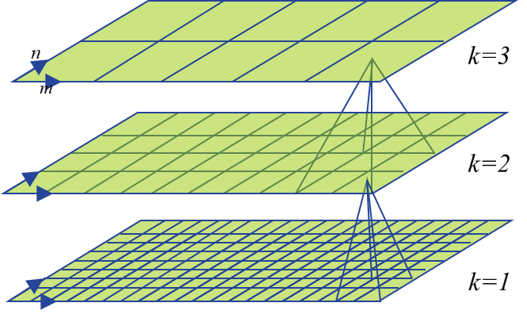

Modelling in 3Di
================

We have two types of tutorials: General tutorials and Modelling tutorials. General tutorials are aimed at how to make 3Di simulations through the web portal and manage revisions in the model database. Modelling tutorials help you with creating or modifying your 3Di model. You will find both below.

Modelling tutorials
-------------------

The tutorials below are aimed add giving you some examples on how to create your model in 3Di. They show you how to create different types of models for different purposes or add elements to existing models. The first tutorial aims to give you an introduction to 3Di and therefore explain the steps and reasons behind them quite extensively. The later tutorials assume you have sufficient knowledge about 3Di and modelling in general. They are less extensive and can be used as cheat sheets for performing different tasks.

All tutorials assume you have some knowledge of 3Di and are able to use QGIS. Make sure you have a working 64bit QGIS version available and install the specially designed 3Di QGIS-plug-in using `this <https://github.com/nens/threedi-qgis-plugin/wiki>`_ link.

Flood model
^^^^^^^^^^^^^^^^
In this tutorial we will set up a relatively simple model with a DEM and some levee’s that can simulate floods.

**Raster-files**

In 3Di we can use several raster input types. For a Flood model we need a DEM and possibly a friction raster. 3Di uses raster-files stored in the Geo-Tiff format. It knows which raster-files to use through a relative reference in the v2_global_settings table in the spatialite. We will come to that later. First we must collect our raster-files.

You may use any source for your raster information. Below we discuss some examples for the DEM and friction information.

**DEM**

For the Digital Elevation Model (DEM) satellite or LIDAR based information is often used. When working with crude SRTM-data for instance, it is important to derive the genuine surface level and remove any artifacts. Also, adding bathymetry information to your raster could be useful, since the satellite and LIDAR techniques are unable to *see* under water.

**Friction**

Information about bed friction is usually derived from land cover, giving high friction to dense forest and lower values to agricultural land. In 3Di these values can be given in Manning or Chezy.

**Requirements**

How you derive your raster information is entirely up to you. For 3Di you must make sure your raster-files eventually meet the following requirements:

#. Format GEO TIFF (.tif)

#. Projection in meters (EPSG:28992 in NL)

#. Projection complete according to OGC (check epsg.io)

#. Projection fits data location

#. Pixel size is square

#. NODATA = -9999

#. Type = Float32

#. All raster-files must have the same pixel size, origin, size and NODATA pixels

#. Data values must meet input types

#. Advised: Origin is rounded to pixel size precision

**Examples using GDAL**

There are several packages available that correctly allow you to meet these requirements. Below are some examples using GDAL. 

*If you are using Windows, GDAL should be installed together with QGIS and available through the OSGeo4W Shell. Try finding it through your start menu. A full list of GDAL functionality and help can be found under the* `gdal documentation <http://www.gdal.org/gdal_utilities.html>`_.

**Retrieve raster information**

This example shows you how to find and retrieve the meta-information of your raster through the OSGeo4W Shell. Make sure you have some raster-type data available.

- Start the OSGEO4W Shell
- Change the directory to the location of your raster file (use for example ``D:`` and ``cd myfiles/mymodel/raster``)
- Then type: ``gdalinfo <raster-file>``

This will give you a list of all raster information available for your raster-file. Check whether your file meets the requirements listed above. Note that information that is not listed, is missing and must be added.

**Change raster information**

To change or update your raster information you must be aware that some changes will affect your data content. For instance, updating your pixel size will require re-sampling or aggregating your existing data. 

We will use gdalwarp to update our raster information. This is a versatile command that enables you to re-project, aggregate and change the data type of your raster all in one command. The first example shows you how to change the NODATA value and transform it into a GeoTiff for any given raster. If you already found your raster in the OSGeo4W Shell you can use the following commands::

    gdalwarp -srcnodata <your-NODATA-value> -dstnodata -9999 <raster-file>  -of Gtiff  warp_output.tif

*Note that the words that start with ‘-‘ are options in gdalwarp. They are followed by a parameter specific to that option. Also, if your NODATA value is specified in the raster information, you may omit the srcnodata option.*

The next example sets all raster-information in one command. It is a useful example as long as you remember how it may change the actual data in your pixels::

    gdalwarp -s_srs EPSG:XXXX -t_srs EPSG:28992 -of Gtiff –ot Float32 -tap -tr 0.5 -0.5 -srcnodata XXXX -dstnodata -9999 -cutline study-area.shp -crop_to_cutline <raster-file>  warp_output.tif

The example uses an extra shape-file of the study area. This is convenient when you are using several raster-files. It ensures that all raster-files you make have the same extent and NODATA pixels. You should make sure however that the shape-file’s projection matches that of your raster information. If you are not sure what any of the commands do, you can check the `gdal documentation <http://www.gdal.org/gdal_utilities.html>`_ or try options separate generating several output files and checking the with gdalinfo.

**Compression**

Once your raster meets all requirements there is one last thing to consider. 3Di is cloud based so we advise you to compress all raster-files before uploading. The example below shows you how::

    gdal_translate -co COMPRESS=DEFLATE warp_output.tif compressed.tif

This command copies all data and information but compresses the data.
 
*Note that we only recommend the DEFLATE compression option. Other options may give better compression or performance in certain cases, but we do not support them in 3Di.*

**Spatialite database**

Once all your raster-files meet the requirements we can set up the model through the spatialite database. To do this, we must connect to the spatialite database using the `3Di-plugin <https://github.com/nens/threedi-qgis-plugin/wiki>`_. This way, all relevant layers are loaded.

**Global settings**

The global settings table (v2_global_settings) contains all general settings for your model. It must contain at least one row for your model to work. You can find a complete overview of all settings through through :ref:`database-overview`. Here we discuss some basic settings and how to set up your calculation grid or quad tree, but you will need the database overview as well.

Some basic settings you must fill out have to do with keeping track of your scenario and the type of model you are making. Consider the following steps:
 
#. The first basic settings you must fill out are the scenario id and a simple name for your scenario.  The scenario name will be shown in the 3Di web portal once you uploaded your model. 

#. Set use_2d_flow to 1 (we are making a 2D flood model) and set use_1d_flow and use_0d_flow to 0.

#. Set the default simulation time step (sim_time_step) to (for instance) 30. 3Di will automatically decrease the time step if no solution can be found in the given time step size. 

#. Set your output time step (output_time_step) to 300. This setting is important since 3Di may generate a large results-file when you choose your output time step too small. 

#. The flooding threshold determines when water starts to flow from one cell to the next. Set it to 0.01 meter. This ensures a more stable and quicker simulation.

#. Set the dem file and friction file relative paths to the raster-files you created. Make sure you use the full filename’s (including .tif).

#. Set the friction type so that it matches your friction raster-file.

#. Check the 3Di :ref:`database-overview` for the remaining settings and fill-out all those listed as mandatory. Except kmax and grid_space, they are explained below.

**Quadtree**

The quadtree or calculation grid consists of all the calculation cells combined. It can consist of different size calculation cells but are all square. In each cell a volume and water level is computed. Velocity and discharge are computed on the edges between these cells. The size of the cells depends on two global settings: kmax and grid_space.
The grid_space defines the size of the smallest calculation cell in your quadtree. The kmax is your maximum refinement level that determines the biggest possible calculation cell. If you do not define any local grid refinement, all calculation cells will become the maximum size. 
Below, a picture is shown to remind you to the way the quadtree is created. Every large cell can be split onto four smaller cells by adding local grid refinement. 

   Grid refinement

For now, set your grid_space and kmax. Your grid space must be a multitude of your raster pixel size. If we assume you are using a pixel size of 5 meter, set your grid space to 10 meter. Then set kmax to 4, your biggest calculations cells will this become 80 meters tall and wide. The next section shows you how to add local grid refinement.

**Local grid refinement**

Adding local grid refinement allows you to calculate the flow of water in one area in more detail while maintaining larger calculation cells in other areas. Generally speaking, you will use grid refinement in areas of your model where you expect high variability in water levels and flow. For instance, near a breach location, levee or river bent. In other areas, like a floodplain or relatively flat farm land, you can use larger cells as they tend to flood quite gradually. 
You can add local grid refinement by drawing lines and storing them in the v2_grid_refinement table in your spatialite database. Any calculation cell that is intersected by a grid refinement line will be split until it meets the given grid refinement. You can set the refinement level for every line segment. Set it to 1 for your smallest calculation cell equal to grid_space.

Try adding some grid refinement lines to your model. You can for instance draw lines over some dikes. You will not be able to see the resulting quadtree until after you uploaded your model.

**Levees or obstacles**

If you have read some more about 3Di and the subgrid technique, you will know that flow from one calculation cell to the next is determined on the edge of each cell and depends on the local pixel values along the edge. In the case of a thin dike this could mean your calculation cell edges don’t fall over the highest pixel values of the dike. This means 3Di will not pick up on to correct height of your dike. To solve this, you must add levees or obstacles to your model. 
The obstacle allows you to set the minimum crest level on the edge of a calculation cell. You can find the layer v2_obstacle in the spatialite database. The obstacle line you draw determines which edges are affected. The image below shows an example.

.. figure:: image/levee-in-non-uniform-grid.png
   :alt: Levee in quadtree

   Levee in quadtree

The levee can be used in the same way as the obstacle but allows you the set some additional parameters that are used when a breach is simulated. For your model, draw a line over your dike and fill out it’s crest level. You can use different segments when the dike varies in height. Make sure all your levee segments are drawn within the extent of your raster-files.

Polder model
^^^^^^^^^^^^^^

To model the water system of a polder you will need different types of structures and perhaps a larger level of detail than available in your 2D raster-files. For this purpose 3Di offers channels and structures that can be linked to the Quadtree. We refer to them as the 1D components. This tutorial shows you what steps you need to take to add these elements to an existing model.
The first thing you must do is activate 1D flow in the global settings. Also consider the following parameters in the global or numerical settings:

* advection_1d

* max_angle_1d_advection

* max_degree

* use_of_nested_newton

**Channels**

To add a channel or network of channel consider the following steps:

#. First, load these tables from the spatialite database if you haven’t already:

    a. v2_channel (line geometry)

    #. v2_connection_nodes (point geometry)

    #. v2_cross_section_location (point geometry)

    #. v2_cross_section_definition (no geometry)

#. Channels are drawn in between connection nodes, so start by adding nodes on the start- and endpoints of your channels. If you wish to add structures later on, make sure to add enough nodes as they are also linked between connection nodes (and thus not placed on top of channels).

#. After saving your edits in QGIS the connection node’s id’s are filled automatically. You can fill out the other attributes of the connection nodes later on.

#. Now draw your channels from connection node to connection node. Make sure you snap the start- and endpoints to the connection nodes and fill out the connection_node_start_id and connection_node_end_id for every channel feature. Then fill all the attribute fields for all channels except id and save.

#. Every channels needs at least one cross section. Start by adding one or multiple cross section definitions in the table v2_cross_section_definition. You have several option to define you profile, check the :ref:`database-overview` for more details. One definition can be used on multiple locations. When you’re done, save. Note that the v2_cross_section_definition id’s are filled.

#. You can place cross sections on channels using the v2_cross_section_location. You may place multiple cross sections on one channel. When placing locations, consider the following:

    a. Cross section locations must be placed on a channel vertex. If you have no vertex available on you channel, add one.

    #. Cross section locations may not be placed on the start- on endpoint of a channel

    #. When placing multiple cross section locations on one channel consider your calculation distance. Make sure you have sufficient calculation points on your channel.

    #. Refer to the correct channel id in the attribute field channel_id.

    #. Refer to the correct definition in the attribute field definition_id

    #. If your channel is of type connected or double connected, make sure to fill out the bank_level. This is the threshold between the water in the channel and that on the 2D surface.

After these steps your channel is complete. If you whish you can fill out the initial water level on the connection nodes. The water level is interpolated between nodes across channel calculation points. If you would like to use an embedded channel, you will find some more requirements below.

**Structures**

Structures in 3Di are always a connection between two connection nodes. 3Di supports four types of structures:

#. Pumpstation

#. Weir

#. Orifice

#. Culvert

Check out het :ref:`database-overview` for how use the structure attributes. Below, some specific details are listed.

* The shape of the weir, orifice and culvert are stored in the cross section definition table. So make sure you have some available before you start adding these structures.

* Culverts are the only structure type that has a geometry, it is a line. This means it can be f.i. curved. The culvert length is derived from it's geometry. Als other structures are defined only as a link between nodes. They have no length. 

* To add a structure,  make sure you have two connection nodes available at the end of two channels. Fill in the correct start and end connection node id in the sqlite tables. You must work in the v2_structure table, editing in views is not supported.

* The pumpstation  pumps from the start node to the end node. You can choose how it is controlled using the *type* attribute. 

* If you wish to model several structures that are only connected to each other, for instance a culvert followed by a culvert. You must add storage area to the connection node. Normally the storage area is derived from the cross section of the adjoining channel, but when there is no channel connected to a connection node, by default is has no storage. So add it manually, or your model won't work. 

* You can not place boundary conditions directly on structures.

* Finally, you must make sure that one of the cross section's reference levels near the structure is below the start, crest or invert level of the adjoining structure. 

**1D boundary condition**

Boundary conditions for the 1D system are placed on connection nodes. They can only be placed on connection nodes that are connected to a single isolated channel or pipe. So not on structures or embedded or connected channels. Check the different types of boundary conditions available in the :ref:`database-overview`.

The timeseries field in the spatialite database can only be filled by pasting your timeseries into the spaitialite as QGIS does not allow you to enter a newline. U may use this example::
    
    0,0.000000
    15,1.000000
    30,2.000000
    45,3.000000
    60,2.000000
    99999,2.000000

**Embedded channels**

Embedded channels are usefull when you wish to add more detailed profiles to a course rasterfile. Also, they are the most efficient way to add channels since they don't add to the numer of calculation points. In fact, the volume in the channel is integrated with that of the 2D calculation grid cell. When modelling embedded channels, considre the following:

* The water level in the embedded channel is always equal to the water level in the underlaying 2D grid cell,

* Embedded channels add extra connections between 2D grid cells that ignore levee's,

* Make sure the embedded channel profile alway partially lays below the surface level in you DEM (you can't have floating embedded channels),

* Make sure no more than one channel vertice falls inside a singel raster file pixel,

* Embedded channels only function when the connect several 2D grid cells, so make sure no embedded channel falls completely inside one 2D grid cell,

* All connection nodes connected to an embedded channel become embedded, so make sure structures or channels of other types that are connected to these connection node cross at leat one 2D grid cell boundary, and

* Do not place boundary conditions directly on embedded channels.

Sewerage system
^^^^^^^^^^^^^^^^ 
UNDER CONSTRUCTION