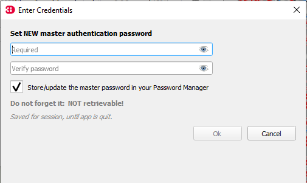
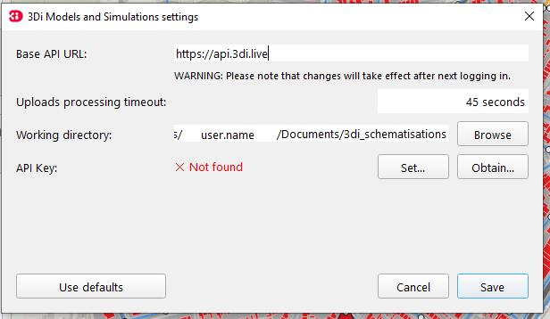
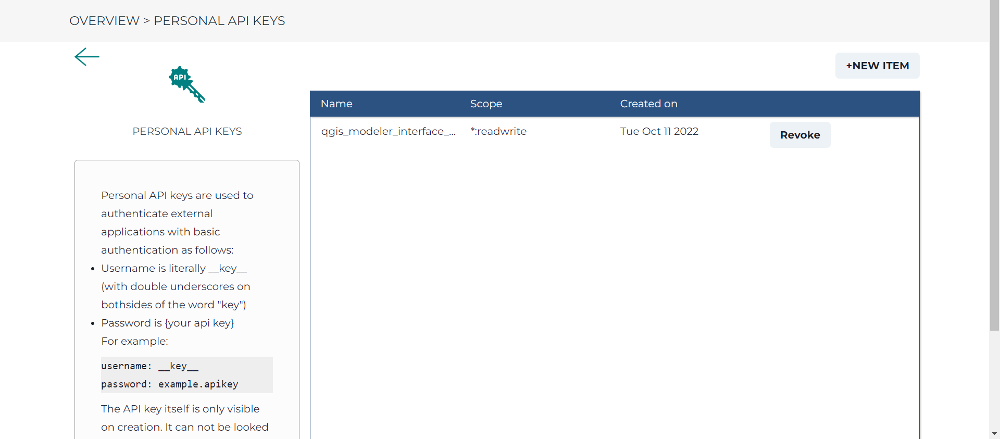
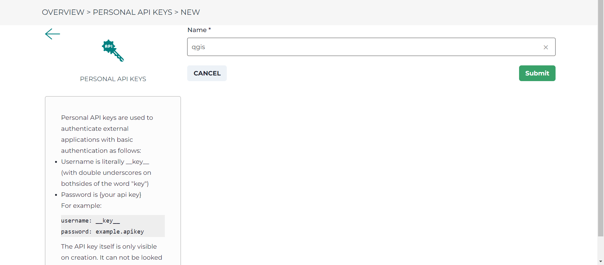
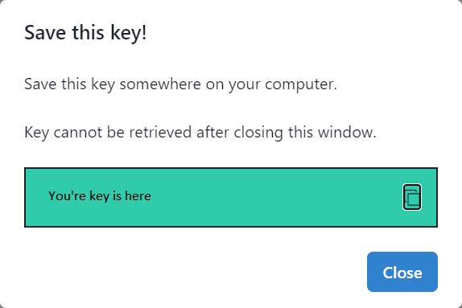

.. _3di_instruments_and_downloads:

Installation manual
======================

Below we explain how to install the Modeller Interface or QGIS with plugins. 

.. _software:

To use 3Di you need these software packages:

* Recent version of Google Chrome (`Get Chrome <https://www.google.nl/chrome/browser/desktop/index.html>`_)

* The 'Modeller Interface' or install a recent version of QGIS with the appropriate plugins. 

.. note::
    Are you running into problems when downloading or updating the software? Please consult the 'problem solving' section and if the error and/or solution is not mentioned,
    please contact our support office (servicedesk@nelen-schuurmans.nl)
	

.. _MI_installation:

Modeller Interface installation
---------------------------------

You can install the modeller interface simply with the downloadlink below.

- Install the `Modeller Interface <https://docs.3di.live/modeller-interface-downloads/3DiModellerInterface-OSGeo4W-3.22.7-1-4-Setup-x86_64.exe>`_

*last update: 8 July 2022*

Personal API Key
^^^^^^^^^^^^^^^^^^

When you start the 3Di Models & Simulations plugin for the first time, you are required to set a :ref:`personal_api_key` that will be used to log in. 
The QGIS Password Manager stores this Personal API Key securely (encrypted). If you have never used the QGIS Password Manager before, you will be asked to set a master password for the QGIS Password Manager. 
Fill in a password and make sure you remember it. Check the box 'Store/update the master password in your Password Manager' so that you do not have to fill in the master password every time you start up QGIS. 

Now, when you log in through the 3Di Models & Simulations plugin, you will be asked to set a Personal API Key and the settings dialog will appear.

- Click 'Obtain...'. Your web browser will open, showing the management page where you can `create a new Personal API Key <https://management.3di.live/personal_api_keys>`_. Create a new Personal API Key by pressing the '+NEW ITEM' button in the upper right corner.

- Add a name for the new Personal API Key. You could use 'qgis', for example. Press on 'Submit' to the right.

- A popup shows with your Personal API Key. You can copy the Personal API Key to your clipboard with the icon on the right or select and copy the text. This Personal API Key cannot be accessed after closing this popup. In case you closed the popup before you added the Personal API Key to QGIS, you can always create a new one.

- Return to the 3Di Modeller Interface.
- In the 3Di Models & Simulations plugin Settings dialog, click 'Set...'.
- Paste the Personal API Key and click OK.
- Click Save.

You can now use all online functionalities of the 3Di Models & Simulations plugin. When logging in is required, the Personal API Key will be read from the QGIS Password manager and be used for logging in. 

Advanced: seperate installation of QGIS and appropriate plugins
----------------------------------------------------------------------

You can also install QGIS seperately with the appropriate plugins. We only recommend this if you have specific reasons for this. 

- Install the Long Term Release (LTR) of QGIS, and install the 3Di toolbox and "3Di Models and Simulations" as QGIS plugins

.. _plugin_installation:

Plugin Installation
^^^^^^^^^^^^^^^^^^^^

* QGIS Standalone Installer Version 3.22 (Long term release). `Get QGIS <http://www.qgis.org/en/site/forusers/download.html#>`_ . 

    After the installation of QGIS, set the interface language and locale to American English. This makes it easier to understand the instructions in this documentation. Some locales do not support scientific notations of numbers, these are required for very small numbers (e.g. 1e-09).

    * Go to Settings > Options > General
    * Tick the box 'Override System Locale'
    * For User Interface Translation, choose 'American English'
    * For Locale, choose 'English UnitedStates (en_US)'
    * Restart QGIS

* QGiS 3Di plug-in specially designed for 3Di
	
	* 3Di Toolbox
	* 3Di Models and Simulations
	* 3Di Schematisation Editor - EXPERIMENTAL

The plugins work for:

- QGIS 3.22.x (LTR after March 2021)
- 64-bit version of QGIS (see below for more details)
- On Linux/OSX: install the following system dependencies: `python3-h5py python3-scipy python3-pyqt5.qtwebsockets`
- 3Di v2 results

To install the 3Di-Toolbox plugin follow the steps below: 

1) Open QGIS and via the menu bar go to 'Plugins > Manage And Install Plugins'. 
2) Go to 'Settings'. 
3) Add a plugin repository
4) Fill in a name and copy the URL: https://plugins.3di.live/plugins.xml into the URL box. 
5) Go to 'All' and choose '3Di toolbox' from the list
6) Install the plugin.

.. figure:: image/d_qgispluging_pluginmanager.png
    :alt: QGIS Plugin Manager
    
.. figure:: image/d_qgispluging_pluginmanager_addlizard_repo.png
    :alt: Add Lizard repo Plugin

.. figure:: image/d_qgispluging_pluginmanager_install_toolbox.png
    :alt: Install 3Di Toolbox

.. _plugin_overview:

To install the "3Di Models and Simulations" plugin follow the steps below: 

1) Open QGIS and via the menu bar go to 'Plugins > Manage And Install Plugins'. 
2) Go to 'Settings'. 
3) Add a plugin repository
4) Fill in a name and copy the URL: https://plugins.lizard.net/plugins.xml into the URL box. 
5) Go to 'All' and choose '"3Di Models and Simulations"' from the list
6) Install the plugin.
7) To active the panel of the"3Di Models and Simulations", choose plugins --> "3Di Models and Simulations" --> "3Di Models and Simulations". Now the panel will be available.

.. _plugin_settings:

Plugin settings
^^^^^^^^^^^^^^^^
To set the Base API URL:

1) Open QGIS and via the menu bar go to 'Plugins > "3Di Models and Simulations" > Settings'
2) Fill in a Base API URL. The Base API URL is in most cases https://api.3di.live. If you want to connect to our second calculation center in Taiwan, the base API URL is https://api.3di.tw/

Information for system administators
--------------------------------------

General information
^^^^^^^^^^^^^^^^^^^^

All applications make use of https traffic over port 443 with public signed SSL/TLS certificates.
If certificate errors show, please check any security software.
One way of testing this is by visiting https://api.3di.live/v3 in a browser and check the certificate.
If it is issued by R3, this is the certificate configured by us.
Any other name will point towards the security software in use.

.. _setup_modeller_interface:

3Di Modeller Interface
^^^^^^^^^^^^^^^^^^^^^^^^

This is a preconfigured version of QGIS (www.qgis.org), with some options switched off, different stylesheets, and some pre-installed plugins.
Two of these plugins (3Di Toolbox and "3Di Models and Simulations") are maintained by Nelen & Schuurmans.
QGIS itself and the other pre-installed plugins are not made / maintained by Nelen & Schuurmans.

Install instructions for the 3Di Modeller Interface can be found in :ref:`3di_instruments_and_downloads`.

Because the 3Di Modeller Interface is a customized QGIS,
we refer to the QGIS documentation when you run into any issues that are not specifically related to the plugins '3Di Toolbox' or '"3Di Models and Simulations"': 
* QGIS User Manual: https://docs.qgis.org/latest/en/docs/user_manual/
* Installation section in QGIS User Manual: https://docs.qgis.org/latest/en/docs/user_manual/introduction/getting_started.html#installing-qgis

**URLs accessed by 3Di Modeller Interface**

Make sure the 3Di Modeller Interface is allowed to communicate with following URLs:
* PyPI: https://pypi.org/ (only during first run after installation / update)
* 3Di API: https://api.3di.live (each time a simulation is started from the Modeller Interface)

