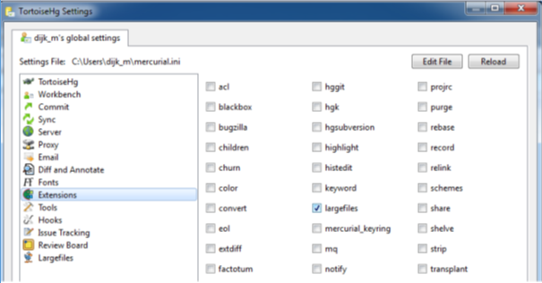

.. _3di_instruments_and_downloads:

3Di instruments and downloads
===============================

Please visit `3Di start <https://3diwatermanagement.com/3di-start/>`_ for an overview of all 3Di instruments and portals.

Below we explain how to install the Modeller Interface or QGIS with plugins and how to install and configure TortoiseHG. 
We also show you how to download the database overview or an empty database. 

.. _software:

To use 3Di you need these software packages:

* Recent version of Google Chrome (`Get Chrome <https://www.google.nl/chrome/browser/desktop/index.html>`_)

* The 'Modeller Interface' or install a recent version of QGIS with the appropriate plugins. 

* Recent version of TortoiseHG

.. note::
    Are you running into problems when downloading or updating the software? 
    Please contact our support office (servicedesk@nelen-schuurmans.nl)

Modeller Interface or QGIS
----------------------------

For an overview on the modeller interface go to: :ref:`intro_modeller_interface`

- Install the `Modeller Interface <https://docs.3di.live/modeller-interface-downloads/3DiModellerInterface-OSGeo4W-3.16.7-1-Setup-x86_64.exe>`_  or
- Install the Long Term Release (LTR) of QGIS, and install the 3Di toolbox and API client as QGIS plugins

.. _plugin_installation:

Plugin Installation
^^^^^^^^^^^^^^^^^^^^

* QGIS 3.16 64bit Long term release (`Get QGIS <http://www.qgis.org/en/site/forusers/download.html#>`_ and use the standalone installer)

    After the installation of QGIS, set the interface language and locale to American English. This makes it easier to understand the instructions in this documentation. Some locales do not support scientific notations of numbers, these are required for very small numbers (e.g. 1e-09).

    * Go to Settings > Options > General
    * Tick the box 'Override System Locale'
    * For User Interface Translation, choose 'American English'
    * For Locale, choose 'English UnitedStates (en_US)'
    * Restart QGIS

* QGiS 3Di plug-in specially designed for 3Di
	
	* 3Di Toolbox
	* 3Di API client

The plugins work for:

- QGIS 3.16.x (LTR after March 2021)
- 64-bit version of QGIS (see below for more details)
- On Linux/OSX: install the following system dependencies: `python3-h5py python3-scipy python3-pyqt5.qtwebsockets`
- 3Di v2 results

To install the 3Di-Toolbox plugin follow the steps below: 

1) Open QGIS and via the menu bar go to 'Plugins > Manage And Install Plugins'. 
2) Go to 'Settings'. 
3) Add a plugin repository
4) Fill in a name and copy the URL: https://plugins.3di.live/plugins.xml into the URL box. 
5) Go to 'All' and choose '3Di toolbox' from the list
6) Install the plugin.

.. figure:: image/d_qgispluging_pluginmanager.png
    :alt: QGIS Plugin Manager
    
.. figure:: image/d_qgispluging_pluginmanager_addlizard_repo.png
    :alt: Add Lizard repo Plugin

.. figure:: image/d_qgispluging_pluginmanager_install_toolbox.png
    :alt: Install 3Di Toolbox

.. _plugin_overview:

To install the 3Di API client plugin follow the steps below: 

1) Open QGIS and via the menu bar go to 'Plugins > Manage And Install Plugins'. 
2) Go to 'Settings'. 
3) Add a plugin repository
4) Fill in a name and copy the URL: https://plugins.lizard.net/plugins.xml into the URL box. 
5) Go to 'All' and choose '3Di API client' from the list
6) Install the plugin.
7) To active the panel of the API client, choose plugins --> 3Di API client --> 3Di API client. Now the panel will be available.

.. _tortoise:

TortoiseHG
-----------

`Get TortoiseHG <https://tortoisehg.bitbucket.io/download/index.html>`_

 After installation of TortoiseHG the program can be started by selecting the TortoiseHg Workbench program from the Windows Start menu. In a first use, activate the 'large files extension' by selecting from the File menu 'Settings' and then' Extensions' and select 'large files’. Also fill in your name. Press OK and restart TortoiseHG.

..

Tortoise also has a built-in encrypted password manager, allowing you to push and pull revisions without being prompted for your username and    password each time. To enable the password manager:

    * Open TortoiseHg Workbench
    * Go to File > Settings > Extensions
    * Check the box 'mercurial_keyring'.
    * Restart TortoiseHg Workbench
    * Now you still have to enable the password manager for each repository you clone, see :ref:`download-repository`

	
Database
----------	

.. _database-overview:

Database overview
^^^^^^^^^^^^^^^^^^

The database overview shows the complete overview of tables that 3Di uses in the spatialite database. You can download the complete overview of tables that 3Di uses in the spatialite database :download:`here <pdf/database-overview.pdf>`. Also, this :download:`flowchart <image/flowchart_edit_model.png>` may help you while editing your model. The following links show you the database schema's for :download:`sewerage <pdf/database-schema-sewerage.pdf>` and :download:`surface water <pdf/database-schema-surface-water.pdf>`.

.. _empty_database:

Empty database
^^^^^^^^^^^^^^

If you like to set up a new model it may be helpful to start from an empty database. Download an empty spatialite database :download:`here <other/empty.sqlite>`.

Please be aware not to add any columns to existing tables in the spatialite as they may interfere with future migrations.

Information for system administators
--------------------------------------

General information
^^^^^^^^^^^^^^^^^^^^

All applications make use of https traffic over port 443 with public signed SSL/TLS certificates.
If certificate errors show, please check any security software.
One way of testing this is by visiting https://api.3di.live/v3.0 in a browser and check the certificate.
If it is issued by R3, this is the certificate configured by us.
Any other name will point towards the security software in use.

.. _setup_modeller_interface:

3Di Modeller Interface
^^^^^^^^^^^^^^^^^^^^^^^^

This is a preconfigured version of QGIS (www.qgis.org), with some options switched off, different stylesheets, and some pre-installed plugins.
Two of these plugins (3Di Toolbox and 3Di API Client) are maintained by Nelen & Schuurmans.
QGIS itself and the other pre-installed plugins are not made / maintained by Nelen & Schuurmans.

Install instructions for the 3Di Modeller Interface can be found here:
https://docs.3di.live/d_before_you_begin.html#modeller-interface-or-qgis

Because the 3Di Modeller Interface is a customized QGIS,
we refer to the QGIS documentation when you run into any issues that are not specifically related to the plugins '3Di Toolbox' or '3Di API Client': 
* QGIS User Manual: https://docs.qgis.org/latest/en/docs/user_manual/
* Installation section in QGIS User Manual: https://docs.qgis.org/latest/en/docs/user_manual/introduction/getting_started.html#installing-qgis

**URLs accessed by 3Di Modeller Interface**

Make sure the 3Di Modeller Interface is allowed to communicate with following URLs:
* PyPI: https://pypi.org/ (only during first run after installation / update)
* 3Di API: https://api.3di.live (each time a simulation is started from the Modeller Interface)

TortoiseHG
^^^^^^^^^^^^^

Graphical user interface (thg.exe) for hg.exe, a utility to communicate with Mercurial repositories (similar to Git).
3Di Models are stored in these Mercurial repos.

Install instructions: https://docs.3di.live/d_before_you_begin.html#tortoisehg

After installation make sure all the .exe files in the TortoiseHg install directory are allowed to run.
This includes but is not limited to hg.exe.

**URLs accessed by TortoiseHG**

https://hg.lizard.net

Information about the TortoiseHG/Mercurial use of certificates: https://www.mercurial-scm.org/wiki/CACertificates