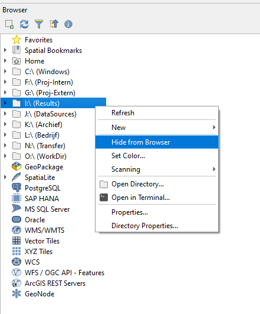

.. _f_problem_solving:

FAQ and problem solving
=======================

This section will help you solve some problems or errors that may occur when using 3Di.
Some issues are due to the software, these will be summarised in the section Known Issues, including a temporary solution.
Errors related to input data or other user settings are usually covered by the schematisation checker. In rare cases however they might not catch a potential issue.

- :ref:`model_size_limitations`
- :ref:`problem_solving_guide`
- :ref:`faq`
- :ref:`known_issues`

.. _model_size_limitations:

Limitations to model size
-------------------------

Maximum number of nodes
^^^^^^^^^^^^^^^^^^^^^^^

There is no hard limit to the size (number of nodes and flowlines) of a 3Di model. The number of nodes strongly affects the computational speed, especially in simulations where there is flow in the entire model domain (e.g. simulations with rain). Some rules of thumb can be given:

- Below 100,000 nodes, no issues are to be expected and the model will generally run smoothly. If there are issues with computational speed, they are likely caused by sub-optimal choices in the schematisation of the 1D domain and/or inappropriate initial conditions.
- Between 100,000 and 300,000 nodes, you may start to notice that the computational speed is affected by the number of nodes.
- Between 300,000 and 500,000 nodes, the simulation will likely be slow and 3Di may run out of memory, causing the simulation to crash.
- Above 500,000 nodes: it is strongly recommended to change the schematisation.

Some strategies that you can pursue to reduce the number of nodes are:

- Choosing the model boundaries differently, e.g. following the hydrological watershed boundaries more precisely
- Dividing the model up in multple smaller models
- Choose a larger *Minimum cell size* and/or smaller *Number of grid levels*, see :ref:`model_settings`
- Use fewer grid refinements, or increase their grid level. See :ref:`grid_refinement_line` and ref:`grid_refinement_area`.
- Choosing a simpler schematisation of the less important parts of the model, e.g. increase the cell size in those areas or schematise parts of the model in 1D instead of 2D. See :ref:`howto_convert_to_1d2d`.

Vertical resolution
^^^^^^^^^^^^^^^^^^^

Several settings and schematisation choices control the size of the :ref:`subgrid_tables`. If these tables become too large, 3Di may run out of memory during the generation of the 3Di model or during the simulation. It is difficult to provide clear guidelines on this, but if you experience *Internal server errors* or simulation crashes with unclear reasons, this may be a cause. Have a look at the following:

- Elevation range, i.e. the difference between the highest and the lowest pixel in the DEM. If the elevation range is very large, consider removing the highest parts of the model domain, e.g. replace them by :ref:`Surfaces<surface>`. 
- The :ref:`table step size<subgrid_table_settings>`. If the table increments are very small and the elevation range very large, the subgrid tables may become too large.
- The number of pixels per cell. If the *Minimum cell size* or the *Number of grid levels* (see :ref:`model_settings`) values are large and the DEM pixel size is small, there will be many pixels in one cell. This will require a large number of table increments in the subgrid tables.

Maximum raster size
^^^^^^^^^^^^^^^^^^^

The maximum size of the Digital Elevation Model is 5 billion pixels. This includes NoData pixels. The other rasters will be resampled to the resolution of the DEM, so their pixel count is not relevant.

.. _problem_solving_guide:

Problem solving guide
---------------------

If you run into problems, it helps to understand where you are in the :ref:`modelling workflow<workflow>`. Try to go back to the last revision in which everything worked fine, and make small step-by-step changes, so you can pinpoint which change causes the issue. Follow the :ref:`best_practices` guide in your modelling workflow to prevent running into hard-to-solve issues.

Import errors in the 3Di Modeller Interface
^^^^^^^^^^^^^^^^^^^^^^^^^^^^^^^^^^^^^^^^^^^

Updating the 3Di Modeller Interface and/or its plugins may in some cases lead to import errors, for example *ImportError: cannot import name 'Dataset' from 'h5py' (unknown location)*. The whole error will look something like this::

    Couldn't load plugin 'threedi_results_analysis' due to an error when calling its classFactory() method 

    ImportError: cannot import name 'Dataset' from 'h5py' (unknown location) 
    Traceback (most recent call last):
      File "C:\PROGRA~1/3DIMOD~1.34/apps/qgis-ltr/./python\qgis\utils.py", line 423, in _startPlugin
        plugins[packageName] = package.classFactory(iface)
      File "C:\Users\user.name\AppData\Roaming\3Di\QGIS3\profiles\default/python/plugins\threedi_results_analysis\__init__.py", line 53, in classFactory
        from .threedi_plugin import ThreeDiPlugin
      File "C:\PROGRA~1/3DIMOD~1.34/apps/qgis-ltr/./python\qgis\utils.py", line 892, in _import
        mod = _builtin_import(name, globals, locals, fromlist, level)
      File "C:\Users\user.name\AppData\Roaming\3Di\QGIS3\profiles\default/python/plugins\threedi_results_analysis\threedi_plugin.py", line 10, in 
        from threedi_results_analysis.processing.providers import ThreediProvider
      File "C:\PROGRA~1/3DIMOD~1.34/apps/qgis-ltr/./python\qgis\utils.py", line 892, in _import
        mod = _builtin_import(name, globals, locals, fromlist, level)
      File "C:\Users\user.name\AppData\Roaming\3Di\QGIS3\profiles\default/python/plugins\threedi_results_analysis\processing\providers.py", line 7, in 
        from threedi_results_analysis.processing.cross_sectional_discharge_algorithm import CrossSectionalDischargeAlgorithm
      File "C:\PROGRA~1/3DIMOD~1.34/apps/qgis-ltr/./python\qgis\utils.py", line 892, in _import
        mod = _builtin_import(name, globals, locals, fromlist, level)
      File "C:\Users\user.name\AppData\Roaming\3Di\QGIS3\profiles\default/python/plugins\threedi_results_analysis\processing\cross_sectional_discharge_algorithm.py", line 59, in 
        from threedigrid.admin.gridresultadmin import GridH5ResultAdmin
      File "C:\PROGRA~1/3DIMOD~1.34/apps/qgis-ltr/./python\qgis\utils.py", line 892, in _import
        mod = _builtin_import(name, globals, locals, fromlist, level)
      File "C:\Users\user.name\AppData\Roaming\3Di\QGIS3\profiles\default\python\plugins\threedi_results_analysis\deps\threedigrid\admin\gridresultadmin.py", line 15, in 
        from threedigrid.admin.gridadmin import GridH5Admin
      File "C:\PROGRA~1/3DIMOD~1.34/apps/qgis-ltr/./python\qgis\utils.py", line 892, in _import
        mod = _builtin_import(name, globals, locals, fromlist, level)
      File "C:\Users\user.name\AppData\Roaming\3Di\QGIS3\profiles\default\python\plugins\threedi_results_analysis\deps\threedigrid\admin\gridadmin.py", line 13, in 
        from threedigrid.admin.h5py_datasource import H5pyGroup
      File "C:\PROGRA~1/3DIMOD~1.34/apps/qgis-ltr/./python\qgis\utils.py", line 892, in _import
        mod = _builtin_import(name, globals, locals, fromlist, level)
      File "C:\Users\user.name\AppData\Roaming\3Di\QGIS3\profiles\default\python\plugins\threedi_results_analysis\deps\threedigrid\admin\h5py_datasource.py", line 7, in 
        from h5py import Dataset
    ImportError: cannot import name 'Dataset' from 'h5py' (unknown location)

If this happens right after updating any of the 3Di plugins, restarting the 3Di Modeller Interface will fix the issue in most cases.

If your installation work correctly before, but produces these errors now, **make sure that the Nelen & Schuurmans Dependency Loader is activated**. QGIS sometimes disables plugins after it has crashed, but the 3Di plugins will not function without the Nelen & Schuurmans Dependency Loader. Do the following:

- Go to *Plugins* > *Manage and install plugins* > *Installed*
- Find the Nelen & Schuurmans Dependency Loader in the list
- Check its box to activate it

If that still does not work, the following approach should fix the issues. It is a bit of a rough remedy, but it is generally effective.

- Open the user profile folder via *Settings* > *User profiles* > *Open active profile folder*. A Windows Explorer window will now open
- Close all 3Di Modeller Interfaces you have open
- In the Windows Explorer window, browse to *python* > *plugins*
- Delete the following folders:
    - lizard_qgis_plugin
    - nens_dependency_loader
    - threedi_models_and_simulations
    - threedi_results_analysis
    - threedi_schematisation_editor
- If you get a message during the deletion that a file cannot be deleted because it is in use by qgs-ltr-bin.exe, close all QGIS processes via *Ctrl+Alt+Del* > *Task manager* and try again
- Restart 3Di Modeller Interface
- Go to *Plugins* > *Manage and install plugins* > *Not installed* and install the following plugins:
    - 3Di Models & Simulations
    - 3Di Results Analysis
    - 3Di Schematisation Editor
    - Lizard (if you have a Lizard subscription)

Everything should now work normally again

Errors during 3Di model generation
^^^^^^^^^^^^^^^^^^^^^^^^^^^^^^^^^^

- Run the :ref:`schematisation checker<checking_model>`. Resolve any errors reported by the checker. Also look into the warnings and info messages and try to resolve those as well, unless you are convinced that the schematisation choice for which te schematisation checker gives a warning is the correct choice for your specific use case.
- Check if the 3Di Modeller Interface and the 3Di plugins are up to date. If this is not the case, :ref:`update the 3Di plugins<updating_plugin_schem_editor>` and run the schematisation checker again. It is recommended to :ref:`re-install the 3Di Modeller Interface<MI_installation>` every year at the end of March.
- Check if your model is not too large, see :ref:`model_size_limitations`
- If the model generation failed while making the simulation template: Check your initial settings in your schematisation including initial (ground)water level raster. 

.. todo::
    Margriet gaat op een rijtje zetten welke tabellen/kolommen door de template worker worden gebruikt, zodat we dat hier kunnen toevoegen

Crashed simulations
^^^^^^^^^^^^^^^^^^^

The 3Di computational core is very stable and crashing simulations are very uncommon. Most schematisation errors that result in a failure to generate a valid 3Di model, or in crashing simulations, will be caught by the :ref:`schematisation checker<checking_model>`. However, if you do run into an error or crash, there are several things you can do to resolve the issues before contacting the :ref:`servicedesk`. The service desk will always ask you to go through these steps before your issue is taken up.

Common causes for crashing simulations are noted in the list below. Please check these if you encounter crashing simulations. 

- Download the simulation logging, and check the contents of all log files. In particular:
    
    - flow_summary.json: large volume errors or NaN values indicate that the simulation has become numerically unstable (matrix convergence was impossible). You will probably find more information in matrix.log in this case. 
    
    - simulation.log: if any errors are mentioned, they will probably be at/near the end of the file. But make sure to also check the rest of the file for errors or messages that may tell you more about the crash.
    
    - matrix.log: if there are any messages in this file, check if it is mentioned in the list of common error messages below, and follow the instructions for that error message.

- Check if your 3Di model is up to date. The model generation will always use the latest 3Di framework, but if the 3Di model was generated a long time ago, or there was a new release after the generation of your model, your 3di Model may be outdated. Please :ref:`re-generate the 3Di model<regenerate_3di_model>` to see if this resolves your issue.

- If you were able to succesfully run simulations with a 3Di model of a earlier revision of the same schematisation, the problem is almost certainly caused by the recent changes you have made. Make sure you commit new revisions often and with a limited amount of changes per revision, so it is easier to pinpoint the exact cause of the problem. If your last commit included a larger number of changes, revert them one by one, and make a 3Di model for each undone change until you have a 3Di model that does run simulations succesfully.

- It could be that you missed something when uploading your schematisation, when encountering a crashing simulation. You could download your schematisation and run the schematisation checker again to see if you missed any warnings. 

If these suggestions did not solve your problem, you can try to run your simulation on the 3Di Live. When your model does run on 3Di Live, it could be that something is wrong with your simulation template. Check this for any weird/wrong settings and restart your simulation. 

Matrix diagonal element, near zero
""""""""""""""""""""""""""""""""""

At one calculation point there is no storage area or the wet cross section area is near zero or even negative. 

The error message indicates at which node the problem occurs. Note that the node at which the error occurs is not always the node where the schematisation problem is; in some cases it is a node near the one indicated in the error message.

The error is followed by a reference to the calculation node without any storage or link without wet cross section area. This will look something like::

    Matrix diagonal element in 1D domain, near zero;nod,aii(nod)   13375  0.0000E+00

The first number (13375 in this example) refers to the calculation node on which the error occurs. To find this location:

- :ref:`load the computionational grid in the 3Di Modeller Interface<3di_results_manager>` 
- In the *Layers* panel, right-click the *Node* layer > *Open attribute table* 
- In the bottom left, click *Show all features* > *Field filter* > *id*
- Type the node id that was mentioned in the error message (13375 in this example)
- Select the row that is shown
- In the Attribute table's toolbar, click *Zoom map to the selected rows (Ctrl-J)*

This may be caused by various reasons listed below:

* Structure levels are below cross-section location reference levels, for instance, a culvert's invert levels are so far below the reference levels of the adjacent channels that the entire structure is below the river bed. This causes problems when water level drop below the channel bed level; flow through the culvert has no area to flow to. Update reference or structure levels so that they match. Reference levels can be below structure invert/crest levels.

* A lateral inflow from laterals or an inflow surface is connected to a calculation node without storage, f.i. an pump end node or boundary node. Remove laterals or inflow from these nodes. Note that the storage of a calculation node is the connection node's storage area *plus* the half of the storage of the adjacent channels, pipes, or culverts, see :ref:`techref_storage_in_1d_domain`. 

* A branch of the 1D network ends with a weir or orifice (which do by definition not have storage), and the last connection node of that branch has a storage area of 0 and no boundary condition. The simulation will crash as soon as this node gets wet, either due to the initial water level, or due to water flowing towards the node.

ERROR - F - Impossible line connection at calculation node:            729
""""""""""""""""""""""""""""""""""""""""""""""""""""""""""""""""""""""""""

This error may occur when using embedded in combination with structures. Make sure no structure is placed entirely inside a 2D computational cell. You can only check this when you have a copy of the 2D computational grid. You can obtain this by making a purely 2D model of your DEM and grid refinement of try making one using the 'create grid' function in the QGIS processing toolbox.

Runtime Error: NetCDF: String match to name in use
""""""""""""""""""""""""""""""""""""""""""""""""""

Check the aggregation NetCDF name settings, names must be unique.

.. _faq:

Frequently Asked Questions
--------------------------

- My 3Di API script doesn't work anymore, what do I need to do? 

*In case this is an old script (< 2022) please check the migration workflow available* `here <https://api.3di.live/v3/docs/migrate_to_threediapi/>`_. 

- How do I edit a simulation template?

*Simulation templates cannot be edited directly. In the 3Di Modeller Interface, start a new simulation based on the template, make the desired changes, and save the simulation as a new template. When using the 3Di API, create a new simulation from the template, make the desired edits, and create a new template from the simulation.*

- Can I change infiltration in a simulation template?

*No, infiltration is part of the schematisation. You can copy a schematisation and change the infiltration file there.
An explainer on schematisations and simulation templates can be found here* :ref:`basic_modelling_concepts`

- Why is the name of my simulation template 'default'? 

*The name is being read from the 'name' attribute in the *Simulation template settings* table. If that happens to be 'default', then that is the name of your simulation template.*

- What happens if I add an extra entry in the *Simulation template settings* table? 

*Extra entries will be ignored.*

- I have a variant of my schematisation that I like to test, what is the best way of doing so? 

*Copy/clone the schematisation, make your changes and upload it as a new schematisation.*

- My model shows unstable behaviour, what can I do to avoid this? 

First of all, instability is not common within 3Di, but certain settings or modelling choices can cause problems for the solver. 

*We have these tips:*

#) Make sure you have fixed all errors *and warnings* that the Schematisation checker gives. 
#) Decrease your calculation time step (background information: courant number)
#) Temporarily decrease your output time step . This makes it easier to analyse what goes wrong
#) Check if there are pumps that are pumping to another 1D node within the same 2D computational cell
#) Put the 'pump_implicit_ratio' in the numerical settings to 1. This makes sure that the model calculates smoothly for pumps (see :ref:`matrixsolvers` --> pump_implicit_ratio)

.. _known_issues:

Known issues
------------

.. _problem_solving_3di_mi:

3Di Modeller Interface
^^^^^^^^^^^^^^^^^^^^^^

3Di Modeller Interface keeps freezing at every click
""""""""""""""""""""""""""""""""""""""""""""""""""""

- In some cases, the 3Di Modeller Interface becomes very slow to respond to everything. This is usually caused by a known QGIS issue with the *Browser panel*. It occurs when QGIS cannot connect to all network drives. To resolve it, hide all network drives from the browser panel, as shown in the figure below.

Interflow in the Water balance tool
"""""""""""""""""""""""""""""""""""

The *Water Balance tool* does not support interflow yet. If your simulation includes interflow, the water balance may not be complete

Changing the 3Di Working Directory
"""""""""""""""""""""""""""""""""" 

The 3Di working directory can be changed as follows:

Via the 3Di Models & Simulations plugin settings (see below). 

.. figure:: image/f_changepluginsettings1.png
    :alt: Open the settings of 3Di Models and Simulations

.. figure:: image/f_changepluginsettings2.png
    :alt: Change the working directory of 3Di Models and Simulations

3Di Modeller Interface in other languages than English
""""""""""""""""""""""""""""""""""""""""""""""""""""""

The 3Di Modeller Interface can be used in other languages than English. What matters is that the numbers notation is set to English. There is a bug in QGIS with scientific notations and Dutch number notations which can cause unexpected behaviour. This may also apply to number locations in other locales.  
Please go to *Settings* > *Options* > *General* and set *Locale (numbers, date and currency formats)* to *en_GB*.

Database is locked
""""""""""""""""""

In some cases the following happens:
- You want to save your edits
- QGIS freezes for several minutes
- Finally, you see the error: "Could not commit changes to layer {layer name}. Errors: ERROR: 1 attribute value change not applied. Provider errors: OGR error committing transaction: sqlite3_exec(COMMIT) failed: database is locked"

The cause of this is probably that you have created a Query layer that uses the schematisation database that you are trying to edit as provider/source.

To resolve the issue, remove the Query layer from your project and try again.

SSLError (HTTPSConnectionPool(host='api.3di.live', port=443): Max retries exceeded with url ...)
""""""""""""""""""""""""""""""""""""""""""""""""""""""""""""""""""""""""""""""""""""""""""""""""

In some cases the 3Di Models and Simulations plugin (part of the 3Di Modeller Interface) can give a generic SSLError on a Windows system (see figure below).
To solve this issue, please contact your organisation's system administrator.
Instructions for your system administrator on how to solve this problem are given below the figure::

  Error: HTTPSConnectionPool(host='api.3di.live', port=443): Max retries exceeded with url: /v3/auth/token/ (Caused by SSLError(1, 'A failure in the SSL Library occurred (_ssl.c:1129)')))

.. figure:: image/f_ssl_error_qgis.png
    :alt: Screenshot of the error

This error is resulting from a combination of how the plugin validates SSL/TLS certificates and how Windows expects that to happen.
We are using Let's Encrypt as our certificate supplier for most of our 3Di webservices.
In September 2021 their root certificate 'DST Root CA X3' expired and was replaced by the 'ISRG Root X1' certificate.
All of the Let's Encrypt domain name certificates are issued by Intermediate Certificate 'R3'.
There are some cases where this Intermediate Certificate is still issued by 'DST Root CA X3', and this can create issues.

To solve this, please open a Microsoft Management Console (mmc.exe) and add the Certificates Snap-In for the user.

.. figure:: image/f_mmc_certificates_snapin.png
    :alt: MMC Certificates Snap-In

Open the "Intermediate Certification Authorities" and then the "Certificates" folder.
Find the 'R3' Intermdiate Certificate, and check who the issuer is.
If this is only 'DST Root CA X3', please remove it and visit https://api.3di.live/v3 with a browser.

Please contact our :ref:`servicedesk` after this fix is applied and are still receiving the error message.

3Di Live
^^^^^^^^

- If a raster has a nodatavalue of 3.4028234663852886e+38 will not be visible in 3Di Live. Setting it to -9999 will solve the issue. This can be done using QGIS tooling or the following GDAL command: ``gdalwarp -of GTiff -srcnodata 3.4028234663852886e+38 -dstnodata -9999 -co "COMPRESS=DEFLATE" dem1.tif dem2.tif``

- In rare cases the waterdepth interpolation in 3Di Live may show unexpected behaviour; it shows triangular patterns. These deviations are only visual, so the results are still correctly. 

3Di Management
^^^^^^^^^^^^^^

I can't find the 3Di Model I am looking for
"""""""""""""""""""""""""""""""""""""""""""

Please check the following:

- Do you have access to the organisation to which the 3Di model belongs

- Does the schematisation have a 3Di model? Someone may have deleted it, in which case you need to regenerate it. Go to `management.3di.live <https://management.3di.live>`_, search for your schematisation and check out the details page. 

.. _current_schematisation_checks:

List of checks run by the schematisation checker on the schematisation
^^^^^^^^^^^^^^^^^^^^^^^^^^^^^^^^^^^^^^^^^^^^^^^^^^^^^^^^^^^^^^^^^^^^^^

These are the checks performed by the schematisation checker.
The checks are listed in the order in which they are run.
The beta checks are for testing purposes only, and not performed in normal usage.

.. include:: i_current_schematisation_checks_table.rst