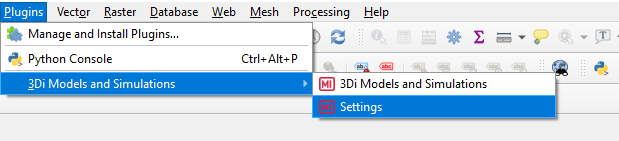
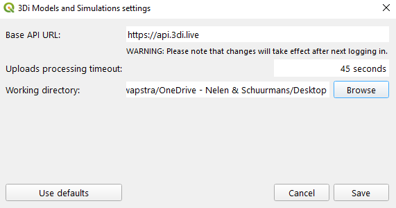
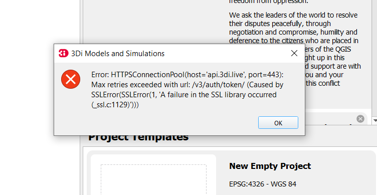

.. _f_problem_solving:

FAQ and problem solving
=======================

This section will help you solve some problems or errors that may occur when using 3Di.
Some issues are due to the software, these will be summarised in the section Known Issues, including a temporary solution.
Errors, due to input data or other user settings are usually covered by the schematisation and raster checker. In rare cases however they might not catch a potential issue. On this page we cover the FAQ & Known Issues with 3Di.

- :ref:`faq`
- :ref:`known_issues`

.. _faq:

Frequently Asked Questions
^^^^^^^^^^^^^^^^^^^^^^^^^^

-	My script doesn't work anymore, what do I need to do? 

*In case this is an old script (< 2022) please check the migration workflow available* `here <https://api.3di.live/v3/docs/migrate_to_threediapi/>`_. 

-	I added extra tables in my SQLite, will they be deleted?

*No, those will be ignored.*

-	How do I edit a simulation template?

*You can't. But you can clone it into a new simulation and edit that.*

-	Can I change infiltration in a simulation template?

*No, infiltration is part of the schematisation. You can copy a schematisation and change the infiltration file there.
An explainer on schematisations and simulation templates can be found here* :ref:`basic_modelling_concepts`

- Why is the name of my simulation template 'default'? 

*The name is being read from the v2_global_settings table in the 'name' column. If that happens to be 'default', then that is the name of your simulation template.*

- What happens if I add an extra entry in the v2_global_settings table? 

*Extra entries will be ignored.*

- I have a variant on my schematisation that I like to test, what is the best way of doing so? 

*Copy/clone the schematisation, make your changes and upload it as a new schematisation.*

- How do I change my working directory in the Modeller Interface '3Di Models and Simulations' plugin?

* Via the settings of the plugin (see below). 

- Is all information from my spatialite being read ?

*Yes, either it is being used as part of the schematisation and converted to a 3Di Model, or it is part of the simulation template.*

- My QGIS defaults to the Dutch language, does that matter?

*What matters is that the numbers notation is set to English. There is a bug in QGIS with scientific notations and Dutch number notations which can cause weird behaviour of the plugin. 
Please set your QGIS or Modeller Interface to English (settings --> options --> locale --> en_GB).*

**General**

- My model shows unstable behaviour, what can I do to avoid this? 

First of all, instability is not common within 3Di, but certain settings or modelling choices can cause problems for the solver. 

*We have these tips:*

1) Decrease your calculation time step (background information: courant number)
2) Decrease your output time step temporarily. This makes it easier to analyse what goes wrong
3) Check combinations of nodes with a small storage area and pump stations with a large capacity. Make sure the 'gemaalkelder/pump basement' is large enough
4) Check if there are pump stations that are pumping to another 1D-node within the same 2D-computational cell
5) Check whether there are sewerage pipes shorter than 1 meter. If so, see if you can make them longer or add storage on the nodes that the pipes are connected to. 
6) Put the 'pump_implicit_ratio' in the numerical settings to 1. This makes sure that the model calculates smoothly for pump stations (see  :ref:`matrixsolvers` --> pump_implicit_ratio)

.. _known_issues:

Known issues
^^^^^^^^^^^^

General
-------

- When applying 2D boundary conditions, it is not allowed to have more than one grid resolution on the edge. However, there is no clear error message for this. To solve this, add a grid refinement line on the boundary. This will force a uniform grid on the 2D boundary line.

- Note, that in v2_control tables (v2_control_table, v2_control_memory, v2_control_pid, v2_control_timed) the unit for adjusting the pump discharge capacity via the API is actually *m3/s*, even though the unit used normally is *l/s*. NB: This is only the case via the API. In the Modeller Interface (sqlite) the unit is in l/s. 

- For simulations including interflow or embedded elements, not all results can be viewed. Moreover, the water balance ignores part of the flow, therefore it will seem to be inconsistent.

- There are some issues related to projections. We are encountered this for our UK-based models (.sqlite). These models will show a shift in the  geometries in QGIS. The reprojection from EPGS:27700 (British National Grid) to WGS84 is based on an outdated reprojection in the spatialite. There is a solution for this:

1. In QGIS open the (table without geometry) table "spatial_ref_sys"
2. go to row srid 27700
3. update column proj4text (overwrite existing value) with +proj=tmerc +lat_0=49 +lon_0=-2 +k=0.9996012717 +x_0=400000 +y_0=-100000 +datum=OSGB36 +units=m +no_defs

This might also be the case for other projections.

- The *manhole_storage_area* in the v2_global_settings table of the data base must be set as an INTEGER.

- Boundary conditions can only be applied via the model sqlite. Uploading a boundary condition as a json file using the API will result in a failure of the simulation.

- In rare cases the waterdepth interpolation in the livesite may show unexpected behaviour; it shows triangular patterns. These deviations are only visual, so the results are still correctly. 

- The following checks don’t work in case there is no index in the spatialite:

   * It doesn’t check for stand alone connection nodes
   * It doesn’t check for connection nodes that are too close or on top of each other

3Di Modeller Interface
----------------------

- "TypeError: setValue(self, float): argument 1 has unexpected type 'NoneType' ". Maximum time step requires a value and cannot be NULL

- The Modeller Interface and the plugins have trouble installing if there is already a previous version installed because of old dependencies. Please remove (before installing a new version) the folder '{user profile} \ python' alle folders instead of 'expressions', 'plugins' and 'share'.  (e.g. the error 'sqlalchemy' might indicate this is the case)
	
- If you have an older version of the MI (e.g. based on QGIS 3.10), you should remove it via *Windows Apps & Features*, to avoid any conflicts. 

- When using the sideview-tool in the QGIS-plugin, the length of the side view profile of pipes in the graph can be different than the actual length of the pipe. This is due to a projection conversion error in QGIS and does not affect 3Di calculations.

- A schematisation that is uploaded via the MI without processing will appear falsely in the management pages as 'not valid'. If you upload the schematisation again with processing, the model will be generated. 

- The Sideview is not supported for channels. 

- Embedded and interflow can not be analysed with the standard tooling.

- When using an infiltration rate file in v2_simple_infiltration, an infiltration value of 'NULL' is not valid and will cause an error. Please use an infiltration rate value of 0 instead.

- Leakage does not work in the Modeller Interface. Please use the API for now if you want to use leakage. 

3Di Live Site
-------------

- If a raster has both NaN and Nodata values the live site DEM will color yellow (showing color scale for -9999)

- If a raster has a nodatavalue of 3.4028234663852886e+38 will not be visible in the live site. Setting it to -9999 will solve the issue. This can be done using QGIS tooling or the following GDAL command: gdalwarp -of GTiff -srcnodata 3.4028234663852886e+38 -dstnodata -9999 -co "COMPRESS=DEFLATE" dem1.tif dem2.tif

3Di Management
--------------

- A schematisation that is uploaded via the MI without processing will appear falsely in the management pages as 'not valid'. If you upload the schematisation again with processing, the model will be generated. 

Uploading a new revision/migrating a model
------------------------------------------

Error: (400)
++++++++++++

*Error: (400)
Reason: Bad Request
HTTP response headers: HTTPHeaderDict({'server': 'openresty/1.15.8.3', 'date': 'Fri, 11 Feb 2022 07:44:04 GMT', 'content-type': 'application/json', 'content-length': '68', 'vary': 'Accept, Origin, Cookie', 'allow': 'POST, OPTIONS', 'x-frame-options': 'DENY', 'x-content-type-options': 'nosniff', 'strict-transport-security': 'max-age=63072000', 'referrer-policy': 'strict-origin-when-cross-origin', 'x-xss-protection': '1'})
HTTP response body: ["Maximum number of active threedimodels for a schematisation is 3"]*

You have reached the max number of active 3Di models for this schematisation. Please go the management.3di.live and remove one or more 3Di models that are attached to this schematisation

sqlite3.IntegrityError: CHECK constraint failed: _alembic_tmp_v2_aggregation_settings
+++++++++++++++++++++++++++++++++++++++++++++++++++++++++++++++++++++++++++++++++++++

This can be fixed by the following 2 adjustments.

1. Set aggregation = 0  instead of aggregation = FALSE

2. remove table _alembic_tmp_v2_aggregation_settings 

Running a simulation
--------------------

"exit_code": "4161 [health_check_premature_container_error]"
++++++++++++++++++++++++++++++++++++++++++++++++++++++++++++

Please run the simulation again. There was a temporary disruption.

"exit_code": "4265 [health_check_postprocessing_error]"
+++++++++++++++++++++++++++++++++++++++++++++++++++++++

Please run the simulation again. There was a temporary disruption.

ERROR - F - Matrix diagonal element, near zero
++++++++++++++++++++++++++++++++++++++++++++++

At one calculation point there is no storage area or the wet cross section area is near zero or even negative. This may be caused by various reasons listed below:

* Structure levels are below cross section reference levels, f.i. a culvert below the bed level. This is not possible as when water level drops below the bed level, flow through the culvert has no area to flow to. Update reference or structure levels so that they match. Reference levels can be below structure levels.

* A lateral inflow from laterals or an inflow surface is connected to a node without storage area, f.i. an pump end node or boundary node. Removes laterals or inflow from these nodes.

* Water level boundary is below structure level.

* All definition values for width and height must be positive.

* Pump start level is below pump stop level.

The error is followed by a reference to the node without any storage or link without wet cross section area. This will look something like::

    near zero, aii(nod)<1.0d-10,nod,aii(nod),su(nod)  14614   14439  0.0000E+00  0.0000E+00

The first number (14614 in this example) refers to the calculation node on which the error occurs. This number can be found using the QGIS plugin when a result of this model is available. The number can be located using the *node_results*. The id's in this table match the one given here. The second number is a link id and can be found using the *line_result* layer.

ERROR : The combination of cross-section types is invalid for input channel number
++++++++++++++++++++++++++++++++++++++++++++++++++++++++++++++++++++++++++++++++++

Not all cross-section definition types can be combined for a single channel. Only type 1 (rectangle) and type 2 (circle) or type 5 and 6 (both tabulated) can be combined. If you have multiple cross-section types on one channel change these or split the channel.

ERROR - F - Impossible line connection at calculation node:            729
++++++++++++++++++++++++++++++++++++++++++++++++++++++++++++++++++++++++++

This error may occur when using embedded in combination with structures. Make sure no structure is placed entirely inside a 2D computational cell. You can only check this when you have a copy of the 2D computational grid. You can obtain this by making a purely 2D model of your DEM and grid refinement of try making one using the 'create grid' function in the QGIS processing toolbox.

Runtime Error: NetCDF: String match to name in use
++++++++++++++++++++++++++++++++++++++++++++++++++

Check the aggregation NetCDF name settings, names must be unique.

Loading results
-----------------

Runtime Error: attempt to write a readonly database
++++++++++++++++++++++++++++++++++++++++++++++++++++

This means that the gridadmin.sqlite is still in use by you or another user or is not closed correctly.
You can fix this by removing the file 'gridadmin.sqlite-journal' (not gridadmin.sqlite!). 

Signing in and sign up
------------------------

403 - You do not have a 3Di account. Please contact your manager and ask for an invitation
+++++++++++++++++++++++++++++++++++++++++++++++++++++++++++++++++++++++++++++++++++++++++++++

Please contact our :ref:`servicedesk` and let us know your login name or mail address and the error code if you received any. 

Finding a model
---------------

Can't find the model you are looking for?
Please check the following:

- If you have access to the organization to which the model belongs

- If the model is available on API v3. Please contact the :ref:`servicedesk` if you need assistance.

- If the schematisation has a 3Di model. Go to `management.3di.live <https://management.3di.live>`_, search for your schematisation and check out the details page. 

Connecting to the 3Di API
-------------------------

In some cases the 3Di Models and Simulations plugin (part of the 3Di Modeller Interface) can give a generic SSLError on a Windows system (see figure below).
To solve this issue, please contact your organisation's system administrator.
Instructions for your system administrator on how to solve this problem are given below the figure::

  Error: HTTPSConnectionPool(host='api.3di.live', port=443): Max retries exceeded with url: /v3/auth/token/ (Caused by SSLError(1, 'A failure in the SSL Library occurred (_ssl.c:1129)')))

This error is resulting from a combination of how the plugin validates SSL/TLS certificates and how Windows expects that to happen.
We are using Let's Encrypt as our certificate supplier for most of our 3Di webservices.
In September 2021 their root certificate 'DST Root CA X3' expired and was replaced by the 'ISRG Root X1' certificate.
All of the Let's Encrypt domain name certificates are issued by Intermediate Certificate 'R3'.
There are some cases where this Intermediate Certificate is still issued by 'DST Root CA X3', and this can create issues.

To solve this, please open a Microsoft Management Console (mmc.exe) and add the Certificates Snap-In for the user.

.. figure:: image/f_mmc_certificates_snapin.png
    :alt: MMC Certificates Snap-In

Open the "Intermediate Certification Authorities" and then the "Certificates" folder.
Find the 'R3' Intermdiate Certificate, and check who the issuer is.
If this is only 'DST Root CA X3', please remove it and visit https://api.3di.live/v3 with a browser.

Please contact our :ref:`servicedesk` after this fix is applied and are still receiving the error message.

Solved issues
^^^^^^^^^^^^^^

The below errors and bugs should not be experienced anymore. Please let us know if you do still encounter them.

- The toolbox does currently not work properly for QGIS 3.22. You cannot edit your schematisations. Please use QGIS 3.16 for now if you have this issue or use the Modeller Interface.

- Calculations that had both rain radar and laterals crashed somewhere during the simulation.
